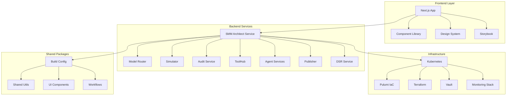
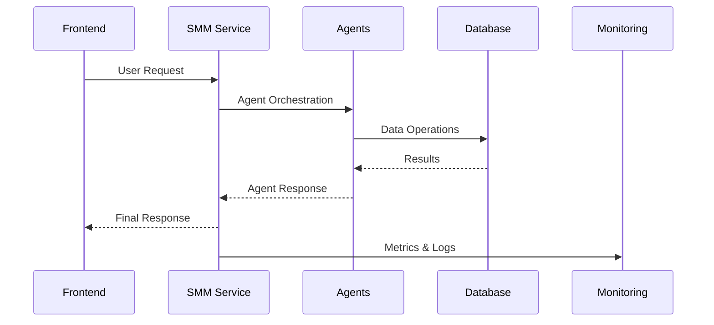

# SMM Architect Codebase Audit & Implementation Plan

## Overview

This comprehensive audit identifies incomplete implementations, missing features, empty directories, and gaps across the SMM Architect monorepo. The analysis covers frontend applications, shared packages, backend services, infrastructure components, and build configurations to ensure complete system functionality.

## Repository Type Detection

**Repository Classification**: Full-Stack Application with Microservices Architecture
- **Frontend**: Next.js application with Storybook component library
- **Backend**: Multiple Node.js services using Encore.ts and Express frameworks
- **Infrastructure**: Kubernetes, Pulumi IaC, multi-tenant architecture
- **Complexity Level**: Enterprise-grade with comprehensive monitoring and compliance requirements

## Architecture Overview



## Critical Gaps Analysis

### 1. Empty Directories & Missing Implementations

#### Infrastructure Components
| Directory | Status | Impact | Priority |
|-----------|--------|---------|----------|
| `infrastructure/environments/` | **EMPTY** | High - No environment configs | Critical |
| `infrastructure/pulumi/` | **EMPTY** | High - IaC automation missing | Critical |
| `infrastructure/terraform/` | **EMPTY** | High - Alternative IaC missing | Critical |
| `infrastructure/vault/` | **EMPTY** | High - Secrets management | Critical |

#### Agent Services
| Agent Directory | Status | Impact | Priority |
|----------------|--------|---------|----------|
| `services/agents/automation-agent/` | **EMPTY** | High - Campaign automation | Critical |
| `services/agents/legal-agent/` | **EMPTY** | High - Compliance validation | Critical |
| `services/agents/publisher-agent/` | **EMPTY** | Medium - Content publishing | High |

### 2. Incomplete Service Implementations

#### A. Data Subject Rights (DSR) Service
**Location**: `services/dsr/`
**Status**: Partially implemented with placeholder functions

**Missing Components**:
```typescript
// Placeholder implementations identified:
private isLongTermCustomer(tenantId: string): boolean {
  return false; // Placeholder
}

async function verifyAdminPermission(requestedBy: string, tenantId: string): Promise<boolean> {
  return true; // Placeholder
}

private async getBusinessMetric(tenantId: string, metricName: string): Promise<number> {
  return Math.floor(Math.random() * 1000); // Placeholder
}
```

#### B. Frontend Service Integrations
**Location**: `apps/frontend/src/hooks/`
**Status**: Hook exists but missing service dependencies

**Missing Service Dependencies**:
- `monitoring-service.ts` imports from non-existent relative paths
- Missing concrete implementation of monitoring providers
- Performance tracking hooks lack backend integration

#### C. Media Upload Service
**Location**: `services/publisher/src/services/MediaUploadService.ts`
**Status**: Video processing placeholder implementations

**Missing Implementations**:
```typescript
private async getVideoMetadata(buffer: Buffer): Promise<any> {
  // This would typically use ffmpeg or similar
  return {
    duration: 0, // Would be extracted from video
    format: 'unknown',
    resolution: 'unknown',
  };
}

private async generateVideoThumbnail(buffer: Buffer, fileId: string, workspaceId: string): Promise<string> {
  // This would typically use ffmpeg to extract a frame
  const thumbnailKey = `workspaces/${workspaceId}/thumbnails/${fileId}.jpg`;
  return this.cdnDomain ? `https://${this.cdnDomain}/${thumbnailKey}` : await this.getSignedUrl(thumbnailKey);
}
```

### 3. Frontend Component Gaps

#### A. Authentication Components
**Location**: `apps/frontend/src/components/auth/`
**Status**: Basic structure exists, requires enhancement

**Missing Features**:
- Multi-factor authentication UI
- Social login integrations
- Password strength validation
- Account recovery flows

#### B. Canvas Visualization
**Location**: `apps/frontend/src/app/canvas/page.tsx`
**Status**: Mock implementation with static data

**Required Implementations**:
- Real-time workflow state synchronization
- Interactive node editing capabilities
- Agent execution status visualization
- Performance metrics display

#### C. Chat Interface
**Location**: `apps/frontend/src/app/chat/page.tsx`
**Status**: Basic UI without backend integration

**Missing Features**:
- WebSocket connection management
- Message persistence
- File upload handling
- Multi-agent conversation routing

### 4. Infrastructure Automation Gaps

#### A. Environment Configuration
**Required Structure**:
```
infrastructure/
├── environments/
│   ├── development/
│   │   ├── pulumi/
│   │   ├── terraform/
│   │   └── vault/
│   ├── staging/
│   │   ├── pulumi/
│   │   ├── terraform/
│   │   └── vault/
│   └── production/
│       ├── pulumi/
│       ├── terraform/
│       └── vault/
```

#### B. Pulumi Infrastructure as Code
**Missing Components**:
- AWS resource definitions
- Multi-tenant provisioning automation
- Monitoring stack deployment
- Security policy automation

#### C. Vault Integration
**Missing Components**:
- Secret rotation policies
- Dynamic secret generation
- Service authentication tokens
- Encryption key management

### 5. Build Configuration Enhancements

#### A. ESLint Configuration
**Location**: `packages/build-config/eslint/`
**Status**: Basic configuration exists

**Required Enhancements**:
- Service-specific rule sets
- Frontend/backend rule separation
- Security-focused linting rules
- Performance optimization rules

#### B. Jest Configuration
**Location**: `packages/build-config/jest/`
**Status**: Basic configs exist

**Missing Features**:
- Integration test configurations
- Coverage reporting setup
- Mock service configurations
- E2E test support

### 6. Agent Service Architecture Gaps

#### A. Automation Agent
**Required Implementation**:
```typescript
// services/agents/automation-agent/src/AutomationAgent.ts
export class AutomationAgent implements AgentInterface {
  async executeWorkflow(workflow: WorkflowDefinition): Promise<WorkflowResult>
  async scheduleTask(task: TaskDefinition): Promise<ScheduleResult>
  async monitorExecution(executionId: string): Promise<ExecutionStatus>
}
```

#### B. Legal Agent
**Required Implementation**:
```typescript
// services/agents/legal-agent/src/LegalAgent.ts
export class LegalAgent implements AgentInterface {
  async validateCompliance(content: Content): Promise<ComplianceResult>
  async checkRegulations(region: string, contentType: string): Promise<RegulationResult>
  async generateDisclaimer(context: ContentContext): Promise<DisclaimerResult>
}
```

#### C. Publisher Agent
**Required Implementation**:
```typescript
// services/agents/publisher-agent/src/PublisherAgent.ts
export class PublisherAgent implements AgentInterface {
  async schedulePublication(content: PublishableContent): Promise<ScheduleResult>
  async publishToChannels(channels: Channel[]): Promise<PublicationResult>
  async trackEngagement(publicationId: string): Promise<EngagementMetrics>
}
```

## Implementation Priority Matrix

### Critical Priority (Immediate Implementation Required)
1. **Infrastructure Automation**
   - Environment configuration setup
   - Pulumi IaC implementation
   - Vault secrets management

2. **Core Agent Services**
   - Automation Agent implementation
   - Legal Agent compliance validation
   - Publisher Agent content distribution

3. **Service Integration Fixes**
   - DSR service placeholder replacements
   - Monitoring service backend integration
   - Media processing pipeline completion

### High Priority (Next Sprint)
1. **Frontend Feature Completion**
   - Canvas real-time updates
   - Chat backend integration
   - Authentication enhancements

2. **Build & Development Tools**
   - Enhanced linting configurations
   - Comprehensive test setups
   - Development environment automation

### Medium Priority (Future Releases)
1. **Advanced Features**
   - Video processing enhancements
   - Advanced monitoring dashboards
   - Performance optimization tools

## Testing Strategy Requirements

### Unit Testing Gaps
- Agent service business logic
- Frontend component interactions
- Infrastructure validation scripts
- Service integration layers

### Integration Testing Needs
- Multi-service workflow testing
- Database transaction testing
- External API integration testing
- Security policy validation

### End-to-End Testing Requirements
- Complete user journey automation
- Multi-tenant isolation validation
- Performance benchmarking
- Compliance audit trails

## Security & Compliance Implementation

### Missing Security Features
- Advanced authentication flows
- API rate limiting implementation
- Data encryption at rest
- Audit trail completeness validation

### Compliance Automation
- GDPR data processing workflows
- CCPA request automation
- SOX audit trail generation
- HIPAA data handling validation

## Monitoring & Observability Gaps

### Performance Monitoring
- Real-time metrics collection
- Alert threshold configuration
- Dashboard automation
- SLA monitoring implementation

### Error Tracking Enhancement
- Distributed tracing setup
- Error correlation analysis
- Performance bottleneck identification
- User experience monitoring

## Data Flow Architecture Requirements

### Service Communication Patterns


### Data Persistence Strategy
- Multi-tenant data isolation
- Event sourcing implementation
- Audit trail preservation
- Backup and recovery automation

## Resource Requirements

### Development Effort Estimation
- **Infrastructure Setup**: 3-4 weeks
- **Agent Services**: 6-8 weeks
- **Frontend Integration**: 4-5 weeks
- **Testing & Validation**: 3-4 weeks
- **Security Implementation**: 2-3 weeks

### Technical Dependencies
- AWS infrastructure access
- HashiCorp Vault licensing
- Monitoring service subscriptions
- External API integrations

## Success Criteria

### Functional Completeness
- All empty directories populated with functional implementations
- Placeholder functions replaced with production-ready code
- Complete agent workflow orchestration
- Full infrastructure automation

### Quality Assurance
- 90%+ test coverage across all services
- Security vulnerability assessments passed
- Performance benchmarks met
- Compliance audit requirements satisfied

### Operational Readiness
- Automated deployment pipelines
- Monitoring and alerting configured
- Documentation complete and current
- Support runbooks established