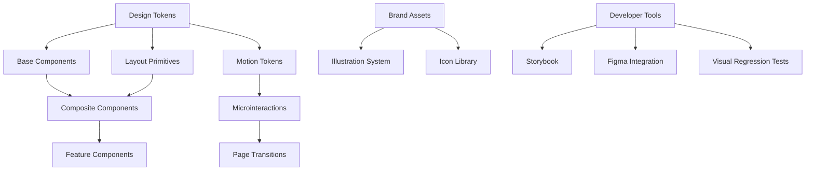

# Design System Implementation for SMM Architect

## Overview

This document outlines the implementation of a comprehensive design system for the SMM Architect platform. The design system will establish a rigorous foundation of design tokens, components, motion language, and illustration system to create a beautiful, consistent, and scalable user experience.

**Scope**: Frontend application (`apps/frontend`) and shared UI package (`packages/ui`)  
**Technology Stack**: Next.js 15, React 18, TypeScript, Tailwind CSS, Radix UI, Storybook, Framer Motion  
**Target Users**: Marketing professionals, agencies, enterprise teams  
**Core Philosophy**: Beautiful UI + Simple UX + Smart Frontend

## Architecture

### Design System Structure



### Component Hierarchy

``mermaid
classDiagram
    class DesignTokens {
        +colors: HSLColorSystem
        +typography: TypeScale
        +spacing: BaselineGrid
        +motion: MotionTokens
    }
    
    class BaseComponents {
        +Button
        +Input
        +Card
        +Modal
        +Tooltip
    }
    
    class CompositeComponents {
        +DecisionCard
        +Timeline
        +ContentEditor
        +MicroGraph
    }
    
    class FeatureComponents {
        +WorkspaceCanvas
        +SimulationDashboard
        +AgentOrchestrator
        +PolicyViewer
    }
    
    DesignTokens --> BaseComponents
    BaseComponents --> CompositeComponents
    CompositeComponents --> FeatureComponents
```

## Design Tokens

### Color System

**HSL-based Color Palette**
- Primary: `hsl(215 95% 49%)` (SMM Brand Blue)
- Accent: `hsl(280 85% 53%)` (Agent Purple)
- Success: `hsl(140 60% 40%)` (Policy Pass Green)
- Warning: `hsl(40 95% 45%)` (Simulation Alert)
- Error: `hsl(360 85% 52%)` (Violation Red)

**Semantic Color Tokens**
```
{
  "color": {
    "primary": {
      "50": "hsl(215 100% 97%)",
      "100": "hsl(215 95% 92%)",
      "500": "hsl(215 95% 49%)",
      "600": "hsl(215 100% 38%)",
      "900": "hsl(215 85% 15%)"
    },
    "semantic": {
      "canvas-background": "hsl(210 40% 98%)",
      "agent-active": "hsl(280 85% 53%)",
      "simulation-running": "hsl(40 95% 45%)",
      "policy-compliant": "hsl(140 60% 40%)",
      "audit-verified": "hsl(200 85% 45%)"
    }
  }
}
```

### Typography Scale

**Variable Font Implementation**
- Primary: Inter Variable (400-700 weight, normal-italic slant)
- Secondary: IBM Plex Serif (headlines only)
- Mono: JetBrains Mono (code, IDs, technical data)

**Type Scale (1.25 Modular Scale)**
```json
{
  "typography": {
    "scale": {
      "xs": "12px/1.4",
      "sm": "14px/1.45", 
      "base": "16px/1.5",
      "lg": "20px/1.4",
      "xl": "24px/1.3",
      "2xl": "32px/1.2",
      "3xl": "40px/1.1",
      "4xl": "56px/1.0"
    }
  }
}
```

### Spacing & Grid System

**8px Baseline Grid**
```json
{
  "spacing": {
    "0": "0px",
    "1": "4px",
    "2": "8px", 
    "3": "12px",
    "4": "16px",
    "6": "24px",
    "8": "32px",
    "12": "48px",
    "16": "64px",
    "24": "96px"
  }
}
```

**Component Sizing**
- Button height: 40px (space-10)
- Input height: 40px (space-10)
- Card padding: 24px (space-6)
- Modal max-width: 640px
- Canvas grid: 24px (space-6)

### Motion Tokens

**Duration & Easing**
```json
{
  "motion": {
    "duration": {
      "fast": "120ms",
      "normal": "200ms", 
      "slow": "300ms",
      "slower": "500ms"
    },
    "easing": {
      "linear": "cubic-bezier(0, 0, 1, 1)",
      "ease-out": "cubic-bezier(0.2, 0.9, 0.2, 1)",
      "ease-in-out": "cubic-bezier(0.4, 0, 0.2, 1)",
      "spring": "cubic-bezier(0.34, 1.56, 0.64, 1)"
    },
    "spring": {
      "gentle": "{ stiffness: 200, damping: 30 }",
      "pop": "{ stiffness: 700, damping: 40 }"
    }
  }
}
```

## Component Architecture

### Base Components

**Button System**
- Variants: `primary | secondary | outline | ghost | danger`
- Sizes: `sm | default | lg | icon`
- States: `default | hover | focus | loading | disabled`
- Enhanced with Framer Motion for microinteractions

**Input System**
- Text, email, password, number inputs
- Textarea with auto-resize
- File upload with drag-and-drop
- Search with debounced suggestions

**Card Components**
- Base Card with elevation tokens
- Interactive Card with hover states
- DecisionCard for agent recommendations
- WorkspaceCard for project overview

### Composite Components

**Timeline Component**
Enhanced for agent orchestration workflow visualization:
- Step indicators with completion states
- Interactive progress tracking
- Branching paths for parallel agent execution

**Content Editor**
Rich content creation interface:
- Multi-platform preview (Twitter, LinkedIn, Instagram)
- Asset library integration
- AI suggestion integration
- Live policy validation

**Simulation Dashboard**
Monte Carlo visualization components:
- Confidence bands with animated updates
- Cost projection with breakdown
- Risk assessment indicators
- What-if scenario controls

### Motion Language

**Microinteractions**

Button Press Ripple:
```typescript
const buttonMotion = {
  whileTap: { 
    scale: 0.98,
    transition: { duration: 0.1 }
  },
  whileHover: { 
    scale: 1.02,
    transition: { duration: 0.2 }
  }
}
```

Card Hover Elevation:
```typescript
const cardMotion = {
  whileHover: {
    y: -4,
    boxShadow: "0 20px 25px -5px rgba(0, 0, 0, 0.1)",
    transition: { duration: 0.2 }
  }
}
```

**Page Transitions**
- Route changes: Slide transition with opacity fade
- Modal entry: Scale + fade with backdrop blur
- Agent status changes: Color pulse with spring easing

**Success Celebrations**
- Policy approval: Subtle confetti animation
- Simulation completion: Progress bar with success checkmark
- Publication success: Gentle scale pulse

## UX Patterns

### One-Clear-Action Flows

**Workspace Creation Flow**
1. **Define Goals** → Single form with smart defaults
2. **Configure Agents** → Progressive disclosure of agent settings
3. **Set Policies** → Template-based policy selection
4. **Review & Create** → Summary with single "Create Workspace" CTA

**Campaign Approval Flow**
``mermaid
sequenceDiagram
    participant U as User
    participant C as Canvas
    participant S as Simulation
    participant A as Approval
    
    U->>C: Review Campaign
    C->>S: Show Readiness Score
    S->>A: Display Primary Action
    A->>U: "Approve & Publish" or "Need Changes"
```

### Progressive Disclosure

**Agent Configuration**
- Level 1: Basic settings (name, platform, schedule)
- Level 2: Advanced options (custom prompts, constraints)
- Level 3: Expert mode (API parameters, debugging)

**Policy Management**
- Level 1: Template selection
- Level 2: Rule customization  
- Level 3: OPA code editor

### AI-Assisted Defaults

**Smart Form Pre-filling**
- Brand Twin data → Campaign settings
- Historical performance → Budget recommendations
- Industry templates → Content suggestions

**Contextual Suggestions**
- Real-time policy compliance hints
- Cost optimization recommendations
- Performance improvement suggestions

## Illustration System

### Visual Style Guidelines

**Illustration Characteristics**
- Flat design with subtle gradients
- Consistent stroke weight (2px)
- Limited color palette from design tokens
- Geometric shapes with rounded corners
- Human figures in simplified, inclusive style

**Icon System**
- 24x24px base size with 16px and 32px variants
- 2px stroke weight for line icons
- Solid fills for status indicators
- Consistent visual metaphors across features

### Asset Categories

**Hero Illustrations**
- Workspace creation: Collaborative team with digital tools
- Agent orchestration: Connected nodes with AI symbols
- Policy compliance: Shield with checkmark
- Simulation results: Charts with confidence indicators

**Empty States**
- No workspaces: Friendly robot suggesting creation
- No campaigns: Content creation tools with sparkles
- No data: Gentle chart animation inviting interaction

**Loading States**
- Skeleton screens with shimmer animation
- Agent processing: Animated thinking bubbles
- Simulation running: Progress indicators with particle effects

## Performance & Technical Implementation

### Modern React Patterns

**Server Components Strategy**
- Static content: Workspace listings, documentation
- Dynamic content: Real-time simulation updates, agent status
- Hybrid: Campaign editor with server-side policy validation

**Edge Computing**
- CDN: Static assets, illustrations, fonts
- Edge Functions: Authentication, basic policy checks
- Origin: Complex simulations, agent orchestration

### Performance Targets

**Core Web Vitals**
- LCP: < 1.2s (target), < 1.5s (threshold)
- CLS: < 0.02
- FID: < 100ms

**Bundle Optimization**
- Code splitting by feature
- Tree shaking for design tokens
- Dynamic imports for heavy components
- Service worker for asset caching

### Font Loading Strategy

```typescript
// Variable font optimization
const fontConfig = {
  'Inter Variable': {
    preload: true,
    fallback: 'system-ui',
    display: 'swap',
    variationSettings: '"wght" 400'
  }
}
```

## Developer Experience

### Figma to Code Workflow

**Design Token Pipeline**
1. Figma Variables → Tokens Studio plugin
2. JSON export → GitHub repository
3. Style Dictionary transform → CSS variables
4. Tailwind config generation → Build process

**Component Sync**
- Figma component → Storybook story
- Design review → Code implementation
- Visual regression test → CI validation

### Storybook Enhancement

**Story Organization**
```
Design System/
├── Foundations/
│   ├── Colors
│   ├── Typography  
│   ├── Spacing
│   └── Motion
├── Components/
│   ├── Base/
│   ├── Composite/
│   └── Feature/
└── Patterns/
    ├── Forms
    ├── Navigation
    └── Data Display
```

**Documentation Standards**
- Component props table with descriptions
- Usage examples for each variant
- Accessibility guidelines
- Do's and don'ts with visual examples

### Visual Regression Testing

**Chromatic Integration**
- Automated screenshot capture
- Cross-browser testing (Chrome, Firefox, Safari)
- Mobile viewport testing
- Dark mode variant testing

**CI/CD Pipeline**
``mermaid
graph LR
    A[PR Created] --> B[Storybook Build]
    B --> C[Visual Tests]
    C --> D[Accessibility Audit]
    D --> E[Performance Check]
    E --> F[Deploy Preview]
    F --> G[Design Review]
    G --> H[Merge Approved]
```

## Testing Strategy

### Accessibility Testing
- Automated: axe-core in Storybook, Lighthouse CI
- Manual: Screen reader testing, keyboard navigation
- Color contrast: Minimum 4.5:1 for body text, 3:1 for large text

### Component Testing
- Unit tests: Jest + React Testing Library
- Integration tests: Playwright for user flows
- Visual tests: Chromatic for UI consistency

### Performance Monitoring
- Bundle analyzer: webpack-bundle-analyzer
- Runtime performance: Chrome DevTools profiling
- User metrics: Core Web Vitals tracking

## Internationalization & Accessibility

### Multi-Locale Support

**Supported Locales**
Comprehensive i18n implementation supporting 6 primary locales:
- English (en-US) - Primary
- Spanish (es-ES) - European markets
- French (fr-FR) - European markets  
- German (de-DE) - European markets
- Japanese (ja-JP) - Asian markets
- Chinese Simplified (zh-CN) - Asian markets

**Implementation Strategy**
```typescript
// Next.js i18n configuration
const i18nConfig = {
  locales: ['en', 'es', 'fr', 'de', 'ja', 'zh'],
  defaultLocale: 'en',
  domains: [
    { domain: 'smm.com', defaultLocale: 'en' },
    { domain: 'smm.es', defaultLocale: 'es' },
    { domain: 'smm.fr', defaultLocale: 'fr' }
  ]
}
```

**Translation Architecture**
- Translation keys with context: `button.approve_publish`
- Pluralization support: `campaign.count_zero|one|other`
- Date/number formatting: Locale-aware formatters
- RTL layout support: Arabic and Hebrew ready

**Content Localization Guidelines**
- UI text: Complete translation coverage
- Illustrations: Culturally appropriate variants
- Colors: Cultural sensitivity (red in China, etc.)
- Typography: Script-specific font stacks

### WCAG AA Accessibility

**Non-Negotiable Requirements**
- Color contrast: ≥4.5:1 for body text, ≥3:1 for large text
- Keyboard navigation: Full app accessible via keyboard
- Screen reader: Semantic HTML + ARIA labels
- Focus management: Visible focus rings, logical tab order
- Motion: Respect `prefers-reduced-motion`

**Implementation Standards**
```typescript
// Accessibility testing in Storybook
export default {
  title: 'Components/Button',
  component: Button,
  parameters: {
    a11y: {
      config: {
        rules: [{ id: 'color-contrast', enabled: true }]
      }
    }
  }
}
```

**Testing Strategy**
- Automated: axe-core in Storybook + Lighthouse CI
- Manual: Screen reader testing (NVDA, JAWS, VoiceOver)
- User testing: Accessibility consultants and disabled users

## Security & Compliance Integration

### Authentication & RBAC UI

**PermissionGate Integration**
```typescript
// Seamless permission-based UI rendering
<PermissionGate resource="workspace" action="create">
  <Button variant="primary">Create Workspace</Button>
</PermissionGate>

// Progressive disclosure based on roles
<RoleBasedTabs
  viewer={<BasicDashboard />}
  editor={<AdvancedDashboard />}
  admin={<AdminPanel />}
/>
```

**Multi-Tenant Security UI**
- Tenant context indicators in header
- Cross-tenant access prevention in navigation
- Tenant-scoped search and filtering
- Workspace isolation visual cues

**Audit Trail Visualization**
- Cryptographic signature verification badges
- Decision provenance with expandable details
- Compliance status indicators
- Audit export interfaces

### Privacy & GDPR Compliance

**Data Subject Rights UI**
- Self-service data export dashboards
- Deletion request workflows
- Consent management interfaces
- Data processing transparency

**Cookie & Consent Management**
- Granular consent categories
- Analytics opt-out controls
- Cross-border data transfer notices
- Preference persistence

## Advanced Performance Optimization

### Edge Computing Strategy

**Content Distribution**
```typescript
// Edge function for authentication
export default async function middleware(request: NextRequest) {
  const token = await verifyJWT(request.headers.get('authorization'))
  if (!token) return new Response('Unauthorized', { status: 401 })
  
  // Edge-cached policy validation
  const policies = await getCachedPolicies(token.workspaceId)
  return NextResponse.next()
}
```

**Performance Monitoring**
- Real User Monitoring (RUM) integration
- Core Web Vitals tracking per route
- Bundle size monitoring with alerts
- Third-party script impact analysis

**Progressive Loading**
```typescript
// Streaming SSR for complex dashboards
function WorkspaceDashboard() {
  return (
    <Suspense fallback={<DashboardSkeleton />}>
      <WorkspaceMetrics /> {/* Server Component */}
      <Suspense fallback={<ChartSkeleton />}>
        <SimulationCharts /> {/* Async data */}
      </Suspense>
    </Suspense>
  )
}
```

### Bundle Optimization Strategy

**Dynamic Imports & Code Splitting**
- Route-based code splitting
- Component-level lazy loading
- Library chunking for shared dependencies
- Service worker caching strategies

**Asset Optimization**
- WebP/AVIF image formats with fallbacks
- SVG icon sprites with tree-shaking
- Font subsetting for multilingual support
- Critical CSS inlining

## Implementation Roadmap

### Phase 1: Foundation (Weeks 1-2)
**Design Token Infrastructure**
- Set up Tokens Studio in Figma
- Create Style Dictionary build pipeline
- Implement CSS custom properties
- Configure Tailwind token integration

**Core Component Migration**
- Audit existing components against design system
- Implement missing base components
- Add Framer Motion to component library
- Create Storybook documentation

### Phase 2: Enhancement (Weeks 3-4)
**Advanced Components**
- Workspace Canvas with zoom/pan
- Agent orchestration visualizer
- Policy compliance dashboard
- Simulation results interface

**Motion & Microinteractions**
- Button press animations
- Loading state transitions
- Success celebration effects
- Error state handling

### Phase 3: Polish (Weeks 5-6)
**Visual Regression Testing**
- Chromatic integration setup
- Cross-browser testing automation
- Mobile viewport validation
- Dark mode implementation

**Performance Optimization**
- Bundle analyzer integration
- Image optimization pipeline
- Font loading optimization
- Service worker implementation

### Phase 4: Scale (Weeks 7-8)
**Developer Experience**
- Component generator CLI
- Design system documentation site
- Figma plugin for token sync
- VS Code snippet library

**Advanced Features**
- Theme customization system
- Brand kit variations
- Component composition tools
- Design system metrics

## Quality Assurance Framework

### Testing Strategy

**Unit Testing**
```typescript
// Component behavior testing
describe('Button Component', () => {
  it('should render with correct variant classes', () => {
    render(<Button variant="primary">Test</Button>)
    expect(screen.getByRole('button')).toHaveClass('bg-primary')
  })
  
  it('should handle loading state', () => {
    render(<Button loading>Submit</Button>)
    expect(screen.getByRole('button')).toBeDisabled()
    expect(screen.getByText('Submit')).toBeInTheDocument()
  })
})
```

**Visual Regression Testing**
- Automated screenshot comparison
- Cross-browser consistency validation
- Component variant coverage
- Responsive design verification

**Performance Testing**
- Lighthouse CI integration
- Bundle size regression detection
- Core Web Vitals monitoring
- Memory leak detection

### Continuous Integration

**Design System CI Pipeline**
```yaml
name: Design System CI
on: [pull_request]
jobs:
  test:
    runs-on: ubuntu-latest
    steps:
      - name: Visual Regression Tests
        run: npm run chromatic
      - name: Accessibility Tests
        run: npm run test:a11y
      - name: Performance Budget
        run: npm run test:bundle-size
      - name: Token Validation
        run: npm run validate:tokens
```

**Quality Gates**
- No visual regressions allowed
- Accessibility score must be 100%
- Bundle size increase < 5%
- All component stories must have documentation

## Brand Guidelines

### Voice & Tone

**Microcopy Principles**
- Action-oriented: "Approve & Publish" vs "Submit"
- Human-friendly: "Something went wrong" vs "Error 500"
- Contextual: "Save Draft" in editor, "Keep in Shadow" in canvas

**Empty State Messaging**
- Encouraging: "Ready to create your first campaign?"
- Helpful: "Import from template or start from scratch"
- Clear next steps: Primary CTA for main action

### Content Standards

**Button Labels**
- Primary: "Approve & Publish", "Create Workspace", "Run Simulation"
- Secondary: "Save Draft", "Preview Changes", "View Details"  
- Destructive: "Discard Draft", "Delete Workspace", "Cancel Campaign"

**Status Messages**
- Success: "Campaign published successfully"
- Warning: "Policy compliance check needed"
- Error: "Unable to connect to simulation service"

## Alternative Implementation Approaches

### A. Premium Design-First Approach
**Characteristics**
- Custom illustration system with branded characters
- Sophisticated animation library with physics-based motion
- Bespoke icon set with consistent metaphors
- High-fidelity prototyping in Figma

**Pros**: Maximum brand differentiation, premium feel
**Cons**: Higher development cost, longer iteration cycles
**Best for**: Enterprise clients, premium tiers

### B. Rapid Growth Approach
**Characteristics**
- Minimal design system with utility-first components
- Fast iteration with A/B testing integration
- Lightweight animation library
- Template-based illustrations

**Pros**: Faster time-to-market, easier A/B testing
**Cons**: Less visual impact, potential design debt
**Best for**: Startup phase, rapid experimentation

### C. AI-Adaptive Approach
**Characteristics**
- Personalized UI based on user behavior
- Dynamic complexity adjustment
- Smart defaults based on workspace data
- Contextual help and guidance

**Pros**: Higher user engagement, personalized experience
**Cons**: Complex implementation, requires user data
**Best for**: Mature product with established user base

### Recommended Hybrid Strategy

Start with **Approach B** for core functionality, evolve toward **Approach A** for visual polish, then integrate **Approach C** for intelligent personalization:

1. **Months 1-2**: Establish solid foundation (B)
2. **Months 3-4**: Add premium visual elements (A)
3. **Months 5-6**: Implement adaptive features (C)

## Maintenance & Evolution

### Design System Governance

**Design System Team Structure**
- Design System Lead: Strategy and roadmap
- Frontend Engineers: Component implementation
- UX Designers: Pattern definition and validation
- Product Managers: Feature prioritization

**Decision Making Framework**
- RFC process for major changes
- Community feedback for component requests
- Usage analytics for deprecation decisions
- Regular design system health audits

### Versioning Strategy

**Semantic Versioning**
- Major: Breaking changes to component APIs
- Minor: New components or non-breaking enhancements
- Patch: Bug fixes and minor improvements

**Migration Guides**
- Automated codemod scripts
- Step-by-step upgrade instructions
- Deprecation warnings with timeline
- Legacy component support window

### Metrics & KPIs

**Design System Adoption**
- Component usage across applications
- Design token consistency score
- Development velocity improvements
- Designer-developer collaboration efficiency

**User Experience Impact**
- User task completion rates
- Time-to-first-value measurements
- Support ticket reduction
- User satisfaction scores

**Technical Performance**
- Bundle size optimization
- Core Web Vitals improvements
- Accessibility compliance rates
- Cross-browser compatibility scores
