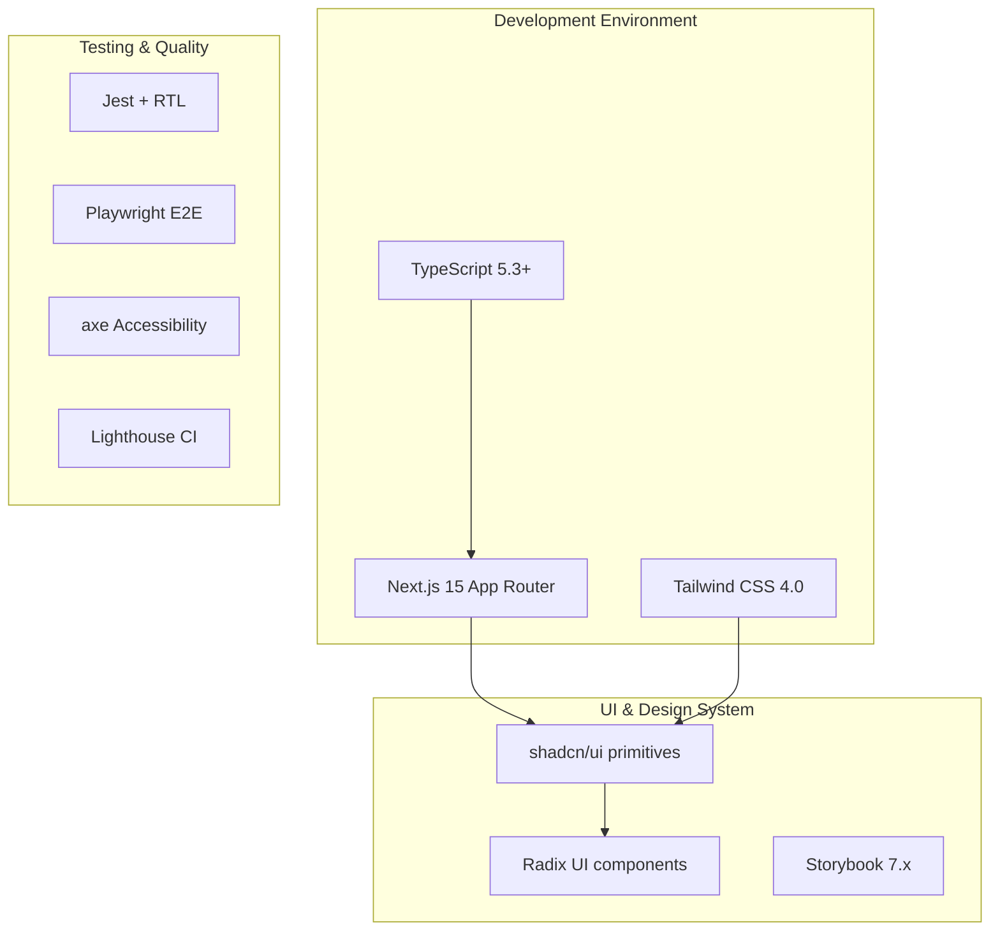

OIDC
    scopes?: string[]; // OIDC
  };
  status: 'active' | 'pending' | 'disabled';
  domains: string[]; // Auto-provision domains
  testResults?: {
    lastTested: Date;
    success: boolean;
    error?: string;
  };
}

const SSOConfigurationPanel = () => {
  const { ssoProviders, isLoading } = useSSOProviders();
  const [selectedProvider, setSelectedProvider] = useState<SSOProvider | null>(null);
  
  return (
    <div className="sso-config space-y-6">
      <div className="flex justify-between items-center">
        <h2 className="text-2xl font-bold">Single Sign-On Configuration</h2>
        <Button onClick={() => setSelectedProvider({ type: 'oidc' } as SSOProvider)}>
          Add SSO Provider
        </Button>
      </div>
      
      <div className="grid gap-4">
        {ssoProviders.map(provider => (
          <SSOProviderCard
            key={provider.id}
            provider={provider}
            onEdit={() => setSelectedProvider(provider)}
            onTest={() => testSSOProvider(provider.id)}
            onToggle={() => toggleSSOProvider(provider.id)}
          />
        ))}
      </div>
      
      {selectedProvider && (
        <SSOConfigModal
          provider={selectedProvider}
          onSave={handleSSOSave}
          onClose={() => setSelectedProvider(null)}
        />
      )}
      
      <SCIMProvisioningSection />
    </div>
  );
};
```

### Role-Based Access Control

**Permission System Implementation:**
```typescript
interface Role {
  id: string;
  name: string;
  description: string;
  permissions: Permission[];
  isSystemRole: boolean;
  memberCount: number;
}

interface Permission {
  resource: 'workspace' | 'campaign' | 'approval' | 'audit' | 'settings' | 'admin';
  action: 'create' | 'read' | 'update' | 'delete' | 'approve' | 'publish';
  scope?: 'own' | 'team' | 'all';
}

// RBAC Hook for UI Guards
const usePermissions = () => {
  const { user } = useAuth();
  
  const hasPermission = useCallback((resource: string, action: string, scope?: string) => {
    if (!user?.roles) return false;
    
    return user.roles.some(role => 
      role.permissions.some(permission => 
        permission.resource === resource &&
        permission.action === action &&
        (!scope || permission.scope === scope || permission.scope === 'all')
      )
    );
  }, [user]);
  
  const canApprove = useMemo(() => hasPermission('campaign', 'approve'), [hasPermission]);
  const canPublish = useMemo(() => hasPermission('campaign', 'publish'), [hasPermission]);
  const canManageTeam = useMemo(() => hasPermission('admin', 'update'), [hasPermission]);
  
  return {
    hasPermission,
    canApprove,
    canPublish, 
    canManageTeam
  };
};

// Permission-Gated Component Wrapper
const PermissionGate: React.FC<{
  resource: string;
  action: string;
  scope?: string;
  fallback?: React.ReactNode;
  children: React.ReactNode;
}> = ({ resource, action, scope, fallback = null, children }) => {
  const { hasPermission } = usePermissions();
  
  if (!hasPermission(resource, action, scope)) {
    return <>{fallback}</>;
  }
  
  return <>{children}</>;
};
```

## Interactive Canvas & Workflow Visualization

### Micro-Graph Implementation

**Step-by-Step Workflow Component:**
```typescript
interface Step {
  id: 'discover' | 'plan' | 'draft' | 'verify' | 'approve' | 'post';
  status: 'pending' | 'running' | 'completed' | 'failed' | 'blocked';
  duration?: string;
  progress?: number;
  actions?: Array<'fix' | 'rerun' | 'approve' | 'rollback'>;
  tooltip?: string;
  artifacts?: {
    logs?: string[];
    outputs?: Record<string, any>;
    errors?: string[];
  };
}

const MicroGraph: React.FC<{
  steps: Step[];
  mode: 'plan' | 'live';
  onStepAction: (stepId: string, action: string) => void;
}> = ({ steps, mode, onStepAction }) => {
  const [hoveredStep, setHoveredStep] = useState<string | null>(null);
  const [selectedStep, setSelectedStep] = useState<string | null>(null);
  
  return (
    <div className="micro-graph flex justify-between items-center p-6 bg-canvas-background border rounded-lg">
      {steps.map((step, index) => (
        <div key={step.id} className="flex items-center">
          <StepNode
            step={step}
            isHovered={hoveredStep === step.id}
            isSelected={selectedStep === step.id}
            onClick={() => setSelectedStep(step.id)}
            onMouseEnter={() => setHoveredStep(step.id)}
            onMouseLeave={() => setHoveredStep(null)}
            mode={mode}
          />
          {index < steps.length - 1 && (
            <StepConnector 
              fromStatus={step.status}
              toStatus={steps[index + 1].status}
              animated={mode === 'live'}
            />
          )}
        </div>
      ))}
      
      {selectedStep && (
        <StepActionPopover
          step={steps.find(s => s.id === selectedStep)!}
          onAction={(action) => {
            onStepAction(selectedStep, action);
            setSelectedStep(null);
          }}
          onClose={() => setSelectedStep(null)}
        />
      )}
    </div>
  );
};
```

### Timeline & Replay System

**Progress Visualization with Scrubber:**
```typescript
const TimelineReplay: React.FC<{
  steps: Step[];
  currentTime: number;
  totalDuration: number;
  onTimeChange: (time: number) => void;
  isPlaying: boolean;
  onPlayPause: () => void;
}> = ({ steps, currentTime, totalDuration, onTimeChange, isPlaying, onPlayPause }) => {
  return (
    <div className="timeline-replay bg-card border rounded-lg p-4">
      <div className="flex items-center space-x-4 mb-4">
        <Button
          variant="outline"
          size="sm"
          onClick={onPlayPause}
          aria-label={isPlaying ? 'Pause replay' : 'Play replay'}
        >
          {isPlaying ? <Pause className="h-4 w-4" /> : <Play className="h-4 w-4" />}
        </Button>
        
        <div className="flex-1">
          <Slider
            value={[currentTime]}
            onValueChange={([value]) => onTimeChange(value)}
            max={totalDuration}
            step={1}
            className="w-full"
            aria-label="Timeline scrubber"
          />
        </div>
        
        <span className="text-sm text-muted-foreground">
          {formatDuration(currentTime)} / {formatDuration(totalDuration)}
        </span>
      </div>
      
      <div className="space-y-2">
        {steps.map(step => (
          <TimelineStep
            key={step.id}
            step={step}
            isActive={isStepActiveAtTime(step, currentTime)}
            onClick={() => jumpToStep(step)}
          />
        ))}
      </div>
    </div>
  );
};
```

## Content Management System

### Structured Content Editor

**WYSIWYG Editor with Platform Variants:**
```typescript
interface StructuredContent {
  id: string;
  type: 'post' | 'story' | 'video' | 'carousel';
  title: string;
  baseContent: {
    text: string; // Rich text JSON (Lexical/EditorJS)
    hashtags: string[];
    mentions: string[];
    cta?: CallToAction;
  };
  platformVariants: Record<Platform, PlatformContent>;
  attachments: MediaAsset[];
  accessibility: {
    altText: Record<string, string>; // Asset ID -> alt text
    captions?: string; // Video captions
    audioDescription?: string;
  };
  metadata: {
    templateId?: string;
    industry?: string;
    audience?: string;
    contentPillars?: string[];
  };
}

const StructuredContentEditor = ({ initialContent, onSave }: {
  initialContent?: StructuredContent;
  onSave: (content: StructuredContent) => void;
}) => {
  const [content, setContent] = useState<StructuredContent>(
    initialContent || createEmptyContent()
  );
  const [activeTab, setActiveTab] = useState<'editor' | 'preview' | 'variants'>('editor');
  const [selectedPlatform, setSelectedPlatform] = useState<Platform>('linkedin');
  
  return (
    <div className="structured-editor h-full flex flex-col">
      <div className="editor-header border-b p-4">
        <div className="flex justify-between items-center">
          <div className="flex space-x-4">
            <h2 className="text-xl font-semibold">{content.title || 'Untitled Post'}</h2>
            <Badge variant="outline">{content.type}</Badge>
          </div>
          <div className="flex space-x-2">
            <Button variant="outline" onClick={() => validateContent(content)}>
              Validate
            </Button>
            <Button onClick={() => onSave(content)}>
              Save Draft
            </Button>
          </div>
        </div>
        
        <Tabs value={activeTab} onValueChange={setActiveTab} className="mt-4">
          <TabsList>
            <TabsTrigger value="editor">Editor</TabsTrigger>
            <TabsTrigger value="preview">Preview</TabsTrigger>
            <TabsTrigger value="variants">Platform Variants</TabsTrigger>
          </TabsList>
        </Tabs>
      </div>
      
      <div className="editor-body flex-1 flex">
        <TabsContent value="editor" className="flex-1 p-6">
          <div className="grid grid-cols-1 lg:grid-cols-2 gap-6 h-full">
            <div className="space-y-4">
              <ContentEditorForm content={content} onChange={setContent} />
            </div>
            <div className="space-y-4">
              <MediaAttachments
                attachments={content.attachments}
                onChange={(attachments) => setContent(prev => ({ ...prev, attachments }))}
              />
              <AccessibilityFields
                accessibility={content.accessibility}
                onChange={(accessibility) => setContent(prev => ({ ...prev, accessibility }))}
              />
            </div>
          </div>
        </TabsContent>
        
        <TabsContent value="preview" className="flex-1 p-6">
          <PlatformPreview
            content={content}
            platform={selectedPlatform}
            onPlatformChange={setSelectedPlatform}
          />
        </TabsContent>
        
        <TabsContent value="variants" className="flex-1 p-6">
          <PlatformVariantsEditor content={content} onChange={setContent} />
        </TabsContent>
      </div>
    </div>
  );
};
```

## Approval & Collaboration Workflows

### Version Control & Review System

**Content Versioning with Diff Viewer:**
```typescript
interface ContentVersion {
  id: string;
  version: number;
  content: StructuredContent;
  author: TeamMember;
  createdAt: Date;
  status: 'draft' | 'review' | 'approved' | 'rejected' | 'published';
  reviewComments: ReviewComment[];
  approvals: Approval[];
  changes: ContentDiff[];
}

const ContentReviewPanel = ({ contentId }: { contentId: string }) => {
  const { versions, currentVersion } = useContentVersions(contentId);
  const [compareVersion, setCompareVersion] = useState<number | null>(null);
  const [showComments, setShowComments] = useState(true);
  
  return (
    <div className="content-review grid grid-cols-1 lg:grid-cols-3 gap-6">
      <div className="version-history space-y-4">
        <h3 className="font-semibold">Version History</h3>
        <div className="space-y-2">
          {versions.map(version => (
            <VersionCard
              key={version.id}
              version={version}
              isCurrent={version.version === currentVersion}
              isComparing={compareVersion === version.version}
              onCompare={() => setCompareVersion(
                compareVersion === version.version ? null : version.version
              )}
            />
          ))}
        </div>
      </div>
      
      <div className="content-area lg:col-span-2 space-y-4">
        {compareVersion ? (
          <DiffViewer
            original={versions.find(v => v.version === compareVersion)!}
            current={versions.find(v => v.version === currentVersion)!}
          />
        ) : (
          <ContentEditor
            content={versions.find(v => v.version === currentVersion)!.content}
            readonly={!hasPermission('content', 'update')}
            onSave={handleContentSave}
          />
        )}
        
        <PermissionGate resource="campaign" action="approve">
          <ApprovalActions
            contentId={contentId}
            currentVersion={currentVersion}
            onApprove={handleApprove}
            onReject={handleReject}
            onRequestChanges={handleRequestChanges}
          />
        </PermissionGate>
      </div>
      
      {showComments && (
        <div className="comments-sidebar space-y-4">
          <ThreadedComments
            comments={currentVersion.reviewComments}
            onAddComment={handleAddComment}
            onResolveComment={handleResolveComment}
          />
        </div>
      )}
    </div>
  );
};
```

## Testing Strategy

### Unit Testing with Jest & RTL

**Component Testing Patterns:**
```typescript
// Button component test
describe('Button', () => {
  it('renders with correct variant classes', () => {
    render(<Button variant="outline">Test</Button>);
    expect(screen.getByRole('button')).toHaveClass('border border-input');
  });
  
  it('handles loading state correctly', () => {
    render(<Button loading>Submit</Button>);
    expect(screen.getByRole('button')).toBeDisabled();
    expect(screen.getByTestId('loading-spinner')).toBeInTheDocument();
  });
  
  it('calls onClick handler', async () => {
    const user = userEvent.setup();
    const handleClick = jest.fn();
    render(<Button onClick={handleClick}>Click me</Button>);
    
    await user.click(screen.getByRole('button'));
    expect(handleClick).toHaveBeenCalledTimes(1);
  });
});

// PermissionGate test
describe('PermissionGate', () => {
  it('renders children when user has permission', () => {
    const mockUser = { roles: [{ permissions: [{ resource: 'campaign', action: 'approve' }] }] };
    jest.mocked(useAuth).mockReturnValue({ user: mockUser });
    
    render(
      <PermissionGate resource="campaign" action="approve">
        <Button>Approve</Button>
      </PermissionGate>
    );
    
    expect(screen.getByRole('button', { name: /approve/i })).toBeInTheDocument();
  });
  
  it('renders fallback when user lacks permission', () => {
    const mockUser = { roles: [] };
    jest.mocked(useAuth).mockReturnValue({ user: mockUser });
    
    render(
      <PermissionGate 
        resource="campaign" 
        action="approve" 
        fallback={<span>Not authorized</span>}
      >
        <Button>Approve</Button>
      </PermissionGate>
    );
    
    expect(screen.getByText('Not authorized')).toBeInTheDocument();
    expect(screen.queryByRole('button')).not.toBeInTheDocument();
  });
});
```

### End-to-End Testing with Playwright

**Critical User Journey Tests:**
```typescript
// Auto Setup flow test
test('Auto Setup flow completes successfully', async ({ page }) => {
  await page.goto('/onboard');
  
  // Step 1: Basic workspace info
  await page.fill('[data-testid="workspace-name"]', 'Test Campaign');
  await page.selectOption('[data-testid="primary-channel"]', 'linkedin');
  await page.click('[data-testid="continue-button"]');
  
  // Step 2: OAuth connector setup
  await page.click('[data-testid="connect-linkedin"]');
  
  // Mock OAuth flow completion
  await page.route('**/api/connectors/linkedin/callback', route => {
    route.fulfill({
      status: 200,
      body: JSON.stringify({ status: 'connected', accountId: 'test-account' })
    });
  });
  
  // Step 3: Review shadow run results
  await page.waitForSelector('[data-testid="readiness-score"]');
  expect(await page.textContent('[data-testid="readiness-score"]')).toContain('%');
  
  await page.click('[data-testid="complete-setup"]');
  
  // Verify navigation to canvas
  await expect(page).toHaveURL(/\/canvas/);
});

// RBAC workflow test
test('Approval workflow respects user permissions', async ({ page }) => {
  // Login as regular user (non-approver)
  await page.goto('/login');
  await page.fill('[data-testid="email"]', 'user@example.com');
  await page.fill('[data-testid="password"]', 'password');
  await page.click('[data-testid="login-button"]');
  
  // Navigate to decision card
  await page.goto('/workspaces/test-workspace');
  
  // Verify approve button is hidden
  expect(await page.locator('[data-testid="approve-button"]').count()).toBe(0);
  
  // Login as approver
  await page.goto('/login');
  await page.fill('[data-testid="email"]', 'approver@example.com');
  await page.fill('[data-testid="password"]', 'password');
  await page.click('[data-testid="login-button"]');
  
  await page.goto('/workspaces/test-workspace');
  
  // Verify approve button is visible and functional
  await expect(page.locator('[data-testid="approve-button"]')).toBeVisible();
  await page.click('[data-testid="approve-button"]');
  
  // Verify approval creates audit entry
  await page.goto('/audit');
  await expect(page.locator('[data-testid="audit-entry"]').first()).toContainText('approved');
});
```

### Accessibility Testing

**Automated Accessibility Validation:**
```typescript
test('Canvas meets accessibility standards', async ({ page }) => {
  await page.goto('/canvas?workspace=ws-test-001');
  
  const accessibilityScanResults = await new AxeBuilder({ page })
    .withTags(['wcag2a', 'wcag2aa', 'wcag21aa'])
    .analyze();
    
  expect(accessibilityScanResults.violations).toEqual([]);
});

test('Keyboard navigation works correctly', async ({ page }) => {
  await page.goto('/canvas?workspace=ws-test-001');
  
  // Tab through interactive elements
  await page.keyboard.press('Tab');
  await expect(page.locator('[data-testid="step-discover"]')).toBeFocused();
  
  await page.keyboard.press('Tab');
  await expect(page.locator('[data-testid="step-plan"]')).toBeFocused();
  
  // Test Enter key activation
  await page.keyboard.press('Enter');
  await expect(page.locator('[data-testid="step-actions"]')).toBeVisible();
  
  // Test Escape key dismissal
  await page.keyboard.press('Escape');
  await expect(page.locator('[data-testid="step-actions"]')).not.toBeVisible();
});
```

## Security Implementation

### Content Security Policy

**Next.js Security Headers Configuration:**
```javascript
// next.config.js
module.exports = {
  experimental: {
    turbo: {
      useSwcCss: true,
    },
  },# Frontend Foundation Setup Design

## Overview

The SMM Architect frontend foundation establishes a comprehensive, production-ready frontend architecture supporting the platform's autonomous social media marketing capabilities. This foundation creates a scalable monorepo structure with Next.js 15, TypeScript, Tailwind CSS, and a robust design system using shadcn/ui primitives.

The frontend delivers 11 primary user journeys including Auto Setup, Interactive Canvas, Proposal Cards, Queue Management, Agent Chat, Audit & Replay, and Monitoring interfaces. The architecture emphasizes accessibility, performance, security, and comprehensive testing strategies.

## Technology Stack & Dependencies

### Core Framework Architecture


### Dependency Configuration

**Core Dependencies:**
- `next`: ^15.5.0 (App Router, Server Components)
- `react`: ^19.1.0 
- `typescript`: ^5.3.0
- `tailwindcss`: ^4.0.0
- `@radix-ui/react-*`: Latest stable versions
- `class-variance-authority`: ^0.7.0 (Component variants)
- `clsx`: ^2.0.0 (Conditional classes)
- `tailwind-merge`: ^3.0.0 (Class merging)

**Development Dependencies:**
- `@storybook/nextjs`: ^7.6.0
- `jest`: ^29.7.0
- `@testing-library/react`: ^14.1.0
- `@playwright/test`: ^1.40.0
- `@axe-core/playwright`: ^4.8.0
- `eslint-config-next`: ^15.5.0
- `@typescript-eslint/eslint-plugin`: ^6.13.0

## Component Architecture

### Enhanced Monorepo Structure
```
smm-architect/
├── apps/
│   └── frontend/                    # Next.js application
│       ├── app/                     # App Router structure
│       │   ├── (auth)/             # Route groups
│       │   │   └── login/
│       │   ├── globals.css
│       │   ├── layout.tsx
│       │   ├── page.tsx            # Dashboard
│       │   ├── onboard/
│       │   ├── canvas/
│       │   ├── workspaces/
│       │   │   └── [id]/
│       │   ├── settings/
│       │   ├── connectors/
│       │   ├── audit/
│       │   │   └── [id]/
│       │   └── chat/
│       ├── components/             # App-specific components
│       ├── lib/                   # Utilities and configs
│       ├── mocks/                 # API mocks for development
│       ├── public/
│       └── package.json
├── packages/
│   └── ui/                        # Design system package
│       ├── src/
│       │   ├── components/        # Reusable UI components
│       │   ├── lib/               # Shared utilities
│       │   └── index.ts           # Exports
│       ├── package.json
│       └── tsconfig.json
└── playwright.config.ts
```

### Design System Components

#### Core UI Components (packages/ui/)

**Base Components:**
- `Button`: Primary, secondary, outline, ghost variants with loading states
- `Input`: Text, password, search with validation states
- `Card`: Content containers with header/footer sections
- `Modal`: Dialog overlays with backdrop and focus management
- `Badge`: Status indicators with color variants
- `Toast`: Notification system with auto-dismiss

**Specialized Components:**
- `Timeline`: Step-by-step progress visualization with replay scrubber
- `DecisionCard`: Campaign proposal display with cost/risk visualization  
- `CanvasSkeleton`: Loading state for complex canvas interactions
- `MicroGraph`: Interactive workflow visualization (Discover → Plan → Draft → Verify → Approve → Post)
- `ConnectorHealthPill`: OAuth connection status indicator
- `AgentChatWindow`: Streaming LLM chat interface
- `AuditBundleViewer`: Signature verification and JSON viewer
- `MonitoringDashboard`: Budget/SLO metrics visualization
- `PolicyBadge`: Policy compliance indicators
- `ProvenanceLinks`: Citation and source traceability
- `PlaywrightWorkerStatus`: Background job status display

## Enterprise Authentication & RBAC

### SSO Integration Architecture
```typescript
interface SSOProvider {
  id: string;
  name: string;
  type: 'saml' | 'oidc';
  config: {
    entityId?: string; // SAML
    ssoUrl?: string; // SAML
    certificate?: string; // SAML
    clientId?: string; // OIDC
    clientSecret?: string; // OIDC
    discoveryUrl?: string; // OIDC
    scopes?: string[]; // OIDC
  };
  status: 'active' | 'pending' | 'disabled';
  domains: string[]; // Auto-provision domains
}

const SSOConfigurationPanel = () => {
  const { ssoProviders, isLoading } = useSSOProviders();
  const [selectedProvider, setSelectedProvider] = useState<SSOProvider | null>(null);
  
  return (
    <div className="sso-config space-y-6">
      <div className="flex justify-between items-center">
        <h2 className="text-2xl font-bold">Single Sign-On Configuration</h2>
        <Button onClick={() => setSelectedProvider({ type: 'oidc' } as SSOProvider)}>
          Add SSO Provider
        </Button>
      </div>
      
      <div className="grid gap-4">
        {ssoProviders.map(provider => (
          <SSOProviderCard
            key={provider.id}
            provider={provider}
            onEdit={() => setSelectedProvider(provider)}
            onTest={() => testSSOProvider(provider.id)}
            onToggle={() => toggleSSOProvider(provider.id)}
          />
        ))}
      </div>
    </div>
  );
};
```

### Role-Based Access Control
```typescript
interface Role {
  id: string;
  name: string;
  description: string;
  permissions: Permission[];
  isSystemRole: boolean;
  memberCount: number;
}

interface Permission {
  resource: 'workspace' | 'campaign' | 'approval' | 'audit' | 'settings';
  action: 'create' | 'read' | 'update' | 'delete' | 'approve' | 'publish';
  scope?: 'own' | 'team' | 'all';
}

// RBAC Hook for UI Guards
const usePermissions = () => {
  const { user } = useAuth();
  
  const hasPermission = useCallback((resource: string, action: string, scope?: string) => {
    if (!user?.roles) return false;
    
    return user.roles.some(role => 
      role.permissions.some(permission => 
        permission.resource === resource &&
        permission.action === action &&
        (!scope || permission.scope === scope || permission.scope === 'all')
      )
    );
  }, [user]);
  
  const canApprove = useMemo(() => hasPermission('campaign', 'approve'), [hasPermission]);
  const canPublish = useMemo(() => hasPermission('campaign', 'publish'), [hasPermission]);
  const canManageTeam = useMemo(() => hasPermission('settings', 'update'), [hasPermission]);
  
  return {
    hasPermission,
    canApprove,
    canPublish, 
    canManageTeam
  };
};

// Permission-Gated Component Wrapper
const PermissionGate: React.FC<{
  resource: string;
  action: string;
  scope?: string;
  fallback?: React.ReactNode;
  children: React.ReactNode;
}> = ({ resource, action, scope, fallback = null, children }) => {
  const { hasPermission } = usePermissions();
  
  if (!hasPermission(resource, action, scope)) {
    return <>{fallback}</>;
  }
  
  return <>{children}</>;
};
```

## Page Architecture & Routing

### Route Structure (App Router)

**Public Routes:**
- `/` - Dashboard overview with workspace cards
- `/login` - Authentication (OAuth flows)

**Protected Routes:**
- `/onboard` - Auto Setup guided flow
- `/canvas` - Interactive Canvas with micro-graph
- `/workspaces/[id]` - Workspace detail with live status
- `/settings` - Personas, budget, policy configuration
- `/connectors` - OAuth management and health status
- `/audit/[id]` - Audit bundle viewer with signature verification
- `/chat` - Agent interaction interface

### Canvas Micro-Graph Implementation
```typescript
interface Step {
  id: 'discover' | 'plan' | 'draft' | 'verify' | 'approve' | 'post';
  status: 'pending' | 'running' | 'completed' | 'failed' | 'blocked';
  duration?: string;
  progress?: number;
  actions?: Array<'fix' | 'rerun' | 'approve' | 'rollback'>;
  tooltip?: string;
  dependencies?: string[];
}

const MicroGraph: React.FC<{ 
  steps: Step[]; 
  mode: 'plan' | 'live'; 
  onStepAction: (stepId: string, action: string) => void 
}> = ({ steps, mode, onStepAction }) => {


