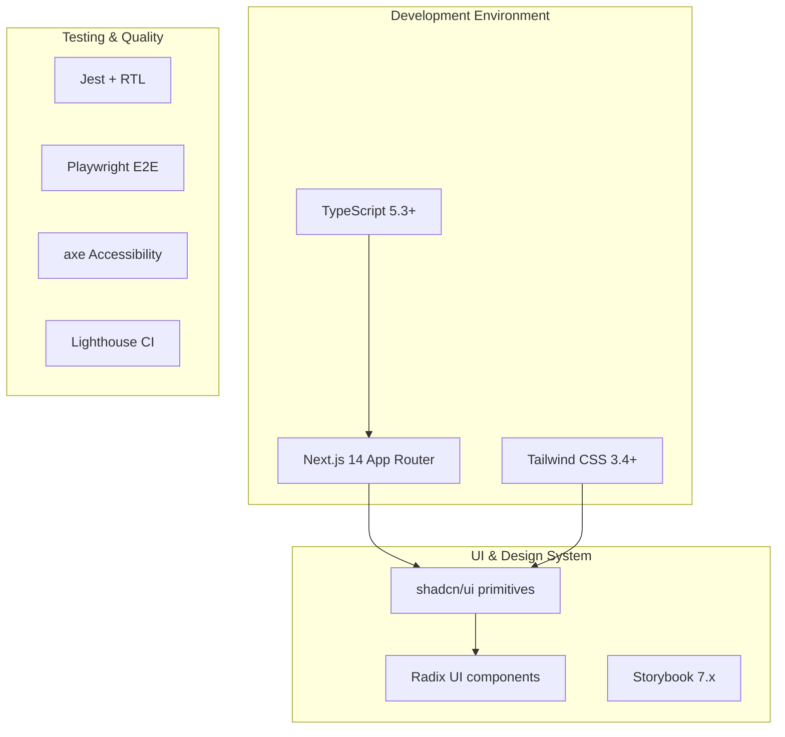

# Frontend Foundation Setup Design

## Overview

The SMM Architect frontend foundation establishes a comprehensive, production-ready frontend architecture supporting the platform's autonomous social media marketing capabilities. This foundation creates a scalable monorepo structure with Next.js 14 (App Router), TypeScript, Tailwind CSS, and a robust design system using shadcn/ui primitives.

The frontend will deliver 11 primary user journeys including Auto Setup, Interactive Canvas, Proposal Cards, Queue Management, Agent Chat, Audit & Replay, and Monitoring interfaces. The architecture emphasizes accessibility, performance, security, and comprehensive testing strategies.

## Technology Stack & Dependencies

### Core Framework Stack


### Dependency Configuration

**Core Dependencies:**
- `next`: ^14.0.0 (App Router, Server Components)
- `react`: ^18.2.0 
- `typescript`: ^5.3.0
- `tailwindcss`: ^3.4.0
- `@radix-ui/react-*`: Latest stable versions
- `class-variance-authority`: ^0.7.0 (Component variants)
- `clsx`: ^2.0.0 (Conditional classes)
- `tailwind-merge`: ^2.0.0 (Class merging)

**Development Dependencies:**
- `@storybook/nextjs`: ^7.6.0
- `jest`: ^29.7.0
- `@testing-library/react`: ^14.1.0
- `@playwright/test`: ^1.40.0
- `@axe-core/playwright`: ^4.8.0
- `eslint-config-next`: ^14.0.0
- `@typescript-eslint/eslint-plugin`: ^6.13.0

## Component Architecture

### Monorepo Structure
```
smm-architect/
├── apps/
│   └── frontend/                    # Next.js application
│       ├── app/                     # App Router structure
│       │   ├── (auth)/             # Route groups
│       │   │   └── login/
│       │   ├── globals.css
│       │   ├── layout.tsx
│       │   ├── page.tsx            # Dashboard
│       │   ├── onboard/
│       │   ├── canvas/
│       │   ├── workspaces/
│       │   │   └── [id]/
│       │   ├── settings/
│       │   ├── connectors/
│       │   ├── audit/
│       │   │   └── [id]/
│       │   └── chat/
│       ├── components/             # App-specific components
│       ├── lib/                   # Utilities and configs
│       ├── mocks/                 # API mocks for development
│       ├── public/
│       └── package.json
├── packages/
│   └── ui/                        # Design system package
│       ├── src/
│       │   ├── components/        # Reusable UI components
│       │   │   ├── button.tsx
│       │   │   ├── card.tsx
│       │   │   ├── input.tsx
│       │   │   ├── modal.tsx
│       │   │   ├── badge.tsx
│       │   │   ├── timeline.tsx
│       │   │   ├── decision-card.tsx
│       │   │   └── canvas-skeleton.tsx
│       │   ├── lib/               # Shared utilities
│       │   └── index.ts           # Exports
│       ├── package.json
│       └── tsconfig.json
├── .storybook/                    # Storybook configuration
└── playwright.config.ts
```

### Component Hierarchy & Design System

#### Core UI Components (packages/ui/)

**Base Components:**
- `Button`: Primary, secondary, outline, ghost variants with loading states
- `Input`: Text, password, search with validation states
- `Card`: Content containers with header/footer sections
- `Modal`: Dialog overlays with backdrop and focus management
- `Badge`: Status indicators with color variants
- `Toast`: Notification system with auto-dismiss

**Specialized Components:**
- `Timeline`: Step-by-step progress visualization with replay scrubber
- `DecisionCard`: Campaign proposal display with cost/risk visualization  
- `CanvasSkeleton`: Loading state for complex canvas interactions
- `MicroGraph`: Interactive workflow visualization (Discover → Plan → Draft → Verify → Approve → Post)
- `ConnectorHealthPill`: OAuth connection status indicator
- `AgentChatWindow`: Streaming LLM chat interface
- `AuditBundleViewer`: Signature verification and JSON viewer
- `MonitoringDashboard`: Budget/SLO metrics visualization
- `PolicyBadge`: Policy compliance indicators
- `ProvenanceLinks`: Citation and source traceability
- `PlaywrightWorkerStatus`: Background job status display

#### Design System Architecture

```typescript
// Component variant system using CVA
const buttonVariants = cva(
  "inline-flex items-center justify-center rounded-md text-sm font-medium transition-colors focus-visible:outline-none focus-visible:ring-2 focus-visible:ring-ring focus-visible:ring-offset-2 disabled:opacity-50 disabled:pointer-events-none ring-offset-background",
  {
    variants: {
      variant: {
        default: "bg-primary text-primary-foreground hover:bg-primary/90",
        destructive: "bg-destructive text-destructive-foreground hover:bg-destructive/90",
        outline: "border border-input hover:bg-accent hover:text-accent-foreground",
        secondary: "bg-secondary text-secondary-foreground hover:bg-secondary/80",
        ghost: "hover:bg-accent hover:text-accent-foreground",
        link: "underline-offset-4 hover:underline text-primary"
      },
      size: {
        default: "h-10 py-2 px-4",
        sm: "h-9 px-3 rounded-md",
        lg: "h-11 px-8 rounded-md",
        icon: "h-10 w-10"
      }
    },
    defaultVariants: {
      variant: "default",
      size: "default"
    }
  }
)
```

**Design Tokens (Tailwind Configuration):**
```javascript
// tailwind.config.js
module.exports = {
  theme: {
    extend: {
      colors: {
        // Brand colors aligned with SMM Architect identity
        primary: {
          50: '#f0f9ff',
          500: '#3b82f6', 
          900: '#1e3a8a'
        },
        // Status colors for campaign states
        success: '#10b981',
        warning: '#f59e0b', 
        error: '#ef4444',
        // Canvas specific colors
        canvas: {
          background: '#fafafa',
          grid: '#e5e7eb',
          node: '#ffffff',
          edge: '#6b7280'
        }
      },
      fontFamily: {
        sans: ['Inter', 'system-ui', 'sans-serif'],
        mono: ['JetBrains Mono', 'monospace']
      },
      spacing: {
        18: '4.5rem',
        88: '22rem'
      }
    }
  }
}
```

### Page Architecture & Routing

#### Route Structure (App Router)

**Public Routes:**
- `/` - Dashboard overview with workspace cards
- `/login` - Authentication (OAuth flows)

**Protected Routes:**
- `/onboard` - Auto Setup guided flow
- `/canvas` - Interactive Canvas with micro-graph
- `/workspaces/[id]` - Workspace detail with live status
- `/settings` - Personas, budget, policy configuration
- `/connectors` - OAuth management and health status
- `/audit/[id]` - Audit bundle viewer with signature verification
- `/chat` - Agent interaction interface

#### Component Integration Patterns

**Queue & Content Calendar Component:**
```typescript
interface ScheduledPost {
  id: string;
  title: string;
  content: string;
  channel: string;
  scheduledAt: Date;
  status: 'scheduled' | 'posted' | 'failed';
  canEdit: boolean;
}

const ContentCalendar = () => {
  const [selectedDate, setSelectedDate] = useState(new Date());
  const [view, setView] = useState<'week' | 'month'>('week');
  const { scheduledPosts, isLoading } = useScheduledPosts();
  
  return (
    <div className="content-calendar">
      <CalendarHeader 
        view={view} 
        onViewChange={setView}
        selectedDate={selectedDate}
        onDateChange={setSelectedDate}
      />
      <CalendarGrid 
        view={view}
        selectedDate={selectedDate}
        posts={scheduledPosts}
        onPostEdit={handlePostEdit}
        onPostCancel={handlePostCancel}
      />
      <QuickEditModal />
    </div>
  );
};
```

**Support/Inbox Router Interface:**
```typescript
interface SupportTicket {
  id: string;
  subject: string;
  priority: 'low' | 'medium' | 'high' | 'urgent';
  status: 'open' | 'in_progress' | 'resolved' | 'escalated';
  customer: { name: string; email: string; };
  assignedTo?: string;
  autoReplyId?: string;
  suggestedResponses: string[];
}

const SupportInbox = () => {
  const { tickets, isLoading } = useSupportTickets();
  const [selectedTicket, setSelectedTicket] = useState<SupportTicket | null>(null);
  
  return (
    <div className="support-inbox grid grid-cols-1 lg:grid-cols-3 gap-6">
      <TicketList 
        tickets={tickets}
        selectedId={selectedTicket?.id}
        onSelect={setSelectedTicket}
        isLoading={isLoading}
      />
      {selectedTicket && (
        <TicketDetail 
          ticket={selectedTicket}
          onReply={handleTicketReply}
          onEscalate={handleTicketEscalate}
          onResolve={handleTicketResolve}
        />
      )}
      <AutoReplyPanel 
        suggestions={selectedTicket?.suggestedResponses || []}
        onUseTemplate={handleUseTemplate}
      />
    </div>
  );
};
```

**Enhanced Canvas Micro-Graph Implementation:**
```typescript
interface Step {
  id: 'discover' | 'plan' | 'draft' | 'verify' | 'approve' | 'post';
  status: 'pending' | 'running' | 'completed' | 'failed' | 'blocked';
  duration?: string;
  progress?: number;
  actions?: Array<'fix' | 'rerun' | 'approve' | 'rollback'>;
  tooltip?: string;
  dependencies?: string[];
}

const MicroGraph: React.FC<{ steps: Step[]; mode: 'plan' | 'live'; onStepAction: (stepId: string, action: string) => void }> = ({ 
  steps, 
  mode, 
  onStepAction 
}) => {
  const [hoveredStep, setHoveredStep] = useState<string | null>(null);
  const [selectedStep, setSelectedStep] = useState<string | null>(null);
  
  return (
    <div className="micro-graph flex justify-between items-center p-6 bg-canvas-background border rounded-lg">
      {steps.map((step, index) => (
        <div key={step.id} className="flex items-center">
          <StepNode
            step={step}
            isHovered={hoveredStep === step.id}
            isSelected={selectedStep === step.id}
            onClick={() => setSelectedStep(step.id)}
            onMouseEnter={() => setHoveredStep(step.id)}
            onMouseLeave={() => setHoveredStep(null)}
            mode={mode}
          />
          {index < steps.length - 1 && (
            <StepConnector 
              fromStatus={step.status}
              toStatus={steps[index + 1].status}
              animated={mode === 'live'}
            />
          )}
        </div>
      ))}
      
      {selectedStep && (
        <StepActionPopover
          step={steps.find(s => s.id === selectedStep)!}
          onAction={(action) => {
            onStepAction(selectedStep, action);
            setSelectedStep(null);
          }}
          onClose={() => setSelectedStep(null)}
        />
      )}
    </div>
  );
};

const StepNode: React.FC<{
  step: Step;
  isHovered: boolean;
  isSelected: boolean;
  onClick: () => void;
  onMouseEnter: () => void;
  onMouseLeave: () => void;
  mode: 'plan' | 'live';
}> = ({ step, isHovered, isSelected, onClick, onMouseEnter, onMouseLeave, mode }) => {
  const getStatusColor = (status: Step['status']) => {
    switch (status) {
      case 'completed': return 'bg-success text-white';
      case 'running': return 'bg-warning text-white animate-pulse';
      case 'failed': return 'bg-error text-white';
      case 'blocked': return 'bg-muted text-muted-foreground';
      default: return 'bg-canvas-node border-2 border-canvas-edge';
    }
  };
  
  return (
    <div className="relative">
      <button
        className={cn(
          "w-12 h-12 rounded-full flex items-center justify-center text-xs font-medium transition-all duration-200",
          getStatusColor(step.status),
          isHovered && "scale-110 shadow-lg",
          isSelected && "ring-2 ring-primary ring-offset-2",
          "focus:outline-none focus:ring-2 focus:ring-primary focus:ring-offset-2"
        )}
        onClick={onClick}
        onMouseEnter={onMouseEnter}
        onMouseLeave={onMouseLeave}
        data-testid={`step-${step.id}`}
        aria-label={`${step.id} step - ${step.status}`}
      >
        <StepIcon stepId={step.id} status={step.status} />
      </button>
      
      {/* Progress indicator for running steps */}
      {step.status === 'running' && step.progress !== undefined && (
        <div className="absolute -bottom-2 left-1/2 transform -translate-x-1/2">
          <div className="w-16 h-1 bg-muted rounded-full overflow-hidden">
            <div 
              className="h-full bg-warning transition-all duration-300"
              style={{ width: `${step.progress}%` }}
            />
          </div>
        </div>
      )}
      
      {/* Tooltip on hover */}
      {isHovered && step.tooltip && (
        <div className="absolute -top-12 left-1/2 transform -translate-x-1/2 bg-popover text-popover-foreground text-xs px-2 py-1 rounded shadow-lg whitespace-nowrap z-10">
          {step.tooltip}
          <div className="absolute top-full left-1/2 transform -translate-x-1/2 border-4 border-transparent border-t-popover" />
        </div>
      )}
      
      <div className="mt-2 text-center">
        <div className="text-xs font-medium capitalize">{step.id}</div>
        {step.duration && (
          <div className="text-xs text-muted-foreground">{step.duration}</div>
        )}
      </div>
    </div>
  );
};
```
```typescript
// Canvas component structure
interface CanvasProps {
  workspaceId: string;
  mode: 'plan' | 'live';
  onStepAction: (stepId: string, action: 'fix' | 'rerun' | 'approve' | 'rollback') => void;
}

const Canvas = ({ workspaceId, mode, onStepAction }: CanvasProps) => {
  // Real-time step updates via SSE/WebSocket
  const { steps, isLoading } = useWorkspaceSteps(workspaceId);
  
  return (
    <div className="canvas-container">
      <MicroGraph steps={steps} mode={mode} />
      <Timeline steps={steps} />
      <ReplayScrubber onTimeChange={handleTimelineChange} />
      <StepCards steps={steps} onAction={onStepAction} />
    </div>
  );
};
```

**Playwright Worker Status & Job Queue UI:**
```typescript
interface PlaywrightJob {
  id: string;
  type: 'screenshot' | 'scrape' | 'interaction';
  status: 'queued' | 'running' | 'completed' | 'failed' | 'retrying';
  url?: string;
  attempts: number;
  maxAttempts: number;
  createdAt: Date;
  completedAt?: Date;
  error?: string;
}

const PlaywrightWorkerStatus = () => {
  const { workers, jobs, isLoading } = usePlaywrightStatus();
  
  return (
    <div className="playwright-status space-y-6">
      {/* Worker Status Overview */}
      <div className="grid grid-cols-1 md:grid-cols-3 gap-4">
        <StatusCard 
          title="Active Workers"
          value={workers.active}
          total={workers.total}
          color="success"
        />
        <StatusCard 
          title="Queue Length"
          value={jobs.queued}
          color={jobs.queued > 10 ? "warning" : "primary"}
        />
        <StatusCard 
          title="Failed Jobs"
          value={jobs.failed}
          color={jobs.failed > 0 ? "error" : "success"}
        />
      </div>
      
      {/* Job Queue */}
      <div className="bg-card border rounded-lg">
        <div className="p-4 border-b">
          <h3 className="text-lg font-semibold">Job Queue</h3>
        </div>
        <div className="divide-y">
          {jobs.items.map(job => (
            <JobItem 
              key={job.id}
              job={job}
              onRetry={() => retryJob(job.id)}
              onCancel={() => cancelJob(job.id)}
            />
          ))}
        </div>
      </div>
    </div>
  );
};
```

**Enhanced Monitoring Dashboard:**
```typescript
interface MetricCard {
  title: string;
  value: number;
  unit: string;
  change?: { value: number; period: string };
  status: 'normal' | 'warning' | 'critical';
  threshold?: { warning: number; critical: number };
}

const MonitoringDashboard = () => {
  const { metrics, alerts, slos, isLoading } = useMonitoringData();
  
  return (
    <div className="monitoring-dashboard space-y-6">
      {/* Critical Alerts */}
      {alerts.critical.length > 0 && (
        <AlertBanner alerts={alerts.critical} severity="critical" />
      )}
      
      {/* Key Metrics Grid */}
      <div className="grid grid-cols-1 md:grid-cols-2 lg:grid-cols-4 gap-4">
        <MetricCard
          title="Budget Utilization"
          value={metrics.budget.utilized}
          unit="%"
          change={{ value: 12, period: "this week" }}
          status={metrics.budget.utilized > 80 ? "warning" : "normal"}
          threshold={{ warning: 80, critical: 95 }}
        />
        <MetricCard
          title="Active Workspaces"
          value={metrics.workspaces.active}
          unit="workspaces"
          status="normal"
        />
        <MetricCard
          title="Agent Success Rate"
          value={metrics.agents.successRate}
          unit="%"
          status={metrics.agents.successRate < 95 ? "warning" : "normal"}
          threshold={{ warning: 95, critical: 90 }}
        />
        <MetricCard
          title="Connector Health"
          value={metrics.connectors.healthy}
          unit={`/${metrics.connectors.total}`}
          status={metrics.connectors.healthy < metrics.connectors.total ? "warning" : "normal"}
        />
      </div>
      
      {/* Emergency Controls */}
      <EmergencyControlPanel />
    </div>
  );
};

const EmergencyControlPanel = () => {
  const [isPaused, setIsPaused] = useState(false);
  const [showConfirm, setShowConfirm] = useState(false);
  
  const handlePauseAll = async () => {
    if (!showConfirm) {
      setShowConfirm(true);
      return;
    }
    
    try {
      await apiClient.post('/api/emergency/pause-all');
      setIsPaused(true);
      setShowConfirm(false);
      toast.success('All campaigns paused successfully');
    } catch (error) {
      toast.error('Failed to pause campaigns');
    }
  };
  
  return (
    <div className="emergency-controls bg-card border border-warning/20 rounded-lg p-6">
      <div className="flex items-center justify-between">
        <div>
          <h3 className="text-lg font-semibold text-warning">Emergency Controls</h3>
          <p className="text-sm text-muted-foreground">
            Use these controls only in emergency situations
          </p>
        </div>
        <div className="flex space-x-3">
          {isPaused ? (
            <Button variant="outline" onClick={() => window.location.reload()}>
              Resume All
            </Button>
          ) : (
            <Button 
              variant={showConfirm ? "destructive" : "outline"}
              onClick={handlePauseAll}
            >
              {showConfirm ? "Confirm: Pause All" : "Emergency Pause All"}
            </Button>
          )}
        </div>
      </div>
      
      {showConfirm && (
        <div className="mt-4 p-3 bg-destructive/10 border border-destructive/20 rounded">
          <p className="text-sm text-destructive font-medium">
            ⚠️ This will immediately pause all active campaigns and agents. Are you sure?
          </p>
          <div className="flex space-x-2 mt-2">
            <Button size="sm" variant="ghost" onClick={() => setShowConfirm(false)}>
              Cancel
            </Button>
          </div>
        </div>
      )}
    </div>
  );
};
```

**Personas & Settings Management:**
```typescript
interface Persona {
  id: string;
  name: string;
  description: string;
  traits: string[];
  tone: 'professional' | 'casual' | 'friendly' | 'authoritative';
  industries: string[];
  isActive: boolean;
}

const PersonaManager = () => {
  const { personas, isLoading } = usePersonas();
  const [selectedPersona, setSelectedPersona] = useState<Persona | null>(null);
  const [showCreateForm, setShowCreateForm] = useState(false);
  
  return (
    <div className="persona-manager space-y-6">
      <div className="flex justify-between items-center">
        <h2 className="text-2xl font-bold">Brand Personas</h2>
        <Button onClick={() => setShowCreateForm(true)}>
          Add New Persona
        </Button>
      </div>
      
      <div className="grid grid-cols-1 md:grid-cols-2 lg:grid-cols-3 gap-4">
        {personas.map(persona => (
          <PersonaCard
            key={persona.id}
            persona={persona}
            onEdit={() => setSelectedPersona(persona)}
            onToggle={() => togglePersona(persona.id)}
          />
        ))}
      </div>
      
      {selectedPersona && (
        <PersonaEditModal
          persona={selectedPersona}
          onClose={() => setSelectedPersona(null)}
          onSave={handlePersonaSave}
        />
      )}
      
      {showCreateForm && (
        <PersonaCreateModal
          onClose={() => setShowCreateForm(false)}
          onCreate={handlePersonaCreate}
        />
      )}
    </div>
  );
};
```

**DecisionCard Component:**
```typescript
interface DecisionCardProps {
  proposal: {
    id: string;
    title: string;
    preview: string;
    cost: number;
    risk: 'low' | 'medium' | 'high';
    readinessScore: number;
    provenance: ProvenanceLink[];
  };
  onApprove: () => void;
  onRequestEdits: (feedback: string) => void;
  onEscalate: () => void;
}

const DecisionCard = ({ proposal, onApprove, onRequestEdits, onEscalate }: DecisionCardProps) => {
  return (
    <Card className="decision-card">
      <CardHeader>
        <div className="flex justify-between items-start">
          <CardTitle>{proposal.title}</CardTitle>
          <Badge variant={getRiskVariant(proposal.risk)}>{proposal.risk}</Badge>
        </div>
      </CardHeader>
      <CardContent>
        <PreviewSection content={proposal.preview} />
        <MetricsGrid cost={proposal.cost} readiness={proposal.readinessScore} />
        <ProvenanceLinks links={proposal.provenance} />
      </CardContent>
      <CardFooter>
        <ActionButtons 
          onApprove={onApprove}
          onRequestEdits={onRequestEdits}
          onEscalate={onEscalate}
        />
      </CardFooter>
    </Card>
  );
};
```

## API Integration Layer

### Backend Integration Architecture

**Authentication Flow:**
```typescript
// Auth integration with Vault-issued tokens
interface AuthConfig {
  vaultEndpoint: string;
  tokenRefreshThreshold: number; // seconds before expiry
}

const useAuth = () => {
  const [token, setToken] = useState<string | null>(null);
  
  const refreshToken = useCallback(async () => {
    // Exchange session for JWT via backend
    const response = await fetch('/api/auth/refresh', {
      method: 'POST',
      credentials: 'include'
    });
    const { token } = await response.json();
    setToken(token);
  }, []);
  
  return { token, refreshToken };
};
```

**Real-time Updates:**
```typescript
// Canvas live updates via Server-Sent Events
const useWorkspaceSteps = (workspaceId: string) => {
  const [steps, setSteps] = useState<Step[]>([]);
  
  useEffect(() => {
    const eventSource = new EventSource(`/api/workspaces/${workspaceId}/events`);
    
    eventSource.onmessage = (event) => {
      const update = JSON.parse(event.data);
      setSteps(prev => updateStepStatus(prev, update));
    };
    
    return () => eventSource.close();
  }, [workspaceId]);
  
  return { steps, isLoading: steps.length === 0 };
};
```

**API Client Configuration:**
```typescript
// Centralized API client with auth and error handling
const apiClient = {
  baseURL: process.env.NEXT_PUBLIC_API_BASE_URL,
  
  async request<T>(endpoint: string, options: RequestInit = {}): Promise<T> {
    const token = await getAuthToken();
    
    const response = await fetch(`${this.baseURL}${endpoint}`, {
      ...options,
      headers: {
        'Content-Type': 'application/json',
        'Authorization': `Bearer ${token}`,
        'X-Trace-ID': generateTraceId(),
        ...options.headers
      }
    });
    
    if (!response.ok) {
      throw new APIError(response.status, await response.text());
    }
    
    return response.json();
  }
};
```

### Mock API Development

**Development Fixtures:**
```typescript
// mocks/workspace-fixtures.ts
export const mockWorkspaces = [
  {
    id: 'ws-demo-001',
    name: 'Holiday Campaign 2024',
    status: 'simulation',
    steps: [
      { id: 'discover', status: 'completed', duration: '2.3s' },
      { id: 'plan', status: 'running', duration: '45.7s' },
      { id: 'draft', status: 'pending' },
      { id: 'verify', status: 'pending' },
      { id: 'approve', status: 'pending' },
      { id: 'post', status: 'pending' }
    ],
    readinessScore: 0.73,
    estimatedCost: 1250
  }
];

// API route handlers for development
// app/api/workspaces/route.ts
import { NextRequest } from 'next/server';
import { mockWorkspaces } from '@/mocks/workspace-fixtures';

export async function GET(request: NextRequest) {
  // Simulate network delay
  await new Promise(resolve => setTimeout(resolve, 300));
  
  return Response.json({
    workspaces: mockWorkspaces,
    total: mockWorkspaces.length
  });
}
```

## Testing Strategy

### Unit Testing (Jest + React Testing Library)

**Component Testing Patterns:**
```typescript
// Button component test
describe('Button', () => {
  it('renders with correct variant classes', () => {
    render(<Button variant="outline">Test</Button>);
    expect(screen.getByRole('button')).toHaveClass('border border-input');
  });
  
  it('handles loading state correctly', () => {
    render(<Button loading>Submit</Button>);
    expect(screen.getByRole('button')).toBeDisabled();
    expect(screen.getByTestId('loading-spinner')).toBeInTheDocument();
  });
  
  it('calls onClick handler', async () => {
    const handleClick = jest.fn();
    render(<Button onClick={handleClick}>Click me</Button>);
    
    await user.click(screen.getByRole('button'));
    expect(handleClick).toHaveBeenCalledTimes(1);
  });
});

// DecisionCard integration test
describe('DecisionCard', () => {
  const mockProposal = {
    id: 'prop-001',
    title: 'LinkedIn Holiday Post',
    preview: 'Engaging holiday content...',
    cost: 150,
    risk: 'low' as const,
    readinessScore: 0.89,
    provenance: []
  };
  
  it('displays proposal information correctly', () => {
    render(<DecisionCard proposal={mockProposal} onApprove={jest.fn()} />);
    
    expect(screen.getByText('LinkedIn Holiday Post')).toBeInTheDocument();
    expect(screen.getByText('$150')).toBeInTheDocument();
    expect(screen.getByText('89%')).toBeInTheDocument();
  });
  
  it('handles approval workflow', async () => {
    const onApprove = jest.fn();
    render(<DecisionCard proposal={mockProposal} onApprove={onApprove} />);
    
    await user.click(screen.getByRole('button', { name: /approve/i }));
    expect(onApprove).toHaveBeenCalled();
  });
});
```

### End-to-End Testing (Playwright)

**Critical User Journey Tests:**
```typescript
// tests/e2e/auto-setup.spec.ts
test('Auto Setup flow completes successfully', async ({ page }) => {
  await page.goto('/onboard');
  
  // Step 1: Basic workspace info
  await page.fill('[data-testid="workspace-name"]', 'Test Campaign');
  await page.selectOption('[data-testid="primary-channel"]', 'linkedin');
  await page.click('[data-testid="continue-button"]');
  
  // Step 2: OAuth connector setup
  await page.click('[data-testid="connect-linkedin"]');
  
  // Mock OAuth flow completion
  await page.route('**/api/connectors/linkedin/callback', route => {
    route.fulfill({
      status: 200,
      body: JSON.stringify({ status: 'connected', accountId: 'test-account' })
    });
  });
  
  // Step 3: Review shadow run results
  await page.waitForSelector('[data-testid="readiness-score"]');
  expect(await page.textContent('[data-testid="readiness-score"]')).toContain('%');
  
  await page.click('[data-testid="complete-setup"]');
  
  // Verify navigation to canvas
  await expect(page).toHaveURL(/\/canvas/);
});

// Canvas interaction test
test('Canvas timeline and step interactions work correctly', async ({ page }) => {
  await page.goto('/canvas?workspace=ws-test-001');
  
  // Wait for canvas to load
  await page.waitForSelector('[data-testid="micro-graph"]');
  
  // Test step hover details
  await page.hover('[data-testid="step-plan"]');
  await expect(page.locator('[data-testid="step-tooltip"]')).toBeVisible();
  
  // Test action buttons
  await page.click('[data-testid="step-plan"]');
  await expect(page.locator('[data-testid="step-actions"]')).toBeVisible();
  
  // Test replay scrubber
  await page.click('[data-testid="replay-scrubber"]');
  await page.keyboard.press('ArrowRight');
  
  // Verify timeline updates
  await expect(page.locator('[data-testid="timeline-progress"]')).toHaveAttribute('aria-valuenow');
});
```

### Accessibility Testing

**Automated Accessibility Checks:**
```typescript
// tests/accessibility/canvas.spec.ts
import { test, expect } from '@playwright/test';
import AxeBuilder from '@axe-core/playwright';

test('Canvas meets accessibility standards', async ({ page }) => {
  await page.goto('/canvas?workspace=ws-test-001');
  
  const accessibilityScanResults = await new AxeBuilder({ page })
    .withTags(['wcag2a', 'wcag2aa', 'wcag21aa'])
    .analyze();
    
  expect(accessibilityScanResults.violations).toEqual([]);
});

// Screen reader navigation test
test('Canvas supports keyboard navigation', async ({ page }) => {
  await page.goto('/canvas?workspace=ws-test-001');
  
  // Tab through interactive elements
  await page.keyboard.press('Tab');
  await expect(page.locator('[data-testid="step-discover"]')).toBeFocused();
  
  await page.keyboard.press('Tab');
  await expect(page.locator('[data-testid="step-plan"]')).toBeFocused();
  
  // Test Enter key activation
  await page.keyboard.press('Enter');
  await expect(page.locator('[data-testid="step-actions"]')).toBeVisible();
  
  // Test Escape key dismissal
  await page.keyboard.press('Escape');
  await expect(page.locator('[data-testid="step-actions"]')).not.toBeVisible();
});
```

### Storybook Configuration

**Component Stories:**
```typescript
// stories/Button.stories.ts
import type { Meta, StoryObj } from '@storybook/react';
import { Button } from '@/components/ui/button';

const meta: Meta<typeof Button> = {
  title: 'UI/Button',
  component: Button,
  parameters: {
    layout: 'centered',
  },
  tags: ['autodocs'],
  argTypes: {
    variant: {
      control: { type: 'select' },
      options: ['default', 'destructive', 'outline', 'secondary', 'ghost', 'link']
    }
  }
};

export default meta;
type Story = StoryObj<typeof meta>;

export const Primary: Story = {
  args: {
    children: 'Primary Button',
    variant: 'default'
  }
};

export const Loading: Story = {
  args: {
    children: 'Loading Button',
    loading: true
  }
};

// DecisionCard story with mock data
export const DecisionCardExample: Story = {
  render: () => (
    <DecisionCard
      proposal={{
        id: 'story-prop-001',
        title: 'LinkedIn Thought Leadership Post',
        preview: 'Share insights about AI in marketing automation...',
        cost: 200,
        risk: 'low',
        readinessScore: 0.92,
        provenance: [
          { type: 'research', source: 'Industry Report 2024', confidence: 0.89 },
          { type: 'template', source: 'Thought Leadership Template v2', confidence: 0.95 }
        ]
      }}
      onApprove={() => console.log('Approved')}
      onRequestEdits={(feedback) => console.log('Edits requested:', feedback)}
      onEscalate={() => console.log('Escalated')}
    />
  )
};
```

### Performance Testing

**Lighthouse CI Configuration:**
```javascript
// lighthouse.config.js
module.exports = {
  ci: {
    collect: {
      url: [
        'http://localhost:3000/',
        'http://localhost:3000/canvas',
        'http://localhost:3000/onboard'
      ],
      numberOfRuns: 3
    },
    assert: {
      assertions: {
        'categories:performance': ['error', { minScore: 0.85 }],
        'categories:accessibility': ['error', { minScore: 0.95 }],
        'categories:best-practices': ['error', { minScore: 0.90 }],
        'categories:seo': ['error', { minScore: 0.85 }]
      }
    }
  }
};
```

**Bundle Analysis:**
```javascript
// next.config.js performance monitoring
const withBundleAnalyzer = require('@next/bundle-analyzer')({
  enabled: process.env.ANALYZE === 'true'
});

module.exports = withBundleAnalyzer({
  experimental: {
    bundlePagesRouterDependencies: true,
  },
  webpack: (config, { isServer }) => {
    if (!isServer) {
      config.resolve.fallback = {
        ...config.resolve.fallback,
        fs: false,
      };
    }
    return config;
  }
});
```

## CI/CD Integration

### GitHub Actions Workflow Extensions

**Frontend-specific CI Jobs:**
```yaml
# .github/workflows/ci.yml additions
frontend-lint:
  name: Frontend Linting & Type Checking
  runs-on: ubuntu-latest
  steps:
    - name: Checkout code
      uses: actions/checkout@v4
      
    - name: Setup Node.js
      uses: actions/setup-node@v4
      with:
        node-version: ${{ env.NODE_VERSION }}
        cache: 'pnpm'
        
    - name: Install dependencies
      run: pnpm install --frozen-lockfile
      
    - name: ESLint
      run: pnpm run lint --workspace=frontend
      
    - name: TypeScript type check
      run: pnpm run type-check --workspace=frontend
      
    - name: Prettier format check
      run: pnpm run format:check --workspace=frontend

frontend-test:
  name: Frontend Unit Tests
  runs-on: ubuntu-latest
  steps:
    - name: Checkout code
      uses: actions/checkout@v4
      
    - name: Setup Node.js
      uses: actions/setup-node@v4
      with:
        node-version: ${{ env.NODE_VERSION }}
        cache: 'pnpm'
        
    - name: Install dependencies
      run: pnpm install --frozen-lockfile
      
    - name: Run Jest tests
      run: pnpm run test --workspace=frontend --coverage
      
    - name: Upload coverage to Codecov
      uses: codecov/codecov-action@v3
      with:
        file: ./apps/frontend/coverage/lcov.info
        flags: frontend

frontend-storybook:
  name: Storybook Build & Visual Tests
  runs-on: ubuntu-latest
  steps:
    - name: Checkout code
      uses: actions/checkout@v4
      
    - name: Setup Node.js
      uses: actions/setup-node@v4
      with:
        node-version: ${{ env.NODE_VERSION }}
        cache: 'pnpm'
        
    - name: Install dependencies
      run: pnpm install --frozen-lockfile
      
    - name: Build Storybook
      run: pnpm run build-storybook --workspace=frontend
      
    - name: Upload Storybook artifacts
      uses: actions/upload-artifact@v3
      with:
        name: storybook-static
        path: apps/frontend/storybook-static/
        retention-days: 30

frontend-e2e:
  name: Frontend E2E Tests
  runs-on: ubuntu-latest
  steps:
    - name: Checkout code
      uses: actions/checkout@v4
      
    - name: Setup Node.js
      uses: actions/setup-node@v4
      with:
        node-version: ${{ env.NODE_VERSION }}
        cache: 'pnpm'
        
    - name: Install dependencies
      run: pnpm install --frozen-lockfile
      
    - name: Install Playwright browsers
      run: pnpm exec playwright install --with-deps
      
    - name: Start application
      run: |
        pnpm run build --workspace=frontend
        pnpm run start --workspace=frontend &
        
    - name: Wait for app to be ready
      run: npx wait-on http://localhost:3000
      
    - name: Run Playwright tests
      run: pnpm run test:e2e --workspace=frontend
      
    - name: Upload test results
      uses: actions/upload-artifact@v3
      if: always()
      with:
        name: playwright-report
        path: apps/frontend/playwright-report/
        retention-days: 30

frontend-accessibility:
  name: Accessibility Testing
  runs-on: ubuntu-latest
  steps:
    - name: Checkout code
      uses: actions/checkout@v4
      
    - name: Setup Node.js
      uses: actions/setup-node@v4
      with:
        node-version: ${{ env.NODE_VERSION }}
        cache: 'pnpm'
        
    - name: Install dependencies
      run: pnpm install --frozen-lockfile
      
    - name: Build application
      run: pnpm run build --workspace=frontend
      
    - name: Run accessibility tests
      run: pnpm run test:a11y --workspace=frontend
      
    - name: Lighthouse CI
      run: pnpm run lighthouse:ci --workspace=frontend
```

### Package Configuration

**Root package.json Updates:**
```json
{
  "name": "smm-architect-monorepo",
  "workspaces": [
    "apps/*",
    "packages/*",
    "services/*"
  ],
  "scripts": {
    "dev": "turbo run dev",
    "build": "turbo run build", 
    "test": "turbo run test",
    "lint": "turbo run lint",
    "type-check": "turbo run type-check"
  },
  "devDependencies": {
    "turbo": "^1.11.0",
    "@changesets/cli": "^2.27.0"
  }
}
```

**Apps/Frontend package.json:**
```json
{
  "name": "@smm-architect/frontend",
  "version": "0.1.0",
  "scripts": {
    "dev": "next dev",
    "build": "next build",
    "start": "next start",
    "lint": "next lint",
    "type-check": "tsc --noEmit",
    "test": "jest",
    "test:watch": "jest --watch",
    "test:e2e": "playwright test",
    "test:a11y": "playwright test --grep @accessibility",
    "storybook": "storybook dev -p 6006",
    "build-storybook": "storybook build",
    "lighthouse:ci": "lhci autorun"
  },
  "dependencies": {
    "next": "^14.0.0",
    "react": "^18.2.0",
    "react-dom": "^18.2.0",
    "@smm-architect/ui": "workspace:*"
  }
}
```

This foundation establishes a comprehensive, scalable frontend architecture that supports the full range of SMM Architect's user journeys while maintaining high standards for accessibility, performance, and developer experience.    .withTags(['wcag2a', 'wcag2aa', 'wcag21aa'])
    .analyze();
    
  expect(accessibilityScanResults.violations).toEqual([]);
});

// Screen reader navigation test
test('Canvas supports keyboard navigation', async ({ page }) => {
  await page.goto('/canvas?workspace=ws-test-001');
  
  // Tab through interactive elements
  await page.keyboard.press('Tab');
  await expect(page.locator('[data-testid="step-discover"]')).toBeFocused();
  
  await page.keyboard.press('Tab');
  await expect(page.locator('[data-testid="step-plan"]')).toBeFocused();
  
  // Test Enter key activation
  await page.keyboard.press('Enter');
  await expect(page.locator('[data-testid="step-actions"]')).toBeVisible();
  
  // Test Escape key dismissal
  await page.keyboard.press('Escape');
  await expect(page.locator('[data-testid="step-actions"]')).not.toBeVisible();
});
```

### Storybook Configuration

**Component Stories:**
```typescript
// stories/Button.stories.ts
import type { Meta, StoryObj } from '@storybook/react';
import { Button } from '@/components/ui/button';

const meta: Meta<typeof Button> = {
  title: 'UI/Button',
  component: Button,
  parameters: {
    layout: 'centered',
  },
  tags: ['autodocs'],
  argTypes: {
    variant: {
      control: { type: 'select' },
      options: ['default', 'destructive', 'outline', 'secondary', 'ghost', 'link']
    }
  }
};

export default meta;
type Story = StoryObj<typeof meta>;

export const Primary: Story = {
  args: {
    children: 'Primary Button',
    variant: 'default'
  }
};

export const Loading: Story = {
  args: {
    children: 'Loading Button',
    loading: true
  }
};

// DecisionCard story with mock data
export const DecisionCardExample: Story = {
  render: () => (
    <DecisionCard
      proposal={{
        id: 'story-prop-001',
        title: 'LinkedIn Thought Leadership Post',
        preview: 'Share insights about AI in marketing automation...',
        cost: 200,
        risk: 'low',
        readinessScore: 0.92,
        provenance: [
          { type: 'research', source: 'Industry Report 2024', confidence: 0.89 },
          { type: 'template', source: 'Thought Leadership Template v2', confidence: 0.95 }
        ]
      }}
      onApprove={() => console.log('Approved')}
      onRequestEdits={(feedback) => console.log('Edits requested:', feedback)}
      onEscalate={() => console.log('Escalated')}
    />
  )
};
```

### Performance Testing

**Lighthouse CI Configuration:**
```javascript
// lighthouse.config.js
module.exports = {
  ci: {
    collect: {
      url: [
        'http://localhost:3000/',
        'http://localhost:3000/canvas',
        'http://localhost:3000/onboard'
      ],
      numberOfRuns: 3
    },
    assert: {
      assertions: {
        'categories:performance': ['error', { minScore: 0.85 }],
        'categories:accessibility': ['error', { minScore: 0.95 }],
        'categories:best-practices': ['error', { minScore: 0.90 }],
        'categories:seo': ['error', { minScore: 0.85 }]
      }
    }
  }
};
```

**Bundle Analysis:**
```javascript
// next.config.js performance monitoring
const withBundleAnalyzer = require('@next/bundle-analyzer')({
  enabled: process.env.ANALYZE === 'true'
});

module.exports = withBundleAnalyzer({
  experimental: {
    bundlePagesRouterDependencies: true,
  },
  webpack: (config, { isServer }) => {
    if (!isServer) {
      config.resolve.fallback = {
        ...config.resolve.fallback,
        fs: false,
      };
    }
    return config;
  }
});
```

## CI/CD Integration

### GitHub Actions Workflow Extensions

**Frontend-specific CI Jobs:**
```yaml
# .github/workflows/ci.yml additions
frontend-lint:
  name: Frontend Linting & Type Checking
  runs-on: ubuntu-latest
  steps:
    - name: Checkout code
      uses: actions/checkout@v4
      
    - name: Setup Node.js
      uses: actions/setup-node@v4
      with:
        node-version: ${{ env.NODE_VERSION }}
        cache: 'pnpm'
        
    - name: Install dependencies
      run: pnpm install --frozen-lockfile
      
    - name: ESLint
      run: pnpm run lint --workspace=frontend
      
    - name: TypeScript type check
      run: pnpm run type-check --workspace=frontend
      
    - name: Prettier format check
      run: pnpm run format:check --workspace=frontend

frontend-test:
  name: Frontend Unit Tests
  runs-on: ubuntu-latest
  steps:
    - name: Checkout code
      uses: actions/checkout@v4
      
    - name: Setup Node.js
      uses: actions/setup-node@v4
      with:
        node-version: ${{ env.NODE_VERSION }}
        cache: 'pnpm'
        
    - name: Install dependencies
      run: pnpm install --frozen-lockfile
      
    - name: Run Jest tests
      run: pnpm run test --workspace=frontend --coverage
      
    - name: Upload coverage to Codecov
      uses: codecov/codecov-action@v3
      with:
        file: ./apps/frontend/coverage/lcov.info
        flags: frontend

frontend-storybook:
  name: Storybook Build & Visual Tests
  runs-on: ubuntu-latest
  steps:
    - name: Checkout code
      uses: actions/checkout@v4
      
    - name: Setup Node.js
      uses: actions/setup-node@v4
      with:
        node-version: ${{ env.NODE_VERSION }}
        cache: 'pnpm'
        
    - name: Install dependencies
      run: pnpm install --frozen-lockfile
      
    - name: Build Storybook
      run: pnpm run build-storybook --workspace=frontend
      
    - name: Upload Storybook artifacts
      uses: actions/upload-artifact@v3
      with:
        name: storybook-static
        path: apps/frontend/storybook-static/
        retention-days: 30

frontend-e2e:
  name: Frontend E2E Tests
  runs-on: ubuntu-latest
  steps:
    - name: Checkout code
      uses: actions/checkout@v4
      
    - name: Setup Node.js
      uses: actions/setup-node@v4
      with:
        node-version: ${{ env.NODE_VERSION }}
        cache: 'pnpm'
        
    - name: Install dependencies
      run: pnpm install --frozen-lockfile
      
    - name: Install Playwright browsers
      run: pnpm exec playwright install --with-deps
      
    - name: Start application
      run: |
        pnpm run build --workspace=frontend
        pnpm run start --workspace=frontend &
        
    - name: Wait for app to be ready
      run: npx wait-on http://localhost:3000
      
    - name: Run Playwright tests
      run: pnpm run test:e2e --workspace=frontend
      
    - name: Upload test results
      uses: actions/upload-artifact@v3
      if: always()
      with:
        name: playwright-report
        path: apps/frontend/playwright-report/
        retention-days: 30

frontend-accessibility:
  name: Accessibility Testing
  runs-on: ubuntu-latest
  steps:
    - name: Checkout code
      uses: actions/checkout@v4
      
    - name: Setup Node.js
      uses: actions/setup-node@v4
      with:
        node-version: ${{ env.NODE_VERSION }}
        cache: 'pnpm'
        
    - name: Install dependencies
      run: pnpm install --frozen-lockfile
      
    - name: Build application
      run: pnpm run build --workspace=frontend
      
    - name: Run accessibility tests
      run: pnpm run test:a11y --workspace=frontend
      
    - name: Lighthouse CI
      run: pnpm run lighthouse:ci --workspace=frontend
```

### Package Configuration

**Root package.json Updates:**
```json
{
  "name": "smm-architect-monorepo",
  "workspaces": [
    "apps/*",
    "packages/*",
    "services/*"
  ],
  "scripts": {
    "dev": "turbo run dev",
    "build": "turbo run build", 
    "test": "turbo run test",
    "lint": "turbo run lint",
    "type-check": "turbo run type-check"
  },
  "devDependencies": {
    "turbo": "^1.11.0",
    "@changesets/cli": "^2.27.0"
  }
}
```

**Apps/Frontend package.json:**
```json
{
  "name": "@smm-architect/frontend",
  "version": "0.1.0",
  "scripts": {
    "dev": "next dev",
    "build": "next build",
    "start": "next start",
    "lint": "next lint",
    "type-check": "tsc --noEmit",
    "test": "jest",
    "test:watch": "jest --watch",
    "test:e2e": "playwright test",
    "test:a11y": "playwright test --grep @accessibility",
    "storybook": "storybook dev -p 6006",
    "build-storybook": "storybook build",
    "lighthouse:ci": "lhci autorun"
  },
  "dependencies": {
    "next": "^14.0.0",
    "react": "^18.2.0",
    "react-dom": "^18.2.0",
    "@smm-architect/ui": "workspace:*"
  }
}
```

## Enterprise Authentication & RBAC

### SSO Integration Architecture
**SAML/OIDC Configuration Interface:**
```typescript
interface SSOProvider {
  id: string;
  name: string;
  type: 'saml' | 'oidc';
  config: {
    entityId?: string; // SAML
    ssoUrl?: string; // SAML
    certificate?: string; // SAML
    clientId?: string; // OIDC
    clientSecret?: string; // OIDC
    discoveryUrl?: string; // OIDC
    scopes?: string[]; // OIDC
  };
  status: 'active' | 'pending' | 'disabled';
  domains: string[]; // Auto-provision domains
}

const SSOConfigurationPanel = () => {
  const { ssoProviders, isLoading } = useSSOProviders();
  const [selectedProvider, setSelectedProvider] = useState<SSOProvider | null>(null);
  
  return (
    <div className="sso-config space-y-6">
      <div className="flex justify-between items-center">
        <h2 className="text-2xl font-bold">Single Sign-On Configuration</h2>
        <Button onClick={() => setSelectedProvider({ type: 'oidc' } as SSOProvider)}>
          Add SSO Provider
        </Button>
      </div>
      
      <div className="grid gap-4">
        {ssoProviders.map(provider => (
          <SSOProviderCard
            key={provider.id}
            provider={provider}
            onEdit={() => setSelectedProvider(provider)}
            onTest={() => testSSOProvider(provider.id)}
            onToggle={() => toggleSSOProvider(provider.id)}
          />
        ))}
      </div>
      
      {selectedProvider && (
        <SSOConfigModal
          provider={selectedProvider}
          onSave={handleSSOSave}
          onClose={() => setSelectedProvider(null)}
        />
      )}
      
      <SCIMProvisioningSection />
    </div>
  );
};

const SCIMProvisioningSection = () => {
  const { scimConfig, webhookUrl } = useSCIMConfig();
  
  return (
    <Card className="scim-config">
      <CardHeader>
        <CardTitle>SCIM Provisioning</CardTitle>
        <CardDescription>
          Automatic user and group synchronization from your identity provider
        </CardDescription>
      </CardHeader>
      <CardContent className="space-y-4">
        <div className="grid grid-cols-2 gap-4">
          <div>
            <Label>SCIM Base URL</Label>
            <Input value={scimConfig.baseUrl} readOnly />
            <CopyButton text={scimConfig.baseUrl} />
          </div>
          <div>
            <Label>Bearer Token</Label>
            <div className="flex space-x-2">
              <Input type="password" value={scimConfig.token} readOnly />
              <Button variant="outline" onClick={regenerateSCIMToken}>
                Regenerate
              </Button>
            </div>
          </div>
        </div>
        <div>
          <Label>Webhook URL (Optional)</Label>
          <Input value={webhookUrl} readOnly />
          <p className="text-xs text-muted-foreground mt-1">
            Configure this in your IdP for real-time provisioning updates
          </p>
        </div>
      </CardContent>
    </Card>
  );
};
```

### Role-Based Access Control (RBAC)
**Tenant Administration Interface:**
```typescript
interface Role {
  id: string;
  name: string;
  description: string;
  permissions: Permission[];
  isSystemRole: boolean;
  memberCount: number;
}

interface Permission {
  resource: 'workspace' | 'campaign' | 'approval' | 'audit' | 'settings';
  action: 'create' | 'read' | 'update' | 'delete' | 'approve' | 'publish';
  scope?: 'own' | 'team' | 'all';
}

interface TeamMember {
  id: string;
  email: string;
  name: string;
  roles: Role[];
  status: 'active' | 'invited' | 'suspended';
  lastActive: Date;
  source: 'manual' | 'sso' | 'scim';
}

const TenantAdminPanel = () => {
  const { members, roles, invitations } = useTenantData();
  const [activeTab, setActiveTab] = useState<'members' | 'roles' | 'invitations'>('members');
  
  return (
    <div className="tenant-admin space-y-6">
      <div className="flex justify-between items-center">
        <h2 className="text-2xl font-bold">Team Management</h2>
        <div className="flex space-x-2">
          <Button onClick={() => setShowInviteModal(true)}>
            Invite Member
          </Button>
          <Button variant="outline" onClick={() => setShowRoleModal(true)}>
            Create Role
          </Button>
        </div>
      </div>
      
      <Tabs value={activeTab} onValueChange={setActiveTab}>
        <TabsList>
          <TabsTrigger value="members">Members ({members.length})</TabsTrigger>
          <TabsTrigger value="roles">Roles ({roles.length})</TabsTrigger>
          <TabsTrigger value="invitations">Pending ({invitations.length})</TabsTrigger>
        </TabsList>
        
        <TabsContent value="members">
          <MembersTable 
            members={members}
            onEditRoles={handleEditMemberRoles}
            onSuspend={handleSuspendMember}
            onDelete={handleDeleteMember}
          />
        </TabsContent>
        
        <TabsContent value="roles">
          <RolesTable 
            roles={roles}
            onEdit={handleEditRole}
            onDelete={handleDeleteRole}
            onDuplicate={handleDuplicateRole}
          />
        </TabsContent>
        
        <TabsContent value="invitations">
          <InvitationsTable 
            invitations={invitations}
            onResend={handleResendInvitation}
            onRevoke={handleRevokeInvitation}
          />
        </TabsContent>
      </Tabs>
    </div>
  );
};

// RBAC Hook for UI Guards
const usePermissions = () => {
  const { user } = useAuth();
  
  const hasPermission = useCallback((resource: string, action: string, scope?: string) => {
    if (!user?.roles) return false;
    
    return user.roles.some(role => 
      role.permissions.some(permission => 
        permission.resource === resource &&
        permission.action === action &&
        (!scope || permission.scope === scope || permission.scope === 'all')
      )
    );
  }, [user]);
  
  const canApprove = useMemo(() => hasPermission('campaign', 'approve'), [hasPermission]);
  const canPublish = useMemo(() => hasPermission('campaign', 'publish'), [hasPermission]);
  const canManageTeam = useMemo(() => hasPermission('settings', 'update'), [hasPermission]);
  
  return {
    hasPermission,
    canApprove,
    canPublish, 
    canManageTeam
  };
};

// Permission-Gated Component Wrapper
const PermissionGate: React.FC<{
  resource: string;
  action: string;
  scope?: string;
  fallback?: React.ReactNode;
  children: React.ReactNode;
}> = ({ resource, action, scope, fallback = null, children }) => {
  const { hasPermission } = usePermissions();
  
  if (!hasPermission(resource, action, scope)) {
    return <>{fallback}</>;
  }
  
  return <>{children}</>;
};
```

## Approval & Collaboration Workflows

### Version Control & Diff Viewer
**Content Versioning System:**
```typescript
interface ContentVersion {
  id: string;
  version: number;
  content: StructuredContent;
  author: TeamMember;
  createdAt: Date;
  status: 'draft' | 'review' | 'approved' | 'rejected' | 'published';
  reviewComments: ReviewComment[];
  approvals: Approval[];
  changes: ContentDiff[];
}

interface ReviewComment {
  id: string;
  author: TeamMember;
  content: string;
  createdAt: Date;
  resolved: boolean;
  thread: ReviewComment[];
  position?: { line: number; column: number }; // For structured content
}

interface Approval {
  id: string;
  reviewer: TeamMember;
  status: 'approved' | 'rejected' | 'changes_requested';
  comment?: string;
  timestamp: Date;
  auditBundle?: string;
}

const ContentReviewPanel = ({ contentId }: { contentId: string }) => {
  const { versions, currentVersion } = useContentVersions(contentId);
  const [compareVersion, setCompareVersion] = useState<number | null>(null);
  const [showComments, setShowComments] = useState(true);
  
  return (
    <div className="content-review grid grid-cols-1 lg:grid-cols-3 gap-6">
      {/* Version History Sidebar */}
      <div className="version-history space-y-4">
        <h3 className="font-semibold">Version History</h3>
        <div className="space-y-2">
          {versions.map(version => (
            <VersionCard
              key={version.id}
              version={version}
              isCurrent={version.version === currentVersion}
              isComparing={compareVersion === version.version}
              onCompare={() => setCompareVersion(
                compareVersion === version.version ? null : version.version
              )}
            />
          ))}
        </div>
      </div>
      
      {/* Main Content Area */}
      <div className="content-area lg:col-span-2 space-y-4">
        {compareVersion ? (
          <DiffViewer
            original={versions.find(v => v.version === compareVersion)!}
            current={versions.find(v => v.version === currentVersion)!}
          />
        ) : (
          <ContentEditor
            content={versions.find(v => v.version === currentVersion)!.content}
            readonly={!hasPermission('content', 'update')}
            onSave={handleContentSave}
          />
        )}
        
        {/* Approval Actions */}
        <ApprovalActions
          contentId={contentId}
          currentVersion={currentVersion}
          onApprove={handleApprove}
          onReject={handleReject}
          onRequestChanges={handleRequestChanges}
        />
      </div>
      
      {/* Comments Sidebar */}
      {showComments && (
        <div className="comments-sidebar space-y-4">
          <div className="flex justify-between items-center">
            <h3 className="font-semibold">Comments</h3>
            <Button
              variant="ghost"
              size="sm"
              onClick={() => setShowComments(false)}
            >
              <X className="h-4 w-4" />
            </Button>
          </div>
          <ThreadedComments
            comments={currentVersion.reviewComments}
            onAddComment={handleAddComment}
            onResolveComment={handleResolveComment}
          />
        </div>
      )}
    </div>
  );
};

const DiffViewer: React.FC<{
  original: ContentVersion;
  current: ContentVersion;
}> = ({ original, current }) => {
  const diff = useMemo(() => 
    generateContentDiff(original.content, current.content), 
    [original, current]
  );
  
  return (
    <div className="diff-viewer border rounded-lg">
      <div className="diff-header p-4 border-b bg-muted">
        <div className="flex justify-between items-center">
          <div className="flex space-x-4">
            <span className="text-sm">
              Comparing v{original.version} → v{current.version}
            </span>
            <Badge variant="outline">
              {diff.additions} additions, {diff.deletions} deletions
            </Badge>
          </div>
          <Button variant="outline" size="sm">
            Export Diff
          </Button>
        </div>
      </div>
      
      <div className="diff-content p-4">
        {diff.sections.map((section, index) => (
          <DiffSection key={index} section={section} />
        ))}
      </div>
    </div>
  );
};
```

## Rich Content Editor & Structured Post Model

### WYSIWYG Editor with Platform Variants
**Structured Content Model:**
```typescript
interface StructuredContent {
  id: string;
  type: 'post' | 'story' | 'video' | 'carousel';
  title: string;
  baseContent: {
    text: string; // Rich text JSON (EditorJS/Lexical)
    hashtags: string[];
    mentions: string[];
    cta?: CallToAction;
  };
  platformVariants: Record<Platform, PlatformContent>;
  attachments: MediaAsset[];
  accessibility: {
    altText: Record<string, string>; // Asset ID -> alt text
    captions?: string; // Video captions
    audioDescription?: string;
  };
  metadata: {
    templateId?: string;
    industry?: string;
    audience?: string;
    contentPillars?: string[];
  };
}

interface PlatformContent {
  platform: Platform;
  text?: string; // Platform-specific text override
  characterLimit: number;
  hashtags?: string[]; // Platform-specific hashtags
  platformFields: Record<string, any>; // LinkedIn: headline, Twitter: thread
  scheduling?: {
    publishAt?: Date;
    timezone: string;
    optimalTimes?: Date[];
  };
}

interface CallToAction {
  type: 'link' | 'shop' | 'learn_more' | 'contact' | 'download';
  text: string;
  url: string;
  tracking?: {
    utm_source: string;
    utm_medium: string;
    utm_campaign: string;
  };
}

const StructuredContentEditor = ({ initialContent, onSave }: {
  initialContent?: StructuredContent;
  onSave: (content: StructuredContent) => void;
}) => {
  const [content, setContent] = useState<StructuredContent>(
    initialContent || createEmptyContent()
  );
  const [activeTab, setActiveTab] = useState<'editor' | 'preview' | 'variants'>('editor');
  const [selectedPlatform, setSelectedPlatform] = useState<Platform>('linkedin');
  
  return (
    <div className="structured-editor h-full flex flex-col">
      {/* Editor Header */}
      <div className="editor-header border-b p-4">
        <div className="flex justify-between items-center">
          <div className="flex space-x-4">
            <h2 className="text-xl font-semibold">{content.title || 'Untitled Post'}</h2>
            <Badge variant="outline">{content.type}</Badge>
          </div>
          <div className="flex space-x-2">
            <Button variant="outline" onClick={() => validateContent(content)}>
              Validate
            </Button>
            <Button onClick={() => onSave(content)}>
              Save Draft
            </Button>
          </div>
        </div>
        
        <Tabs value={activeTab} onValueChange={setActiveTab} className="mt-4">
          <TabsList>
            <TabsTrigger value="editor">Editor</TabsTrigger>
            <TabsTrigger value="preview">Preview</TabsTrigger>
            <TabsTrigger value="variants">Platform Variants</TabsTrigger>
          </TabsList>
        </Tabs>
      </div>
      
      <div className="editor-body flex-1 flex">
        <TabsContent value="editor" className="flex-1 p-6">
          <div className="grid grid-cols-1 lg:grid-cols-2 gap-6 h-full">
            {/* Main Editor */}
            <div className="space-y-4">
              <div>
                <Label>Post Title</Label>
                <Input
                  value={content.title}
                  onChange={(e) => setContent(prev => ({ ...prev, title: e.target.value }))}
                  placeholder="Enter post title..."
                />
              </div>
              
              <div>
                <Label>Content</Label>
                <RichTextEditor
                  content={content.baseContent.text}
                  onChange={(text) => setContent(prev => ({
                    ...prev,
                    baseContent: { ...prev.baseContent, text }
                  }))}
                  placeholder="Write your content here..."
                />
              </div>
              
              <div className="grid grid-cols-2 gap-4">
                <div>
                  <Label>Hashtags</Label>
                  <HashtagInput
                    value={content.baseContent.hashtags}
                    onChange={(hashtags) => setContent(prev => ({
                      ...prev,
                      baseContent: { ...prev.baseContent, hashtags }
                    }))}
                  />
                </div>
                <div>
                  <Label>Mentions</Label>
                  <MentionInput
                    value={content.baseContent.mentions}
                    onChange={(mentions) => setContent(prev => ({
                      ...prev,
                      baseContent: { ...prev.baseContent, mentions }
                    }))}
                  />
                </div>
              </div>
              
              <CTAEditor
                cta={content.baseContent.cta}
                onChange={(cta) => setContent(prev => ({
                  ...prev,
                  baseContent: { ...prev.baseContent, cta }
                }))}
              />
            </div>
            
            {/* Media & Metadata */}
            <div className="space-y-4">
              <MediaAttachments
                attachments={content.attachments}
                onChange={(attachments) => setContent(prev => ({ ...prev, attachments }))}
                onUpload={handleMediaUpload}
              />
              
              <AccessibilityFields
                accessibility={content.accessibility}
                attachments={content.attachments}
                onChange={(accessibility) => setContent(prev => ({ ...prev, accessibility }))}
              />
              
              <ContentMetadata
                metadata={content.metadata}
                onChange={(metadata) => setContent(prev => ({ ...prev, metadata }))}
              />
            </div>
          </div>
        </TabsContent>
        
        <TabsContent value="preview" className="flex-1 p-6">
          <PlatformPreview
            content={content}
            platform={selectedPlatform}
            onPlatformChange={setSelectedPlatform}
          />
        </TabsContent>
        
        <TabsContent value="variants" className="flex-1 p-6">
          <PlatformVariantsEditor
            content={content}
            onChange={setContent}
          />
        </TabsContent>
      </div>
    </div>
  );
};
```

## Security Implementation

### Content Security Policy
**CSP Configuration:**
```javascript
// next.config.js security headers
module.exports = {
  async headers() {
    return [
      {
        source: '/(.*)',
        headers: [
          {
            key: 'Content-Security-Policy',
            value: `
              default-src 'self';
              script-src 'self' 'unsafe-eval' 'unsafe-inline';
              style-src 'self' 'unsafe-inline';
              img-src 'self' data: https:;
              font-src 'self';
              connect-src 'self' ${process.env.NEXT_PUBLIC_API_BASE_URL} wss:;
              frame-ancestors 'none';
            `.replace(/\s{2,}/g, ' ').trim()
          },
          {
            key: 'X-Frame-Options',
            value: 'DENY'
          },
          {
            key: 'X-Content-Type-Options', 
            value: 'nosniff'
          },
          {
            key: 'Referrer-Policy',
            value: 'origin-when-cross-origin'
          }
        ]
      }
    ];
  }
};
```

### Session Management
**Secure Token Handling:**
```typescript
// lib/auth-session.ts
interface SessionConfig {
  tokenKey: string;
  refreshThreshold: number;
  maxAge: number;
}

class SecureSession {
  private config: SessionConfig;
  
  constructor(config: SessionConfig) {
    this.config = config;
  }
  
  storeToken(token: string, expiresAt: number) {
    // Use httpOnly cookies for token storage
    document.cookie = `${this.config.tokenKey}=${token}; Secure; HttpOnly; SameSite=Strict; Max-Age=${this.config.maxAge}`;
    
    // Store expiry in sessionStorage for client-side checks
    sessionStorage.setItem('token_expires_at', expiresAt.toString());
  }
  
  async getValidToken(): Promise<string | null> {
    const expiresAt = sessionStorage.getItem('token_expires_at');
    if (!expiresAt) return null;
    
    const timeToExpiry = parseInt(expiresAt) - Date.now();
    
    // Refresh if within threshold
    if (timeToExpiry < this.config.refreshThreshold) {
      await this.refreshToken();
    }
    
    return this.getTokenFromCookie();
  }
  
  private async refreshToken() {
    // Backend handles token refresh via httpOnly cookies
    const response = await fetch('/api/auth/refresh', {
      method: 'POST',
      credentials: 'include'
    });
    
    if (response.ok) {
      const { expiresAt } = await response.json();
      sessionStorage.setItem('token_expires_at', expiresAt.toString());
    }
  }
}
```

### Input Sanitization
**XSS Prevention:**
```typescript
// lib/sanitization.ts
import DOMPurify from 'dompurify';

interface SanitizeOptions {
  allowedTags?: string[];
  allowedAttributes?: Record<string, string[]>;
}

export const sanitizeHtml = (input: string, options: SanitizeOptions = {}) => {
  const config = {
    ALLOWED_TAGS: options.allowedTags || ['b', 'i', 'em', 'strong', 'p', 'br'],
    ALLOWED_ATTR: options.allowedAttributes || {},
    FORBID_SCRIPT: true,
    FORBID_TAGS: ['script', 'object', 'embed', 'iframe'],
    FORBID_ATTR: ['onerror', 'onload', 'onclick']
  };
  
  return DOMPurify.sanitize(input, config);
};

export const sanitizeUserInput = (input: string) => {
  return input
    .replace(/[<>"'&]/g, (match) => {
      const entities: Record<string, string> = {
        '<': '&lt;',
        '>': '&gt;',
        '"': '&quot;',
        "'": '&#x27;',
        '&': '&amp;'
      };
      return entities[match];
    })
    .trim();
};
```

## Observability & Monitoring

### Real-time User Monitoring (RUM)
**Frontend Metrics Collection:**
```typescript
// lib/monitoring.ts
interface MetricsCollector {
  trackPageView(page: string): void;
  trackUserAction(action: string, metadata?: Record<string, any>): void;
  trackError(error: Error, context?: Record<string, any>): void;
  trackPerformance(metric: string, value: number): void;
}

class FrontendMetrics implements MetricsCollector {
  private traceId: string;
  private userId?: string;
  
  constructor() {
    this.traceId = this.generateTraceId();
    this.setupPerformanceObserver();
  }
  
  trackPageView(page: string) {
    this.sendMetric('page_view', {
      page,
      timestamp: Date.now(),
      trace_id: this.traceId,
      user_id: this.userId,
      viewport: {
        width: window.innerWidth,
        height: window.innerHeight
      }
    });
  }
  
  trackUserAction(action: string, metadata = {}) {
    this.sendMetric('user_action', {
      action,
      metadata,
      timestamp: Date.now(),
      trace_id: this.traceId,
      user_id: this.userId
    });
  }
  
  trackError(error: Error, context = {}) {
    this.sendMetric('frontend_error', {
      message: error.message,
      stack: error.stack,
      context,
      timestamp: Date.now(),
      trace_id: this.traceId,
      user_id: this.userId,
      url: window.location.href
    });
  }
  
  trackPerformance(metric: string, value: number) {
    this.sendMetric('performance_metric', {
      metric,
      value,
      timestamp: Date.now(),
      trace_id: this.traceId
    });
  }
  
  private setupPerformanceObserver() {
    // Core Web Vitals tracking
    new PerformanceObserver((list) => {
      list.getEntries().forEach((entry) => {
        if (entry.entryType === 'largest-contentful-paint') {
          this.trackPerformance('lcp', entry.startTime);
        }
        if (entry.entryType === 'first-input') {
          this.trackPerformance('fid', (entry as any).processingStart - entry.startTime);
        }
        if (entry.entryType === 'layout-shift') {
          this.trackPerformance('cls', (entry as any).value);
        }
      });
    }).observe({ entryTypes: ['largest-contentful-paint', 'first-input', 'layout-shift'] });
  }
  
  private async sendMetric(type: string, data: any) {
    try {
      await fetch('/api/metrics', {
        method: 'POST',
        headers: { 'Content-Type': 'application/json' },
        body: JSON.stringify({ type, data })
      });
    } catch (error) {
      console.warn('Failed to send metric:', error);
    }
  }
  
  private generateTraceId(): string {
    return `frontend-${Date.now()}-${Math.random().toString(36).substr(2, 9)}`;
  }
}

// Global metrics instance
export const metrics = new FrontendMetrics();
```

### Error Boundary Implementation
**React Error Boundaries:**
```typescript
// components/error-boundary.tsx
import React from 'react';
import { metrics } from '@/lib/monitoring';

interface ErrorBoundaryState {
  hasError: boolean;
  error?: Error;
  errorInfo?: React.ErrorInfo;
}

class ErrorBoundary extends React.Component<
  React.PropsWithChildren<{ fallback?: React.ComponentType<{ error: Error }> }>,
  ErrorBoundaryState
> {
  constructor(props: any) {
    super(props);
    this.state = { hasError: false };
  }
  
  static getDerivedStateFromError(error: Error): ErrorBoundaryState {
    return { hasError: true, error };
  }
  
  componentDidCatch(error: Error, errorInfo: React.ErrorInfo) {
    metrics.trackError(error, {
      component_stack: errorInfo.componentStack,
      error_boundary: true
    });
    
    this.setState({ errorInfo });
  }
  
  render() {
    if (this.state.hasError) {
      const FallbackComponent = this.props.fallback || DefaultErrorFallback;
      return <FallbackComponent error={this.state.error!} />;
    }
    
    return this.props.children;
  }
}

const DefaultErrorFallback: React.FC<{ error: Error }> = ({ error }) => (
  <div className="error-boundary-fallback p-6 bg-destructive/10 border border-destructive rounded-lg">
    <h2 className="text-lg font-semibold text-destructive mb-2">Something went wrong</h2>
    <p className="text-sm text-muted-foreground mb-4">
      An unexpected error occurred. The development team has been notified.
    </p>
    <details className="text-xs">
      <summary className="cursor-pointer text-muted-foreground">Error details</summary>
      <pre className="mt-2 p-2 bg-muted rounded overflow-auto">{error.message}</pre>
    </details>
    <button 
      onClick={() => window.location.reload()} 
      className="mt-4 px-4 py-2 bg-primary text-primary-foreground rounded hover:bg-primary/90"
    >
      Reload page
    </button>
  </div>
);
```

## Localization Readiness

### i18n Configuration
**Next.js Internationalization Setup:**
```javascript
// next.config.js i18n configuration
module.exports = {
  i18n: {
    locales: ['en', 'es', 'fr', 'de', 'ja', 'zh'],
    defaultLocale: 'en',
    localeDetection: true,
    domains: [
      {
        domain: 'smm-architect.com', 
        defaultLocale: 'en'
      },
      {
        domain: 'smm-architect.es',
        defaultLocale: 'es'
      }
    ]
  }
};
```

**Translation Key Management:**
```typescript
// lib/i18n.ts
interface TranslationKeys {
  // Canvas & Workflow
  'canvas.step.discover': string;
  'canvas.step.plan': string;
  'canvas.step.draft': string;
  'canvas.step.verify': string;
  'canvas.step.approve': string;
  'canvas.step.post': string;
  'canvas.action.fix': string;
  'canvas.action.rerun': string;
  'canvas.action.approve': string;
  'canvas.action.rollback': string;
  
  // Decision Cards
  'decision.risk.low': string;
  'decision.risk.medium': string;
  'decision.risk.high': string;
  'decision.action.approve': string;
  'decision.action.request_edits': string;
  'decision.action.escalate': string;
  'decision.readiness_score': string;
  'decision.estimated_cost': string;
  
  // Auto Setup Flow
  'onboard.welcome.title': string;
  'onboard.workspace.name_label': string;
  'onboard.workspace.channel_label': string;
  'onboard.oauth.connect_button': string;
  'onboard.shadow_run.title': string;
  'onboard.complete.button': string;
  
  // Settings & Admin
  'settings.personas.title': string;
  'settings.budget.weekly_cap': string;
  'settings.budget.hard_cap': string;
  'settings.policy.title': string;
  'settings.emergency.pause_all': string;
  
  // Common UI
  'common.loading': string;
  'common.error': string;
  'common.retry': string;
  'common.cancel': string;
  'common.save': string;
}

type TranslationFunction = (key: keyof TranslationKeys, params?: Record<string, string | number>) => string;

export const useTranslation = (): { t: TranslationFunction } => {
  const { locale } = useRouter();
  
  const t: TranslationFunction = (key, params = {}) => {
    // Translation implementation would load from JSON files
    // or integrate with i18n library like react-i18next
    const translation = getTranslation(locale, key);
    
    // Simple parameter substitution
    return Object.entries(params).reduce(
      (str, [param, value]) => str.replace(`{{${param}}}`, String(value)),
      translation
    );
  };
  
  return { t };
};
```

**Locale-aware Formatting:**
```typescript
// lib/formatting.ts
export const formatCurrency = (amount: number, locale: string = 'en-US') => {
  const formatters: Record<string, Intl.NumberFormat> = {
    'en': new Intl.NumberFormat('en-US', { style: 'currency', currency: 'USD' }),
    'es': new Intl.NumberFormat('es-ES', { style: 'currency', currency: 'EUR' }),
    'fr': new Intl.NumberFormat('fr-FR', { style: 'currency', currency: 'EUR' }),
    'de': new Intl.NumberFormat('de-DE', { style: 'currency', currency: 'EUR' }),
    'ja': new Intl.NumberFormat('ja-JP', { style: 'currency', currency: 'JPY' }),
    'zh': new Intl.NumberFormat('zh-CN', { style: 'currency', currency: 'CNY' })
  };
  
  const formatter = formatters[locale] || formatters['en'];
  return formatter.format(amount);
};

export const formatDateTime = (date: Date, locale: string = 'en-US') => {
  return new Intl.DateTimeFormat(locale, {
    year: 'numeric',
    month: 'short',
    day: 'numeric',
    hour: '2-digit',
    minute: '2-digit'
  }).format(date);
};

export const formatPercentage = (value: number, locale: string = 'en-US') => {
  return new Intl.NumberFormat(locale, {
    style: 'percent',
    minimumFractionDigits: 1,
    maximumFractionDigits: 1
  }).format(value);
};
```

## Progressive Enhancement & Performance

### Skeleton Screens & Loading States
**Advanced Loading Components:**
```typescript
// components/ui/skeleton-screens.tsx
interface SkeletonProps {
  className?: string;
  animate?: boolean;
}

const Skeleton: React.FC<SkeletonProps> = ({ className, animate = true }) => (
  <div className={cn(
    "bg-muted rounded-md",
    animate && "animate-pulse",
    className
  )} />
);

export const CanvasLoadingSkeleton = () => (
  <div className="canvas-loading p-6 space-y-6">
    {/* Micro-graph skeleton */}
    <div className="flex justify-between items-center">
      {Array.from({ length: 6 }).map((_, i) => (
        <div key={i} className="flex flex-col items-center space-y-2">
          <Skeleton className="w-12 h-12 rounded-full" />
          <Skeleton className="w-16 h-4" />
        </div>
      ))}
    </div>
    
    {/* Timeline skeleton */}
    <Skeleton className="w-full h-8" />
    
    {/* Step cards skeleton */}
    <div className="grid grid-cols-1 md:grid-cols-2 lg:grid-cols-3 gap-4">
      {Array.from({ length: 6 }).map((_, i) => (
        <div key={i} className="space-y-3 p-4 border rounded-lg">
          <Skeleton className="w-full h-6" />
          <Skeleton className="w-3/4 h-4" />
          <Skeleton className="w-1/2 h-4" />
        </div>
      ))}
    </div>
  </div>
);

export const DecisionCardSkeleton = () => (
  <div className="decision-card-skeleton p-6 border rounded-lg space-y-4">
    <div className="flex justify-between items-start">
      <Skeleton className="w-48 h-6" />
      <Skeleton className="w-16 h-5 rounded-full" />
    </div>
    <Skeleton className="w-full h-20" />
    <div className="flex justify-between">
      <Skeleton className="w-24 h-4" />
      <Skeleton className="w-24 h-4" />
    </div>
    <div className="flex space-x-2">
      <Skeleton className="w-20 h-8" />
      <Skeleton className="w-24 h-8" />
      <Skeleton className="w-20 h-8" />
    </div>
  </div>
);
```

### Progressive Data Loading
**SWR Integration for Data Fetching:**
```typescript
// lib/data-fetching.ts
import useSWR, { SWRConfiguration } from 'swr';
import { apiClient } from './api-client';

interface UseDataOptions extends SWRConfiguration {
  deps?: any[];
}

export const useWorkspaces = (options: UseDataOptions = {}) => {
  const { data, error, mutate, isLoading } = useSWR(
    '/api/workspaces',
    apiClient.get,
    {
      revalidateOnFocus: false,
      revalidateOnReconnect: true,
      dedupingInterval: 30000, // 30 seconds
      ...options
    }
  );
  
  return {
    workspaces: data?.workspaces || [],
    isLoading,
    error,
    refresh: mutate
  };
};

export const useWorkspace = (workspaceId: string, options: UseDataOptions = {}) => {
  const { data, error, mutate, isLoading } = useSWR(
    workspaceId ? `/api/workspaces/${workspaceId}` : null,
    apiClient.get,
    {
      refreshInterval: 5000, // Poll every 5 seconds for live updates
      ...options
    }
  );
  
  return {
    workspace: data,
    isLoading,
    error,
    refresh: mutate
  };
};

// Prefetch for performance
export const prefetchWorkspace = (workspaceId: string) => {
  return mutate(`/api/workspaces/${workspaceId}`, apiClient.get(`/api/workspaces/${workspaceId}`));
};
```

This foundation establishes a comprehensive, scalable frontend architecture that supports the full range of SMM Architect's user journeys while maintaining high standards for accessibility, performance, security, and developer experience.

## Concrete Action Plan (Next 12 Steps)

### Phase 1: Core Enterprise Features (Steps 1-4)

**Step 1: Auth & RBAC Surface**
- Implement tenant admin screen with member management
- Add role-based UI guards using PermissionGate component
- Configure SAML/OIDC integration with auth providers
- CI: Role-based button visibility tests + mock SSO flow

**Step 2: Approval Workflow & Audit UI**
- Build content versioning with diff viewer
- Add threaded comment system for reviews
- Implement approve/reject actions with audit metadata
- Acceptance: Every approval creates viewable audit event

**Step 3: Structured Content Editor + Template Library**
- Create WYSIWYG editor outputting structured JSON
- Build platform-specific preview system
- Add template library with industry presets
- Acceptance: Editor validates against backend schema

**Step 4: Asset Library & Upload Pipeline**
- Implement signed upload to object store
- Add media processing pipeline (thumbnails, transforms)
- Build asset management with metadata/alt-text
- Acceptance: Upload → CDN URL → preview in UI

### Phase 2: UX Polish & Enterprise Integration (Steps 5-8)

**Step 5: Enhanced Calendar UX**
- Add drag/drop scheduling with timezone awareness
- Implement conflict detection and resolution
- Build recurring post management
- Acceptance: Timezone-correct scheduling across regions

**Step 6: DecisionCard & Replay Enhancements**
- Add expandable provenance with single-click explanations
- Build timeline scrubber with step artifacts
- Implement "why" justifications for proposals
- Acceptance: Full audit trail replay with sources

**Step 7: Model Usage & Cost Dashboard**
- Create per-workspace cost tracking
- Add real-time budget alerts at 80% threshold
- Implement one-click throttle/downgrade flows
- Acceptance: Cost controls prevent runaway spending

**Step 8: Feature Flags & Experiments UI**
- Build toggle management for feature rollouts
- Add A/B test configuration interface
- Integrate with backend canary deployment
- Acceptance: Safe feature rollout with measurement

### Phase 3: Production Readiness (Steps 9-12)

**Step 9: Observability + RUM**
- Integrate Sentry with source maps
- Add frontend performance monitoring
- Create error tracking dashboard
- Acceptance: Production errors traceable to source

**Step 10: Visual Regression & CI**
- Set up Playwright visual testing for critical pages
- Add Chromatic/Percy integration
- Create visual diff CI gates
- Acceptance: Layout regressions caught in CI

**Step 11: Privacy & Consent UI**
- Build GDPR/CCPA consent management
- Add data export/deletion request interface
- Implement audit logging for privacy requests
- Acceptance: Compliance workflows fully automated

**Step 12: Accessibility & Keyboard Navigation**
- Complete keyboard navigation for all components
- Add comprehensive screen reader support
- Implement Axe CI integration with thresholds
- Acceptance: WCAG 2.1 AA compliance verified

## Production Readiness Checklist

### Security Requirements ✅
- [ ] SSO/RBAC: SAML/OIDC tested, role flows functional
- [ ] CSP with nonces, SRI for third-party scripts
- [ ] Secure session rotation, input sanitization
- [ ] No secrets in frontend code (git-secrets verified)
- [ ] reCAPTCHA integration for public flows

### Approval & Audit ✅
- [ ] Every approve/reject creates auditable bundle
- [ ] Visible timeline trace for all actions
- [ ] Content versioning with diff viewer
- [ ] Threaded review comments functional

### Content Management ✅
- [ ] Editor JSON validates against backend schemas
- [ ] Platform-specific previews render correctly
- [ ] Media pipeline: signed uploads, CDN, transforms
- [ ] Alt-text required for accessibility compliance

### Calendar & Scheduling ✅
- [ ] Timezone handling across regions
- [ ] Recurring events and conflict resolution
- [ ] Drag/drop scheduling functional

### Testing & Quality ✅
- [ ] E2E: Auto Setup → Canvas → Approve → Publish flows pass
- [ ] Accessibility: Axe scan + keyboard navigation verified
- [ ] Visual regression: No unexpected diffs on main pages
- [ ] Unit tests: ≥80% coverage for critical components

### Performance & Monitoring ✅
- [ ] Lighthouse: Performance ≥0.85, Accessibility ≥0.95
- [ ] Sentry + RUM configured with alerts
- [ ] Bundle analysis within performance budgets
- [ ] CDN strategy for images and static assets

### Privacy & Compliance ✅
- [ ] GDPR flows implemented and tested
- [ ] Cookie consent with granular controls
- [ ] Data export/deletion workflows functional
- [ ] Privacy request audit logging

### CI/CD Integration ✅
- [ ] All checks required for merging to main
- [ ] Visual regression gates in pipeline
- [ ] Security scanning (secrets, dependencies)
- [ ] Performance budgets enforced

## Quick Implementation Wins (3-Minute Tasks)

1. **Add Role Check to Approve Button:**
```typescript
<PermissionGate resource="campaign" action="approve">
  <Button onClick={handleApprove}>Approve</Button>
</PermissionGate>
```

2. **Add Minimal WYSIWYG with JSON Output:**
```typescript
const SimpleEditor = () => {
  const [content, setContent] = useState({});
  return (
    <div>
      <RichTextEditor onChange={setContent} />
      <pre>{JSON.stringify(content, null, 2)}</pre>
    </div>
  );
};
```

3. **Wire Signed Upload Example:**
```typescript
const uploadFile = async (file: File) => {
  const { uploadUrl } = await fetch('/api/upload-url', {
    method: 'POST',
    body: JSON.stringify({ filename: file.name, type: file.type })
  }).then(r => r.json());
  
  await fetch(uploadUrl, { method: 'PUT', body: file });
};
```

4. **Add Axe to CI:**
```yaml
- name: Accessibility Test
  run: |
    npm run build
    npm run start &
    npx wait-on http://localhost:3000
    npx @axe-core/cli http://localhost:3000
```

5. **Add Provenance Tooltip:**
```typescript
<Tooltip>
  <TooltipTrigger>
    <Info className="h-4 w-4" />
  </TooltipTrigger>
  <TooltipContent>
    <div className="space-y-1">
      {proposal.provenance.slice(0, 3).map(link => (
        <div key={link.source}>{link.source} ({link.confidence}%)</div>
      ))}
    </div>
  </TooltipContent>
</Tooltip>
```


