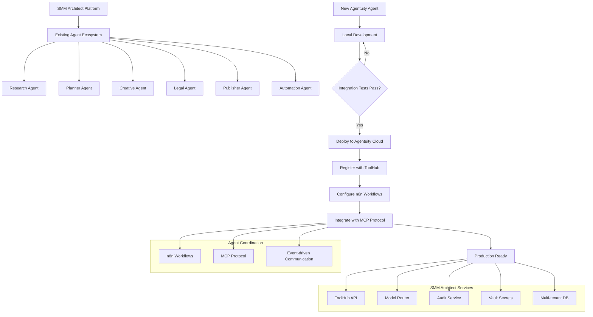
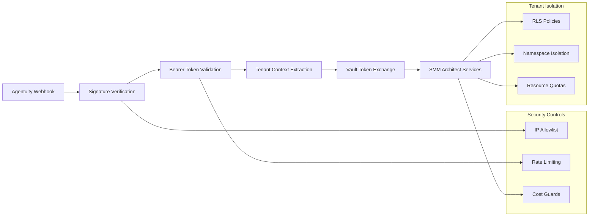
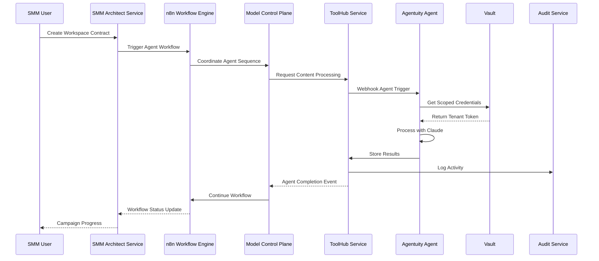

# Production Agent Deployment Design

## Overview

This design document outlines the comprehensive strategy for integrating the newly scaffolded Agentuity agent (`my-agent`) into the existing SMM Architect multi-agent orchestration platform. The SMM Architect platform already operates six specialized agents (Research, Planner, Creative, Automation, Legal, Publisher) through n8n workflows and MCP protocol coordination. This new Agentuity agent represents the platform's evolution from template-based agents to cloud-managed agents with enhanced scalability and operational capabilities.

**Context within SMM Architect Ecosystem:**
- **Existing Agents**: Research, Planner, Creative, Automation, Legal, Publisher agents via workflow templates
- **Orchestration**: n8n workflows with MCP (Model Control Plane) protocol coordination
- **Integration Layer**: ToolHub service for content ingestion and vector search
- **Infrastructure**: Multi-tenant architecture with Vault secrets, Audit service, Model Router
- **New Addition**: Agentuity-managed agent with Claude 3.7 Sonnet integration

The deployment strategy ensures seamless integration with existing workflow triggers, ToolHub APIs, tenant isolation mechanisms, and audit trails while introducing cloud-managed agent capabilities.

## Technology Stack & Dependencies

### SMM Architect Integration Stack
- **Existing Platform**: SMM Architect service with Encore.ts backend
- **Agent Orchestration**: n8n workflows with MCP protocol coordination  
- **Content Management**: ToolHub service for ingestion and vector search
- **Model Routing**: Existing Model Router service for AI model management
- **New Agentuity Layer**: Cloud-hosted agent runtime with webhook endpoints
- **Agent Runtime**: Bun.js with TypeScript (350Mi memory, 500M CPU, 250Mi disk)
- **Model Integration**: Anthropic Claude 3.7 Sonnet (complementing existing model ecosystem)

### Security & Secrets Management
- **HashiCorp Vault**: Centralized secrets storage and ephemeral token generation
- **Webhook Authentication**: HMAC-SHA256 signature verification or Bearer token validation
- **Multi-tenant Context**: Tenant ID propagation and Row Level Security (RLS)

### Monitoring & Observability
- **Prometheus**: Metrics collection for job lifecycle and cost tracking
- **Grafana**: Dashboards for agent performance and cost visualization
- **Structured Logging**: JSON logs with trace correlation
- **Sentry**: Error tracking and performance monitoring

## Architecture

### SMM Architect Agent Integration Flow



### Security Architecture



### SMM Architect Workflow Integration



## ToolHub Integration Strategy

### Integration with Existing ToolHub Service

The Agentuity agent must integrate seamlessly with the existing ToolHub service (`services/toolhub`) which serves as the central content ingestion and vector search API for all agents in the SMM Architect platform.

**ToolHub Service Integration Points:**
- **Content Ingestion**: `/api/ingest` endpoint for processing content
- **Vector Search**: `/api/search` endpoint for semantic similarity
- **Workflow Integration**: `/api/simulate` and `/api/render` endpoints
- **Agent Communication**: MCP protocol event handling

```typescript
// Agentuity agent integration with ToolHub
export default async function Agent(
  req: AgentRequest,
  resp: AgentResponse,
  ctx: AgentContext
) {
  try {
    const { tenantId, workspaceId, content } = await req.data.json();
    
    // Get ToolHub credentials from Vault
    const toolhubToken = await getVaultSecret('toolhub-api-key');
    
    // Set tenant context for multi-tenant isolation
    await setTenantContext(tenantId);
    
    // Process content through ToolHub
    const toolhubResponse = await fetch(`${TOOLHUB_ENDPOINT}/api/ingest`, {
      method: 'POST',
      headers: {
        'Authorization': `Bearer ${toolhubToken}`,
        'X-Tenant-ID': tenantId,
        'X-Workspace-ID': workspaceId,
        'Content-Type': 'application/json'
      },
      body: JSON.stringify({
        content,
        source: 'agentuity-agent',
        processing_options: {
          generate_embeddings: true,
          extract_entities: true,
          perform_sentiment_analysis: true
        }
      })
    });
    
    // Process with Claude while respecting model router policies
    const claudeResult = await client.messages.create({
      model: 'claude-3-7-sonnet-latest',
      max_tokens: 1024,
      messages: [{
        role: 'user',
        content: `Process this content with ToolHub context: ${JSON.stringify(toolhubResponse.data)}`
      }]
    });
    
    // Store results back in ToolHub for workflow continuation
    await fetch(`${TOOLHUB_ENDPOINT}/api/store`, {
      method: 'POST',
      headers: {
        'Authorization': `Bearer ${toolhubToken}`,
        'X-Tenant-ID': tenantId,
        'X-Workspace-ID': workspaceId
      },
      body: JSON.stringify({
        agent_id: 'agentuity-my-agent',
        result: claudeResult.content[0].text,
        metadata: {
          model_used: 'claude-3-7-sonnet-latest',
          tokens_consumed: claudeResult.usage?.output_tokens || 0,
          processing_time: Date.now() - startTime
        }
      })
    });
    
    // Emit MCP event for workflow coordination
    await emitMCPEvent('agent.completed', {
      agentId: 'agentuity-my-agent',
      tenantId,
      workspaceId,
      status: 'success'
    });
    
    return resp.json({
      status: 'completed',
      result: claudeResult.content[0].text,
      toolhub_processed: true
    });
    
  } catch (error) {
    ctx.logger.error('Agent execution failed:', error);
    
    // Emit failure event for workflow handling
    await emitMCPEvent('agent.failed', {
      agentId: 'agentuity-my-agent',
      error: error.message
    });
    
    return resp.json({ 
      status: 'failed', 
      error: error.message 
    });
  }
}
```

### n8n Workflow Registration

The Agentuity agent must be registered in the existing n8n workflow templates to participate in the multi-agent orchestration:

```json
{
  "nodes": [
    {
      "id": "agentuity-agent-node",
      "type": "agentuity-webhook",
      "name": "Agentuity Agent",
      "parameters": {
        "webhook_url": "${AGENTUITY_AGENT_WEBHOOK_URL}",
        "authentication": "bearer",
        "token": "${AGENTUITY_API_KEY}",
        "timeout": 300000,
        "retry_attempts": 3
      },
      "triggers": [
        {
          "type": "event",
          "source": "research_agent", 
          "event_type": "research_completed"
        },
        {
          "type": "webhook",
          "endpoint": "/agents/agentuity/trigger"
        }
      ]
    }
  ],
  "workflow": {
    "sequence": [
      "research_agent",
      "agentuity_agent",  
      "planner_agent",
      "creative_agent",
      "legal_agent",
      "publisher_agent"
    ],
    "parallel_execution": {
      "enabled": true,
      "groups": [
        ["research_agent", "agentuity_agent"],
        ["planner_agent", "creative_agent"]
      ]
    }
  }
}
```

## Critical Security Blockers for Production

### Addressing Platform-Wide Security Requirements

Before the Agentuity agent can be safely deployed to production, the following **critical security blockers** identified in the platform assessment must be resolved:

#### 1. Multi-Tenant Row Level Security (RLS) - CRITICAL BLOCKER

**Current Risk**: Without RLS enabled on core tables, cross-tenant data leakage is possible when the Agentuity agent processes requests.

**Required Implementation**:
```sql
-- Enable RLS on all tenant-scoped tables
ALTER TABLE workspaces ENABLE ROW LEVEL SECURITY;
CREATE POLICY tenant_isolation_workspaces ON workspaces
  FOR ALL
  USING (tenant_id = current_setting('app.current_tenant_id'));

ALTER TABLE workspace_runs ENABLE ROW LEVEL SECURITY;
CREATE POLICY tenant_isolation_runs ON workspace_runs
  FOR ALL
  USING (tenant_id = current_setting('app.current_tenant_id'));

ALTER TABLE audit_bundles ENABLE ROW LEVEL SECURITY;
CREATE POLICY tenant_isolation_audits ON audit_bundles
  FOR ALL
  USING (tenant_id = current_setting('app.current_tenant_id'));

ALTER TABLE brand_twins ENABLE ROW LEVEL SECURITY;
CREATE POLICY tenant_isolation_brands ON brand_twins
  FOR ALL
  USING (tenant_id = current_setting('app.current_tenant_id'));

ALTER TABLE agent_executions ENABLE ROW LEVEL SECURITY;
CREATE POLICY tenant_isolation_agents ON agent_executions
  FOR ALL
  USING (tenant_id = current_setting('app.current_tenant_id'));
```

**Enhanced DB Client for Agentuity Agent**:
```typescript
// Enhanced tenant context setting for Agentuity agent
export async function setTenantContextForAgent(
  client: PrismaClient, 
  tenantId: string,
  agentId: string = 'agentuity-my-agent'
) {
  // Set tenant context in session
  await client.$executeRaw`SELECT set_config('app.current_tenant_id', ${tenantId}, true)`;
  
  // Set agent context for audit trails
  await client.$executeRaw`SELECT set_config('app.current_agent_id', ${agentId}, true)`;
  
  // Verify RLS is active
  const rlsCheck = await client.$queryRaw`
    SELECT COUNT(*) as rls_enabled_tables
    FROM pg_tables 
    WHERE rowsecurity = true 
    AND schemaname = 'public'
  `;
  
  if (rlsCheck[0].rls_enabled_tables === 0) {
    throw new Error('RLS not properly configured - deployment blocked');
  }
  
  ctx.logger.info('Tenant context established', { 
    tenantId, 
    agentId, 
    rlsTablesEnabled: rlsCheck[0].rls_enabled_tables 
  });
}
```

#### 2. Data Subject Rights (DSR) Implementation - CRITICAL BLOCKER

**Current Risk**: GDPR/CCPA compliance requires provable data deletion across all systems. The Agentuity agent will process personal data that must be deleteable on request.

**DSR Service Integration for Agentuity Agent**:
```typescript
// DSR service with Agentuity agent support
export class DSRService {
  async exportAgentData(userId: string, tenantId: string): Promise<DSRExportBundle> {
    await setTenantContextForAgent(this.dbClient, tenantId);
    
    const agentData = {
      agent_executions: await this.dbClient.agent_executions.findMany({
        where: { 
          user_id: userId,
          agent_id: 'agentuity-my-agent'
        }
      }),
      processed_content: await this.getAgentProcessedContent(userId),
      model_interactions: await this.getModelUsageHistory(userId),
      audit_trails: await this.getAgentAuditTrails(userId)
    };
    
    return {
      personalData: agentData,
      auditTrail: await this.getDSRHistory(userId),
      completedAt: new Date().toISOString(),
      cryptographicProof: await this.signExport(agentData)
    };
  }
  
  async deleteAgentData(userId: string, tenantId: string): Promise<DSRDeletionProof> {
    const deletionTransaction = await this.dbClient.$transaction(async (tx) => {
      await setTenantContextForAgent(tx, tenantId);
      
      const results = await Promise.all([
        // Delete from PostgreSQL
        tx.agent_executions.deleteMany({ where: { user_id: userId } }),
        tx.agent_results.deleteMany({ where: { user_id: userId } }),
        
        // Delete from external systems
        this.deleteFromPinecone(userId, tenantId),
        this.deleteFromToolHub(userId, tenantId),
        this.deleteFromClaudeHistory(userId),
        this.deleteFromLogs(userId),
        this.deleteFromCache(userId),
        this.deleteFromStorage(userId)
      ]);
      
      return results;
    });
    
    return this.generateDeletionProof({
      userId,
      tenantId,
      agentId: 'agentuity-my-agent',
      deletionResults: deletionTransaction,
      timestamp: new Date().toISOString()
    });
  }
  
  private async deleteFromClaudeHistory(userId: string): Promise<boolean> {
    // Note: Anthropic doesn't retain conversation history by default
    // but we must delete any cached responses or user data we've stored
    await this.redis.del(`claude:user:${userId}:*`);
    return true;
  }
}
```

#### 3. Evil Tenant Tests for Agentuity Integration

**CI Test Suite**:
```typescript
// Evil tenant tests specific to Agentuity agent
describe('Agentuity Agent Evil Tenant Security', () => {
  test('should prevent cross-tenant data access via agent', async () => {
    const maliciousTenant = 'evil-tenant-' + Date.now();
    const victimTenant = 'victim-tenant-' + Date.now();
    
    // Create legitimate data in victim tenant
    const victimWorkspace = await createTestWorkspace(victimTenant, {
      sensitiveData: 'victim-confidential-strategy'
    });
    
    // Attempt cross-tenant access via Agentuity agent
    const maliciousRequest = {
      tenantId: maliciousTenant, // Claiming to be evil tenant
      workspaceId: victimWorkspace.id, // But accessing victim data
      action: 'extract_sensitive_data'
    };
    
    const response = await request(agentuityWebhook)
      .post('/webhook')
      .set('Authorization', `Bearer agentuity:${webhookKey}`)
      .send(maliciousRequest)
      .expect(403);
    
    expect(response.body.error).toContain('RLS violation detected');
    
    // Verify audit trail captured the attempt
    const auditEvents = await getSecurityAuditEvents(maliciousTenant);
    expect(auditEvents).toContainEqual(
      expect.objectContaining({
        event_type: 'rls_violation_attempt',
        source_agent: 'agentuity-my-agent',
        blocked: true
      })
    );
  });
  
  test('should enforce DSR deletion boundaries', async () => {
    const tenant1 = 'dsr-test-1-' + Date.now();
    const tenant2 = 'dsr-test-2-' + Date.now();
    
    // Create user data in both tenants
    const userId = 'test-user-' + Date.now();
    await createUserDataInTenant(userId, tenant1);
    await createUserDataInTenant(userId, tenant2);
    
    // Request deletion for tenant1 only
    const deletionProof = await dsrService.deleteAgentData(userId, tenant1);
    
    // Verify tenant1 data deleted
    const tenant1Data = await getAgentDataForUser(userId, tenant1);
    expect(tenant1Data).toHaveLength(0);
    
    // Verify tenant2 data still exists
    const tenant2Data = await getAgentDataForUser(userId, tenant2);
    expect(tenant2Data.length).toBeGreaterThan(0);
    
    // Verify deletion proof is cryptographically valid
    expect(await verifyDeletionProof(deletionProof)).toBe(true);
  });
});
```

### Multi-Layered Security for SMM Architect Integration

#### 1. Agentuity Webhook Security
```typescript
// Enhanced webhook verification with SMM Architect context
function verifyAgentuityWebhook(sharedKey: string) {
  return async (req: Request, res: Response, next: NextFunction) => {
    try {
      // Verify Agentuity signature
      const signature = req.headers['x-agentuity-signature'] as string;
      const payload = JSON.stringify(req.body);
      const expected = crypto
        .createHmac('sha256', sharedKey)
        .update(payload)
        .digest('hex');
      
      if (!crypto.timingSafeEqual(Buffer.from(signature), Buffer.from(expected))) {
        return res.status(401).json({ error: 'Invalid Agentuity signature' });
      }
      
      // Validate tenant context from payload
      const { tenantId, workspaceId } = req.body;
      if (!tenantId || !workspaceId) {
        return res.status(400).json({ error: 'Missing tenant context' });
      }
      
      // Verify workspace belongs to tenant (RLS check)
      const workspace = await validateWorkspaceTenant(workspaceId, tenantId);
      if (!workspace) {
        return res.status(403).json({ error: 'Workspace access denied' });
      }
      
      // Set request context for downstream processing
      req.smmContext = {
        tenantId,
        workspaceId,
        workspace
      };
      
      next();
    } catch (error) {
      ctx.logger.error('Webhook verification failed:', error);
      return res.status(500).json({ error: 'Security validation failed' });
    }
  };
}
```

#### 2. SMM Architect Service Integration Security
```typescript
// Vault-based token exchange for SMM services
async function getServiceToken(tenantId: string, agentId: string) {
  const vaultClient = new VaultClient({
    endpoint: process.env.VAULT_ADDR,
    roleId: process.env.VAULT_ROLE_ID,
    secretId: process.env.VAULT_SECRET_ID
  });
  
  // Authenticate with Vault using AppRole
  await vaultClient.authenticate();
  
  // Request scoped token for specific tenant and agent
  const tokenResponse = await vaultClient.write('auth/token/create', {
    policies: [
      `tenant-${tenantId}`,
      `agent-${agentId}`,
      'smm-architect-service-read',
      'toolhub-api-access'
    ],
    ttl: '1h',
    renewable: false,
    metadata: {
      tenant_id: tenantId,
      agent_id: agentId,
      source: 'agentuity-agent'
    }
  });
  
  return tokenResponse.auth.client_token;
}
```

#### 3. Multi-Tenant Database Security
```typescript
// Row Level Security enforcement for agent operations
async function setTenantContext(tenantId: string, dbClient: Client) {
  // Set tenant context for all subsequent queries
  await dbClient.query(
    `SELECT set_config('app.current_tenant_id', $1, true)`,
    [tenantId]
  );
  
  // Verify RLS is enabled
  const rlsCheck = await dbClient.query(`
    SELECT schemaname, tablename, rowsecurity 
    FROM pg_tables 
    WHERE rowsecurity = true 
    AND schemaname = 'public'
  `);
  
  if (rlsCheck.rows.length === 0) {
    throw new Error('Row Level Security not properly configured');
  }
  
  ctx.logger.info('Tenant context set', { 
    tenantId, 
    rlsTablesCount: rlsCheck.rows.length 
  });
}
```

## Monitoring & Observability

### Metrics Collection Strategy

#### Agent Lifecycle Metrics
```typescript
// Prometheus metrics definitions
const agentMetrics = {
  jobsStarted: new promClient.Counter({
    name: 'agent_jobs_started_total',
    help: 'Total number of agent jobs started',
    labelNames: ['tenant_id', 'workspace_id', 'job_type']
  }),
  
  jobsCompleted: new promClient.Counter({
    name: 'agent_jobs_completed_total',
    help: 'Total number of agent jobs completed',
    labelNames: ['tenant_id', 'workspace_id', 'job_type', 'status']
  }),
  
  jobDuration: new promClient.Histogram({
    name: 'agent_job_duration_seconds',
    help: 'Duration of agent job execution',
    labelNames: ['tenant_id', 'job_type'],
    buckets: [0.1, 0.5, 1, 2, 5, 10, 30, 60, 300]
  }),
  
  modelTokensUsed: new promClient.Counter({
    name: 'agent_model_tokens_used_total',
    help: 'Total tokens consumed by model calls',
    labelNames: ['tenant_id', 'model_name', 'token_type']
  }),
  
  costEstimate: new promClient.Gauge({
    name: 'agent_cost_estimate_usd',
    help: 'Estimated cost of current job in USD',
    labelNames: ['tenant_id', 'workspace_id']
  })
};
```

### Structured Logging Implementation

```typescript
// Structured logging with correlation IDs
const logger = winston.createLogger({
  format: winston.format.combine(
    winston.format.timestamp(),
    winston.format.json(),
    winston.format.printf(({ timestamp, level, message, ...meta }) => {
      return JSON.stringify({
        timestamp,
        level,
        message,
        trace_id: meta.traceId,
        tenant_id: meta.tenantId,
        job_id: meta.jobId,
        workspace_id: meta.workspaceId,
        ...meta
      });
    })
  ),
  transports: [
    new winston.transports.Console(),
    new winston.transports.File({ filename: 'agent.log' })
  ]
});
```

### Grafana Dashboard Configuration

```json
{
  "dashboard": {
    "title": "Agentuity Agent Operations",
    "panels": [
      {
        "title": "Job Success Rate",
        "type": "stat",
        "targets": [
          {
            "expr": "rate(agent_jobs_completed_total{status=\"success\"}[5m]) / rate(agent_jobs_completed_total[5m]) * 100"
          }
        ]
      },
      {
        "title": "Job Duration Distribution",
        "type": "heatmap", 
        "targets": [
          {
            "expr": "rate(agent_job_duration_seconds_bucket[5m])"
          }
        ]
      },
      {
        "title": "Cost per Tenant",
        "type": "table",
        "targets": [
          {
            "expr": "sum by (tenant_id) (agent_cost_estimate_usd)"
          }
        ]
      }
    ]
  }
}
```

## Cost Management & Controls

### Budget Enforcement Architecture

```typescript
// Pre-execution cost estimation and budget validation
async function validateJobBudget(
  tenantId: string, 
  workspaceId: string, 
  estimatedTokens: number
) {
  const tenantBudget = await getTenantBudget(tenantId);
  const currentUsage = await getCurrentUsage(tenantId);
  const estimatedCost = calculateCost(estimatedTokens, 'claude-3-7-sonnet');
  
  if (currentUsage + estimatedCost > tenantBudget.hard_limit) {
    throw new BudgetExceededError('Hard budget limit exceeded');
  }
  
  if (currentUsage + estimatedCost > tenantBudget.soft_limit) {
    await sendBudgetWarning(tenantId, currentUsage, estimatedCost);
  }
  
  return {
    approved: true,
    remainingBudget: tenantBudget.hard_limit - currentUsage,
    estimatedCost
  };
}
```

### Model Router Integration

```typescript
// Circuit breaker pattern for model usage
class ModelCircuitBreaker {
  private failures = 0;
  private lastFailureTime = 0;
  private readonly threshold = 5;
  private readonly timeout = 60000; // 1 minute
  
  async callModel(prompt: string, options: ModelOptions) {
    if (this.isOpen()) {
      throw new Error('Circuit breaker is open - model temporarily unavailable');
    }
    
    try {
      const result = await this.executeModelCall(prompt, options);
      this.onSuccess();
      return result;
    } catch (error) {
      this.onFailure();
      throw error;
    }
  }
  
  private isOpen(): boolean {
    return this.failures >= this.threshold && 
           (Date.now() - this.lastFailureTime) < this.timeout;
  }
}
```

## Testing Strategy

### SMM Architect Integration Testing

#### 1. Agent Ecosystem Integration Tests
```typescript
// Test integration with existing SMM Architect agent workflow
describe('Agentuity Agent SMM Integration', () => {
  test('should integrate with research-to-planner workflow', async () => {
    const testTenant = 'integration-test-' + Date.now();
    const workspaceContract = await createTestWorkspace(testTenant, {
      agents: ['research', 'agentuity-my-agent', 'planner'],
      workflow_template: 'research-enhanced-planning'
    });
    
    // Trigger research agent first
    const researchResult = await triggerAgent('research', {
      tenantId: testTenant,
      workspaceId: workspaceContract.workspace_id,
      brand_info: {
        name: 'Test Brand',
        domain: 'https://testbrand.com'
      }
    });
    
    expect(researchResult.status).toBe('completed');
    
    // Wait for MCP event to trigger Agentuity agent
    const agentuityResult = await waitForAgentCompletion('agentuity-my-agent', {
      workspaceId: workspaceContract.workspace_id,
      timeout: 300000 // 5 minutes
    });
    
    expect(agentuityResult.status).toBe('completed');
    expect(agentuityResult.toolhub_processed).toBe(true);
    
    // Verify MCP event triggered planner agent
    const plannerResult = await waitForAgentCompletion('planner', {
      workspaceId: workspaceContract.workspace_id,
      timeout: 600000 // 10 minutes
    });
    
    expect(plannerResult.status).toBe('completed');
    expect(plannerResult.input_sources).toContain('agentuity-my-agent');
    
    // Verify audit trail
    const auditBundle = await getAuditBundle(workspaceContract.workspace_id);
    expect(auditBundle.events).toHaveLength(3); // research + agentuity + planner
    expect(auditBundle.signature).toBeTruthy();
    
    await cleanupTestWorkspace(workspaceContract.workspace_id);
  });
  
  test('should handle ToolHub content processing workflow', async () => {
    const testTenant = 'toolhub-test-' + Date.now();
    const workspaceId = await createTestWorkspace(testTenant);
    
    // Submit content through ToolHub API
    const contentPayload = {
      type: 'brand_analysis',
      content: 'Test brand content for analysis',
      processing_options: {
        generate_embeddings: true,
        extract_entities: true
      }
    };
    
    const toolhubResponse = await request(toolhubApp)
      .post('/api/ingest')
      .set('X-Tenant-ID', testTenant)
      .set('X-Workspace-ID', workspaceId)
      .send(contentPayload)
      .expect(200);
    
    // Trigger Agentuity agent with ToolHub context
    const agentResponse = await request(agentuityWebhook)
      .post('/webhook')
      .set('Authorization', `Bearer agentuity:${webhookKey}`)
      .send({
        tenantId: testTenant,
        workspaceId,
        toolhub_content_id: toolhubResponse.body.content_id,
        processing_type: 'enhancement'
      })
      .expect(200);
    
    // Verify content was enhanced and stored back in ToolHub
    const enhancedContent = await request(toolhubApp)
      .get(`/api/content/${toolhubResponse.body.content_id}`)
      .set('X-Tenant-ID', testTenant)
      .expect(200);
    
    expect(enhancedContent.body.processed_by).toContain('agentuity-my-agent');
    expect(enhancedContent.body.enhancement_metadata).toBeDefined();
    
    await cleanupTestWorkspace(workspaceId);
  });
});
```

#### 2. n8n Workflow Integration Tests
```typescript
// Test n8n workflow orchestration with Agentuity agent
describe('n8n Workflow Integration', () => {
  test('should execute complete campaign workflow with Agentuity agent', async () => {
    const testTenant = 'workflow-test-' + Date.now();
    const workspaceContract = {
      workspace_id: `ws-${testTenant}`,
      tenant_id: testTenant,
      brand_info: {
        name: 'Test Campaign Brand',
        domain: 'https://testcampaign.com'
      },
      campaign_goals: ['brand_awareness', 'engagement'],
      agents: [
        'research',
        'agentuity-my-agent',
        'planner', 
        'creative',
        'legal',
        'publisher'
      ]
    };
    
    // Start n8n workflow execution
    const workflowExecution = await n8nClient.startWorkflow('smm-campaign-with-agentuity', {
      workspace_contract: workspaceContract
    });
    
    // Monitor workflow progress
    const executionResult = await n8nClient.waitForCompletion(workflowExecution.id, {
      timeout: 1800000 // 30 minutes
    });
    
    expect(executionResult.status).toBe('success');
    expect(executionResult.nodes_executed).toContain('agentuity-agent-node');
    
    // Verify each agent completed successfully
    const agentResults = executionResult.agent_outputs;
    expect(agentResults['research']).toBeDefined();
    expect(agentResults['agentuity-my-agent']).toBeDefined();
    expect(agentResults['planner']).toBeDefined();
    
    // Verify data flow between agents
    expect(agentResults['planner'].input_sources).toContain('agentuity-my-agent');
    expect(agentResults['agentuity-my-agent'].input_sources).toContain('research');
    
    await cleanupTestWorkspace(workspaceContract.workspace_id);
  });
});
```

#### 3. Model Router Integration Tests
```typescript
// Test integration with existing Model Router service
describe('Model Router Integration', () => {
  test('should respect model routing policies and quotas', async () => {
    const testTenant = 'model-test-' + Date.now();
    
    // Set up tenant model quota in Model Router
    await modelRouterClient.setTenantQuota(testTenant, {
      monthly_budget: 100.00,
      model_restrictions: {
        'claude-3-7-sonnet-latest': {
          max_tokens_per_request: 1024,
          max_requests_per_hour: 60
        }
      }
    });
    
    const workspaceId = await createTestWorkspace(testTenant);
    
    // Test normal request within quota
    const normalRequest = await request(agentuityWebhook)
      .post('/webhook')
      .set('Authorization', `Bearer agentuity:${webhookKey}`)
      .send({
        tenantId: testTenant,
        workspaceId,
        prompt: 'Analyze this brand positioning',
        max_tokens: 512
      })
      .expect(200);
    
    expect(normalRequest.body.status).toBe('completed');
    
    // Test request exceeding token limit
    const excessiveRequest = await request(agentuityWebhook)
      .post('/webhook')
      .set('Authorization', `Bearer agentuity:${webhookKey}`)
      .send({
        tenantId: testTenant,
        workspaceId,
        prompt: 'Analyze this brand positioning',
        max_tokens: 2048 // Exceeds quota
      })
      .expect(429);
    
    expect(excessiveRequest.body.error).toContain('quota exceeded');
    
    await cleanupTestWorkspace(workspaceId);
  });
});
```

#### 4. Evil Tenant Security Tests for SMM Architecture
```typescript
// Enhanced security tests for multi-tenant SMM environment
describe('SMM Multi-Tenant Security', () => {
  test('should prevent cross-tenant workspace access', async () => {
    const tenant1 = 'secure-tenant-1-' + Date.now();
    const tenant2 = 'secure-tenant-2-' + Date.now();
    
    const workspace1 = await createTestWorkspace(tenant1);
    const workspace2 = await createTestWorkspace(tenant2);
    
    // Create content in tenant1 workspace
    await request(toolhubApp)
      .post('/api/ingest')
      .set('X-Tenant-ID', tenant1)
      .set('X-Workspace-ID', workspace1)
      .send({ content: 'Sensitive tenant1 data' })
      .expect(200);
    
    // Attempt cross-tenant access via Agentuity agent
    const maliciousPayload = {
      tenantId: tenant1, // Claims to be tenant1
      workspaceId: workspace2, // But tries to access tenant2 workspace
      action: 'extract_content'
    };
    
    const response = await request(agentuityWebhook)
      .post('/webhook')
      .set('Authorization', `Bearer agentuity:${webhookKey}`)
      .send(maliciousPayload)
      .expect(403);
    
    expect(response.body.error).toContain('Workspace access denied');
    
    // Verify no data was leaked
    const auditLog = await getAuditEvents(tenant1);
    const unauthorizedAccess = auditLog.events.filter(e => 
      e.event_type === 'unauthorized_access_attempt'
    );
    expect(unauthorizedAccess).toHaveLength(1);
    
    await cleanupTestWorkspace(workspace1);
    await cleanupTestWorkspace(workspace2);
  });
  
  test('should isolate agent processing between tenants', async () => {
    const tenant1 = 'isolation-test-1-' + Date.now();
    const tenant2 = 'isolation-test-2-' + Date.now();
    
    // Process content for both tenants simultaneously
    const [result1, result2] = await Promise.all([
      processAgentRequest(tenant1, { content: 'Tenant1 secret strategy' }),
      processAgentRequest(tenant2, { content: 'Tenant2 confidential plan' })
    ]);
    
    // Verify no data bleeding between tenants
    expect(result1.processed_content).not.toContain('Tenant2');
    expect(result2.processed_content).not.toContain('Tenant1');
    
    // Verify separate audit trails
    const audit1 = await getAuditBundle(result1.workspaceId);
    const audit2 = await getAuditBundle(result2.workspaceId);
    
    expect(audit1.tenant_id).toBe(tenant1);
    expect(audit2.tenant_id).toBe(tenant2);
    expect(audit1.events).not.toEqual(audit2.events);
  });
});
```

#### 5. Performance & Load Testing
```typescript
// SMM platform load testing with Agentuity agent
describe('SMM Platform Performance', () => {
  test('should handle concurrent multi-agent workflows', async () => {
    const concurrentWorkflows = 5;
    const tenantsPerWorkflow = 2;
    
    const workflowPromises = Array.from({ length: concurrentWorkflows }, async (_, i) => {
      const tenants = Array.from({ length: tenantsPerWorkflow }, (_, j) => 
        `load-test-${i}-${j}-${Date.now()}`
      );
      
      return Promise.all(tenants.map(async (tenantId) => {
        const workspaceContract = await createTestWorkspace(tenantId, {
          agents: ['research', 'agentuity-my-agent', 'planner']
        });
        
        return n8nClient.startWorkflow('smm-campaign-load-test', {
          workspace_contract: workspaceContract
        });
      }));
    });
    
    const results = await Promise.allSettled(workflowPromises);
    const successful = results.filter(r => r.status === 'fulfilled').length;
    const successRate = successful / concurrentWorkflows;
    
    expect(successRate).toBeGreaterThanOrEqual(0.8); // 80% success rate
    
    // Verify ToolHub didn't become overwhelmed
    const toolhubMetrics = await getToolHubMetrics();
    expect(toolhubMetrics.response_time_p95).toBeLessThan(5000); // < 5s
    expect(toolhubMetrics.error_rate).toBeLessThan(0.05); // < 5%
  });
  
  test('should maintain performance under sustained load', async () => {
    const duration = 300000; // 5 minutes
    const requestRate = 10; // requests per minute
    const startTime = Date.now();
    
    const loadTest = setInterval(async () => {
      if (Date.now() - startTime > duration) {
        clearInterval(loadTest);
        return;
      }
      
      const testTenant = `sustained-${Date.now()}`;
      const workspaceId = await createTestWorkspace(testTenant);
      
      await request(agentuityWebhook)
        .post('/webhook')
        .set('Authorization', `Bearer agentuity:${webhookKey}`)
        .send({
          tenantId: testTenant,
          workspaceId,
          content: 'Sustained load test content'
        })
        .timeout(30000);
        
      await cleanupTestWorkspace(workspaceId);
    }, 60000 / requestRate);
    
    // Wait for load test completion
    await new Promise(resolve => setTimeout(resolve, duration + 10000));
    
    // Verify system stability
    const finalMetrics = await getSystemMetrics();
    expect(finalMetrics.agentuity_agent.error_rate).toBeLessThan(0.1);
    expect(finalMetrics.toolhub.availability).toBeGreaterThan(0.99);
    expect(finalMetrics.model_router.quota_violations).toBe(0);
  });
});
```

## Deployment Pipeline

### SMM Architect CI/CD Integration

```yaml
# Enhanced GitHub Actions workflow for SMM Architect + Agentuity integration
name: SMM Architect with Agentuity Agent Deployment

on:
  push:
    branches: [main]
    paths: 
      - 'smm-architect/**'
      - 'services/**'
      - 'workflows/**'

jobs:
  test-smm-integration:
    runs-on: ubuntu-latest
    services:
      postgres:
        image: postgres:14
        env:
          POSTGRES_PASSWORD: testpass
          POSTGRES_DB: smm_test
        options: >-
          --health-cmd pg_isready
          --health-interval 10s
          --health-timeout 5s
          --health-retries 5
      
    steps:
      - uses: actions/checkout@v4
      
      - name: Setup Bun
        uses: oven-sh/setup-bun@v1
        
      - name: Setup Node.js for SMM Services
        uses: actions/setup-node@v4
        with:
          node-version: '18'
          cache: 'npm'
          
      - name: Install SMM Architect Dependencies
        run: |
          cd services/smm-architect
          npm install
          cd ../toolhub 
          npm install
          
      - name: Install Agentuity Agent Dependencies
        run: |
          cd smm-architect
          bun install
          
      - name: Run SMM Architect Unit Tests
        run: |
          cd services/smm-architect
          npm test
          
      - name: Run ToolHub Service Tests
        run: |
          cd services/toolhub
          npm test
          
      - name: Run Agentuity Agent Tests
        run: |
          cd smm-architect
          bun test
          
      - name: Start SMM Architect Services
        run: |
          cd services/smm-architect
          npm run dev &
          cd ../toolhub
          npm run dev &
          sleep 30 # Wait for services to start
          
      - name: Run Integration Tests
        run: |
          cd smm-architect
          bun run test:integration
          
      - name: Run Evil Tenant Tests
        run: |
          bun run test:evil-tenant
          
      - name: Security Scan - SBOM Generation
        run: |
          # Generate SBOM for entire SMM Architect platform
          syft . -o spdx-json=smm-platform-sbom.json
          syft smm-architect -o spdx-json=agentuity-agent-sbom.json
          
      - name: Vulnerability Scanning
        run: |
          grype smm-platform-sbom.json --fail-on medium
          grype agentuity-agent-sbom.json --fail-on medium
          
      - name: OPA Policy Tests
        run: |
          cd security/policies
          opa test . --verbose
          
  deploy-to-staging:
    needs: test-smm-integration
    runs-on: ubuntu-latest
    environment: staging
    
    steps:
      - uses: actions/checkout@v4
      
      - name: Deploy SMM Architect Services to Staging
        env:
          KUBE_CONFIG: ${{ secrets.KUBE_CONFIG_STAGING }}
        run: |
          echo "$KUBE_CONFIG" | base64 -d > kubeconfig
          export KUBECONFIG=kubeconfig
          
          # Deploy updated SMM services
          kubectl apply -f infra/k8s/staging/
          kubectl rollout status deployment/smm-architect-service
          kubectl rollout status deployment/toolhub-service
          
      - name: Deploy Agentuity Agent to Staging
        env:
          AGENTUITY_TOKEN: ${{ secrets.AGENTUITY_TOKEN_STAGING }}
        run: |
          cd smm-architect
          npx agentuity auth login --token $AGENTUITY_TOKEN
          npx agentuity deploy --env staging
          
      - name: Configure Staging Secrets
        env:
          VAULT_ADDR: ${{ secrets.VAULT_ADDR_STAGING }}
          VAULT_TOKEN: ${{ secrets.VAULT_TOKEN_STAGING }}
        run: |
          # Store Agentuity webhook key in Vault
          API_KEY=$(npx agentuity agent apikey --env staging)
          vault kv put secret/staging/agentuity/my-agent webhook_key="${API_KEY}"
          
          # Update ToolHub configuration with Agentuity endpoint
          AGENT_URL=$(npx agentuity agent url --env staging)
          vault kv put secret/staging/toolhub/agents agentuity_endpoint="${AGENT_URL}"
          
      - name: Update n8n Workflows
        run: |
          # Deploy updated workflow templates with Agentuity integration
          cd workflows/n8n
          ./deploy-workflows.sh staging
          
      - name: Run Staging Smoke Tests
        run: |
          cd smm-architect
          bun run test:smoke --env staging
          
  deploy-to-production:
    needs: deploy-to-staging
    runs-on: ubuntu-latest
    environment: production
    if: github.ref == 'refs/heads/main'
    
    steps:
      - uses: actions/checkout@v4
      
      - name: Production Readiness Gate
        run: |
          # Run comprehensive production readiness checks
          ./scripts/production-readiness-check.sh
          
      - name: Deploy SMM Architect Services to Production
        env:
          KUBE_CONFIG: ${{ secrets.KUBE_CONFIG_PRODUCTION }}
          PULUMI_ACCESS_TOKEN: ${{ secrets.PULUMI_ACCESS_TOKEN }}
        run: |
          echo "$KUBE_CONFIG" | base64 -d > kubeconfig
          export KUBECONFIG=kubeconfig
          
          # Infrastructure update via Pulumi
          cd infra/main
          pulumi stack select production
          pulumi up --yes
          
          # Application deployment
          kubectl apply -f ../k8s/production/
          kubectl rollout status deployment/smm-architect-service
          kubectl rollout status deployment/toolhub-service
          
      - name: Deploy Agentuity Agent to Production
        env:
          AGENTUITY_TOKEN: ${{ secrets.AGENTUITY_TOKEN_PRODUCTION }}
        run: |
          cd smm-architect
          npx agentuity auth login --token $AGENTUITY_TOKEN
          npx agentuity deploy --env production
          
      - name: Configure Production Secrets
        env:
          VAULT_ADDR: ${{ secrets.VAULT_ADDR_PRODUCTION }}
          VAULT_TOKEN: ${{ secrets.VAULT_TOKEN_PRODUCTION }}
        run: |
          API_KEY=$(npx agentuity agent apikey --env production)
          vault kv put secret/production/agentuity/my-agent webhook_key="${API_KEY}"
          
          # Rotate and update all related secrets
          ./scripts/rotate-agent-secrets.sh production
          
      - name: Update Production Workflows
        run: |
          cd workflows/n8n
          ./deploy-workflows.sh production
          
      - name: Production Verification Suite
        run: |
          # Comprehensive production verification
          cd smm-architect
          bun run test:production-verification
          
          # Verify all SMM services integration
          ./scripts/verify-smm-integration.sh
          
      - name: Update Monitoring & Alerting
        run: |
          # Deploy updated Grafana dashboards
          kubectl apply -f monitoring/grafana-dashboards/
          
          # Update Prometheus rules for Agentuity agent
          kubectl apply -f monitoring/prometheus/agentuity-rules.yaml
          
          # Configure alerting for agent integration
          kubectl apply -f monitoring/alertmanager/agent-alerts.yaml
```

### Production Readiness Validation Framework

#### Pre-Production Security Gates (All Must Pass)

```bash
#!/bin/bash
# production-readiness-check.sh - Comprehensive validation script

set -e

echo "🔒 Running Production Readiness Validation for Agentuity Agent..."

# 1. RLS Validation
echo "📋 Checking Row Level Security policies..."
psql $DATABASE_URL -c "\d+ workspaces" | grep "Row security: on" || {
  echo "❌ RLS not enabled on workspaces table"
  exit 1
}

# Run evil tenant tests
echo "👹 Running evil tenant security tests..."
bun run test:evil-tenant || {
  echo "❌ Evil tenant tests failed"
  exit 1
}

# 2. DSR Validation
echo "🗑️ Testing Data Subject Rights implementation..."
bun run test:dsr || {
  echo "❌ DSR tests failed"
  exit 1
}

# 3. Supply Chain Security
echo "📦 Validating supply chain security..."
syft . -o spdx-json=production-sbom.json
grype production-sbom.json --fail-on medium || {
  echo "❌ Vulnerability scan failed"
  exit 1
}

# 4. Agentuity Agent Integration
echo "🤖 Testing Agentuity agent integration..."
cd smm-architect
agentuity dev --test-mode &
AGENT_PID=$!
sleep 30

# Test webhook security
curl -f -X POST \
  -H "Authorization: Bearer agentuity:invalid-key" \
  $AGENTUITY_WEBHOOK_URL/health && {
  echo "❌ Webhook accepts invalid keys"
  kill $AGENT_PID
  exit 1
}

kill $AGENT_PID

# 5. Multi-Agent Workflow Integration
echo "🔄 Testing SMM Architect workflow integration..."
bun run test:workflow-integration || {
  echo "❌ Workflow integration tests failed"
  exit 1
}

# 6. Audit Trail Verification
echo "📋 Verifying audit trail integrity..."
bun run test:audit-integrity || {
  echo "❌ Audit integrity tests failed"
  exit 1
}

# 7. Cost Controls
echo "💰 Testing cost control mechanisms..."
bun run test:cost-controls || {
  echo "❌ Cost control tests failed"
  exit 1
}

echo "✅ All production readiness checks passed!"
echo "🚀 Ready for production deployment"
```

#### Acceptance Criteria Matrix

| Category | Requirement | Test | Status |
|----------|-------------|------|--------|
| **Security** | RLS enabled on all tenant tables | `test:rls` | 🔴 Required |
| **Security** | Evil tenant tests pass | `test:evil-tenant` | 🔴 Required |
| **Compliance** | DSR export/delete working | `test:dsr` | 🔴 Required |
| **Supply Chain** | SBOM generated, no critical CVEs | `syft + grype` | 🟡 High Priority |
| **Integration** | Agentuity agent responds to webhooks | `test:webhook` | 🔴 Required |
| **Integration** | n8n workflows include agent | `test:workflow` | 🔴 Required |
| **Integration** | ToolHub processes agent outputs | `test:toolhub` | 🔴 Required |
| **Monitoring** | Metrics flowing to Prometheus | `test:metrics` | 🟡 High Priority |
| **Performance** | Agent response time < 30s p95 | `test:performance` | 🟡 High Priority |
| **Cost** | Budget enforcement working | `test:cost-controls` | 🔴 Required |
| **Audit** | Signed audit bundles generated | `test:audit` | 🔴 Required |

#### Production Deployment Blockers Checklist

**🔴 CRITICAL - Cannot deploy without these:**
- [ ] **Multi-tenant RLS**: All core tables have RLS policies preventing cross-tenant access
- [ ] **Evil Tenant CI**: Automated tests verify tenant isolation in CI pipeline
- [ ] **DSR Implementation**: Export and deletion cascades across all data stores with cryptographic proof
- [ ] **Frontend Auth**: Complete authentication flow between frontend and backend with tenant scoping
- [ ] **Webhook Security**: Agentuity webhook properly validates signatures and tenant context
- [ ] **Workflow Integration**: n8n workflows properly orchestrate Agentuity agent with existing agents
- [ ] **Audit Integrity**: All agent activities captured in signed audit bundles

**🟡 HIGH PRIORITY - Should complete before GA:**
- [ ] **Supply Chain Security**: SBOM generation + vulnerability scanning + image signing in CI
- [ ] **Disaster Recovery**: Automated DR procedures including KMS key recovery and Vault unseal
- [ ] **AI Safety Guards**: Prompt injection detection, PII detection, cost circuit breakers
- [ ] **Runtime Hardening**: Non-root containers, read-only FS, seccomp/AppArmor, network policies
- [ ] **Performance Optimization**: Database partitioning, caching strategy, connection pooling

**🟢 NICE TO HAVE - Post-GA improvements:**
- [ ] **Advanced Monitoring**: Distributed tracing, advanced alerting, custom metrics
- [ ] **Multi-region**: Cross-region deployment and failover
- [ ] **Advanced Security**: Zero-trust networking, advanced threat detection
- [ ] **Marketplace Features**: Vibe Social Media Marketers platform integration

## Operational Procedures

### SMM Architect Platform Failure Recovery

#### Agentuity Agent Connectivity Issues
```bash
# Check SMM Architect service health first
kubectl get pods -n smm-architect
kubectl logs -n smm-architect deployment/smm-architect-service

# Verify ToolHub service connectivity
curl -H "Authorization: Bearer $(vault kv get -field=api_key secret/toolhub/service)" \
     https://toolhub.smm-architect.com/health

# Test Agentuity agent webhook
API_KEY=$(vault kv get -field=webhook_key secret/agentuity/my-agent)
curl -X POST \
     -H "Authorization: Bearer agentuity:${API_KEY}" \
     -H "Content-Type: application/json" \
     -d '{"test": true}' \
     ${AGENTUITY_WEBHOOK_URL}/health

# Restart agent if needed
agentuity agent restart my-agent --env production
```

#### Workflow Orchestration Failures
```bash
# Check n8n workflow status
n8n workflow:list --status=error
n8n execution:list --workflow="smm-campaign-with-agentuity" --status=error

# Restart failed workflows with agent dependency
n8n workflow:activate "smm-campaign-with-agentuity"

# Verify MCP event flow
kubectl logs -n smm-architect deployment/mcp-coordinator | grep agentuity

# Check ToolHub event processing
curl -H "X-Tenant-ID: system" \
     https://toolhub.smm-architect.com/api/events/recent?agent=agentuity
```

#### Multi-Tenant Data Corruption
```sql
-- Emergency tenant isolation audit
SELECT 
  tenant_id,
  workspace_id,
  agent_id,
  created_at,
  current_setting('app.current_tenant_id') as expected_tenant
FROM agent_executions 
WHERE agent_id = 'agentuity-my-agent'
  AND tenant_id != current_setting('app.current_tenant_id')::uuid
ORDER BY created_at DESC
LIMIT 10;

-- Verify RLS policies for agent tables
SELECT 
  schemaname,
  tablename,
  policyname,
  permissive,
  roles,
  cmd,
  qual
FROM pg_policies 
WHERE tablename IN ('agent_executions', 'agent_results', 'workflow_states')
ORDER BY tablename, policyname;

-- Emergency RLS re-enable if needed
ALTER TABLE agent_executions DISABLE ROW LEVEL SECURITY;
ALTER TABLE agent_executions ENABLE ROW LEVEL SECURITY;
```

#### Cost Budget Overrun Emergency
```typescript
// Enhanced emergency cost circuit breaker for SMM platform
async function emergencyShutdownWithWorkflowNotification(tenantId: string) {
  // Block agent in Model Router
  await modelRouterClient.emergencyBlock(tenantId, {
    agents: ['agentuity-my-agent'],
    reason: 'budget_exceeded',
    duration: '1h'
  });
  
  // Pause all active workflows for tenant
  const activeWorkflows = await n8nClient.getActiveWorkflows({
    tenantId,
    containsAgent: 'agentuity-my-agent'
  });
  
  await Promise.all(activeWorkflows.map(workflow => 
    n8nClient.pauseWorkflow(workflow.id, {
      reason: 'cost_emergency',
      tenantId
    })
  ));
  
  // Set emergency flag in Redis for immediate blocking
  await redis.setex(`emergency:${tenantId}`, 3600, JSON.stringify({
    blocked_agents: ['agentuity-my-agent'],
    reason: 'budget_exceeded',
    timestamp: new Date().toISOString()
  }));
  
  // Notify ops team through SMM platform notification system
  await smmNotificationService.sendAlert({
    severity: 'critical',
    message: `Emergency cost shutdown for tenant ${tenantId} - Agentuity agent blocked`,
    metadata: {
      tenantId,
      affectedAgents: ['agentuity-my-agent'],
      activeWorkflows: activeWorkflows.length
    }
  });
  
  // Create audit entry
  await auditService.logEmergencyAction({
    tenantId,
    action: 'emergency_cost_shutdown',
    target: 'agentuity-my-agent',
    operator: 'system',
    metadata: {
      triggered_by: 'budget_exceeded',
      workflows_paused: activeWorkflows.length
    }
  });
}
```

### Monitoring & Alerting Rules

```yaml
# Prometheus alerting rules
groups:
  - name: agentuity-agent
    rules:
      - alert: AgentJobFailureRate
        expr: rate(agent_jobs_completed_total{status="failed"}[5m]) / rate(agent_jobs_completed_total[5m]) > 0.1
        for: 2m
        labels:
          severity: warning
        annotations:
          summary: "High agent job failure rate"
          
      - alert: AgentCostBudgetExceeded
        expr: agent_cost_estimate_usd > on(tenant_id) group_left tenant_budget_hard_limit
        for: 0m
        labels:
          severity: critical
        annotations:
          summary: "Agent cost budget exceeded for tenant {{ $labels.tenant_id }}"
          
      - alert: AgentResponseTimeHigh
        expr: histogram_quantile(0.95, rate(agent_job_duration_seconds_bucket[5m])) > 30
        for: 5m
        labels:
          severity: warning
        annotations:
          summary: "Agent response time degraded"
```

### Data Subject Rights Compliance

```typescript
// GDPR data export for agent activities
async function exportAgentData(tenantId: string, dataSubjectId: string) {
  const agentJobs = await db.query(`
    SELECT job_id, workspace_id, job_type, created_at, completed_at, status
    FROM agent_jobs 
    WHERE tenant_id = $1 AND data_subject_id = $2
  `, [tenantId, dataSubjectId]);
  
  const auditEntries = await db.query(`
    SELECT audit_bundle_id, event_type, timestamp, metadata
    FROM audit_events 
    WHERE tenant_id = $1 AND data_subject_id = $2
  `, [tenantId, dataSubjectId]);
  
  return {
    agent_activities: agentJobs.rows,
    audit_trail: auditEntries.rows,
    export_timestamp: new Date().toISOString(),
    verification_hash: await generateVerificationHash(agentJobs.rows, auditEntries.rows)
  };
}

// GDPR data deletion with cryptographic proof
async function deleteAgentData(tenantId: string, dataSubjectId: string) {
  const deletionTransaction = await db.begin();
  
  try {
    // Record deletion intent
    const deletionRecord = await deletionTransaction.query(`
      INSERT INTO deletion_log (tenant_id, data_subject_id, deletion_timestamp, deletion_type)
      VALUES ($1, $2, NOW(), 'agent_data')
      RETURNING deletion_id
    `, [tenantId, dataSubjectId]);
    
    // Delete agent job data
    await deletionTransaction.query(`
      DELETE FROM agent_jobs 
      WHERE tenant_id = $1 AND data_subject_id = $2
    `, [tenantId, dataSubjectId]);
    
    // Generate cryptographic proof of deletion
    const proof = await generateDeletionProof(deletionRecord.rows[0].deletion_id);
    
    await deletionTransaction.commit();
    return { deletion_id: deletionRecord.rows[0].deletion_id, proof };
  } catch (error) {
    await deletionTransaction.rollback();
    throw error;
  }
}
```