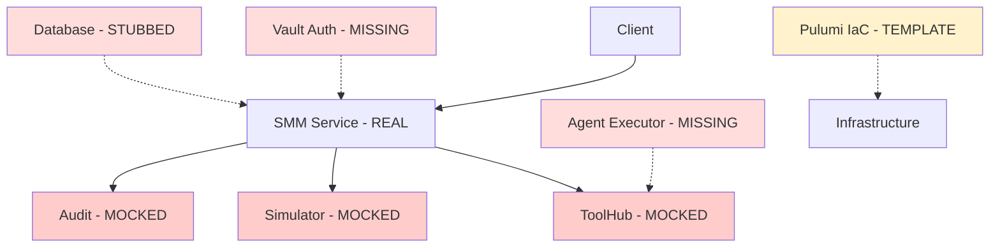
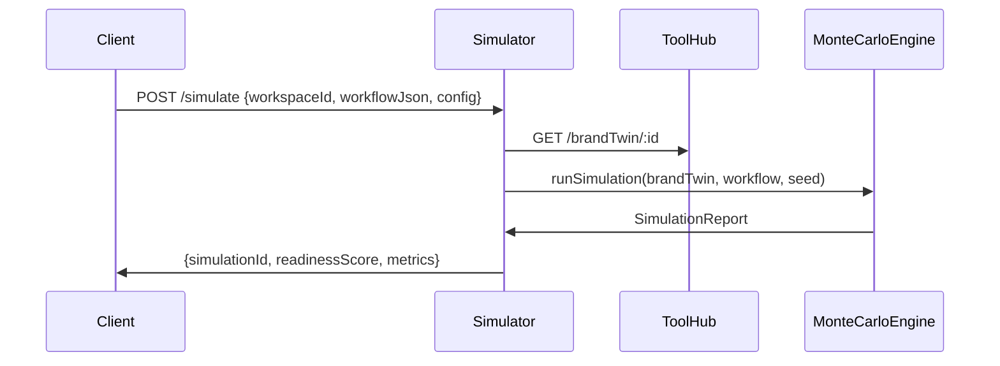

# Production Readiness Implementation Design

## Overview

The SMM Architect system has mature architecture and test infrastructure, but critical runtime components are mocked. This design prioritizes implementing real integrations for the 8 highest-risk missing pieces to achieve production readiness.

## Architecture Assessment

### Current State vs Target



## Implementation Priority Matrix

| Priority | Component | Risk | Dependencies | Production Impact |
|----------|-----------|------|--------------|------------------|
| 1 | Simulator Real Integration | Critical | ToolHub, DB | DecisionCard accuracy |
| 2 | Audit Bundle + KMS Signing | Critical | Vault, KMS | Compliance verification |
| 3 | Agent Execution Framework | High | ToolHub, Vault | Content generation |
| 4 | ToolHub Endpoints | High | Vector DB | Agent operations |
| 5 | Vault Integration | High | KMS, RBAC | Security foundation |
| 6 | Database Layer | Medium | ORM | State persistence |
| 7 | Pulumi Provisioning | Medium | Cloud APIs | Workspace creation |
| 8 | Monitoring Stack | Low | Metrics | Observability |

## Critical Production Enhancements

### Contract Immutability & Audit Trail

**Enhanced Schema Fields**
```json
// schemas/workspace-contract.v2.json additions
{
  "contractVersion": "v1.0.0",
  "previousContractRef": "sha256_hash_of_previous",
  "policyBundleChecksum": "sha256_of_opa_policies",
  "kmsKeyRef": "arn:aws:kms:region:account:key/id",
  "lifecycle": "active",
  "emergencyFlags": {
    "halted": false,
    "budgetOverride": false,
    "humanApprovalRequired": false
  }
}
```

### Simulation Reproducibility

**Metadata Storage**
```typescript
interface ReproducibilityMetadata {
  randomSeed: number;
  iterations: number;
  rngAlgorithm: 'mersenne-twister';
  rngLibraryVersion: string;
  nodeJsVersion: string;
}
```

**Baseline Testing**
```json
// services/simulator/tests/baseline/icblabs-seed42.json
{
  "input": { "randomSeed": 42, "iterations": 1000 },
  "expectedOutput": {
    "readinessScore": 0.847,
    "policyPassPct": 0.923
  },
  "tolerance": {
    "readinessScore": 0.001,
    "policyPassPct": 0.005
  }
}
```

### CI-Local KMS Adapter

```typescript
// services/audit/src/kms/adapters/local.ts
class LocalKMSAdapter implements KMSAdapter {
  async sign(buffer: Buffer, keyRef: string): Promise<SignatureResult> {
    const signature = crypto.sign('sha256', buffer, this.privateKey);
    return {
      signature: signature.toString('base64'),
      keyId: `local-test-${keyRef}`,
      algorithm: 'ECDSA_SHA_256'
    };
  }
}
```

### Model Usage & Cost Controls

**Database Schema**
```sql
ALTER TABLE agent_runs ADD COLUMN model_usage JSONB;

CREATE TABLE workspace_quotas (
    workspace_id UUID REFERENCES workspaces(id),
    quota_type VARCHAR(50), -- 'tokens_per_day', 'cost_per_month'
    limit_value BIGINT,
    current_usage BIGINT DEFAULT 0
);
```

**Usage Tracking**
```typescript
interface ModelUsage {
  modelId: string;
  promptHash: string;
  totalTokens: number;
  costEstimateUsd: number;
  timestamp: string;
}
```

### Hallucination Detection

**OPA Policy**
```rego
# services/policy/rules/hallucination_detection.rego
require_human_approval if {
    input.agentOutput.confidenceScore < 0.85
    not verified_by_rag
}
```

### Operational Playbooks

**Budget Breach Response**
```yaml
# ops/playbooks/budget-breach.yml
actions:
  - type: "immediate_halt"
    target: "workspace.agents.*"
  - type: "audit_snapshot"
```

### Enhanced SLO Monitoring

```yaml
# monitoring/slos/service-objectives.yml
slos:
  toolhub_vector_search:
    threshold: 0.2  # 200ms p95
  simulation_latency:
    threshold: 30   # 30s p95
  agent_job_start:
    threshold: 60   # 60s p95
  publish_success_rate:
    threshold: 0.99 # 99%
```

### E2E Smoke Test

```javascript
// ops/smoke.js
async function runE2ESmokeTest() {
  const workspace = await createTestWorkspace();
  const simulation = await runSimulation(workspace.id);
  const agentRun = await executeAgent('research', workspace.id);
  const auditBundle = await createAuditBundle(workspace.id);
  const verification = await verifyAuditBundle(auditBundle.id);
  
  if (!verification.verified) {
    throw new Error('Audit verification failed');
  }
  
  await cleanupWorkspace(workspace.id);
  return { success: true };
}
```

## Prioritized Action Plan

### Quest A (Critical): Contract Immutability + Schema Validation
- `schemas/workspace-contract.v2.json` - Enhanced schema
- `services/smm-architect/src/contract-manager.ts` - Hash generation
- CI gate: `schema-validate`

### Quest B (Critical): Deterministic Simulator + Baseline  
- `services/simulator/src/montecarlo.ts` - Reproducible implementation
- `services/simulator/tests/baseline/icblabs-seed42.json` - Baseline
- CI gate: `simulate-regression` (±0.001 tolerance)

### Quest C (Critical): Audit Bundle + Local KMS
- `services/audit/src/kms/adapters/local.ts` - CI adapter
- `ci/keys/test-kms.pem` - Test keypair
- CI gate: `audit-integration`

### Quest D (High): Model Usage Tracking
- `migrations/002_model_usage.sql` - Schema
- `services/agents/src/model-usage-tracker.ts` - Recording
- Cost throttle enforcement

### Quest E (High): Hallucination Detection
- `services/policy/rules/hallucination_detection.rego` - OPA rules
- `services/agents/src/hallucination-detector.ts` - Verification
- CI gate: Enhanced `policy-test`

### Quest F (High): Chaos Testing
- `tests/chaos/playwright-fallback.test.ts` - API failure scenarios
- `services/publisher/src/fallback-manager.ts` - Connector failover

### Quest G (Medium): E2E Smoke Harness
- `ops/smoke.js` - Automated test script
- `.github/workflows/e2e-smoke.yml` - CI integration

### Quest H (Medium): Secrets Management
- `.github/workflows/security-scan.yml` - Leak detection
- `ops/secrets-rotation.sh` - Rotation procedures

### Quest I (Low): Data Retention
- `services/compliance/src/data-retention.ts` - Purge jobs
- Automated anonymization workflows

## Core Component Implementations

### 1. Simulator Real Integration

**Architecture**


**Key Components**
- **services/simulator/src/server.ts**: Express endpoint with ToolHub integration
- **services/simulator/src/montecarlo.ts**: Deterministic PRNG using `seedrandom`
- **Database Schema**: simulation_reports table with workspace correlation
- **Baseline Testing**: Regression tests with ±0.001 tolerance for readiness scores

### 2. Audit Bundle + KMS Signing

**KMS Integration**
```typescript
interface KMSAdapter {
  sign(buffer: Buffer, keyRef: string): Promise<SignatureResult>;
  verify(buffer: Buffer, signature: string, keyRef: string): Promise<boolean>;
}

class AWSKMSAdapter implements KMSAdapter {
  async sign(buffer: Buffer, keyRef: string): Promise<SignatureResult> {
    const kms = new AWS.KMS();
    return await kms.sign({
      KeyId: keyRef,
      Message: buffer,
      SigningAlgorithm: 'ECDSA_SHA_256'
    }).promise();
  }
}
```

**Storage Architecture**
```
audit-bundles/
├── 2024-01-15/
│   ├── bundle-ws001-timestamp.json.gz
│   └── bundle-ws002-timestamp.json.gz
```

**Verification Endpoint**: GET /bundles/:id/verify returns cryptographic proof validation

### 3. Agent Execution Framework

**Core Service**
```typescript
class AgentExecutor {
  async executeJob(request: AgentJobRequest): Promise<AgentJobResponse> {
    // Get scoped Vault token
    const token = await this.vaultService.getAgentToken(request.agentType, request.workspaceId);
    
    // Execute with sandbox
    const runner = new AgentRunner(token, this.modelRouter);
    const result = await runner.execute(request.blueprint, request.input);
    
    // Store outputs to ToolHub
    await this.storeAgentOutputs(result, token);
    
    return { jobId, status: 'completed', outputs: result };
  }
}
```

**Database Schema**
```sql
CREATE TABLE agent_runs (
    id UUID PRIMARY KEY DEFAULT gen_random_uuid(),
    job_id VARCHAR(255) UNIQUE NOT NULL,
    workspace_id VARCHAR(255) NOT NULL,
    agent_type VARCHAR(100) NOT NULL,
    status VARCHAR(50) NOT NULL,
    input_data JSONB NOT NULL,
    output_data JSONB,
    model_usage JSONB,
    created_at TIMESTAMP WITH TIME ZONE DEFAULT NOW()
);
```

### 4. ToolHub Endpoints Implementation

**Ingest Route**
```typescript
// POST /ingest
async function ingestSource(req: Request, res: Response) {
  const { url, sourceType, workspaceId } = req.body;
  
  const rawContent = await downloadUrl(url);
  const extractedText = await extractText(rawContent, sourceType);
  
  const sourceId = generateSourceId();
  await objectStorage.store(`sources/${sourceId}`, rawContent);
  
  res.json({ sourceId, extractedLength: extractedText.length });
}
```

**Vector Routes**
```typescript
// POST /vector/upsert
async function upsertEmbedding(req: Request, res: Response) {
  const embedding = await embeddingProvider.embed(req.body.text);
  const embeddingId = await vectorDB.upsert({
    id: generateEmbeddingId(),
    values: embedding,
    metadata: { workspaceId: req.body.workspaceId, ...req.body.metadata }
  });
  
  res.json({ embeddingId });
}

// POST /vector/search - topK vector similarity search
```

### 5. Vault Integration & Auth Middleware

**Authentication Middleware**
```typescript
async function validateVaultToken(token: string): Promise<AuthContext> {
  const vaultClient = new VaultClient({ endpoint: process.env.VAULT_ADDR! });
  
  const introspection = await vaultClient.auth.token.lookup({ token });
  
  return {
    userId: introspection.data.meta.user_id,
    workspaceId: introspection.data.meta.workspace_id,
    policies: introspection.data.policies,
    tokenExpiry: introspection.data.expire_time
  };
}

export const authMiddleware = async (req: Request, res: Response, next: NextFunction) => {
  const authHeader = req.headers.authorization;
  if (!authHeader?.startsWith('Bearer vault:')) {
    return res.status(401).json({ error: 'Invalid authorization header' });
  }
  
  const authContext = await validateVaultToken(authHeader.substring('Bearer '.length));
  req.authContext = authContext;
  next();
};
```

**Token Issuer**
```typescript
class VaultTokenIssuer {
  async issueAgentToken(agentType: string, workspaceId: string): Promise<string> {
    return await this.vaultClient.auth.token.create({
      policies: [`agent-${agentType}-${workspaceId}`, 'default'],
      ttl: '2h',
      meta: { agent_type: agentType, workspace_id: workspaceId }
    });
  }
}
```

### 6. Database Layer & Migrations

**Prisma Schema**
```prisma
model Workspace {
  id              String   @id @default(uuid())
  tenantId        String
  contractVersion String
  metadata        Json
  
  simulationReports SimulationReport[]
  agentRuns         AgentRun[]
  auditBundles      AuditBundle[]
}

model SimulationReport {
  id               String   @id @default(uuid())
  simulationId     String   @unique
  readinessScore   Decimal  @db.Decimal(5,4)
  policyPassPct    Decimal  @db.Decimal(5,4)
  iterations       Int
  randomSeed       Int
  confidenceBounds Json?
  workspace        Workspace @relation(fields: [workspaceId], references: [id])
}
```

**Migration System**: Automated schema deployment with rollback capabilities

### 7. Pulumi Workspace Provisioning

**Automation API**
```typescript
async function createWorkspace(config: WorkspaceConfig): Promise<WorkspaceOutputs> {
  const namespace = new k8s.core.v1.Namespace(`${config.workspaceId}-ns`);
  
  const outputs: WorkspaceOutputs = { namespaceId: namespace.metadata.name };
  
  if (config.resources.database) {
    const database = await provisionDatabase(config, namespace);
    outputs.databaseConnection = database.connectionString;
  }
  
  if (config.resources.n8n) {
    const n8n = await provisionN8N(config, namespace);
    outputs.n8nUrl = n8n.serviceUrl;
  }
  
  return outputs;
}
```

**Programmatic Provisioning**
```typescript
class WorkspaceProvisioner {
  async createWorkspace(config: WorkspaceConfig): Promise<ProvisioningResult> {
    const stack = await LocalWorkspace.createOrSelectStack({
      stackName: `workspace-${config.workspaceId}`,
      program: () => createWorkspace(config)
    });
    
    const result = await stack.up({ onOutput: console.log });
    return { outputs: result.outputs, resources: result.summary.resourceChanges };
  }
}
```

### 8. Monitoring & Observability

**Metrics Collection**
- Prometheus ServiceMonitors for all services
- Custom metrics: agent execution latency, simulation performance, audit bundle creation time
- SLO tracking: ToolHub p95 < 200ms, /simulate p95 < 30s

**Smoke Testing**
```javascript
async function runSmokeTest() {
  // 1. Create test workspace
  const workspace = await createTestWorkspace();
  
  // 2. Run simulation  
  const simulation = await runSimulation(workspace.id);
  
  // 3. Execute agent workflow
  const agentRun = await executeAgent('research', workspace.id);
  
  // 4. Verify audit bundle
  const auditBundle = await createAuditBundle(workspace.id);
  const verification = await verifyBundle(auditBundle.id);
  
  console.log(`✅ Smoke test passed: ${verification.verified}`);
}
```

## Ready-to-Execute Task List (9 Quests A→I)

### Implementation Reasoning

**Priority by Production Risk:**
1. **Content Safety & Compliance** (A-C): Contract immutability, simulation accuracy, audit integrity
2. **Runtime Foundation** (D-E): Agent execution, ToolHub operations
3. **Security & Persistence** (F-G): Authentication, data storage
4. **Infrastructure & Operations** (H-I): Provisioning, monitoring

Each Quest is atomic, testable, and CI-gated for safe iterative development.

---

## Quest A — Contract Immutability & Audit Snapshot (Critical)

**Goal:** Make contracts immutable and persist canonical contract snapshot to audit bundles.

**Deliverables:**
- `schemas/workspace-contract.v2.json` - Add contractVersion, previousContractRef, policyBundleChecksum, kmsKeyRef, lifecycle, emergencyFlags
- `services/audit/src/snapshotter.ts` - Stores `audit-snapshots/<bundleId>/contract.json` (gzip)
- Update AuditBundle schema to include contractSnapshotRef, policyBundleChecksum
- `examples/workspace.icblabs.v2.json` - Updated example contract

**Files to Create/Modify:**
```
schemas/workspace-contract.v2.json
services/audit/src/snapshotter.ts
services/audit/src/types/audit-bundle.ts
examples/workspace.icblabs.v2.json
tests/schema/contract-immutability.test.ts
```

**Tests & CI:**
- `schema-validate` job: Validate examples against v2 schema
- Unit test: Attempt to mutate signed contract → verify audit snapshot mismatch and fail
- Contract version increment validation

**Acceptance Criteria:**
- Example signed contract stored as immutable snapshot and referenced in AuditBundle
- CI fails if a merged PR changes a signed contract without new contractVersion
- Contract hash generation is deterministic and verifiable

---

## Quest B — Deterministic Simulator & Baseline Regression (Critical)

**Goal:** Replace mocked simulator with deterministic Monte Carlo engine and baseline regression harness.

**Deliverables:**
- `services/simulator/src/server.ts` - POST /simulate endpoint
- `services/simulator/src/montecarlo.ts` - Using seedrandom library
- `migrations/003_create_simulation_reports.sql` - Database schema
- `services/simulator/tests/baseline/icblabs-seed42.json` - Regression baseline
- `services/simulator/tests/montecarlo.property.test.ts` - Property-based tests

**Files to Create/Modify:**
```
services/simulator/src/server.ts
services/simulator/src/montecarlo.ts
services/simulator/src/types/simulation.ts
migrations/003_create_simulation_reports.sql
services/simulator/tests/baseline/icblabs-seed42.json
services/simulator/tests/montecarlo.property.test.ts
services/simulator/tests/regression.test.ts
```

**Tests & CI:**
- `simulate-regression` CI job: Run sim with seed=42 and compare readinessScore ±0.001, policyPassPct ±0.005
- Property-based tests (fast-check) for monotonicity
- Reproducibility validation across environments

**Acceptance Criteria:**
- Simulation runs produce seed, iterations, rngVersion, persisted to DB
- Baseline regression CI passes with tolerance requirements
- Property tests verify mathematical invariants

---

## Quest C — Audit Bundle Assembler + KMS Signing (Critical)

**Goal:** Assemble full audit bundles and sign them with pluggable KMS. Provide local KMS adapter for CI.

**Deliverables:**
- `services/audit/src/assembler.ts` - Bundle assembly logic
- `services/audit/src/kms/adapter.{aws,gcp,local}.ts` - Pluggable KMS adapters
- POST /bundles → assemble, sign, store `audit/<bundleId>.json.gz`
- GET /bundles/:id/verify → verify signature
- CI-local key pair + local KMS adapter for audit-integration job

**Files to Create/Modify:**
```
services/audit/src/assembler.ts
services/audit/src/kms/adapter-aws.ts
services/audit/src/kms/adapter-gcp.ts
services/audit/src/kms/adapter-local.ts
services/audit/src/kms/types.ts
ci/keys/test-kms.pem
ci/keys/test-kms.pub
services/audit/tests/kms-integration.test.ts
```

**Tests & CI:**
- `audit-integration` job: Sign sample bundle with local adapter and GET /bundles/:id/verify returns true
- End-to-end unit test for canonical digest & signature
- Multi-provider KMS adapter compatibility tests

**Acceptance Criteria:**
- Bundles signed with KMS adapter; verification endpoint proves signature
- Local KMS adapter works in CI without cloud credentials
- Signature verification is cryptographically sound

---

## Quest D — AgentExecutor & Model Usage Accounting (High)

**Goal:** Implement AgentExecutor runtime, sandbox, model-router calls and model_usage accounting.

**Deliverables:**
- `services/agents/executor.ts` - Issue run record, get Vault token, call model-router, store outputs to ToolHub
- `migrations/004_add_agent_runs_model_usage.sql` - Add JSONB model_usage column
- Basic runner implementations for Research & Planner agents (proof-of-flow)
- `services/agents/tests/executor.integration.test.ts` - Integration tests

**Files to Create/Modify:**
```
services/agents/executor.ts
services/agents/src/runner/research-runner.ts
services/agents/src/runner/planner-runner.ts
services/agents/src/model-usage-tracker.ts
services/agents/src/cost-throttle.ts
migrations/004_add_agent_runs_model_usage.sql
services/agents/tests/executor.integration.test.ts
services/agents/tests/cost-throttle.test.ts
```

**Tests & CI:**
- `agent-integration` job: Run Research agent with real ToolHub mocks; assert BrandTwin created and agent_runs.model_usage populated
- Unit tests for model usage token/cost cap enforcement
- Sandbox security validation

**Acceptance Criteria:**
- AgentExecutor records model_usage with modelId, promptHash, tokens, costEstimate
- Token caps enforced and tested
- Agent runs create verifiable outputs in ToolHub

---

## Quest E — ToolHub Full Endpoints (High)

**Goal:** Implement real ToolHub routes: ingest, vector-upsert/search, simulate proxy, render, oauth-init.

**Deliverables:**
- `services/toolhub/src/routes/ingest.ts, vector.ts, simulate.ts, render.ts, oauth.ts`
- Object store write for sources/ and embeddings/ metadata
- Minimal vector DB adapter for CI (local in-memory) and integration adapter for Pinecone

**Files to Create/Modify:**
```
services/toolhub/src/routes/ingest.ts
services/toolhub/src/routes/vector.ts
services/toolhub/src/routes/simulate.ts
services/toolhub/src/routes/render.ts
services/toolhub/src/routes/oauth.ts
services/toolhub/src/adapters/vector-db-local.ts
services/toolhub/src/adapters/vector-db-pinecone.ts
services/toolhub/src/storage/object-store.ts
services/toolhub/tests/contract/toolhub-provider.test.ts
```

**Tests & CI:**
- `contract-test` (Pact): Provider stubs and consumer interactions for ingest/vector/simulate
- Integration tests using local vector adapter
- Performance tests for vector search latency

**Acceptance Criteria:**
- Ingest returns sourceId and stored content; vector search returns consistent topK hits
- OAuth initiation returns valid redirect URLs
- Simulate proxy maintains API compatibility

---

## Quest F — Vault Integration & Auth Middleware (High)

**Goal:** Replace mocked Vault flows with real Vault integration (with CI-local emulation).

**Deliverables:**
- `services/smm-architect/src/middleware/auth.ts` - Using Vault introspect
- `services/auth/issuer.ts` - Mint agent-scoped ephemeral tokens
- CI-local Vault dev container config for tests

**Files to Create/Modify:**
```
services/smm-architect/src/middleware/auth.ts
services/auth/issuer.ts
services/auth/src/vault-client.ts
docker-compose.vault-dev.yml
ci/vault/dev-config.hcl
services/auth/tests/vault-integration.test.ts
services/smm-architect/tests/auth-middleware.test.ts
```

**Tests & CI:**
- `vault-integration` job: Validate validateVaultToken() against dev Vault; agent executor uses minted token to call ToolHub
- Token lifecycle and expiration tests
- RBAC policy validation

**Acceptance Criteria:**
- Middleware rejects invalid tokens; agent-runner receives valid ephemeral token
- Workspace-scoped permissions are enforced
- CI tests run without production Vault credentials

---

## Quest G — DB Migrations & ORM (Medium)

**Goal:** Implement DB connectivity and migrations (Prisma/TypeORM) for workspace, simulationReports, agentRuns, auditBundles, connectors.

**Deliverables:**
- `services/smm-architect/prisma/schema.prisma` (or ORM equivalents)
- Migration scripts and db-migrate-check CI job
- DB adapter with pooling and retry logic `src/db/index.ts`

**Files to Create/Modify:**
```
services/smm-architect/prisma/schema.prisma
services/smm-architect/src/db/index.ts
services/smm-architect/src/db/migrations.ts
migrations/001_initial_schema.sql
migrations/002_workspace_quotas.sql
services/smm-architect/tests/db/migrations.test.ts
services/smm-architect/tests/db/connection.test.ts
```

**Tests & CI:**
- `db-migrate-check` runs migrations against ephemeral Postgres container in CI and verifies tables exist
- Connection pooling and retry logic tests
- Data integrity validation

**Acceptance Criteria:**
- Migrations applied in CI; services can read/write necessary entities
- Database health checks pass
- Connection pooling prevents resource leaks

---

## Quest H — Pulumi Workspace Provisioner & E2E Smoke Harness (Medium)

**Goal:** Add Pulumi createWorkspace automation (dry-run) and E2E smoke script that exercises the full flow in ephemeral workspace.

**Deliverables:**
- `infra/pulumi/workspace-template.ts` - Create namespace, n8n helm chart, Playwright chart, RDS placeholder
- `ops/smoke.js` - Create workspace (Pulumi preview/dry-run allowed), run simulate, run Research agent, create audit, verify
- CI job pulumi-preview (dry-run) and nightly e2e-smoke on staging

**Files to Create/Modify:**
```
infra/pulumi/workspace-template.ts
infra/pulumi/provisioner.ts
ops/smoke.js
ops/e2e-harness.ts
.github/workflows/pulumi-preview.yml
.github/workflows/e2e-smoke.yml
tests/e2e/ephemeral-workspace.test.ts
```

**Tests & CI:**
- `pulumi-preview` returns expected outputs in CI dry-run
- `e2e-smoke` runs in staging or controlled env
- Infrastructure validation tests

**Acceptance Criteria:**
- Smoke script completes and reports bundleVerified:true or detailed failure
- Pulumi preview generates expected resource manifests
- E2E test creates, validates, and cleans up ephemeral workspace

---

## Quest I — Monitoring, Chaos & Secrets Hygiene (Low → Medium)

**Goal:** Deploy monitoring manifests, synthetic monitors, chaos tests for fallback, and secrets scan/rotation automation.

**Deliverables:**
- `monitoring/helm/` - Prometheus/Grafana manifests and dashboards
- `tests/chaos/playwright-fallback.test.ts` - Simulates 401→429→200 sequence and asserts fallback path
- `ci/security-scan.yml` - git-secrets + Snyk
- `ops/secrets-rotation.md` + CI job template secrets-rotation-check

**Files to Create/Modify:**
```
monitoring/helm/prometheus.yaml
monitoring/helm/grafana.yaml
monitoring/dashboards/smm-architect.json
tests/chaos/playwright-fallback.test.ts
tests/chaos/connector-revocation.test.ts
ci/security-scan.yml
ops/secrets-rotation.md
ops/scripts/rotate-secrets.sh
.github/workflows/security-scan.yml
```

**Tests & CI:**
- `qa-chaos` CI job runs fallback test in ephemeral environment
- `security-scan` must have zero critical issues
- Synthetic monitoring validation

**Acceptance Criteria:**
- Synthetic monitors report expected metrics; chaos test triggers fallback and logs DecisionCard
- Security scan passes with zero critical vulnerabilities
- Secrets rotation procedures are documented and tested

---

## Implementation Strategy

### Immediate Execution Plan

**Phase 1: Critical Path (Execute Now)**
1. Execute Quests A-C immediately in Qoder
2. Merge only when CI gates pass: `schema-validate`, `simulate-regression`, `audit-integration`
3. Establish baseline artifacts (simulation baseline, KMS test keys, audit snapshots)

**Phase 2: Runtime Foundation (Execute Next)**
1. Execute Quests D-F immediately after Phase 1
2. Enable CI gating: `agent-integration`, `contract-test`, `vault-integration`
3. Validate end-to-end agent execution flow

**Phase 3: Infrastructure & Operations (Execute Final)**
1. Execute Quests G-I immediately after Phase 2
2. Enable monitoring and chaos testing
3. Complete E2E smoke testing and production validation

### Alternative Implementation Approaches

**Conservative (Recommended for Enterprise):**
- Implement all Quests as-is
- Tenant KMS isolation
- Self-hosted vector DB options
- Complete policy enforcement

**Aggressive (Faster Launch):**
- Use managed Pinecone, managed n8n, cloud KMS
- Skip tenant KMS until v2
- Shared infrastructure initially
- Tradeoff: Faster deployment, less tenant control

**Hybrid (Balanced):**
- Implement core (A-C, D-E) fully
- Use managed services for Pulumi-deployed apps initially
- Migrate to tenant-controlled infrastructure incrementally

## Production Acceptance Criteria

### Required CI Gates (Block Merge)
```yaml
required_checks:
  - schema-validate          # All example contracts valid
  - simulate-regression      # Baseline match within tolerance
  - audit-integration        # KMS signing + verification
  - policy-test              # OPA hallucination/consent/budget tests
  - security-scan           # No secrets, Snyk critical==0
  - unit-coverage-80         # 80%+ coverage for core modules
  - e2e-smoke               # Ephemeral workspace smoke test
```

### Specific Verification Requirements

**Simulator Baseline**
- `icblabs-seed42` test: readinessScore ±0.001, policyPassPct ±0.005
- Reproducibility metadata stored in all SimulationReports
- RNG library version pinned in package.json

**Audit Integration**
- Test KMS signs bundle and GET /bundles/:id/verify returns `verified: true`
- Local KMS adapter works in CI without cloud credentials
- Contract snapshots stored with immutable references

**Cost Controls**
- Model usage tracking persists to `agent_runs.model_usage`
- Workspace quotas enforce token caps with hard blocks
- Budget breach triggers immediate halt + audit snapshot

**Security & Compliance**
- No secrets committed to git history
- Vault tokens expire within 2h for agents
- Data retention jobs purge expired workspace data

## Risk Mitigation Strategies

### Technical Risks

**Risk: CI false positives from RNG differences**
- *Mitigation*: Pin seedrandom library version, persist rngVersion in reports
- *Fallback*: Allow 100 iterations in CI, full 1000 on nightly builds

**Risk: KMS cloud credentials in CI**
- *Mitigation*: Local KMS adapter for CI, cloud KMS only on protected branches
- *Acceptance*: Separate CI pipeline using test keys vs. production pipeline

**Risk: Model cost blowouts**
- *Mitigation*: Hard token caps in AgentExecutor, break-glass overrides require audit
- *Monitoring*: Real-time cost tracking with 80% budget alerts

**Risk: Slow simulation causing CI timeouts**
- *Mitigation*: Configurable iteration counts (CI: 100, staging: 1000)
- *Validation*: Property tests verify distribution consistency across iteration counts

### Operational Risks

**Risk: Connector revocation during campaigns**
- *Mitigation*: Automatic fallback to secondary connectors
- *Playbook*: `ops/playbooks/connector-revocation.yml` with escalation procedures

**Risk: Data retention compliance failures**
- *Mitigation*: Automated purge jobs + audit trails
- *Validation*: Quarterly compliance audits with retention verification

### Implementation Approach Tradeoffs

**Conservative (Recommended for Enterprise)**
- Pros: Tenant KMS isolation, local vector DB option, per-tenant policies
- Cons: More infrastructure complexity, longer implementation time
- Best for: Regulated industries, multi-tenant SaaS

**Aggressive (Fast Track)**
- Pros: Hosted KMS, managed vector DB, shared infrastructure
- Cons: Less tenant control, vendor lock-in risk
- Best for: Internal MVP, single-tenant deployment

## Implementation Timeline

**Week 1-2: Critical Foundation**
- Quests A, B, C (Contract immutability, Simulator, Audit KMS)
- CI gates: schema-validate, simulate-regression, audit-integration

**Week 3-4: Safety & Controls**
- Quests D, E (Model usage, Hallucination detection)
- Enhanced policy testing and cost controls

**Week 5-6: Operational Readiness**
- Quests F, G, H (Chaos testing, E2E harness, Secrets management)
- Monitoring, alerting, and incident response procedures

**Week 7: Production Validation**
- Quest I (Data retention)
- Final security review and compliance validation
- Production deployment verification