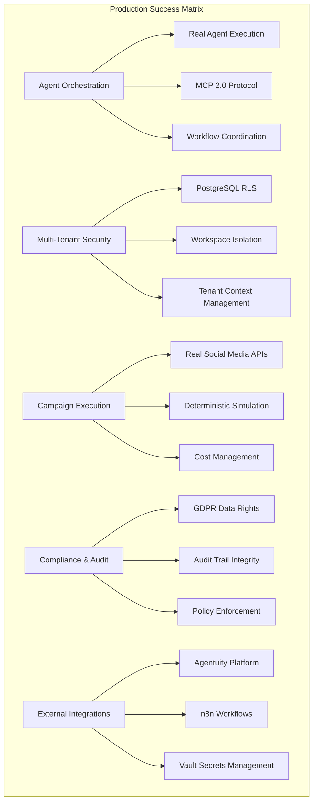
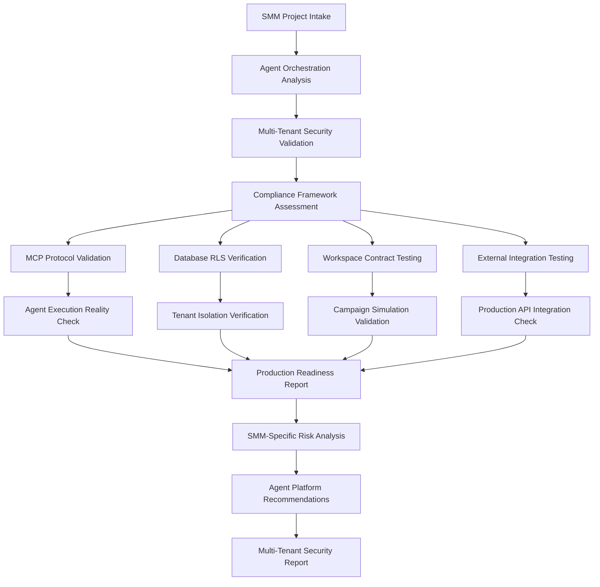
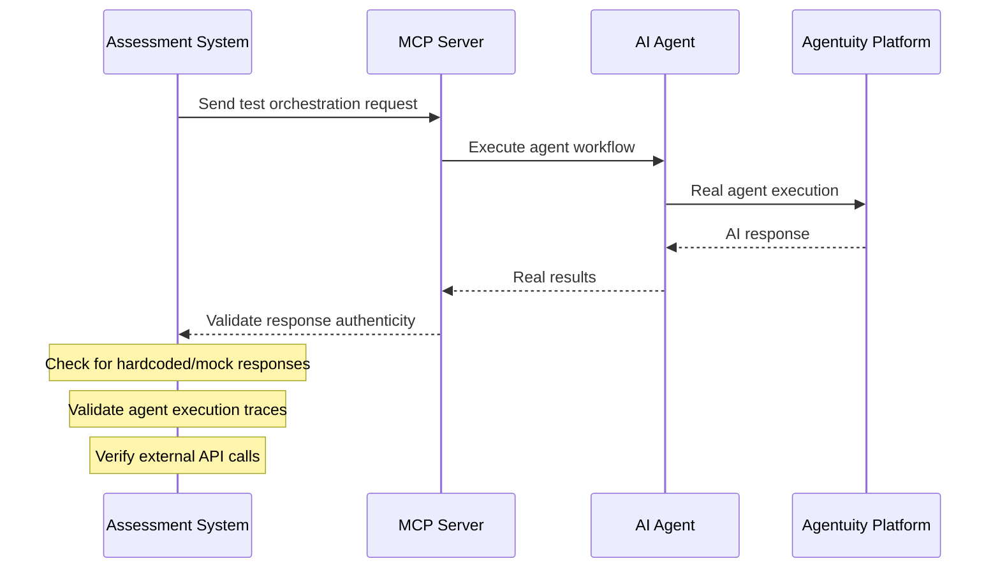
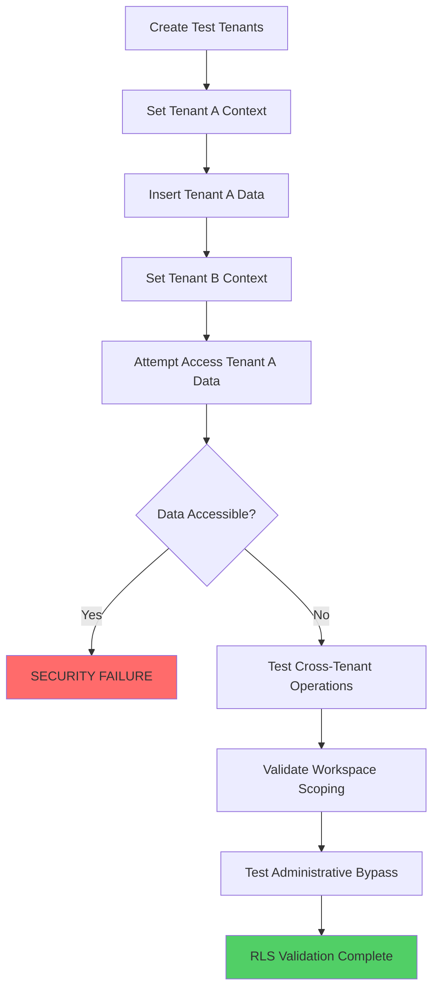
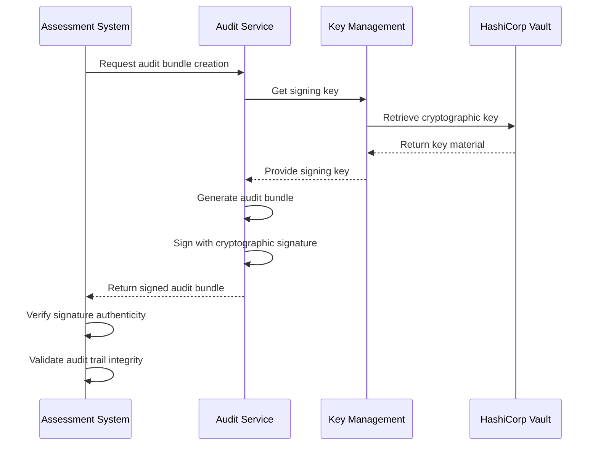
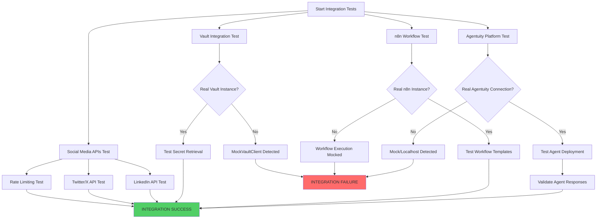
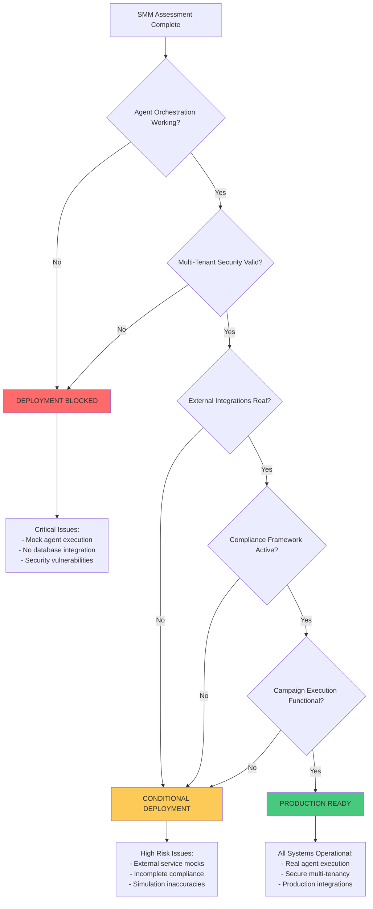
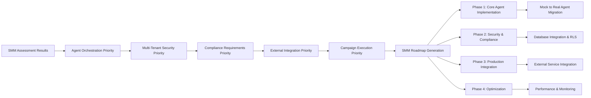

# SMM Architect Production Assessment System Design

## Overview

This document designs a specialized production readiness assessment system tailored specifically for **AI agent orchestration platforms** like SMM Architect. The system focuses on the unique challenges and requirements of autonomous social media marketing platforms that must orchestrate multiple AI agents, manage multi-tenant workspaces, ensure compliance, and deliver deterministic campaign results in production.

**System Purpose**: Provide comprehensive production readiness validation for enterprise-grade AI agent orchestration platforms with focus on agent coordination, multi-tenant isolation, compliance frameworks, and real-time campaign execution.

**SMM Architect-Specific Focus Areas**:
- Agent orchestration and MCP 2.0 protocol implementation
- Multi-tenant workspace isolation and security
- Compliance frameworks (GDPR, CCPA, SOC2)
- Real-time campaign simulation and execution
- External platform integrations (Agentuity, n8n)
- Declarative workspace contract management
- BrandTwin intelligence and provenance tracking

## Production Success Criteria for SMM Architect

### Critical Production Requirements



### Ultimate Production Goals Assessment

| Production Goal | Assessment Criteria | Success Metrics | Failure Impact |
|----------------|-------------------|-----------------|----------------|
| **AI Agent Orchestration** | Real agent execution, not mocks | 100% real agent responses | Campaign execution fails |
| **Multi-Tenant Isolation** | PostgreSQL RLS working, tenant context set | Zero cross-tenant data leaks | Data breach, compliance violation |
| **Campaign Simulation** | Deterministic Monte Carlo results | Reproducible simulation outcomes | Unreliable campaign planning |
| **Compliance Processing** | Real GDPR/CCPA data subject rights | Automated DSR handling | Legal liability |
| **Social Media Integration** | Real platform APIs, not localhost | Successful post publishing | Campaign delivery fails |
| **Workspace Management** | Contract lifecycle, approval workflows | End-to-end workspace operations | Business process breakdown |
| **Cost Management** | Real budget tracking and enforcement | Accurate cost estimation/control | Budget overruns |
| **Audit Integrity** | Cryptographic audit bundles | Tamper-proof audit trails | Compliance audit failures |

## SMM Architect Assessment Architecture

### Agent Orchestration Validation Framework



### SMM Architect-Specific Assessment Dimensions

| Assessment Dimension | SMM-Specific Focus | Validation Method | Critical for Production |
|---------------------|-------------------|-------------------|------------------------|
| **Agent Orchestration** | Real vs mock agent execution | MCP protocol testing, agent response validation | ✅ CRITICAL |
| **Multi-Tenant Architecture** | PostgreSQL RLS, tenant context | Database isolation testing, cross-tenant validation | ✅ CRITICAL |
| **Campaign Simulation** | Monte Carlo determinism | Simulation reproducibility, statistical validation | ✅ CRITICAL |
| **Social Media Integration** | Real platform APIs | Live API testing, rate limiting validation | ✅ CRITICAL |
| **Compliance Framework** | GDPR/CCPA automation | DSR workflow testing, audit trail validation | ✅ CRITICAL |
| **Workspace Management** | Contract lifecycle | End-to-end workspace operations testing | ✅ CRITICAL |
| **External Dependencies** | Agentuity, n8n, Vault | Integration health checks, fallback testing | 🔶 HIGH |
| **Cost Management** | Budget enforcement | Cost calculation validation, limit testing | 🔶 HIGH |
| **BrandTwin Intelligence** | Provenance tracking | Data lineage validation, quality scoring | 🔶 HIGH |
| **Policy Enforcement** | OPA constraints | Policy violation testing, approval workflows | 🔶 HIGH |

## SMM Architect Assessment Methodology

### Phase 1: Agent Orchestration Reality Check

#### MCP Protocol Implementation Validation
```typescript
interface MCPValidationResult {
  protocolCompliance: MCPProtocolStatus;
  agentExecution: AgentExecutionStatus;
  mockDetection: AgentMockAnalysis;
  integrationHealth: ExternalIntegrationStatus;
}

interface AgentExecutionStatus {
  realAgentResponses: boolean;
  agentuityIntegration: 'real' | 'mock' | 'localhost';
  anthropicClaudeExecution: boolean;
  toolHubIntegration: IntegrationStatus;
  mcpServerResponses: 'hardcoded' | 'dynamic' | 'agent-driven';
}

interface AgentMockAnalysis {
  researchAgentMocked: boolean;
  creativeAgentMocked: boolean;
  legalAgentMocked: boolean;
  publisherAgentMocked: boolean;
  orchestrationSimulated: boolean;
  workflowExecutionReal: boolean;
}
```

#### Critical Agent Orchestration Tests


### Phase 2: Multi-Tenant Security Architecture Validation

#### Database Row-Level Security (RLS) Testing
```typescript
interface MultiTenantValidation {
  postgresRLS: RLSValidationResult;
  tenantIsolation: TenantIsolationTest;
  workspaceScoping: WorkspaceScopingTest;
  crossTenantLeakage: CrossTenantLeakageTest;
}

interface RLSValidationResult {
  rlsPoliciesActive: boolean;
  tenantContextSet: boolean;
  queryFiltering: boolean;
  insertRestrictions: boolean;
  updateRestrictions: boolean;
  deleteRestrictions: boolean;
  bypassAttempts: SecurityBypassTest[];
}

interface CrossTenantLeakageTest {
  tenantA: string;
  tenantB: string;
  dataLeakageDetected: boolean;
  leakageVectors: LeakageVector[];
  isolationScore: number; // 0-100
}
```

#### Multi-Tenant Database Testing Protocol


### Phase 3: Campaign Simulation & Execution Validation

#### Monte Carlo Simulation Verification
```typescript
interface SimulationValidation {
  deterministicResults: DeterminismTest;
  statisticalAccuracy: StatisticalValidation;
  realDataIntegration: DataIntegrationTest;
  campaignExecutionPath: ExecutionPathTest;
}

interface DeterminismTest {
  seedReproducibility: boolean;
  identicalResults: boolean;
  varianceWithinBounds: boolean;
  rngLibraryConsistency: boolean;
  simulationTraceability: boolean;
}

interface ExecutionPathTest {
  workspaceContractProcessing: boolean;
  agentOrchestrationReal: boolean;
  socialMediaAPIIntegration: boolean;
  costCalculationAccuracy: boolean;
  approvalWorkflowFunctional: boolean;
}
```

### Phase 4: Compliance Framework Validation

#### GDPR/CCPA Data Subject Rights Testing
```typescript
interface ComplianceValidation {
  gdprCompliance: GDPRValidationResult;
  ccpaCompliance: CCPAValidationResult;
  auditTrailIntegrity: AuditValidationResult;
  dataSubjectRights: DSRValidationResult;
}

interface DSRValidationResult {
  dataAccessRequest: DSRTestResult;
  dataRectificationRequest: DSRTestResult;
  dataErasureRequest: DSRTestResult;
  dataPortabilityRequest: DSRTestResult;
  consentWithdrawal: DSRTestResult;
  automatedProcessing: boolean;
  responseTimeCompliance: boolean;
}

interface DSRTestResult {
  requestProcessed: boolean;
  dataRetrieved: boolean;
  crossSystemCoordination: boolean;
  auditTrailGenerated: boolean;
  legalComplianceVerified: boolean;
}
```

#### Audit Bundle Cryptographic Verification


## SMM Architect Assessment Execution Engine

### Agent Orchestration Testing Framework

#### Real vs Mock Agent Detection
```typescript
class SMMAgentValidationEngine {
  async validateAgentOrchestration(project: SMMProject): Promise<AgentValidationResult> {
    const results = {
      mcpServerImplementation: await this.validateMCPServer(project),
      agentExecutionReality: await this.validateAgentExecution(project),
      agentuityIntegration: await this.validateAgentuityIntegration(project),
      workflowExecution: await this.validateWorkflowExecution(project)
    };
    
    return this.calculateAgentOrchestrationScore(results);
  }

  private async validateMCPServer(project: SMMProject): Promise<MCPValidationResult> {
    // Check for hardcoded responses in MCP server
    const mcpServerCode = await this.scanFile('services/toolhub/src/mcp/server.ts');
    
    const mockPatterns = [
      /const\s+orchestrationResult\s*=\s*{[^}]*status:\s*['"]completed['"]/,
      /workflow_id:\s*`workflow_\$\{Date\.now\(\)\}`/,
      /agents_executed:\s*args\.agents/,
      /return\s*{[^}]*text:\s*`.*Results:\\n\$\{JSON\.stringify\(/
    ];
    
    const hasMockImplementation = mockPatterns.some(pattern => pattern.test(mcpServerCode));
    
    return {
      hasRealImplementation: !hasMockImplementation,
      mcpProtocolCompliance: await this.checkMCPProtocolCompliance(project),
      toolExecutionReal: await this.validateToolExecution(project)
    };
  }

  private async validateAgentExecution(project: SMMProject): Promise<AgentExecutionResult> {
    // Test actual agent execution vs mocked responses
    const testCases = [
      {
        agent: 'research-agent',
        input: { query: 'test market research', domain: 'technology' },
        expectedOutputType: 'insights'
      },
      {
        agent: 'creative-agent', 
        input: { campaign: 'brand awareness', platforms: ['linkedin'] },
        expectedOutputType: 'content'
      }
    ];
    
    const results = await Promise.all(
      testCases.map(testCase => this.executeAgentTest(project, testCase))
    );
    
    return {
      realAgentResponses: results.every(r => r.isRealResponse),
      agentResponseVariability: this.calculateResponseVariability(results),
      externalAPIIntegration: results.every(r => r.usesExternalAPIs)
    };
  }
}
```

#### Multi-Tenant Database Validation Engine
```typescript
class MultiTenantValidationEngine {
  async validateDatabaseIsolation(project: SMMProject): Promise<TenantIsolationResult> {
    // 1. Verify Prisma client usage vs mock SQLDatabase
    const mainServiceCode = await this.scanFile('services/smm-architect/src/main.ts');
    const usesMockDatabase = this.detectMockSQLDatabase(mainServiceCode);
    
    if (usesMockDatabase) {
      return {
        isolation: 'FAILED',
        reason: 'Main service uses mock SQLDatabase instead of Prisma client',
        riskLevel: 'CRITICAL'
      };
    }
    
    // 2. Test actual Row-Level Security
    const rlsTests = await this.executeRLSTests(project);
    
    // 3. Validate tenant context management
    const tenantContextTests = await this.validateTenantContext(project);
    
    return this.aggregateTenantIsolationResults(rlsTests, tenantContextTests);
  }

  private async executeRLSTests(project: SMMProject): Promise<RLSTestResult[]> {
    const testCases = [
      {
        name: 'Cross-tenant workspace access',
        setup: () => this.createTestTenants(['tenant-a', 'tenant-b']),
        test: () => this.attemptCrossTenantAccess('tenant-a', 'tenant-b'),
        expectedResult: 'ACCESS_DENIED'
      },
      {
        name: 'Tenant context enforcement',
        setup: () => this.setTenantContext('tenant-a'),
        test: () => this.queryWorkspaces(),
        expectedResult: 'TENANT_A_DATA_ONLY'
      }
    ];
    
    return Promise.all(testCases.map(testCase => this.executeRLSTest(testCase)));
  }
}
```

### External Integration Health Validation

#### Production API Integration Testing


#### External Service Mock Detection
```typescript
class ExternalIntegrationValidator {
  async validateExternalIntegrations(project: SMMProject): Promise<IntegrationValidationResult> {
    const validations = {
      agentuity: await this.validateAgentuityIntegration(project),
      vault: await this.validateVaultIntegration(project),
      n8n: await this.validateN8NIntegration(project),
      socialMediaAPIs: await this.validateSocialMediaAPIs(project)
    };
    
    return this.calculateIntegrationScore(validations);
  }

  private async validateVaultIntegration(project: SMMProject): Promise<VaultValidationResult> {
    // Check for MockVaultClient usage
    const agentCode = await this.scanFile('services/agents/agentuity/src/agents/my-agent/index.ts');
    
    const mockVaultPatterns = [
      /class\s+MockVaultClient/,
      /\/\/\s*Mock\s+implementation.*Vault/,
      /readKVSecret.*Mock\s+implementation/
    ];
    
    const usesMockVault = mockVaultPatterns.some(pattern => pattern.test(agentCode));
    
    if (usesMockVault) {
      return {
        status: 'MOCK_IMPLEMENTATION',
        riskLevel: 'HIGH',
        description: 'Agent uses MockVaultClient instead of real Vault integration'
      };
    }
    
    // Test actual Vault connectivity
    return await this.testVaultConnectivity(project);
  }

  private async validateAgentuityIntegration(project: SMMProject): Promise<AgentuityValidationResult> {
    // Check endpoint configuration
    const endpointConfig = process.env.TOOLHUB_ENDPOINT || 'http://localhost:8080';
    
    if (endpointConfig.includes('localhost')) {
      return {
        status: 'LOCALHOST_CONFIGURATION',
        riskLevel: 'CRITICAL',
        description: 'Agentuity integration uses localhost endpoint'
      };
    }
    
    // Test actual agent deployment and execution
    return await this.testAgentuityPlatformIntegration(project);
  }
}
```

### SMM Architect Risk Analysis Framework

#### Production Deployment Blockers for Agent Orchestration Platforms
```typescript
interface SMMRiskAssessment {
  agentOrchestrationRisks: AgentOrchestrationRisk[];
  multiTenantSecurityRisks: MultiTenantRisk[];
  complianceRisks: ComplianceRisk[];
  externalIntegrationRisks: IntegrationRisk[];
  campaignExecutionRisks: CampaignRisk[];
  overallDeploymentReadiness: DeploymentReadiness;
}

interface AgentOrchestrationRisk {
  riskType: 'mock-agent-execution' | 'mcp-protocol-failure' | 'orchestration-simulation';
  severity: 'deployment-blocker' | 'high' | 'medium';
  description: string;
  productionImpact: string;
  detectionCriteria: string[];
  remediationEffort: EffortEstimate;
}

interface MultiTenantRisk {
  riskType: 'cross-tenant-data-leak' | 'rls-bypass' | 'tenant-context-failure';
  severity: 'critical' | 'high';
  complianceImplication: 'gdpr-violation' | 'data-breach' | 'audit-failure';
  legalLiability: boolean;
  detectionMethod: string;
  mitigationStrategy: string;
}

enum DeploymentReadiness {
  PRODUCTION_READY = 'ready-for-production',
  CONDITIONAL_DEPLOYMENT = 'conditional-with-fixes',
  DEPLOYMENT_BLOCKED = 'critical-issues-prevent-deployment',
  PROTOTYPE_ONLY = 'not-suitable-for-production'
}
```

#### SMM-Specific Risk Scoring Algorithm
```typescript
class SMMRiskAnalysisEngine {
  calculateSMMDeploymentRisk(assessmentResults: SMMAssessmentResults): SMMRiskScore {
    const criticalRiskWeights = {
      agentExecution: 0.35,        // Highest weight - core functionality
      multiTenantSecurity: 0.25,   // Critical for compliance
      externalIntegrations: 0.20,  // Essential for functionality
      complianceFramework: 0.15,   // Legal requirements
      campaignExecution: 0.05      // Business logic validation
    };
    
    const riskScores = {
      agentExecution: this.scoreAgentExecutionRisk(assessmentResults),
      multiTenantSecurity: this.scoreMultiTenantRisk(assessmentResults),
      externalIntegrations: this.scoreIntegrationRisk(assessmentResults),
      complianceFramework: this.scoreComplianceRisk(assessmentResults),
      campaignExecution: this.scoreCampaignExecutionRisk(assessmentResults)
    };
    
    return this.calculateWeightedSMMRisk(riskScores, criticalRiskWeights);
  }

  private scoreAgentExecutionRisk(results: SMMAssessmentResults): number {
    const { agentOrchestration } = results;
    
    // Critical failure conditions
    if (agentOrchestration.mcpServerImplementation.hasRealImplementation === false) {
      return 100; // Deployment blocker
    }
    
    if (agentOrchestration.agentExecutionReality.realAgentResponses === false) {
      return 95; // Near-deployment blocker
    }
    
    if (agentOrchestration.agentuityIntegration.status === 'LOCALHOST_CONFIGURATION') {
      return 90; // High risk
    }
    
    // Calculate risk based on implementation quality
    let riskScore = 0;
    
    if (!agentOrchestration.workflowExecution.realWorkflowExecution) {
      riskScore += 30;
    }
    
    if (agentOrchestration.agentExecutionReality.agentResponseVariability < 0.1) {
      riskScore += 20; // Too deterministic, likely mocked
    }
    
    return Math.min(riskScore, 100);
  }

  private scoreMultiTenantRisk(results: SMMAssessmentResults): number {
    const { multiTenantSecurity } = results;
    
    // Critical security failures
    if (multiTenantSecurity.databaseImplementation === 'MOCK_SQL_DATABASE') {
      return 100; // Complete failure of multi-tenant architecture
    }
    
    if (multiTenantSecurity.crossTenantLeakage.dataLeakageDetected) {
      return 95; // Security breach
    }
    
    if (!multiTenantSecurity.rlsValidation.rlsPoliciesActive) {
      return 90; // RLS not working
    }
    
    return multiTenantSecurity.tenantIsolationScore;
  }
}
```

#### SMM Production Deployment Decision Matrix


## SMM Architect Assessment Reporting

### Executive Summary for AI Agent Orchestration Platforms

#### SMM-Specific Executive Summary Template
```typescript
interface SMMExecutiveSummary {
  platformReadiness: PlatformReadinessStatus;
  agentOrchestrationHealth: AgentOrchestrationHealth;
  multiTenantSecurityStatus: SecurityStatus;
  complianceFrameworkStatus: ComplianceStatus;
  criticalProductionBlockers: SMMProductionBlocker[];
  estimatedTimeToProduction: SMMTimeEstimate;
  businessRiskAssessment: BusinessRiskProfile;
}

interface PlatformReadinessStatus {
  overallScore: number; // 0-100
  deployment: 'ready' | 'conditional' | 'blocked' | 'prototype-only';
  coreCapabilities: {
    agentExecution: ReadinessLevel;
    multiTenantIsolation: ReadinessLevel;
    campaignOrchestration: ReadinessLevel;
    complianceAutomation: ReadinessLevel;
    externalIntegrations: ReadinessLevel;
  };
}

interface SMMProductionBlocker {
  category: 'agent-orchestration' | 'multi-tenant-security' | 'compliance' | 'integration';
  title: string;
  businessImpact: string;
  technicalImpact: string;
  legalImplication?: string;
  recommendedAction: string;
  estimatedCost: number;
  timelineToResolve: string;
}

enum ReadinessLevel {
  PRODUCTION_READY = 'production-ready',
  MINOR_ISSUES = 'minor-fixes-needed', 
  MAJOR_DEVELOPMENT = 'major-development-required',
  COMPLETE_REBUILD = 'complete-rebuild-required'
}
```

#### SMM Technical Deep-Dive Report Template
```typescript
interface SMMTechnicalReport {
  agentOrchestrationAnalysis: AgentOrchestrationReport;
  multiTenantArchitectureAnalysis: MultiTenantReport;
  campaignExecutionAnalysis: CampaignExecutionReport;
  complianceImplementationAnalysis: ComplianceImplementationReport;
  externalIntegrationAnalysis: ExternalIntegrationReport;
  infrastructureReadiness: InfrastructureReport;
  actionableTechnicalRoadmap: TechnicalRoadmap;
}

interface AgentOrchestrationReport {
  mcpProtocolImplementation: {
    status: 'real' | 'mock' | 'partial';
    serverImplementation: string;
    agentExecutionFlow: string;
    orchstrationCapability: string;
  };
  
  agentExecutionReality: {
    researchAgent: AgentImplementationStatus;
    creativeAgent: AgentImplementationStatus;
    legalAgent: AgentImplementationStatus;
    publisherAgent: AgentImplementationStatus;
    automationAgent: AgentImplementationStatus;
  };
  
  agentuityPlatformIntegration: {
    connectionStatus: 'production' | 'localhost' | 'mock';
    agentDeploymentStatus: string;
    apiIntegrationHealth: string;
    workflowExecutionCapability: string;
  };
  
  criticalFindings: AgentOrchestrationFinding[];
  recommendedActions: AgentOrchestrationAction[];
}

interface MultiTenantReport {
  databaseArchitecture: {
    implementationType: 'prisma-rls' | 'mock-sql' | 'hybrid';
    rowLevelSecurity: RLSImplementationStatus;
    tenantContextManagement: TenantContextStatus;
    crossTenantIsolation: IsolationTestResults;
  };
  
  securityValidation: {
    tenantDataIsolation: SecurityTestResult;
    workspaceScopingValidation: SecurityTestResult;
    unauthorizedAccessPrevention: SecurityTestResult;
    auditTrailIntegrity: SecurityTestResult;
  };
  
  complianceImplications: ComplianceImplication[];
  securityGaps: SecurityGap[];
  remediationPlan: SecurityRemediationPlan;
}
```

### SMM Architect Actionable Recommendations Engine



#### SMM-Specific Recommendation Categories
```typescript
interface SMMRecommendationEngine {
  generateSMMRoadmap(assessmentResults: SMMAssessmentResults): SMMProductionRoadmap;
}

interface SMMProductionRoadmap {
  immediateActions: ImmediateAction[];
  shortTermDevelopment: ShortTermDevelopment[];
  longTermOptimization: LongTermOptimization[];
  riskMitigation: RiskMitigationStrategy[];
}

interface ImmediateAction {
  category: 'critical-blocker-removal';
  action: string;
  priority: 'p0-deployment-blocker' | 'p1-high-risk';
  effort: string;
  impact: string;
  acceptanceCriteria: string[];
  
  // SMM-specific fields
  affectedAgents?: string[];
  complianceImplication?: string;
  multiTenantImpact?: string;
}

// Example immediate actions for SMM Architect
const smmImmediateActions: ImmediateAction[] = [
  {
    category: 'critical-blocker-removal',
    action: 'Replace mock SQLDatabase with Prisma client in main SMM service',
    priority: 'p0-deployment-blocker',
    effort: '2-3 weeks',
    impact: 'Enables real multi-tenant database operations',
    acceptanceCriteria: [
      'All database queries use Prisma client',
      'Row-Level Security policies active',
      'Tenant context properly set for all operations',
      'Cross-tenant data access blocked'
    ],
    multiTenantImpact: 'Critical for tenant data isolation'
  },
  {
    category: 'critical-blocker-removal', 
    action: 'Implement real agent orchestration in MCP server',
    priority: 'p0-deployment-blocker',
    effort: '4-6 weeks',
    impact: 'Enables actual AI agent execution for campaigns',
    acceptanceCriteria: [
      'Real agent responses from Agentuity platform',
      'Dynamic workflow execution',
      'Agent state management',
      'Error handling and retries'
    ],
    affectedAgents: ['research', 'creative', 'legal', 'publisher', 'automation']
  },
  {
    category: 'critical-blocker-removal',
    action: 'Replace MockVaultClient with production Vault integration',
    priority: 'p1-high-risk',
    effort: '1-2 weeks', 
    impact: 'Enables secure secrets management for agents',
    acceptanceCriteria: [
      'Real Vault connectivity',
      'Secret retrieval working',
      'Agent authentication via Vault',
      'Secure credential management'
    ]
  }
];
```

### SMM Architect Specialized Assessment Templates

#### AI Agent Orchestration Platform Assessment
```typescript
interface AIAgentPlatformAssessment extends BaseAssessment {
  agentOrchestration: {
    mcpProtocolImplementation: MCPImplementationAnalysis;
    agentExecutionReality: AgentExecutionAnalysis;
    workflowCoordination: WorkflowCoordinationAnalysis;
    externalPlatformIntegration: ExternalPlatformAnalysis;
  };
  
  multiTenantSecurity: {
    databaseRowLevelSecurity: RLSAnalysis;
    tenantIsolationValidation: TenantIsolationAnalysis;
    workspaceScoping: WorkspaceScopingAnalysis;
    crossTenantLeakagePrevention: LeakagePreventionAnalysis;
  };
  
  campaignExecution: {
    simulationAccuracy: SimulationAccuracyAnalysis;
    socialMediaIntegration: SocialMediaAPIAnalysis;
    costManagement: CostManagementAnalysis;
    approvalWorkflows: ApprovalWorkflowAnalysis;
  };
  
  complianceAutomation: {
    gdprImplementation: GDPRImplementationAnalysis;
    ccpaImplementation: CCPAImplementationAnalysis;
    auditTrailIntegrity: AuditTrailAnalysis;
    dataSubjectRights: DSRAutomationAnalysis;
  };
}
```

## Implementation Strategy for SMM Assessment System

### Development Phases Tailored to AI Agent Platforms

#### Phase 1: Core Agent Validation Engine (4-6 weeks)
**SMM-Specific MVP Features:**
- Agent orchestration mock detection
- MCP protocol compliance validation
- Multi-tenant database assessment
- Basic external integration testing
- Agent execution reality checks

**Deliverables:**
- Agent orchestration validation API
- Multi-tenant security testing framework
- MCP server analysis tools
- External integration health checks

#### Phase 2: Production Readiness Validation (6-8 weeks)
**Enhanced SMM Features:**
- Campaign simulation accuracy testing
- Social media API integration validation
- Compliance framework assessment
- Cost management validation
- Audit trail integrity verification

**Deliverables:**
- Campaign execution testing suite
- Compliance automation validator
- Cost calculation verification tools
- Audit bundle integrity checker

#### Phase 3: Enterprise Agent Platform Features (4-6 weeks)
**Advanced SMM Capabilities:**
- Multi-agent workflow validation
- BrandTwin intelligence assessment
- Policy enforcement testing
- Workspace contract lifecycle validation
- Performance optimization recommendations

**Deliverables:**
- Enterprise agent platform dashboard
- Workflow orchestration analyzer
- Policy compliance monitor
- Performance optimization engine

### Technology Stack for SMM Assessment System

#### Core Technologies Aligned with SMM Architect
```typescript
interface SMMAssessmentTechnologyStack {
  backend: {
    language: 'TypeScript/Node.js 18+'; // Match SMM Architect
    framework: 'Encore.ts'; // Consistent with SMM service framework
    database: 'PostgreSQL with RLS'; // Same as SMM multi-tenant architecture
    cache: 'Redis'; // Consistent with SMM caching strategy
  };
  
  agentTesting: {
    mcpProtocol: 'MCP 2.0 SDK';
    agentuityTesting: 'Agentuity API Client';
    anthropicTesting: 'Claude API Integration';
    n8nValidation: 'n8n Workflow Testing';
  };
  
  securityTesting: {
    databaseTesting: 'Prisma Testing Utils';
    vaultTesting: 'HashiCorp Vault API';
    complianceTesting: 'OPA Policy Validation';
    auditTesting: 'Cryptographic Signature Validation';
  };
  
  infrastructure: {
    containerization: 'Docker'; // Same as SMM
    orchestration: 'Kubernetes'; // Same as SMM
    monitoring: 'Prometheus/Grafana'; // Same as SMM
    iac: 'Pulumi'; // Same as SMM
  };
}
```

## Quality Assurance for AI Agent Platform Assessment

### Assessment Accuracy Validation for Agent Orchestration
```typescript
interface SMMAssessmentValidation {
  agentExecutionValidation: AgentExecutionValidationResult[];
  multiTenantSecurityValidation: SecurityValidationResult[];
  complianceValidation: ComplianceValidationResult[];
  falsePositiveDetection: SMMFalsePositiveAnalysis;
  assessmentConfidenceLevel: number;
  platformSpecificAccuracy: PlatformAccuracyMetrics;
}

interface PlatformAccuracyMetrics {
  agentMockDetectionAccuracy: number;
  multiTenantIsolationTestAccuracy: number;
  externalIntegrationTestAccuracy: number;
  complianceFrameworkTestAccuracy: number;
}
```

### Success Criteria for SMM Assessment System
- **Agent Orchestration Accuracy**: >95% accuracy in detecting mock vs real agent execution
- **Multi-Tenant Security Validation**: 100% accuracy in identifying RLS bypass vulnerabilities
- **Compliance Assessment**: >90% accuracy in GDPR/CCPA compliance gap detection
- **External Integration Testing**: >85% accuracy in production API vs localhost detection
- **Campaign Execution Validation**: >90% accuracy in simulation vs real execution detection

## Future Enhancements for AI Agent Platform Assessment

### Advanced AI Agent Testing Capabilities
- Real-time agent response quality analysis
- Multi-agent workflow optimization recommendations
- Agent performance benchmarking
- Campaign effectiveness prediction modeling

### Enhanced Multi-Tenant Security Testing
- Advanced RLS policy validation
- Tenant data encryption verification
- Cross-tenant communication analysis
- Compliance audit automation

### Integration Ecosystem for SMM Platforms
- Agentuity platform health monitoring
- n8n workflow validation automation
- Social media API rate limiting analysis
- Cost optimization recommendations

This specialized SMM Architect assessment system design provides a comprehensive framework specifically tailored for evaluating AI agent orchestration platforms' production readiness. Unlike generic assessment tools, this system understands the unique challenges of multi-agent systems, multi-tenant security requirements, compliance automation, and the critical distinction between mock implementations and production-ready agent orchestration.

The system addresses the core production requirements that must work for SMM Architect to be successful:
1. **Real agent execution** - not simulated responses
2. **Secure multi-tenant isolation** - protecting customer data
3. **Compliance automation** - handling GDPR/CCPA requirements
4. **Production integrations** - connecting to real external services
5. **Campaign execution reliability** - delivering actual marketing campaigns

By focusing on these SMM-specific requirements, this assessment system can provide accurate, actionable guidance for bringing AI agent orchestration platforms like SMM Architect to production readiness.