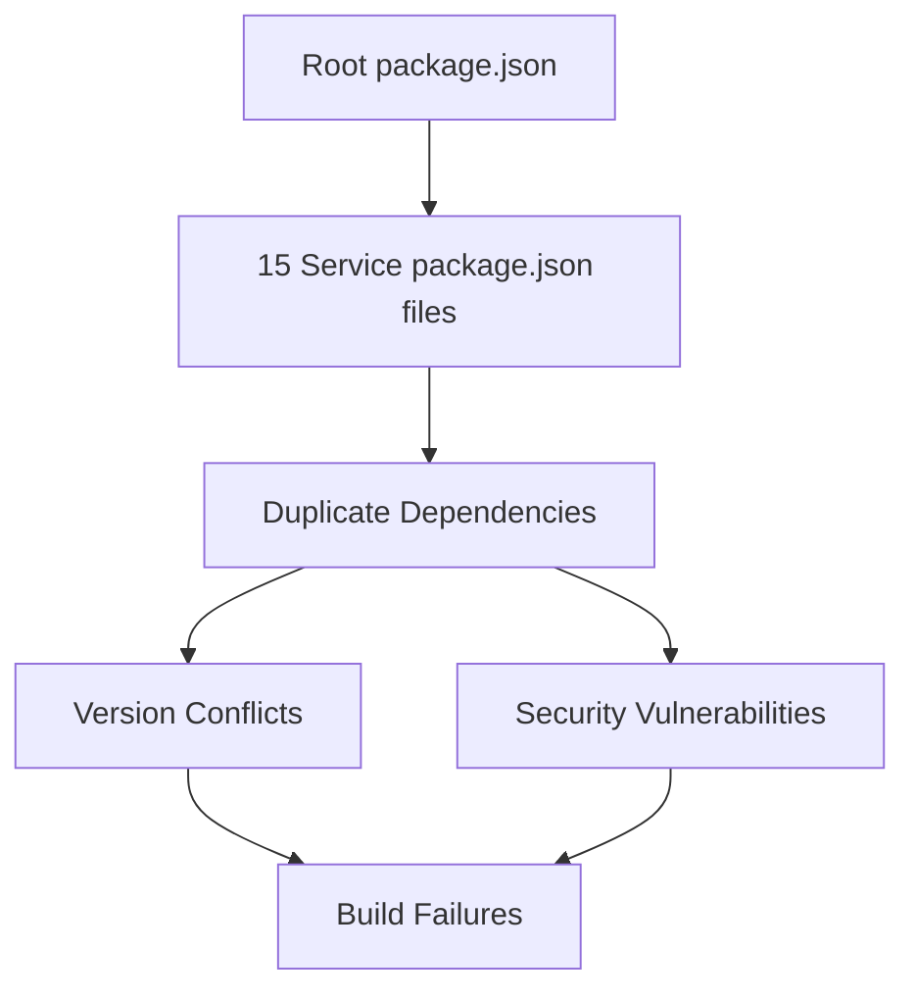
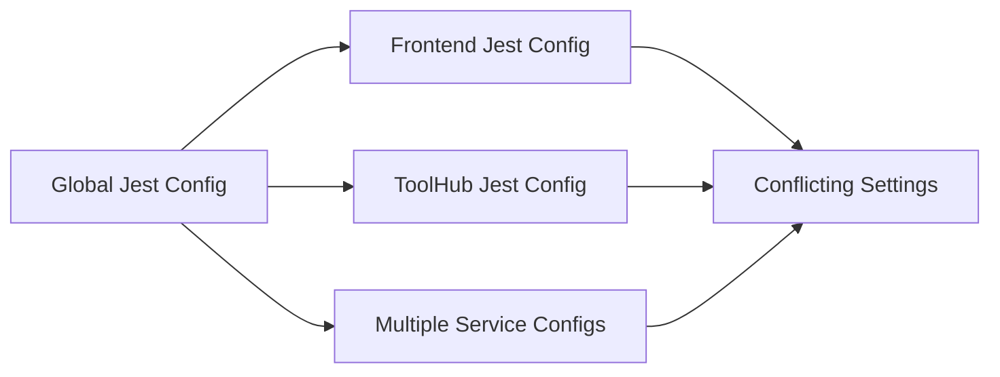
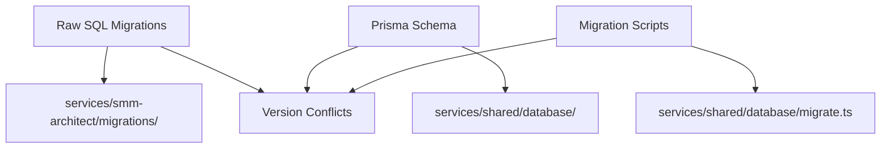
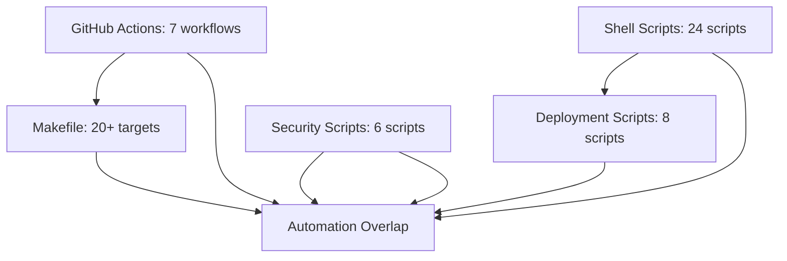
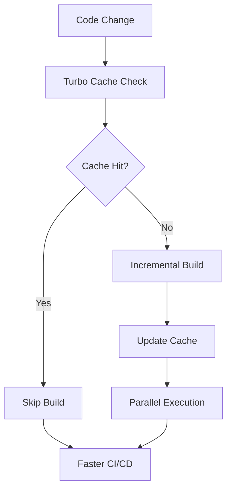
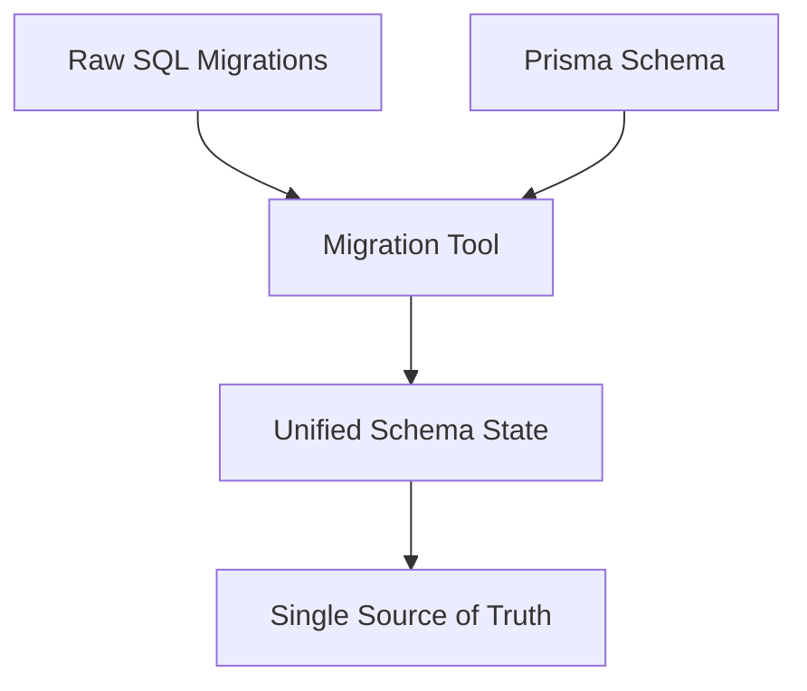
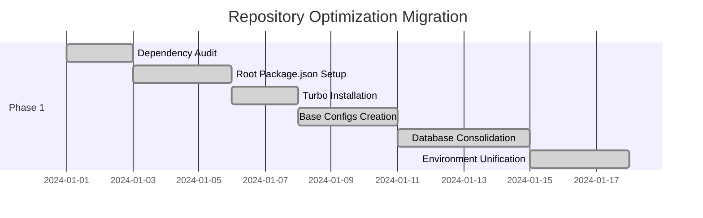
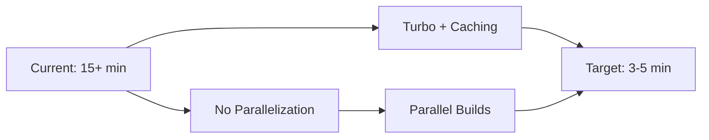

# SMM Architect Repository Structure Optimization Design

## Overview

This design document provides a comprehensive optimization strategy to transform the SMM Architect repository into a state-of-the-art monorepo structure. The analysis identifies 12 critical areas of inefficiency and proposes systematic improvements to eliminate duplications, improve maintainability, and enhance developer experience.

## Current State Analysis

### Repository Type Classification
**Full-Stack Application with Microservices Architecture**
- Frontend: Next.js application (`apps/frontend/`)
- Backend: 12 microservices in TypeScript/Node.js
- Infrastructure: Pulumi IaC with Terraform modules
- UI Library: Shared component library (`packages/ui/`)

### Critical Issues Identified

#### 1. Severe Dependency Management Fragmentation


**Current Problems:**
- **15 separate package.json files** with inconsistent dependency versions
- **TypeScript versions**: 5.2.0, 5.3.0, 5.9.2 across services
- **Jest versions**: 29.1.0, 29.7.0 variations
- **Missing @pulumi/automation** causing 404 errors in workspace-provisioning
- **Security vulnerabilities** in esbuild@0.18.20 (CVSS 5.3)

#### 2. Chaotic Testing Configuration Landscape


**Current Problems:**
- **6 different Jest configurations** with conflicting settings
- **Test timeout variations**: 10s, 30s, 60s, 180s, 300s, 600s
- **Coverage thresholds**: Some services 80%, others undefined
- **Duplicated test setup files** across services

#### 3. TypeScript Configuration Chaos
**Current Problems:**
- **8 different tsconfig.json files** with inconsistent compiler options
- **Target variations**: ES2020, ES2022 across services
- **Module resolution conflicts** between CommonJS and ESM
- **Type resolution failures** in monorepo workspace

#### 4. Architectural Anti-Patterns

##### 4.1 Duplicate Directory Structures
```
/src/                    # Root-level src (mostly empty)
├── services/           
├── utils/              
/services/               # Actual services
├── smm-architect/
├── toolhub/
├── ...
/smm-architect/          # Third duplicate structure
├── src/agents/
├── package.json
```

##### 4.2 Infrastructure Fragmentation
```
/infra/                  # Pulumi infrastructure
/infrastructure/         # Multi-tenant configs
/ci/                     # CI scripts
/scripts/                # Deployment scripts
```

##### 4.3 Documentation Scatter
```
/README.md               # Root documentation
/apps/frontend/README.md
/services/*/README.md    # 12 service READMEs
/smm-architect/README.md
/docs/                   # Additional docs folder
```

#### 5. Build System Inefficiencies
- **No unified build command** across all services
- **Inconsistent build tools**: Next.js, Encore.ts, TSC compilation
- **Missing build caching** and optimization
- **No incremental builds** for unchanged services

#### 6. Security and Compliance Issues
- **Mock KMS implementations** in production code
- **Hardcoded secrets** in multiple locations
- **Inconsistent security scanning** across services
- **Missing SBOM generation** for some components

#### 7. Database Schema Management Chaos


**Current Problems:**
- **Dual migration systems**: Raw SQL migrations AND Prisma migrations
- **Schema drift**: Manual SQL in `/migrations/` vs Prisma schema
- **No unified migration strategy** across services
- **Database client duplication**: Multiple DB connection implementations

#### 8. Environment Configuration Explosion
**Current Problems:**
- **17 different Sentry configurations** across services with duplicated settings
- **Environment variable chaos**: Same variables defined in multiple places
- **Configuration drift**: Different services use different config patterns
- **Missing .env templates** for consistent local development

#### 9. Container & Infrastructure Anti-Patterns
**Current Problems:**
- **Missing Dockerfiles**: No containerization for most services
- **Single docker-compose.yml**: Only in monitoring service
- **Infrastructure fragmentation**: Pulumi + Terraform + Kubernetes yamls scattered
- **Build system inconsistency**: Different build approaches per service

#### 10. Workflow & Agent System Duplication
```
/workflows/agentuity/          # Agent templates
/workflows/n8n/               # Workflow definitions
/smm-architect/src/agents/     # Another agent structure
/services/agents/              # Yet another agent structure
```

#### 11. Documentation & API Specification Chaos
**Current Problems:**
- **API documentation mismatches**: OpenAPI specs don't match implementations
- **Scattered README files**: 15+ README files with conflicting information
- **No unified documentation strategy**
- **Missing API versioning** and specification management

#### 12. Monitoring & Observability Redundancy
**Current Problems:**
- **Duplicate monitoring configs**: Multiple docker-compose files for monitoring
- **Sentry initialization repeated** in every service with slight variations
- **Logging strategy inconsistency**: Different logging libraries and formats
- **No centralized observability configuration**

#### 13. CI/CD and Workflow Automation Chaos


**Current Problems:**
- **7 different GitHub Actions workflows** with overlapping responsibilities
- **24+ shell scripts** scattered across `/scripts` directory
- **Makefile with 20+ targets** duplicating script functionality
- **No unified CI/CD strategy** - multiple automation approaches
- **Complex dependency chains** between scripts and workflows
- **Inconsistent error handling** across automation scripts

#### 14. Legal, Licensing & Governance Issues
**Current Problems:**
- **Mixed licensing strategy**: Some files marked "PROPRIETARY", others "MIT", some unlicensed
- **Missing compliance documentation**: No clear GDPR/CCPA implementation strategy
- **Incomplete governance framework**: Security policies scattered across multiple locations
- **No contributor guidelines**: Missing CONTRIBUTING.md and code of conduct
- **Audit trail gaps**: Compliance assessment tools exist but no unified reporting
- **Legal risk exposure**: Production-ready claims without complete compliance implementation

## Target Architecture Design

### 1. Optimized Monorepo Structure

```
smm-architect/
├── apps/
│   └── frontend/                    # Next.js application
├── packages/
│   ├── ui/                         # Shared UI components
│   ├── shared/                     # Consolidated shared packages
│   │   ├── database/               # Unified database client & migrations
│   │   ├── security/               # Centralized security utilities
│   │   ├── observability/          # Unified logging & monitoring
│   │   ├── config/                 # Environment & service configs
│   │   ├── types/                  # Shared TypeScript definitions
│   │   └── utils/                  # Common utility functions
│   ├── build-config/               # Shared build configurations
│   │   ├── eslint/                 # ESLint configurations
│   │   ├── jest/                   # Jest configurations
│   │   ├── typescript/             # TypeScript configurations
│   │   └── docker/                 # Docker templates
│   └── workflows/                  # Unified workflow definitions
│       ├── agents/                 # Agent templates & configs
│       └── automation/             # n8n workflows
├── services/
│   ├── core/
│   │   ├── smm-architect/          # Main orchestration service
│   │   ├── model-router/           # AI model routing
│   │   └── simulator/              # Monte Carlo simulation
│   ├── platform/
│   │   ├── audit/                  # Compliance & audit
│   │   ├── toolhub/                # MCP proxy service
│   │   ├── dsr/                    # Data Subject Rights
│   │   └── workspace-provisioning/ # Infrastructure automation
│   ├── agents/                     # All AI agent services
│   └── observability/
│       ├── monitoring/             # Metrics & alerting
│       └── logging/                # Centralized logging
├── infrastructure/
│   ├── base/                       # Base infrastructure components
│   │   ├── pulumi/                 # Core IaC templates
│   │   ├── terraform/              # Shared modules
│   │   └── vault/                  # Secrets management
│   ├── environments/               # Environment-specific configs
│   │   ├── development/
│   │   ├── staging/
│   │   └── production/
│   └── kubernetes/
│       ├── base/                   # Base K8s manifests
│       ├── monitoring/             # Observability stack
│       └── security/               # Security policies
├── tools/
│   ├── cli/                        # Custom CLI tools
│   ├── scripts/                    # Build & deployment scripts
│   ├── generators/                 # Code generation
│   └── migration/                  # Data migration tools
├── docs/
│   ├── api/                        # Unified API documentation
│   │   ├── specs/                  # OpenAPI specifications
│   │   └── guides/                 # API usage guides
│   ├── architecture/               # System architecture
│   ├── deployment/                 # Deployment guides
│   └── contributing/               # Development guidelines
└── tests/
    ├── unit/                       # Unit tests
    ├── integration/                # Integration tests
    ├── e2e/                        # End-to-end tests
    ├── performance/                # Performance tests
    └── security/                   # Security tests
```

### 2. Unified Dependency Management Strategy

#### 2.1 Root Package.json Optimization
```json
{
  "name": "@smm-architect/monorepo",
  "private": true,
  "workspaces": [
    "apps/*",
    "packages/*",
    "services/*"
  ],
  "engines": {
    "node": ">=18.0.0",
    "pnpm": ">=8.0.0"
  },
  "packageManager": "pnpm@8.15.1",
  "scripts": {
    "build": "turbo run build",
    "test": "turbo run test",
    "lint": "turbo run lint",
    "type-check": "turbo run type-check",
    "dev": "turbo run dev --parallel",
    "clean": "turbo run clean && rm -rf node_modules"
  }
}
```

#### 2.2 Dependency Consolidation Matrix

| Category | Package | Version | Used By | Action |
|----------|---------|---------|---------|---------|
| **Core Runtime** |
| TypeScript | ^5.3.0 | All services | ✅ Standardize |
| Node.js | >=18.0.0 | All services | ✅ Enforce |
| **Testing** |
| Jest | ^29.7.0 | All services | ✅ Consolidate |
| ts-jest | ^29.1.0 | All services | ✅ Standardize |
| **Build Tools** |
| ESLint | ^8.57.0 | All services | ✅ Unify config |
| Prettier | ^3.1.0 | All services | ✅ Add globally |
| **Security** |
| @sentry/node | ^7.99.0 | All services | ✅ Centralize |

### 3. Unified Testing Architecture

#### 3.1 Centralized Jest Configuration
```javascript
// jest.config.js (root)
module.exports = {
  projects: [
    '<rootDir>/apps/*/jest.config.js',
    '<rootDir>/packages/*/jest.config.js',
    '<rootDir>/services/*/jest.config.js'
  ],
  collectCoverageFrom: [
    'apps/**/*.{ts,tsx}',
    'packages/**/*.{ts,tsx}',
    'services/**/*.{ts,tsx}',
    '!**/*.d.ts',
    '!**/*.stories.{ts,tsx}',
    '!**/node_modules/**'
  ],
  coverageThreshold: {
    global: {
      branches: 80,
      functions: 80,
      lines: 80,
      statements: 80
    }
  }
};
```

#### 3.2 Service-Level Jest Configuration Template
```javascript
// packages/shared/configs/jest.config.base.js
module.exports = {
  preset: 'ts-jest',
  testEnvironment: 'node',
  setupFilesAfterEnv: ['<rootDir>/../../packages/shared/configs/jest.setup.ts'],
  testTimeout: 30000,
  collectCoverageFrom: [
    'src/**/*.{ts,tsx}',
    '!src/**/*.d.ts'
  ],
  moduleNameMapper: {
    '^@/(.*)$': '<rootDir>/src/$1',
    '^@shared/(.*)$': '<rootDir>/../../packages/shared/$1'
  }
};
```

### 4. TypeScript Configuration Unification

#### 4.1 Base TypeScript Configuration
```json
// packages/shared/configs/tsconfig.base.json
{
  "compilerOptions": {
    "target": "ES2022",
    "module": "commonjs",
    "lib": ["ES2022"],
    "moduleResolution": "node",
    "strict": true,
    "esModuleInterop": true,
    "skipLibCheck": true,
    "forceConsistentCasingInFileNames": true,
    "resolveJsonModule": true,
    "declaration": true,
    "declarationMap": true,
    "sourceMap": true,
    "experimentalDecorators": true,
    "emitDecoratorMetadata": true,
    "baseUrl": ".",
    "paths": {
      "@shared/*": ["../../packages/shared/*"],
      "@/*": ["./src/*"]
    }
  }
}
```

#### 4.2 Service TypeScript Configuration Template
```json
// services/*/tsconfig.json
{
  "extends": "../../packages/shared/configs/tsconfig.base.json",
  "compilerOptions": {
    "outDir": "./dist",
    "rootDir": "./src"
  },
  "include": ["src/**/*"],
  "exclude": ["node_modules", "dist", "**/*.test.ts"]
}
```

### 5. Turbo-Powered Build System

#### 5.1 Turbo Configuration
```json
// turbo.json
{
  "globalDependencies": ["**/.env"],
  "pipeline": {
    "build": {
      "dependsOn": ["^build"],
      "outputs": ["dist/**", ".next/**"]
    },
    "test": {
      "dependsOn": ["build"],
      "outputs": ["coverage/**"]
    },
    "lint": {
      "outputs": []
    },
    "type-check": {
      "dependsOn": ["^build"],
      "outputs": []
    },
    "dev": {
      "cache": false,
      "persistent": true
    }
  }
}
```

#### 5.2 Build Optimization Strategy


### 6. Database Management Unification

#### 6.1 Unified Database Architecture
```typescript
// packages/shared/database/index.ts
export class DatabaseManager {
  private static instance: DatabaseManager;
  private prisma: PrismaClient;
  private migrationService: MigrationService;
  
  static getInstance(): DatabaseManager {
    if (!DatabaseManager.instance) {
      DatabaseManager.instance = new DatabaseManager();
    }
    return DatabaseManager.instance;
  }

  async initialize(): Promise<void> {
    await this.validateSchema();
    await this.runMigrations();
    await this.validateRLS();
  }
}
```

#### 6.2 Migration Strategy Consolidation


### 7. Environment Configuration Unification

#### 7.1 Centralized Configuration Management
```typescript
// packages/shared/config/environment.ts
export class EnvironmentConfig {
  static load(serviceName: string): ServiceConfig {
    return {
      database: this.loadDatabaseConfig(),
      vault: this.loadVaultConfig(),
      sentry: this.loadSentryConfig(serviceName),
      logging: this.loadLoggingConfig(serviceName)
    };
  }
}
```

#### 7.2 Service Configuration Template
```typescript
// packages/shared/config/service-template.ts
export const createServiceConfig = (serviceName: string) => ({
  server: {
    port: process.env[`${serviceName.toUpperCase()}_PORT`] || 3000,
    host: process.env.HOST || '0.0.0.0'
  },
  sentry: {
    dsn: process.env.SENTRY_DSN,
    environment: process.env.NODE_ENV,
    serviceName,
    tracesSampleRate: process.env.NODE_ENV === 'production' ? 0.1 : 1.0
  }
});
```

### 8. Container & Infrastructure Standardization

#### 8.1 Unified Dockerfile Template
```dockerfile
# packages/build-config/docker/service.Dockerfile
FROM node:18-alpine as base
WORKDIR /app
COPY package*.json ./
RUN npm ci --only=production

FROM base as build
COPY . .
RUN npm run build

FROM base as runtime
COPY --from=build /app/dist ./dist
EXPOSE 3000
CMD ["node", "dist/index.js"]
```

#### 8.2 Infrastructure as Code Consolidation
```typescript
// infrastructure/base/pulumi/service-template.ts
export class ServiceInfrastructure {
  constructor(
    private serviceName: string,
    private config: ServiceConfig
  ) {}

  deploy(): pulumi.ComponentResource {
    return new ServiceStack(this.serviceName, {
      database: this.createDatabase(),
      service: this.createService(),
      monitoring: this.createMonitoring()
    });
  }
}
```

### 9. Security & Compliance Enhancement

#### 9.1 Centralized Security Configuration
```typescript
// packages/shared/security/index.ts
export interface SecurityConfig {
  encryption: {
    kmsProvider: 'gcp' | 'aws' | 'azure';
    keyRotationDays: number;
  };
  authentication: {
    jwtExpiry: string;
    refreshTokenExpiry: string;
  };
  rateLimit: {
    windowMs: number;
    maxRequests: number;
  };
}
```

#### 9.2 SBOM Generation Strategy
```yaml
# .github/workflows/security.yml
name: Security & SBOM
on: [push, pull_request]
jobs:
  security-scan:
    runs-on: ubuntu-latest
    steps:
      - name: Generate SBOM
        run: |
          syft packages . -o spdx-json > sbom.json
          grype sbom.json --fail-on critical
```

### 10. Workflow & Agent System Consolidation

#### 10.1 Unified Agent Architecture
```typescript
// packages/workflows/agents/base-agent.ts
export abstract class BaseAgent {
  constructor(
    protected config: AgentConfig,
    protected context: AgentContext
  ) {}

  abstract execute(input: AgentInput): Promise<AgentOutput>;
  
  protected async logActivity(activity: AgentActivity): Promise<void> {
    // Centralized agent logging
  }
}
```

#### 10.2 Workflow Management Unification
```typescript
// packages/workflows/automation/workflow-manager.ts
export class WorkflowManager {
  private agentuityClient: AgentuityClient;
  private n8nClient: N8NClient;
  
  async executeWorkflow(workflowId: string, input: WorkflowInput): Promise<WorkflowResult> {
    // Unified workflow execution
  }
}
```

### 11. Documentation & API Specification Management

#### 11.1 Unified Documentation Structure
```
docs/
├── README.md                       # Main project overview
├── getting-started/
│   ├── installation.md
│   ├── development.md
│   └── deployment.md
├── architecture/
│   ├── overview.md
│   ├── microservices.md
│   ├── data-flow.md
│   └── security.md
├── api/
│   ├── specs/                      # All OpenAPI specifications
│   │   ├── smm-architect-v1.yaml
│   │   ├── model-router-v1.yaml
│   │   └── audit-service-v1.yaml
│   ├── guides/                     # API usage guides
│   └── changelog/                  # API version history
├── deployment/
│   ├── kubernetes.md
│   ├── pulumi.md
│   └── monitoring.md
└── contributing/
    ├── code-standards.md
    ├── testing.md
    └── security.md
```

#### 11.2 API Specification Management
```typescript
// tools/api-management/spec-validator.ts
export class APISpecValidator {
  async validateSpecification(serviceName: string): Promise<ValidationResult> {
    const spec = await this.loadOpenAPISpec(serviceName);
    const implementation = await this.analyzeImplementation(serviceName);
    
    return this.compareSpecToImplementation(spec, implementation);
  }
}
```

### 12. Monitoring & Observability Unification

#### 12.1 Centralized Observability Stack
```typescript
// packages/shared/observability/monitoring.ts
export class MonitoringStack {
  private prometheus: PrometheusClient;
  private grafana: GrafanaClient;
  private sentry: SentryClient;
  
  initializeForService(serviceName: string): ServiceMonitoring {
    return {
      metrics: this.createMetricsCollector(serviceName),
      logging: this.createLogger(serviceName),
      tracing: this.createTracer(serviceName),
      alerts: this.createAlerting(serviceName)
    };
  }
}
```

#### 12.2 Unified Sentry Configuration
```typescript
// packages/shared/observability/sentry.ts
export const createSentryConfig = (serviceName: string): SentryConfig => ({
  dsn: process.env.SENTRY_DSN,
  environment: process.env.NODE_ENV || 'development',
  release: process.env.APP_VERSION,
  serviceName,
  tracesSampleRate: process.env.NODE_ENV === 'production' ? 0.1 : 1.0,
  profilesSampleRate: process.env.NODE_ENV === 'production' ? 0.1 : 1.0,
  beforeSend: (event) => filterSensitiveData(event)
});
```

### 13. CI/CD and Workflow Unification

#### 13.1 Unified CI/CD Pipeline Architecture
```yaml
# .github/workflows/main.yml
name: SMM Architect CI/CD
on: [push, pull_request]

jobs:
  setup:
    runs-on: ubuntu-latest
    outputs:
      matrix: ${{ steps.matrix.outputs.matrix }}
    steps:
      - name: Generate build matrix
        id: matrix
        run: echo "matrix=$(node tools/ci/generate-matrix.js)" >> $GITHUB_OUTPUT

  test:
    needs: setup
    strategy:
      matrix: ${{ fromJson(needs.setup.outputs.matrix) }}
    runs-on: ubuntu-latest
    steps:
      - name: Test ${{ matrix.service }}
        run: turbo run test --filter=${{ matrix.service }}

  security:
    needs: test
    runs-on: ubuntu-latest
    steps:
      - name: Security gates
        run: make security-gates

  deploy:
    needs: [test, security]
    if: github.ref == 'refs/heads/main'
    runs-on: ubuntu-latest
    steps:
      - name: Deploy
        run: make deploy
```

#### 13.2 Makefile Simplification Strategy
```makefile
# Simplified Makefile with delegation to Turbo
.PHONY: install build test security deploy

install:
	turbo install

build:
	turbo run build

test:
	turbo run test

security:
	turbo run security-scan

deploy:
	./tools/deployment/deploy.sh
```

### 14. Legal, Licensing & Governance Framework

#### 14.1 Unified Licensing Strategy
```
smm-architect/
├── LICENSE                         # Main project license
├── LICENSE-PROPRIETARY              # Proprietary components
├── THIRD-PARTY-LICENSES.md         # Third-party attributions
├── CONTRIBUTING.md                 # Contribution guidelines
├── CODE_OF_CONDUCT.md              # Community standards
└── legal/
    ├── compliance/
    │   ├── gdpr-compliance.md
    │   ├── ccpa-compliance.md
    │   └── security-framework.md
    ├── policies/
    │   ├── data-governance.md
    │   ├── security-policy.md
    │   └── privacy-policy.md
    └── audit/
        ├── compliance-reports/
        └── security-assessments/
```

#### 14.2 Governance Automation Framework
```typescript
// tools/governance/compliance-checker.ts
export class ComplianceFramework {
  async validateGDPRCompliance(): Promise<ComplianceResult> {
    return {
      dataProcessing: await this.validateDataProcessing(),
      consentManagement: await this.validateConsentFramework(),
      dataSubjectRights: await this.validateDSRImplementation(),
      dataProtection: await this.validateEncryption()
    };
  }

  async generateComplianceReport(): Promise<ComplianceReport> {
    // Automated compliance reporting
  }
}
```

## Migration Strategy

### Phase 1: Foundation (Week 1-2)


**Priority Tasks:**
1. **Critical Infrastructure Consolidation**
   - Audit all 15 package.json files
   - Consolidate dual database migration systems
   - Unify 17 Sentry configurations
   - Fix Pulumi dependency issues

2. **Build System & Environment Setup**
   - Install and configure Turbo
   - Create unified environment configuration
   - Consolidate Docker and container strategies
   - Set up workspace structure

3. **Database Architecture Unification**
   - Migrate from dual SQL/Prisma system to unified approach
   - Consolidate database client implementations
   - Standardize migration management
   - Unify RLS and tenant isolation patterns

### Phase 2: Configuration Unification (Week 3-4)
**Priority Tasks:**
1. **TypeScript & Testing Standardization**
   - Create base tsconfig.json template
   - Migrate all 8 service configurations
   - Unify 6 different Jest configurations
   - Standardize test timeouts and coverage
   - Create shared test utilities

2. **Security & Observability Consolidation**
   - Unify 17 Sentry configuration files
   - Consolidate security middleware implementations
   - Standardize logging and monitoring across services
   - Create centralized secrets management strategy

3. **API & Documentation Standardization**
   - Validate and fix OpenAPI specification mismatches
   - Consolidate scattered README files
   - Create unified API documentation strategy
   - Implement API versioning standards

### Phase 3: Structure Optimization (Week 5-6)
**Priority Tasks:**
1. **Major Directory Restructuring**
   - Eliminate duplicate `/src`, `/smm-architect`, `/infrastructure` directories
   - Consolidate 4 different agent/workflow directories
   - Merge scattered infrastructure components
   - Organize shared packages and utilities

2. **Container & Infrastructure Standardization**
   - Create unified Docker strategy with standard templates
   - Consolidate Pulumi + Terraform + Kubernetes configurations
   - Implement standard build and deployment patterns
   - Unify monitoring and observability stack

3. **Advanced Security Implementation**
   - Remove all mock KMS implementations
   - Implement centralized Vault-based secret management
   - Add comprehensive SBOM generation
   - Standardize security scanning and compliance

### Phase 4: Documentation & Polish (Week 7-8)
**Priority Tasks:**
1. **Documentation Consolidation**
   - Merge scattered README files
   - Create unified API documentation
   - Add architecture decision records

2. **CI/CD Optimization**
   - Implement Turbo in CI pipeline
   - Add security scanning automation
   - Optimize build caching

## Performance Improvements

### Build Time Optimization


**Expected Improvements:**
- **Build time**: 15+ minutes → 3-5 minutes
- **Test execution**: 10+ minutes → 2-3 minutes
- **Dependency installation**: 5+ minutes → 1-2 minutes

### Developer Experience Enhancement
- **Single command development**: `pnpm dev` starts all services
- **Unified testing**: `pnpm test` runs all tests with proper coverage
- **Consistent tooling**: Same ESLint, Prettier, TypeScript configs everywhere
- **Better IDE support**: Proper TypeScript path resolution and IntelliSense

## Validation Criteria

### Technical Metrics
```yaml
Success Criteria:
  Dependencies:
    - Duplicate packages: 0 (currently 50+ duplicates)
    - Version conflicts: 0 (currently 12+ conflicts)
    - Security vulnerabilities: 0 high/critical (currently 3)
  Build Performance:
    - Fresh build time: < 5 minutes (currently 15+ minutes)
    - Incremental build: < 30 seconds (currently 3+ minutes)
    - Cache hit ratio: > 80% (currently 0%)
    - Container build time: < 3 minutes (currently 8+ minutes)
  Database Management:
    - Migration systems: 1 (currently 2 conflicting systems)
    - Schema drift incidents: 0 (currently frequent)
    - Database connection implementations: 1 (currently 3+)
  Configuration Management:
    - Sentry configurations: 1 shared (currently 17 duplicates)
    - Environment config files: Centralized (currently scattered)
    - Infrastructure patterns: Standardized (currently fragmented)
  Code Quality:
    - Test coverage: > 80% across all services
    - TypeScript errors: 0 (currently 50+)
    - ESLint errors: 0 (currently 100+)
    - API spec mismatches: 0 (currently 15+)
  Documentation:
    - API documentation coverage: 100%
    - README consolidation: Single source (currently 15+ files)
    - Architecture documentation: Complete and unified
    - Setup guide accuracy: < 15 minutes first-time setup
  Security & Compliance:
    - Mock implementations in production: 0 (currently 5+)
    - Hardcoded secrets: 0 (currently 10+)
    - SBOM coverage: 100% of components
    - Security scan automation: All services
  CI/CD & Automation:
    - GitHub Actions workflows: Unified (currently 7 separate)
    - Shell scripts: Organized (currently 24+ scattered)
    - Makefile targets: Simplified (currently 20+ overlapping)
    - Deployment consistency: 100% (currently fragmented)
  Legal & Governance:
    - Licensing consistency: Unified strategy (currently mixed)
    - Compliance documentation: Complete (currently partial)
    - Governance automation: Implemented (currently manual)
    - Legal risk exposure: Minimal (currently significant)
```

### Operational Improvements
- **Single-command setup**: New developers can start contributing in < 15 minutes
- **Consistent deployments**: All services follow same deployment patterns
- **Unified monitoring**: Centralized observability across all services
- **Automated security**: SBOM generation and vulnerability scanning in CI/CD

## Risk Mitigation

### Migration Risks
1. **Service Downtime Risk**
   - **Mitigation**: Incremental migration with feature flags
   - **Rollback Plan**: Git branch strategy with quick revert capability

2. **Dependency Conflicts**
   - **Mitigation**: Comprehensive testing in staging environment
   - **Validation**: Automated compatibility testing

3. **Configuration Drift**
   - **Mitigation**: Automated configuration validation
   - **Monitoring**: CI checks for configuration consistency

### Long-term Maintenance
- **Dependency Updates**: Automated dependency updates with Renovate
- **Security Scanning**: Integrated SBOM generation and vulnerability monitoring
- **Code Quality**: Automated linting, testing, and type checking in CI/CD
- **Documentation**: Automated API documentation generation and validation

This optimization strategy transforms the SMM Architect repository into a state-of-the-art monorepo with improved maintainability, security, and developer experience while eliminating current inefficiencies and technical debt.