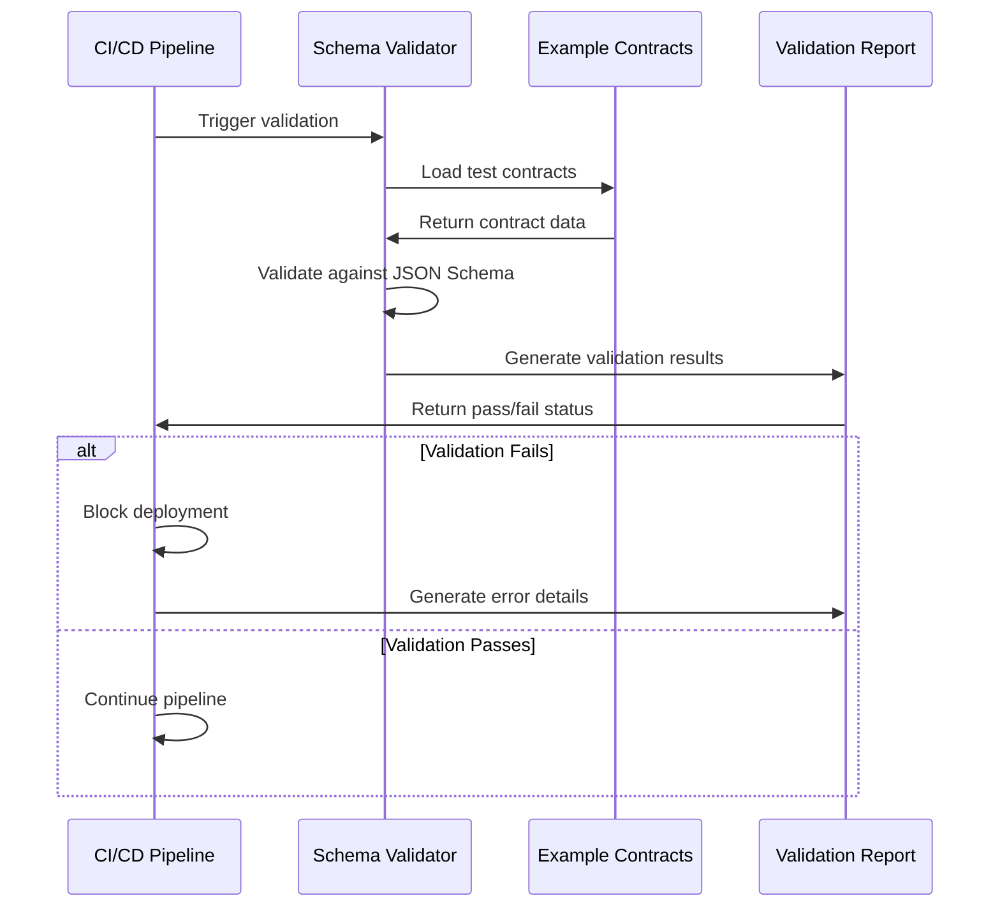

# QA & Validation of Core Systems Design

## Overview

This document outlines the comprehensive quality assurance and validation strategy for the SMM Architect autonomous marketing platform. The system has progressed beyond conceptual implementation and requires rigorous operational verification, integration testing, observability, and production rollout preparation.

The platform consists of interconnected components including JSON schemas (WorkspaceContract, BrandTwin, DecisionCard), AI agents (Research, Planner, Creative, Automation, Legal, Publisher), Monte Carlo simulation engine, policy enforcement via OPA, and infrastructure-as-code provisioning via Pulumi.

## Technology Stack & Dependencies

- **Schemas**: JSON Schema validation for WorkspaceContract, BrandTwin, DecisionCard
- **Simulation Engine**: TypeScript-based Monte Carlo engine with seedrandom for deterministic results
- **Agent Framework**: Blueprint-based agents with standardized I/O schemas
- **Policy Engine**: Open Policy Agent (OPA) with Rego rules
- **Infrastructure**: Pulumi IaC templates for multi-tenant workspace provisioning
- **Security**: HashiCorp Vault integration for secrets management and audit signing
- **Orchestration**: n8n workflows, MCP protocol, ToolHub integration
- **Testing**: JSON Schema validators, deterministic simulation testing

## QA Architecture

### Validation Pipeline Structure

``mermaid
graph TB
    A[Schema Validation] --> B[Agent Output Verification]
    B --> C[Simulation Verification]
    C --> D[Policy Enforcement Tests]
    D --> E[Infrastructure Dry Run]
    E --> F[Integration Testing]
    F --> G[Security & Compliance]
    G --> H[Observability Validation]
    H --> I[Production Readiness]
    
    subgraph "Core Validations"
        A1[WorkspaceContract Schema]
        A2[BrandTwin Schema]
        A3[DecisionCard Schema]
        A --> A1
        A --> A2
        A --> A3
    end
    
    subgraph "Agent Blueprints"
        B1[Research Agent]
        B2[Planner Agent] 
        B3[Creative Agent]
        B4[Automation Agent]
        B5[Legal Agent]
        B6[Publisher Agent]
        B --> B1
        B --> B2
        B --> B3
        B --> B4
        B --> B5
        B --> B6
    end
    
    subgraph "Simulation Tests"
        C1[Fixed Seed Determinism]
        C2[Edge Case Scenarios]
        C3[Budget Limit Testing]
        C4[Consent Violation Testing]
        C --> C1
        C --> C2
        C --> C3
        C --> C4
    end
```

### Test Environment Topology

``mermaid
graph LR
    subgraph "Development"
        DEV[Dev Environment]
        UNIT[Unit Tests]
        LINT[Schema Lint]
    end
    
    subgraph "Staging"
        STAGE[Staging Environment]
        INT[Integration Tests]
        E2E[End-to-End Tests]
    end
    
    subgraph "Production"
        PROD[Production Environment]
        SMOKE[Smoke Tests]
        MONITOR[Monitoring]
    end
    
    DEV --> STAGE
    STAGE --> PROD
    
    subgraph "Ephemeral"
        EPH1[Pulumi Test Workspace 1]
        EPH2[Pulumi Test Workspace 2]
        EPH3[Pulumi Test Workspace N]
    end
    
    STAGE --> EPH1
    STAGE --> EPH2
    STAGE --> EPH3
```

## Immediate Improvements (High Priority)

### Contract Immutability & Migration Testing

**Problem**: Signed audit bundles must map to immutable contract snapshots. Contract changes after signing break audit traceability.

**Solution**: Enhanced AuditBundle schema with immutability tracking:

``json
{
  "auditBundleId": "audit-12345",
  "contractSnapshot": {
    "contractId": "ws-contract-v1.2.3",
    "previousContractRef": "ws-contract-v1.2.2",
    "isImmutableSnapshot": true,
    "contractChangeLog": [
      {
        "version": "v1.2.3",
        "changedBy": "user-123",
        "changedAt": "2024-01-15T10:30:00Z",
        "changes": ["budget.weeklyCap updated", "connector added"]
      }
    ]
  },
  "signatureMetadata": {
    "contractHashAtSigning": "sha256:abc123...",
    "signedAt": "2024-01-15T10:35:00Z"
  }
}
```

**CI Test Implementation**:
- Negative test: Attempt to mutate signed contract, assert verification fails
- Positive test: Contract versioning creates new immutable snapshot
- Hash verification: Ensure audit bundle references correct contract hash

### Deterministic Simulator Regression Testing

**Baseline Storage**: `tests/simulator/baseline/icblabs-seed42.json`

``json
{
  "testConfig": {
    "workspaceId": "ws-test-001",
    "randomSeed": 42,
    "iterations": 1000,
    "baselineVersion": "v1.0.0"
  },
  "expectedResults": {
    "readinessScore": {
      "mean": 0.847,
      "stdDev": 0.123,
      "p50": 0.851,
      "p95": 0.934,
      "p99": 0.967
    },
    "policyPassPct": {
      "mean": 0.923,
      "tolerance": 0.001
    },
    "citationCoverage": {
      "mean": 0.834,
      "tolerance": 0.002
    },
    "duplicationRisk": {
      "mean": 0.156,
      "tolerance": 0.001
    },
    "costEstimate": {
      "mean": 1247.32,
      "tolerance": 0.50
    }
  }
}
```

**CI Job**: `simulate-regression`
- Run Monte Carlo with seed=42 on standard test workspace
- Compare results against baseline within tolerance
- Fail if any metric deviates beyond threshold
- Generate regression report for investigation

### Property-Based Testing for Monte Carlo

**Invariant Testing with fast-check**:

``typescript
// Monotonicity: Increased budget should never increase cost risk
fc.assert(fc.property(
  fc.integer(100, 10000), // budget1
  fc.integer(100, 10000), // budget2
  (budget1, budget2) => {
    if (budget1 < budget2) {
      const risk1 = calculateCostRisk(budget1, workspace);
      const risk2 = calculateCostRisk(budget2, workspace);
      return risk1 >= risk2; // Higher budget = lower risk
    }
    return true;
  }
));

// Convergence: More iterations should reduce confidence interval width
fc.assert(fc.property(
  fc.integer(100, 500),  // iterations1
  fc.integer(501, 1000), // iterations2
  (iter1, iter2) => {
    const results1 = runSimulation({iterations: iter1, seed: 42});
    const results2 = runSimulation({iterations: iter2, seed: 42});
    return results2.confidenceInterval.width <= results1.confidenceInterval.width;
  }
));
```

### Contract Testing for External APIs

**ToolHub Contract Tests (Pact)**:

``typescript
// Provider: ToolHub
// Consumer: SMM Architect
const pact = new Pact({
  consumer: 'smm-architect',
  provider: 'toolhub'
});

// Vector search contract
pact.addInteraction({
  state: 'vector database has content',
  uponReceiving: 'a vector search request',
  withRequest: {
    method: 'POST',
    path: '/api/v1/search',
    headers: {'Content-Type': 'application/json'},
    body: {
      query: like('marketing strategy'),
      limit: like(10),
      threshold: like(0.8)
    }
  },
  willRespondWith: {
    status: 200,
    headers: {'Content-Type': 'application/json'},
    body: {
      results: eachLike({
        id: like('doc-123'),
        score: like(0.92),
        content: like('Marketing strategy content...'),
        metadata: like({source: 'trusted'})
      }),
      latency_ms: like(150)
    }
  }
});
```

### Chaos Engineering for Connector Failures

**Fault Injection Scenarios**:

``typescript
// Test: Token expiry cascade
const chaosTest = {
  name: 'connector-token-expiry',
  scenario: [
    {step: 1, mock: '401 Unauthorized', platform: 'linkedin'},
    {step: 2, mock: '429 Rate Limited', platform: 'linkedin'},
    {step: 3, mock: '200 Success', platform: 'linkedin'}
  ],
  expectedBehavior: {
    retries: 3,
    backoffStrategy: 'exponential',
    fallbackActivated: true,
    decisionCardGenerated: true,
    auditTrailComplete: true
  }
};

// Assertion: System handles graceful degradation
assert(publisherAgent.handleTokenExpiry() === 'FALLBACK_TO_BROWSER');
assert(decisionCard.recommendations.includes('reconnect_linkedin'));
```

### Model Evaluation & Drift Detection

**Golden Dataset Testing**:

``json
{
  "modelEvaluationSuite": {
    "testCases": [
      {
        "input": {
          "prompt": "Generate LinkedIn post about AI trends",
          "brandVoice": "professional, thought-leadership",
          "constraints": {"maxLength": 3000, "includeHashtags": true}
        },
        "expectedOutput": {
          "contentQuality": "> 0.8",
          "brandAlignment": "> 0.85",
          "hashtagCount": "3-5",
          "callToActionPresent": true
        },
        "humanLabel": "approved"
      }
    ],
    "evaluationMetrics": {
      "bleuScore": "> 0.7",
      "rougeScore": "> 0.75",
      "humanApprovalRate": "> 0.9",
      "brandViolationRate": "< 0.05"
    }
  }
}
```

**Model Swap Canary Testing**:
- Route 5% traffic to new model
- Monitor quality delta over 24 hours
- Auto-rollback if quality drops > 5%
- Human-in-the-loop review for edge cases

### End-to-End Security Testing

**Automated Security Pipeline**:

```
# .github/workflows/security.yml
security-scan:
  runs-on: ubuntu-latest
  steps:
    - name: Git Secrets Scan
      run: git-secrets --scan
    - name: SAST Analysis
      run: snyk code test
    - name: Dependency Scan
      run: snyk test
    - name: Container Security
      run: snyk container test
    - name: Infrastructure Security
      run: snyk iac test
```

**Pre-Launch Pentest Checklist**:
- [ ] Authentication bypass attempts
- [ ] Authorization privilege escalation
- [ ] Input validation and injection attacks
- [ ] Session management vulnerabilities
- [ ] API rate limiting and abuse prevention
- [ ] Secrets exposure in logs/responses
- [ ] Multi-tenant data isolation verification

## Schema Validation Framework

### JSON Schema Validation Pipeline

**WorkspaceContract Validation**
- Validate against 50+ example contracts covering all lifecycle states
- Test edge cases: empty goals array, invalid currency codes, expired contracts
- Validate nested objects: connectors, consentRecords, signedBy metadata
- Test required field enforcement and optional field handling

**BrandTwin Schema Validation**
- Validate brand asset references and metadata completeness
- Test brand voice consistency parameters
- Validate social media account mappings and permissions
- Test brand guideline constraint enforcement

**DecisionCard Schema Validation**
- Validate readiness score calculations and threshold compliance
- Test policy violation reporting accuracy
- Validate audit trail completeness and signature verification
- Test decision recommendation logic and risk assessment

### CI/CD Integration Points



## Agent Output Verification

### Blueprint Testing Framework

Each agent blueprint requires verification in isolated test workspaces:

**Research Agent Verification**
- Input: Market research query, competitor analysis request
- Expected Output: Structured research report with citations, source credibility scores
- Validation: Citation coverage ≥ 80%, source quality score ≥ 0.7, no hallucinated references

**Planner Agent Verification** 
- Input: Campaign objectives, budget constraints, timeline requirements
- Expected Output: Detailed campaign plan with resource allocation and milestones
- Validation: Budget allocation within limits, timeline feasibility, goal alignment scoring

**Creative Agent Verification**
- Input: Brand guidelines, content requirements, platform specifications
- Expected Output: Content variations with metadata scoring
- Validation: Brand alignment ≥ 0.8, platform optimization ≥ 0.8, content quality scoring

**Legal Agent Verification**
- Input: Content draft, consent requirements, regulatory constraints
- Expected Output: Legal compliance assessment and risk mitigation recommendations
- Validation: Consent coverage completeness, regulatory gap identification, risk scoring accuracy

**Publisher Agent Verification**
- Input: Approved content, platform scheduling requirements, audience targeting
- Expected Output: Publication schedule with platform-specific optimizations
- Validation: Platform API compatibility, scheduling conflict resolution, audience targeting accuracy

### Agent Output Schema Enforcement

``mermaid
graph TD
    A[Agent Blueprint] --> B[Test Workspace]
    B --> C[Execute Agent]
    C --> D[Capture Output]
    D --> E[Schema Validation]
    E --> F{Valid Schema?}
    F -->|Yes| G[Content Quality Check]
    F -->|No| H[Schema Error Report]
    G --> I{Quality Threshold?}
    I -->|Pass| J[Integration Test]
    I -->|Fail| K[Quality Error Report]
    J --> L{End-to-End Success?}
    L -->|Pass| M[Agent Verified]
    L -->|Fail| N[Integration Error Report]
```

## Simulation Verification Framework

### Monte Carlo Engine Testing

**Deterministic Seeding Verification**
- Fixed seed: `42` for all CI/CD test runs
- Expected: Identical readiness scores across multiple runs
- Tolerance: 0.001% variance in final results
- Verification: Compare mean, standard deviation, quantiles across runs

**Edge Case Simulation Scenarios**

| Scenario | Test Conditions | Expected Behavior |
|----------|----------------|-------------------|
| Max Budget | weeklyCap: $50,000, hardCap: $200,000 | Cost risk escalation, conservative recommendations |
| Missing Consent | No voice_likeness consent | Policy violations detected, workflow blocked |
| High Duplication Risk | Content similarity > 0.8 | Duplication warnings, alternative content suggestions |
| Connector Degraded | All platforms status: "degraded" | Reduced technical readiness, fallback recommendations |
| Zero Budget | weeklyCap: $0 | Simulation fails with budget constraint error |

**Performance Benchmarking**
- Simulation runs: 1,000 iterations in < 30 seconds
- Memory usage: < 512MB for standard workspace
- Convergence testing: Early termination within 500 iterations for stable scenarios

### Simulation Results Validation

``mermaid
graph TB
    A[Monte Carlo Input] --> B[Simulation Engine]
    B --> C[Results Analysis]
    C --> D[Statistical Validation]
    D --> E{Results Valid?}
    E -->|Yes| F[Confidence Intervals]
    E -->|No| G[Statistical Error]
    F --> H[Decision Thresholds]
    H --> I{Threshold Met?}
    I -->|Yes| J[Approve for Production]
    I -->|No| K[Recommend Optimization]
    
    subgraph "Validation Checks"
        D1[Mean within bounds]
        D2[Standard deviation reasonable]
        D3[No extreme outliers]
        D4[Distribution normality]
        D --> D1
        D --> D2
        D --> D3
        D --> D4
    end
```

## Policy Enforcement Testing

### OPA Rule Verification

**Consent Policy Testing**
- Test Case: Missing required consent records
- Expected: Workflow blocked with specific violation details
- Validation: Error message contains consent type and requirement details

**Connector Status Testing**  
- Test Case: All connectors in "revoked" status
- Expected: Technical readiness score < 0.3, recommendation to reconnect
- Validation: Policy evaluation returns correct block/allow decision

**Budget Compliance Testing**
- Test Case: Campaign cost exceeds weekly cap
- Expected: Budget violation detected, alternative budget allocation suggested
- Validation: OPA rule correctly calculates budget utilization

### Policy Rule Coverage Matrix

| Rule Category | Test Scenarios | Pass Criteria |
|--------------|----------------|---------------|
| Consent Rules | 12 consent type combinations | 100% accurate allow/deny decisions |
| Budget Rules | 8 budget constraint scenarios | Correct cost calculations and limits |
| Connector Rules | 6 connector status combinations | Proper technical readiness scoring |
| Content Rules | 10 content compliance scenarios | Accurate policy violation detection |

## Infrastructure Dry Run Testing

### Pulumi IaC Deployment Testing

**Ephemeral Environment Provisioning**
- Create test tenant workspaces using Pulumi templates
- Validate resource provisioning: VPC, subnets, EKS cluster, RDS, Redis
- Test multi-AZ deployment for high availability configurations
- Verify resource tagging and cost allocation accuracy

**Vault/KMS Integration Testing**
- Test dynamic secret generation for each workspace
- Validate KMS key creation and rotation policies
- Test audit bundle signing with workspace-specific keys
- Verify secret retrieval and token renewal processes

**Resource Cleanup Verification**
- Ensure complete resource destruction after testing
- Validate no orphaned resources or security groups
- Test billing impact and cost optimization

### Integration Testing Pipeline

``mermaid
sequenceDiagram
    participant CI as CI Pipeline
    participant Pulumi as Pulumi Engine
    participant AWS as AWS Resources
    participant Vault as HashiCorp Vault
    participant Test as Test Suite
    
    CI->>Pulumi: Deploy test workspace
    Pulumi->>AWS: Provision infrastructure
    AWS->>Pulumi: Resource confirmation
    Pulumi->>Vault: Configure secrets
    Vault->>Pulumi: Secret policies created
    Pulumi->>CI: Deployment complete
    CI->>Test: Run integration tests
    Test->>AWS: Validate resources
    Test->>Vault: Test secret retrieval
    Test->>CI: Report results
    CI->>Pulumi: Destroy test workspace
    Pulumi->>AWS: Clean up resources
```

## External Integration Verification

### n8n Workflow Testing
- Test campaign execution workflows in staging mode
- Validate error handling and retry mechanisms
- Test webhook integrations and data transformation

### MCP Protocol Integration
- Validate agent communication protocol compliance
- Test message serialization and deserialization
- Verify authentication and authorization flows

### ToolHub Integration
- Test vector search performance (p95 < 200ms SLO)
- Validate API rate limiting and retry logic  
- Test tool discovery and execution workflows

## Security & Compliance Validation

### Secrets Safety Scanning
- Repository secret scanning using git-secrets and detect-secrets
- Validate Vault token lifecycle and rotation
- Test ephemeral token expiration and renewal

### Audit Traceability Verification
- Every DecisionCard linked to signed audit bundle
- Cryptographic signature verification for all decisions
- Audit trail completeness and tamper detection

### Policy Coverage Assessment
- Test all consent type scenarios and edge cases
- Validate connector status policy enforcement
- Test budget constraint and overspend prevention

## Observability & Monitoring Framework

### Metrics Dashboard Requirements

**Connector Health Metrics**
- Platform connection status and health scores
- OAuth token expiration and renewal tracking
- API rate limit utilization and throttling events

**Agent Performance Metrics**
- Job execution latency by agent type (target: < 60s start time)
- Success/failure rates and error categorization
- Resource utilization and cost per execution

**Simulation Performance Metrics**
- Monte Carlo execution time (target: p95 < 30s for small workflows)
- Memory usage and convergence statistics
- Deterministic result verification and variance tracking

**Budget Usage Metrics**
- Real-time budget utilization tracking
- Weekly and monthly spend analysis
- Budget threshold alerts and overspend prevention

### Alert Configuration

``mermaid
graph TD
    A[Monitoring System] --> B[Metrics Collection]
    B --> C[Threshold Evaluation]
    C --> D{Alert Condition?}
    D -->|Yes| E[Alert Manager]
    D -->|No| F[Continue Monitoring]
    E --> G[Notification Channels]
    G --> H[Slack Alerts]
    G --> I[PagerDuty Escalation]
    G --> J[Email Notifications]
    
    subgraph "Alert Types"
        K[Canary Failures]
        L[Budget Overspend]
        M[Connector Degradation]
        N[Agent Job Failures]
        O[Policy Violations]
    end
    
    E --> K
    E --> L
    E --> M
    E --> N
    E --> O
```

### Centralized Logging Strategy

**Log Correlation Requirements**
- Trace ID propagation across all agents and services
- Workspace ID and tenant ID tagging for multi-tenant isolation
- Structured logging with consistent field naming

**Log Aggregation Pipeline**
- Centralized collection via Fluentd or Filebeat
- Storage in Elasticsearch or CloudWatch Logs
- Retention policies: 30 days for debug, 1 year for audit

## Production Readiness Checklist

### Pre-Production Validation
- [ ] All schema validation tests pass with 100% coverage
- [ ] Agent blueprints verified in test workspaces with expected output schemas
- [ ] Monte Carlo simulations produce deterministic results with fixed seeds
- [ ] All OPA policy "deny" cases tested and verified
- [ ] Pulumi IaC successfully provisions ephemeral test environments
- [ ] Vault/KMS integration verified for dynamic secrets and audit signing
- [ ] External integrations (n8n, MCP, ToolHub) tested in staging mode
- [ ] End-to-end workflow completed: contract → simulation → decision → audit

### Multi-Tenant Deployment Preparation
- [ ] Tenant-specific namespace provisioning via Pulumi
- [ ] Vault policies and KMS keys configured per tenant
- [ ] Resource isolation and security boundary validation
- [ ] Golden example WorkspaceContracts seeded for each tenant
- [ ] Billing and cost allocation verification

### Final Production Validation
- [ ] Security review completed with no critical findings
- [ ] CI/CD pipeline passes all automated tests
- [ ] Deterministic simulation audits completed successfully
- [ ] Performance benchmarks met for all SLOs
- [ ] Disaster recovery procedures tested and documented
- [ ] Monitoring dashboards and alerting configured
- [ ] Documentation updated and team training completed

### Success Criteria Definition

| Component | Success Metric | Target | Validation Method |
|-----------|---------------|---------|-------------------|
| Schema Validation | Pass rate | 100% | Automated CI tests |
| Agent Output | Schema compliance | 100% | Blueprint verification |
| Simulation Engine | Deterministic results | < 0.001% variance | Fixed seed testing |
| Policy Enforcement | Correct deny decisions | 100% | OPA rule testing |
| Infrastructure | Deployment success | 99.9% | Pulumi dry runs |
| Security | Zero critical findings | 0 | Security scan results |
| Performance | SLO compliance | 100% | Load testing results |

This comprehensive QA & validation framework ensures the autonomous marketing platform meets production readiness standards with robust testing, monitoring, and compliance verification across all core systems.

```

## Agent Output Verification

### Blueprint Testing Framework

Each agent blueprint requires verification in isolated test workspaces:

**Research Agent Verification**
- Input: Market research query, competitor analysis request
- Expected Output: Structured research report with citations, source credibility scores
- Validation: Citation coverage ≥ 80%, source quality score ≥ 0.7, no hallucinated references

**Planner Agent Verification** 
- Input: Campaign objectives, budget constraints, timeline requirements
- Expected Output: Detailed campaign plan with resource allocation and milestones
- Validation: Budget allocation within limits, timeline feasibility, goal alignment scoring

**Creative Agent Verification**
- Input: Brand guidelines, content requirements, platform specifications
- Expected Output: Content variations with metadata scoring
- Validation: Brand alignment ≥ 0.8, platform optimization ≥ 0.8, content quality scoring

**Legal Agent Verification**
- Input: Content draft, consent requirements, regulatory constraints
- Expected Output: Legal compliance assessment and risk mitigation recommendations
- Validation: Consent coverage completeness, regulatory gap identification, risk scoring accuracy

**Publisher Agent Verification**
- Input: Approved content, platform scheduling requirements, audience targeting
- Expected Output: Publication schedule with platform-specific optimizations
- Validation: Platform API compatibility, scheduling conflict resolution, audience targeting accuracy

### Agent Output Schema Enforcement

``mermaid
graph TD
    A[Agent Blueprint] --> B[Test Workspace]
    B --> C[Execute Agent]
    C --> D[Capture Output]
    D --> E[Schema Validation]
    E --> F{Valid Schema?}
    F -->|Yes| G[Content Quality Check]
    F -->|No| H[Schema Error Report]
    G --> I{Quality Threshold?}
    I -->|Pass| J[Integration Test]
    I -->|Fail| K[Quality Error Report]
    J --> L{End-to-End Success?}
    L -->|Pass| M[Agent Verified]
    L -->|Fail| N[Integration Error Report]
```

## Simulation Verification Framework

### Monte Carlo Engine Testing

**Deterministic Seeding Verification**
- Fixed seed: `42` for all CI/CD test runs
- Expected: Identical readiness scores across multiple runs
- Tolerance: 0.001% variance in final results
- Verification: Compare mean, standard deviation, quantiles across runs

**Edge Case Simulation Scenarios**

| Scenario | Test Conditions | Expected Behavior |
|----------|----------------|-------------------|
| Max Budget | weeklyCap: $50,000, hardCap: $200,000 | Cost risk escalation, conservative recommendations |
| Missing Consent | No voice_likeness consent | Policy violations detected, workflow blocked |
| High Duplication Risk | Content similarity > 0.8 | Duplication warnings, alternative content suggestions |
| Connector Degraded | All platforms status: "degraded" | Reduced technical readiness, fallback recommendations |
| Zero Budget | weeklyCap: $0 | Simulation fails with budget constraint error |

**Performance Benchmarking**
- Simulation runs: 1,000 iterations in < 30 seconds
- Memory usage: < 512MB for standard workspace
- Convergence testing: Early termination within 500 iterations for stable scenarios

### Simulation Results Validation

``mermaid
graph TB
    A[Monte Carlo Input] --> B[Simulation Engine]
    B --> C[Results Analysis]
    C --> D[Statistical Validation]
    D --> E{Results Valid?}
    E -->|Yes| F[Confidence Intervals]
    E -->|No| G[Statistical Error]
    F --> H[Decision Thresholds]
    H --> I{Threshold Met?}
    I -->|Yes| J[Approve for Production]
    I -->|No| K[Recommend Optimization]
    
    subgraph "Validation Checks"
        D1[Mean within bounds]
        D2[Standard deviation reasonable]
        D3[No extreme outliers]
        D4[Distribution normality]
        D --> D1
        D --> D2
        D --> D3
        D --> D4
    end
```

## Policy Enforcement Testing

### OPA Rule Verification

**Consent Policy Testing**
- Test Case: Missing required consent records
- Expected: Workflow blocked with specific violation details
- Validation: Error message contains consent type and requirement details

**Connector Status Testing**  
- Test Case: All connectors in "revoked" status
- Expected: Technical readiness score < 0.3, recommendation to reconnect
- Validation: Policy evaluation returns correct block/allow decision

**Budget Compliance Testing**
- Test Case: Campaign cost exceeds weekly cap
- Expected: Budget violation detected, alternative budget allocation suggested
- Validation: OPA rule correctly calculates budget utilization

### Policy Rule Coverage Matrix

| Rule Category | Test Scenarios | Pass Criteria |
|--------------|----------------|---------------|
| Consent Rules | 12 consent type combinations | 100% accurate allow/deny decisions |
| Budget Rules | 8 budget constraint scenarios | Correct cost calculations and limits |
| Connector Rules | 6 connector status combinations | Proper technical readiness scoring |
| Content Rules | 10 content compliance scenarios | Accurate policy violation detection |

## Infrastructure Dry Run Testing

### Pulumi IaC Deployment Testing

**Ephemeral Environment Provisioning**
- Create test tenant workspaces using Pulumi templates
- Validate resource provisioning: VPC, subnets, EKS cluster, RDS, Redis
- Test multi-AZ deployment for high availability configurations
- Verify resource tagging and cost allocation accuracy

**Vault/KMS Integration Testing**
- Test dynamic secret generation for each workspace
- Validate KMS key creation and rotation policies
- Test audit bundle signing with workspace-specific keys
- Verify secret retrieval and token renewal processes

**Resource Cleanup Verification**
- Ensure complete resource destruction after testing
- Validate no orphaned resources or security groups
- Test billing impact and cost optimization

### Integration Testing Pipeline

``mermaid
sequenceDiagram
    participant CI as CI Pipeline
    participant Pulumi as Pulumi Engine
    participant AWS as AWS Resources
    participant Vault as HashiCorp Vault
    participant Test as Test Suite
    
    CI->>Pulumi: Deploy test workspace
    Pulumi->>AWS: Provision infrastructure
    AWS->>Pulumi: Resource confirmation
    Pulumi->>Vault: Configure secrets
    Vault->>Pulumi: Secret policies created
    Pulumi->>CI: Deployment complete
    CI->>Test: Run integration tests
    Test->>AWS: Validate resources
    Test->>Vault: Test secret retrieval
    Test->>CI: Report results
    CI->>Pulumi: Destroy test workspace
    Pulumi->>AWS: Clean up resources
```

## External Integration Verification

### n8n Workflow Testing
- Test campaign execution workflows in staging mode
- Validate error handling and retry mechanisms
- Test webhook integrations and data transformation

### MCP Protocol Integration
- Validate agent communication protocol compliance
- Test message serialization and deserialization
- Verify authentication and authorization flows

### ToolHub Integration
- Test vector search performance (p95 < 200ms SLO)
- Validate API rate limiting and retry logic  
- Test tool discovery and execution workflows

## Security & Compliance Validation

### Secrets Safety Scanning
- Repository secret scanning using git-secrets and detect-secrets
- Validate Vault token lifecycle and rotation
- Test ephemeral token expiration and renewal

### Audit Traceability Verification
- Every DecisionCard linked to signed audit bundle
- Cryptographic signature verification for all decisions
- Audit trail completeness and tamper detection

### Policy Coverage Assessment
- Test all consent type scenarios and edge cases
- Validate connector status policy enforcement
- Test budget constraint and overspend prevention

## Observability & Monitoring Framework

### Metrics Dashboard Requirements

**Connector Health Metrics**
- Platform connection status and health scores
- OAuth token expiration and renewal tracking
- API rate limit utilization and throttling events

**Agent Performance Metrics**
- Job execution latency by agent type (target: < 60s start time)
- Success/failure rates and error categorization
- Resource utilization and cost per execution

**Simulation Performance Metrics**
- Monte Carlo execution time (target: p95 < 30s for small workflows)
- Memory usage and convergence statistics
- Deterministic result verification and variance tracking

**Budget Usage Metrics**
- Real-time budget utilization tracking
- Weekly and monthly spend analysis
- Budget threshold alerts and overspend prevention

### Alert Configuration

``mermaid
graph TD
    A[Monitoring System] --> B[Metrics Collection]
    B --> C[Threshold Evaluation]
    C --> D{Alert Condition?}
    D -->|Yes| E[Alert Manager]
    D -->|No| F[Continue Monitoring]
    E --> G[Notification Channels]
    G --> H[Slack Alerts]
    G --> I[PagerDuty Escalation]
    G --> J[Email Notifications]
    
    subgraph "Alert Types"
        K[Canary Failures]
        L[Budget Overspend]
        M[Connector Degradation]
        N[Agent Job Failures]
        O[Policy Violations]
    end
    
    E --> K
    E --> L
    E --> M
    E --> N
    E --> O
```

### Centralized Logging Strategy

**Log Correlation Requirements**
- Trace ID propagation across all agents and services
- Workspace ID and tenant ID tagging for multi-tenant isolation
- Structured logging with consistent field naming

**Log Aggregation Pipeline**
- Centralized collection via Fluentd or Filebeat
- Storage in Elasticsearch or CloudWatch Logs
- Retention policies: 30 days for debug, 1 year for audit

## Production Readiness Checklist

### Pre-Production Validation
- [ ] All schema validation tests pass with 100% coverage
- [ ] Agent blueprints verified in test workspaces with expected output schemas
- [ ] Monte Carlo simulations produce deterministic results with fixed seeds
- [ ] All OPA policy "deny" cases tested and verified
- [ ] Pulumi IaC successfully provisions ephemeral test environments
- [ ] Vault/KMS integration verified for dynamic secrets and audit signing
- [ ] External integrations (n8n, MCP, ToolHub) tested in staging mode
- [ ] End-to-end workflow completed: contract → simulation → decision → audit

### Multi-Tenant Deployment Preparation
- [ ] Tenant-specific namespace provisioning via Pulumi
- [ ] Vault policies and KMS keys configured per tenant
- [ ] Resource isolation and security boundary validation
- [ ] Golden example WorkspaceContracts seeded for each tenant
- [ ] Billing and cost allocation verification

### Final Production Validation
- [ ] Security review completed with no critical findings
- [ ] CI/CD pipeline passes all automated tests
- [ ] Deterministic simulation audits completed successfully
- [ ] Performance benchmarks met for all SLOs
- [ ] Disaster recovery procedures tested and documented
- [ ] Monitoring dashboards and alerting configured
- [ ] Documentation updated and team training completed

### Success Criteria Definition

| Component | Success Metric | Target | Validation Method |
|-----------|---------------|---------|-------------------|
| Schema Validation | Pass rate | 100% | Automated CI tests |
| Agent Output | Schema compliance | 100% | Blueprint verification |
| Simulation Engine | Deterministic results | < 0.001% variance | Fixed seed testing |
| Policy Enforcement | Correct deny decisions | 100% | OPA rule testing |
| Infrastructure | Deployment success | 99.9% | Pulumi dry runs |
| Security | Zero critical findings | 0 | Security scan results |
| Performance | SLO compliance | 100% | Load testing results |

This comprehensive QA & validation framework ensures the autonomous marketing platform meets production readiness standards with robust testing, monitoring, and compliance verification across all core systems.

## Medium Priority Additions (Stability & Operations)

### Quotas & Circuit Breakers

**Per-Agent Resource Limits**:

``typescript
interface AgentQuotas {
  maxRuntimeMinutes: number;
  maxLLMTokenSpendPerHour: number;
  maxRenderJobsConcurrent: number;
  maxMemoryMB: number;
  maxDiskUsageMB: number;
}

const agentQuotas: Record<string, AgentQuotas> = {
  'creative-agent': {
    maxRuntimeMinutes: 15,
    maxLLMTokenSpendPerHour: 50000,
    maxRenderJobsConcurrent: 3,
    maxMemoryMB: 1024,
    maxDiskUsageMB: 2048
  },
  'research-agent': {
    maxRuntimeMinutes: 10,
    maxLLMTokenSpendPerHour: 30000,
    maxRenderJobsConcurrent: 1,
    maxMemoryMB: 512,
    maxDiskUsageMB: 1024
  }
};
```

**Circuit Breaker Implementation**:

``typescript
class AgentCircuitBreaker {
  private failures = 0;
  private lastFailure = 0;
  private state: 'CLOSED' | 'OPEN' | 'HALF_OPEN' = 'CLOSED';
  
  async execute<T>(operation: () => Promise<T>): Promise<T> {
    if (this.state === 'OPEN') {
      if (Date.now() - this.lastFailure > this.config.resetTimeoutMs) {
        this.state = 'HALF_OPEN';
      } else {
        throw new Error('Circuit breaker OPEN');
      }
    }
    
    try {
      const result = await operation();
      this.onSuccess();
      return result;
    } catch (error) {
      this.onFailure();
      throw error;
    }
  }
  
  private onFailure() {
    this.failures++;
    this.lastFailure = Date.now();
    if (this.failures >= this.config.failureThreshold) {
      this.state = 'OPEN';
      this.generateDecisionCard('quota_exceeded');
    }
  }
}
```

### Business-Level Smoke Checks for DecisionCards

**DecisionCard Quality Validation**:

```typescript
interface DecisionCardQualityChecks {
  hasCostBreakdown: boolean;
  hasTop3ProvenanceLinks: boolean;
  hasOneLineRiskSummary: boolean;
  hasActionableRecommendations: boolean;
  hasClearUrgencyLevel: boolean;
}

const validateDecisionCardQuality = (card: DecisionCard): DecisionCardQualityChecks => {
  return {
    hasCostBreakdown: !!card.costBreakdown && Object.keys(card.costBreakdown).length > 0,
    hasTop3ProvenanceLinks: card.provenanceLinks?.length >= 3,
    hasOneLineRiskSummary: card.riskSummary?.length > 0 && card.riskSummary.length <= 150,
    hasActionableRecommendations: card.recommendations?.length >= 1,
    hasClearUrgencyLevel: ['low', 'medium', 'high', 'critical'].includes(card.urgency)
  };
};
```

## Operational SLOs & Alert Thresholds

### Service Level Objectives

| Service Component | SLO Metric | Target | Alert Threshold |
|------------------|------------|--------|----------------|
| ToolHub Vector Search | p95 latency | < 200ms | > 300ms |
| Simulation Engine | p95 execution time | < 30s (small workflows) | > 45s |
| Agent Job Start | p95 latency | < 60s | > 90s |
| Publisher Success Rate | Availability | > 99% (24h) | < 98% |
| Budget Monitoring | Weekly cap alert | 80% threshold | 90% critical |
| Canary Health | Conversion rate | < 10% drop | > 15% drop |

**Budget Alert Configuration**:
- **80% Weekly Cap**: Warning alert to Slack
- **90% Weekly Cap**: Critical alert to PagerDuty  
- **100% Weekly Cap**: Auto-pause publishing + immediate escalation
- **Budget breach**: Generate DecisionCard for user approval

**Canary Failure Thresholds**:
- **Conversion Rate Drop > 10%**: Auto-rollback trigger
- **Negative Sentiment Delta > 15%**: Content review required
- **Error Rate > 5%**: Immediate canary termination

### CI Job Matrix Implementation

```
# .github/workflows/ci-matrix.yml
name: CI Test Matrix
on: [push, pull_request]

jobs:
  lint:
    runs-on: ubuntu-latest
    steps:
      - uses: actions/checkout@v3
      - name: ESLint
        run: npm run lint
      - name: Prettier
        run: npm run format:check
  
  unit:
    runs-on: ubuntu-latest
    steps:
      - uses: actions/checkout@v3
      - name: Jest Tests
        run: npm run test:unit
  
  schema-validate:
    runs-on: ubuntu-latest
    steps:
      - uses: actions/checkout@v3
      - name: Validate All Schemas
        run: |
          for schema in schemas/*.json; do
            ajv validate -s "$schema" -d "examples/contracts/*.json"
          done
  
  policy-test:
    runs-on: ubuntu-latest
    steps:
      - uses: actions/checkout@v3
      - name: OPA Policy Tests
        run: opa test services/policy/
  
  simulate-baseline:
    runs-on: ubuntu-latest
    steps:
      - uses: actions/checkout@v3
      - name: Run Deterministic Simulation
        run: |
          npm run test:simulate -- --seed=42 --baseline=tests/simulator/baseline/icblabs-seed42.json
  
  integration-toolhub:
    runs-on: ubuntu-latest
    steps:
      - uses: actions/checkout@v3
      - name: Contract Tests
        run: npm run test:contract
  
  security-scan:
    runs-on: ubuntu-latest
    steps:
      - uses: actions/checkout@v3
      - name: Git Secrets
        run: git-secrets --scan
      - name: Snyk Security
        run: snyk test
  
  deploy-preview:
    runs-on: ubuntu-latest
    steps:
      - uses: actions/checkout@v3
      - name: Pulumi Preview
        run: pulumi preview --stack dev
  
  qa-chaos:
    runs-on: ubuntu-latest
    if: github.event_name == 'push' && github.ref == 'refs/heads/main'
    steps:
      - uses: actions/checkout@v3
      - name: Chaos Engineering Test
        run: |
          # Deploy ephemeral workspace
          pulumi up --stack chaos-test --yes
          # Run chaos scenario
          npm run test:chaos -- --scenario=connector-token-expiry
          # Cleanup
          pulumi destroy --stack chaos-test --yes

  # Gate merges on critical tests
  gate:
    needs: [unit, schema-validate, policy-test, simulate-baseline]
    runs-on: ubuntu-latest
    steps:
      - name: All Critical Tests Passed
        run: echo "✅ All gate tests passed"
```

## Validation Test Scenarios

### Simulator Edge Cases

**A. Missing Consent Scenario**:

``json
{
  "testName": "missing-consent-synthetic-voice",
  "workspaceContract": {
    "workspaceId": "ws-test-missing-consent",
    "consentRecords": [],
    "goals": [{"key": "engagement", "target": 1000, "unit": "interactions"}]
  },
  "workflow": {
    "uses_synthetic_voice": true,
    "content_type": "video_ad"
  },
  "simulationConfig": {
    "randomSeed": 42,
    "iterations": 100
  },
  "expectedResults": {
    "policyPassPct": 0.0,
    "readinessScore": "< 0.3",
    "policyDenials": ["synthetic voice requires signed voice_likeness consent"],
    "recommendedActions": ["obtain_consent", "use_text_only"]
  }
}
```

**B. Budget Overspend Scenario**:

``json
{
  "testName": "budget-overspend-weekly-cap",
  "workspaceContract": {
    "workspaceId": "ws-test-budget-breach",
    "budget": {
      "currency": "USD",
      "weeklyCap": 100.00,
      "hardCap": 500.00
    }
  },
  "campaignEstimate": {
    "estimatedCost": 150.00,
    "confidence": 0.85
  },
  "expectedResults": {
    "policyDecision": "deny",
    "denyReason": "estimated cost ($150.00) exceeds weekly budget cap ($100.00)",
    "auditBundleContains": ["budget_violation", "cost_breakdown"],
    "recommendedActions": ["increase_weekly_cap", "reduce_campaign_scope", "defer_to_next_week"]
  }
}
```

**C. Connector Token Expiry Cascade**:

``json
{
  "testName": "connector-token-expiry-cascade",
  "mockSequence": [
    {"step": 1, "platform": "linkedin", "response": {"status": 401, "error": "token_expired"}},
    {"step": 2, "platform": "linkedin", "response": {"status": 429, "error": "rate_limited", "retry_after": 60}},
    {"step": 3, "platform": "linkedin", "response": {"status": 200, "data": {"post_id": "12345"}}}
  ],
  "expectedBehavior": {
    "retryAttempts": 3,
    "backoffStrategy": "exponential",
    "fallbackActivated": "browser_automation",
    "decisionCardGenerated": true,
    "decisionCardContent": {
      "type": "connector_health_degraded",
      "urgency": "medium",
      "recommendations": ["reconnect_linkedin", "verify_oauth_scopes"]
    }
  }
}
```

### OPA Policy Test Examples

**Consent Missing Test** (`policy/tests/consent_missing.json`):

``json
{
  "input": {
    "workflow": {
      "uses_synthetic_voice": true,
      "content_type": "audio_ad"
    },
    "workspace": {
      "workspaceId": "ws-test-001",
      "consentRecords": []
    },
    "simulation": {
      "contentRisk": 0.2
    }
  },
  "expected": {
    "allow": false,
    "deny": ["synthetic voice requires signed voice_likeness consent"],
    "code": "CONSENT_MISSING"
  }
}
```

## Incident Response Runbooks

### Budget Breach Response

```
## Runbook: Budget Breach (>100% weekly cap)

### Immediate Actions (< 5 minutes)
1. **Auto-pause publishing**: System automatically pauses all publishing for workspace
2. **Generate DecisionCard**: Create urgent DecisionCard with cost breakdown
3. **Alert stakeholders**: Notify user, ops team, and finance team
4. **Capture context**: Log spending pattern and recent campaign changes

### Investigation (< 15 minutes)
1. **Review spend history**: Check recent 7-day spending pattern
2. **Identify anomalies**: Look for unusual cost spikes or billing errors
3. **Validate calculations**: Ensure budget calculation accuracy
4. **Check for fraud**: Unusual activity patterns or unauthorized access

### Resolution Options
1. **User Override**: 
   - Require signed approval with justification
   - Create audit trail entry
   - Set temporary increased cap
2. **Budget Adjustment**:
   - Update weekly cap with business justification
   - Notify finance team for approval
3. **Campaign Modification**:
   - Reduce model quality to lower costs
   - Pause non-critical campaigns
   - Defer to next budget period

### Post-Incident (< 24 hours)
1. **Update monitoring**: Adjust alert thresholds based on learnings
2. **Improve predictions**: Enhance cost estimation accuracy
3. **Document learnings**: Add to incident knowledge base
4. **Process improvement**: Update budget management procedures
```

