# SMM Architect Autonomous Audit + Remediation Plan

**Repository:** SMM Architect (https://github.com/eipp/smm-architect)  
**Objective:** Production-readiness audit with concurrent PR-first remediation  
**Scope:** Security, reliability, compliance, quality, performance, observability, IaC  
**Execution Model:** Spec-first approval, autonomous execution, concurrent remediation

## Overview

This document outlines a comprehensive autonomous audit and remediation plan for the SMM Architect repository. The plan implements a concurrent execution model where audit activities run in parallel with remediation PR creation, ensuring rapid identification and resolution of production blockers.

### Repository Architecture Context

SMM Architect is a multi-tenant, agent-orchestrated social media marketing platform with the following key components:

- **Core Services**: smm-architect, toolhub, policy, simulator, audit  
- **Technology Stack**: TypeScript, Node.js, Encore.ts, Docker, Pulumi, OPA, Vault  
- **Testing Frameworks**: Jest, Ajv, OPA test, integration/e2e scripts  
- **Infrastructure**: Pulumi IaC, Docker containers, CI/CD pipelines  
- **Compliance**: GDPR/CCPA, audit logging, RBAC, tenant isolation

## Audit Specification

### Audit Scope Matrix

```mermaid
graph TD
    A[Audit Execution] --> B[Security Assessment]
    A --> C[Quality Validation]
    A --> D[Performance Testing]
    A --> E[Operations Review]
    A --> F[Compliance Check]
    
    B --> B1[SAST/DAST Scanning]
    B --> B2[SBOM/CVE Analysis]
    B --> B3[Secret/Config Audit]
    B --> B4[RBAC/Auth Flow Review]
    B --> B5[OPA Policy Evaluation]
    
    C --> C1[Code Coverage ≥80%]
    C --> C2[Schema Validation]
    C --> C3[Unit Test Execution]
    C --> C4[Integration Tests]
    C --> C5[E2E Test Validation]
    
    D --> D1[Load Testing]
    D --> D2[Latency Analysis]
    D --> D3[Workspace Operations]
    D --> D4[Search/Ingest Endpoints]
    D --> D5[Simulation Performance]
    
    E --> E1[CI/CD Pipeline Review]
    E --> E2[Pulumi IaC Validation]
    E --> E3[Monitoring/Alerting]
    E --> E4[Rollback Procedures]
    E --> E5[Infrastructure Drift]
    
    F --> F1[GDPR Compliance]
    F --> F2[Consent Management]
    F --> F3[Data Retention]
    F --> F4[Audit Logging]
    F --> F5[DSR Implementation]
```



### Audit Tools & Environments

| Category | Tools | Environment | Data Handling |
|----------|-------|-------------|---------------|
| **Security** | SAST (ESLint security), DAST (ZAP), Syft (SBOM), Grype (CVE) | Staging + Read-only prod | Synthetic/Anonymized |
| **Quality** | Jest, Ajv, OPA test, Docker Compose | Local + CI | Test fixtures |
| **Performance** | Artillery, k6, Lighthouse | Staging windows | Canary parameters |
| **Operations** | Pulumi CLI, Docker, GitHub Actions | Development + Staging | Configuration validation |
| **Compliance** | Custom GDPR validators, OPA rules | Staging + Mock data | Synthetic PII |

### Acceptance Criteria

#### Critical Gates (Must Pass)
- [ ] All CI/QA gates green with ≥80% test coverage
- [ ] No critical/high CVEs in dependencies
- [ ] No hardcoded secrets or credentials exposed
- [ ] All OPA policies enforced in CI pipeline
- [ ] Performance thresholds met for core operations
- [ ] IaC deployments safe with drift detection
- [ ] All webhook authentication properly implemented
- [ ] DSR cascade deletion fully functional
- [ ] KMS integration using real cryptographic operations

#### Quality Gates (Should Pass)
- [ ] Documentation up-to-date with API specifications
- [ ] Container images signed and verified
- [ ] SBOM generated for all components
- [ ] Monitoring dashboards operational
- [ ] Alerting rules validated and tested

## Audit Execution Plan

### Phase 0: Codebase Comprehension & Schema Validation

#### Full Repository Index
```bash
# Complete codebase analysis
find . -type f -name "*.ts" -o -name "*.js" -o -name "*.json" | grep -v node_modules | xargs wc -l
tree -I 'node_modules|dist|coverage' > codebase-structure.txt

# Service dependency mapping
npm list --all > dependency-tree.txt
pnpm list --depth=3 --prod > production-deps.txt

# Configuration audit
find . -name "*.config.*" -o -name ".*rc*" -o -name "*.env*" | grep -v node_modules
```

#### Schema Validation Suite
```bash
# All schema validations
ajv validate -s schemas/workspace-contract.json -d examples/workspace-contract.icblabs.json
ajv validate -s schemas/workspace-contract.json -d examples/workspace-contract.icblabs.v2.json
ajv validate -s schemas/audit-bundle.json -d reports/production-audit/audit-summary.json
ajv validate -s schemas/decision-card.json -d tests/data/sample-decision-card.json
ajv validate -s schemas/brand-twin.json -d tests/data/sample-brand-twin.json

# OpenAPI spec validation
swagger-codegen validate -i services/toolhub/openapi.yaml
redoc-cli validate services/toolhub/openapi.yaml
```

### Phase 1: Baseline Assessment (Parallel Execution)

#### Security Analysis
```bash
# SAST/DAST Scanning
npm audit --audit-level=high
./scripts/security-compliance-framework.sh
eslint --config .eslintrc.security.js src/ services/ apps/

# SBOM/CVE Analysis  
make security-scan
grype sbom/combined/smm-architect-complete-sbom.json
grype sbom/services/smm-architect-sbom.json --fail-on medium

# Secret Scanning
git-secrets --scan
truffleHog --regex --entropy=False .
grep -r "password\|secret\|key\|token" --include="*.ts" --include="*.js" .

# Authentication Flow Review
npm run test:security
npm run test -- tests/security/tenant-isolation.test.ts
npm run test -- tests/security/webhook-auth.test.ts
npm run test -- tests/security/vault-kms-verification.test.ts
```

#### Comprehensive Test Suite Execution
```bash
# All test suites as specified
npm run test:all
npm run test:security
npm run test:integration
npm run test:e2e
npm run test:performance
npm run test:chaos

# Per-service test execution
cd services/smm-architect && npm test
cd services/toolhub && npm test
cd services/policy && opa test rules.rego rules_test.rego
cd services/simulator && npm test
cd services/audit && npm test
cd services/dsr && npm test

# Docker Compose integration tests
docker-compose -f docker-compose.test.yml up --abort-on-container-exit
docker-compose -f docker-compose.yml up -d
./scripts/run-integration-tests.sh

# Encore smoke tests
cd services/smm-architect && encore test
cd services/smm-architect && encore run --env=test &
curl -f http://localhost:4000/health || exit 1
```

#### Quality Validation
```bash
# Test Coverage Analysis (≥80% requirement)
npm run test:all -- --coverage
jest --coverage --coverageThreshold='{"global":{"statements":80,"branches":80,"functions":80,"lines":80}}'

# Coverage per service
cd services/smm-architect && npm run test:coverage
cd services/toolhub && npm run test:coverage
cd apps/frontend && npm run test:coverage

# Ajv schema validation
ajv validate -s schemas/workspace-contract.json -d examples/workspace-contract.icblabs.json
ajv validate -s schemas/audit-bundle.json -d reports/production-audit/audit-summary.json

# OPA policy tests
cd services/policy && opa test --coverage policies/
cd security/policies && opa test --coverage .
```

#### Performance Baseline
```bash
# Core Operations Load Testing (Specific Endpoints)
artillery run tests/performance/workspace-create-load.yml
artillery run tests/performance/simulation-engine-load.yml
artillery run tests/performance/search-ingest-load.yml

# Staging Environment Performance Tests
artillery run --config staging-config.json tests/performance/workspace-create-load.yml
artillery run --config staging-config.json tests/performance/agent-orchestration-load.yml

# API Latency Profiling
npm run test:performance -- --timeout=30000
lighthouse http://localhost:3000 --output=json --output-path=./reports/lighthouse-audit.json
k6 run tests/performance/api-load-test.js
```

### Phase 2: Targeted Deep-Dive Analysis

#### Critical Component Focus Areas

**1. Webhook Authentication System**
- Location: `services/smm-architect/src/middleware/verify-webhook.ts`
- Issues: Mock signature implementation, missing HMAC verification
- Tests: `tests/security/webhook-auth.test.ts`

**2. KMS Integration Layer**
- Location: `services/audit/src/kms/adapters/`
- Issues: Mock signatures in production code
- Tests: `tests/security/vault-kms-verification.test.ts`

**3. DSR Implementation**
- Location: `services/dsr/src/data-subject-rights-service.ts`
- Issues: Incomplete cascade deletion across data stores
- Tests: `tests/integration/dsr-cascade.test.ts`

**4. Infrastructure Provisioning**
- Location: `services/workspace-provisioning/`
- Issues: Pulumi dependency failures blocking deployment
- Tests: `scripts/pulumi-preview.sh`

**5. Multi-Tenant Security**
- Location: `services/smm-architect/migrations/002_enable_rls.sql`
- Status: ✅ Complete with comprehensive RLS policies
- Tests: `tests/security/tenant-isolation.test.ts`

### Phase 3: Concurrent Remediation Strategy

#### Agent Behavior & Execution Model

**Autonomous Operation Rules:**
- Audit engine runs continuously while PRs are created and iterated
- Parallel sub-task execution: security, tests, performance, ops assessments
- Respect concurrency caps: max 3 performance tests, max 5 remediation PRs simultaneously
- No direct commits to default branch - all changes via PR workflow
- Human approval required before merge for all critical security fixes

**Load Test Approval Process:**
- Separate confirmation required before executing performance tests in staging
- Canary parameters used for staging environment load tests
- Performance test windows: staging-only during specified maintenance windows
- Resource usage monitoring during load tests to prevent staging environment impact

#### PR-First Workflow Pattern


#### Priority-Based Remediation Queue

**P0 - Critical Security (Immediate)**
1. **Remove Mock KMS Signatures**
   - Branch: `fix/real-kms-integration`
   - Files: `services/audit/src/services/kms-service.ts`
   - Tests: Add real AWS/GCP/Vault integration tests

2. **Implement Webhook Authentication**
   - Branch: `feat/webhook-hmac-verification`
   - Files: `services/smm-architect/src/middleware/verify-webhook.ts`
   - Tests: Add replay attack protection tests

3. **Complete DSR Cascade Logic**
   - Branch: `feat/complete-dsr-implementation`
   - Files: `services/dsr/src/data-subject-rights-service.ts`
   - Tests: Add Pinecone/S3 integration tests

**P1 - Infrastructure (Next Sprint)**
1. **Fix Pulumi Dependencies**
   - Branch: `fix/pulumi-workspace-provisioning`
   - Files: `services/workspace-provisioning/package.json`
   - Tests: Add end-to-end provisioning tests

2. **Enhance CI Security Gates**
   - Branch: `feat/enhanced-security-gates`
   - Files: `.github/workflows/ci.yml`
   - Tests: Add evil tenant and image signing validation

**P2 - Quality Improvements (Ongoing)**
1. **Update Vulnerable Dependencies**
2. **API Documentation Alignment**
3. **Enhanced Monitoring Dashboards**

## Testing Strategy

### Comprehensive Test Execution Requirements

#### Mandatory Test Suites (All Must Pass)
```bash
# Core test commands as specified
npm run test:all                    # Complete test suite
npm run test:security               # Security-focused tests including tenant isolation
npm run test:integration            # Service integration tests
npm run test:e2e                    # End-to-end workflow tests
npm run test:performance            # Performance and load tests
npm run test:chaos                  # Chaos engineering tests

# Per-service test execution
cd services/smm-architect && npm test
cd services/toolhub && npm test  
cd services/policy && opa test rules.rego rules_test.rego
cd services/simulator && npm test
cd services/audit && npm test
cd services/dsr && npm test
cd apps/frontend && npm test

# Ajv schema validation tests
ajv validate -s schemas/workspace-contract.json -d examples/workspace-contract.icblabs.json
ajv validate -s schemas/audit-bundle.json -d reports/production-audit/audit-summary.json
ajv validate -s schemas/decision-card.json -d tests/data/sample-decision-card.json

# Docker compose integration tests
docker-compose -f docker-compose.test.yml up --abort-on-container-exit
docker-compose up -d && ./scripts/run-integration-tests.sh

# Encore smoke tests
cd services/smm-architect && encore test
cd services/smm-architect && encore run --env=test
```

### Test Execution Matrix

| Test Type | Scope | Environment | Pass Criteria | Tools |
|-----------|-------|-------------|---------------|-------|
| **Unit Tests** | Individual functions | Local | Coverage ≥80% | Jest |
| **Integration Tests** | Service interactions | Docker Compose | All services healthy | Supertest |
| **Security Tests** | Tenant isolation, Auth | Staging | Zero policy violations | Custom + OPA |
| **Performance Tests** | Core operations | Staging | Latency <500ms, RPS >100 | Artillery |
| **E2E Tests** | User workflows | Staging | Complete workflow success | Playwright |
| **Chaos Tests** | Failure scenarios | Staging | Graceful degradation | Custom |

### Test Data Management

```yaml
# Test Data Configuration
test_data:
  synthetic_users:
    - tenant_id: "test-tenant-001"
      email: "[email]@example.com"
      created_at: "2024-01-01T00:00:00Z"
  
  workspace_contracts:
    - type: "simulation"
      budget_limit: 1000
      policy_constraints: ["content_safety", "budget_enforcement"]
  
  audit_bundles:
    - bundle_id: "audit-test-001"
      signature_algorithm: "ECDSA-SHA256"
      kms_provider: "vault-test"
```

### Performance Benchmarks

#### Core Operation Targets

| Operation | Latency (p95) | Throughput | Concurrency |
|-----------|---------------|------------|-------------|
| Workspace Creation | <2s | 50 ops/min | 10 concurrent |
| Campaign Simulation | <5s | 20 sims/min | 5 concurrent |
| Vector Search | <500ms | 100 req/s | 50 concurrent |
| Content Ingestion | <1s | 200 docs/min | 20 concurrent |
| Agent Orchestration | <3s | 30 workflows/min | 8 concurrent |

## Compliance & Governance

### GDPR/CCPA Compliance Checklist

#### Data Subject Rights (DSR)
- [ ] **Right to Access**: User data export API implemented
- [ ] **Right to Rectification**: Data update mechanisms functional
- [ ] **Right to Erasure**: Cascade deletion across all data stores
- [ ] **Right to Portability**: Structured data export in machine-readable format
- [ ] **Data Minimization**: Collection limited to necessary data only
- [ ] **Consent Management**: Granular consent tracking and withdrawal

#### Technical Implementation
```typescript
// DSR Service Integration Points
interface DSRImplementation {
  postgresql: {
    deletion: "CASCADE with RLS enforcement"
    anonymization: "PII field replacement"
    audit_trail: "Cryptographic proof of deletion"
  }
  
  pinecone: {
    vector_deletion: "By metadata filter tenant_id"
    embedding_removal: "Complete namespace cleanup"
  }
  
  s3_storage: {
    object_deletion: "Versioned with lifecycle policies"
    backup_annotation: "Retention policy markers"
  }
  
  logs: {
    redaction: "PII pattern replacement"
    retention: "Automated expiry per policy"
  }
}
```

### OPA Policy Enforcement

#### Policy Categories
1. **Budget Constraints**: Prevent campaign overspend
2. **Content Safety**: Block inappropriate content
3. **Data Governance**: Enforce retention and access rules
4. **Tenant Isolation**: Prevent cross-tenant data access
5. **Compliance**: Ensure regulatory requirement adherence

#### Policy Testing Framework
```bash
# OPA Policy Validation
opa test security/policies/ -v
opa fmt --list security/policies/
opa deps security/policies/budget-constraints.rego

# Integration with CI
opa test --coverage security/policies/
conftest verify --policy security/policies/ examples/workspace-contract.icblabs.json
```

## Infrastructure as Code (IaC)

### Pulumi Deployment Validation

#### Infrastructure Components
- **Workspace Provisioning**: Automated tenant resource allocation
- **Network Security**: VPC, security groups, ingress rules
- **Data Storage**: RDS, S3 buckets with encryption
- **Observability**: CloudWatch, Prometheus, Grafana
- **Secrets Management**: Vault integration with dynamic credentials

#### Deployment Safety Checks
```bash
# Pre-deployment Validation
pulumi preview --diff
pulumi policy ls
pulumi stack graph

# Drift Detection
pulumi refresh --dry-run
pulumi up --policy-pack security-policies/

# Rollback Preparation
pulumi history
pulumi cancel
pulumi destroy --target specific-resource
```

### CI/CD Pipeline Enhancement

#### Required CI Security Gates
```bash
# Block merge until all checks pass
- tests: all test suites must pass
- opa: policy validation required
- schema: Ajv validation mandatory  
- sbom: SBOM generation and CVE checks
- coverage: minimum 80% test coverage
- secrets: no hardcoded credentials
- image-signing: container signatures required

# Auto review/improve PRs
/describe  # Auto-generate PR descriptions
/review    # Automated code review
/improve   # Suggest improvements
```

#### Rollback Drill Procedures
```bash
# Database rollback testing
pg_dump production_db > backup_$(date +%Y%m%d).sql
psql -d staging_db < backup_$(date +%Y%m%d).sql

# Service rollback validation
docker tag current_image:latest previous_image:rollback
kubectl rollout undo deployment/smm-architect
kubectl rollout status deployment/smm-architect

# Pulumi infrastructure rollback
pulumi stack select staging
pulumi history
pulumi up --target-dependents=false
```

### Concurrent Remediation Targets (Specific)

#### Simulator Service Remediation
- **Monte Carlo Endpoints**: Implement probabilistic simulation APIs
- **Readiness Scoring**: Campaign deployment confidence metrics
- **Deterministic Tests**: Reproducible simulation results
- **Performance Tests**: Sub-5s simulation completion
- **Documentation**: OpenAPI spec and integration guides

#### Audit Service Remediation  
- **Bundle Assembly**: Cryptographic audit trail compilation
- **Signature Verification**: Real KMS integration (remove mocks)
- **Audit Export**: GDPR-compliant data export functionality
- **OPA Integration**: Policy violation audit logging
- **Validation Tests**: End-to-end audit bundle verification

#### Vault/Secrets Standardization
- **Secret Loading**: Consistent secret retrieval patterns
- **Dynamic Credentials**: Rotating database/API credentials
- **Secret Scanning**: CI integration with secret detection
- **Environment Parity**: Dev/staging/prod secret consistency

#### Observability Enhancement
- **Golden Signals**: Latency, traffic, errors, saturation dashboards
- **Policy Alerts**: Real-time OPA violation notifications
- **Budget Monitoring**: Campaign spend tracking and alerting
- **Agent Failure Alerts**: Multi-agent orchestration health
- **Security Dashboards**: Threat detection and compliance metrics

### Environment Configuration

```yaml
# Environment Matrix
environments:
  development:
    resources: "minimal"
    monitoring: "basic"
    policies: "permissive"
    
  staging:
    resources: "production-like"
    monitoring: "full"
    policies: "strict"
    
  production:
    resources: "enterprise"
    monitoring: "comprehensive"
    policies: "zero-tolerance"
```

## Monitoring & Observability

### Golden Signals Dashboard

#### Application Metrics
- **Latency**: Request response times across all services
- **Traffic**: Request volume and patterns
- **Errors**: Error rates and failure modes
- **Saturation**: Resource utilization and capacity

#### Business Metrics
- **Workspace Creation Rate**: New tenant onboarding velocity
- **Campaign Success Rate**: Simulation to deployment conversion
- **Agent Performance**: Task completion times and success rates
- **Policy Violations**: Security and compliance breach frequency

#### Infrastructure Metrics
- **Container Health**: CPU, memory, disk, network usage
- **Database Performance**: Query times, connection pools, locks
- **Storage Systems**: S3 performance, Pinecone query latency
- **Network**: Ingress/egress traffic, CDN performance

### Alerting Strategy

```yaml
# Alert Configuration
alerts:
  critical:
    - name: "Service Down"
      condition: "up == 0"
      duration: "1m"
      
    - name: "High Error Rate"
      condition: "rate(http_requests_total{status=~'5..'}[5m]) > 0.1"
      duration: "2m"
      
  warning:
    - name: "High Latency"
      condition: "http_request_duration_seconds > 2"
      duration: "5m"
      
    - name: "Policy Violation"
      condition: "opa_violations_total > 0"
      duration: "1m"
```

## Risk Assessment & Mitigation

### Critical Risk Matrix

| Risk Category | Impact | Probability | Mitigation Strategy | Owner |
|---------------|--------|-------------|-------------------|--------|
| **Mock KMS in Production** | High | High | Remove mocks, implement real KMS | Security Team |
| **Incomplete DSR** | High | Medium | Complete cascade deletion | Compliance Team |
| **Infrastructure Failures** | High | Medium | Fix Pulumi dependencies | DevOps Team |
| **Dependency Vulnerabilities** | Medium | High | Update vulnerable packages | Engineering |
| **Performance Degradation** | Medium | Medium | Optimize critical paths | Performance Team |

### Business Continuity

#### Disaster Recovery Procedures
1. **Data Backup**: Automated daily backups with point-in-time recovery
2. **Service Failover**: Multi-region deployment with automatic failover
3. **Communication Plan**: Stakeholder notification and status updates
4. **Recovery Time Objectives**: RTO <4 hours, RPO <1 hour

## Deliverables & Reporting

### Executive Brief Template

```markdown
# SMM Architect Security Audit - Executive Summary

**Audit Date**: [DATE]
**Overall Risk Level**: [RED/YELLOW/GREEN]
**Production Readiness**: [GO/NO-GO]
**Go/No-Go Rationale**: [EXPLICIT REASONING]

## Top Risks & Heatmap
| Risk | Severity | Business Impact | Likelihood | Mitigation Timeline |
|------|----------|----------------|------------|--------------------|
| Mock KMS in Production | Critical | Data integrity compromise | High | 30 days |
| Incomplete DSR | Critical | Regulatory non-compliance | Medium | 60 days |
| Infrastructure Gaps | High | Deployment failures | High | 45 days |

## Key Findings
- Critical Issues: [COUNT] requiring immediate attention
- High Priority: [COUNT] for next sprint resolution  
- Medium Priority: [COUNT] for ongoing improvement

## Business Impact Assessment
- Security Posture: [ASSESSMENT WITH SPECIFIC METRICS]
- Compliance Status: [GDPR/CCPA COMPLIANCE LEVEL WITH GAP ANALYSIS]
- Performance Impact: [SPECIFIC LATENCY/THROUGHPUT METRICS]
- Operational Readiness: [DEPLOYMENT/MONITORING CAPABILITY]

## Immediate Actions Required
1. [IMMEDIATE ACTION 1 WITH TIMELINE]
2. [IMMEDIATE ACTION 2 WITH OWNER]
3. [STRATEGIC INITIATIVE WITH BUDGET]

## 30/60/90-Day Remediation Plan
### 30-Day Critical Path
- Address all P0 security vulnerabilities
- Complete webhook authentication implementation
- Remove all mock KMS implementations
- Fix Pulumi infrastructure provisioning

### 60-Day Infrastructure & Compliance
- Complete DSR cascade deletion implementation
- Enhance CI/CD security gates
- Deploy comprehensive monitoring
- Achieve GDPR compliance certification

### 90-Day Production Hardening
- Complete performance optimization
- Finalize disaster recovery procedures
- Achieve SOC2 Type II readiness
- Complete security penetration testing
```

### Required Deliverable Artifacts

#### 1. Detailed Findings Report
```markdown
# Detailed Security Audit Findings

## Vulnerability Assessment
### V001 - Mock KMS Signatures (CRITICAL)
**CVSS Score**: 9.1 (Critical)
**Location**: `services/audit/src/services/kms-service.ts:118-152`
**Evidence**: [Code snippet showing mock implementation]
**Exploitation Scenario**: Attacker could forge audit bundles
**Business Risk**: Complete audit trail compromise
**Remediation Steps**: 
1. Remove mock implementations
2. Integrate real AWS/GCP/Vault KMS
3. Add integration tests
**Code Example**: [Fixed implementation]

### V002 - Incomplete DSR Implementation (CRITICAL)
**CVSS Score**: 8.7 (High)
**Location**: `services/dsr/src/data-subject-rights-service.ts`
**Evidence**: Missing Pinecone and S3 cascade deletion
**Regulatory Impact**: GDPR Article 17 non-compliance
**Remediation Timeline**: 60 days
```

#### 2. Raw Evidence Artifacts
- **Test Output Files**: `reports/test-results/`
- **SBOM Files**: `sbom/combined/smm-architect-complete-sbom.json`
- **CVE Lists**: `reports/vulnerabilities/grype-scan-results.json`
- **OPA/Ajv Logs**: `reports/policy-validation/`
- **Performance Reports**: `reports/performance/artillery-results.json`
- **Coverage Reports**: `coverage/lcov-report/index.html`

#### 3. Change Artifacts & PR Tracking
- **Active PRs**: List of all remediation PRs with status
- **Merged Changes**: Diff summaries for completed fixes
- **CI Results**: Link to all CI pipeline executions
- **Test Evidence**: Screenshots/logs proving fix validation

#### 4. Task Report Template
```markdown
# Audit Execution Task Report

## Action Flow Summary
1. **Baseline Assessment** (Completed: [DATE])
   - Codebase comprehension: [STATUS]
   - Schema validation: [STATUS] 
   - Security scanning: [STATUS]

2. **Critical Issue Identification** (Completed: [DATE])
   - 27 critical blockers identified
   - Evidence collected and documented
   - Remediation tasks created

3. **Concurrent Remediation** (In Progress: [DATE])
   - Active PRs: [COUNT]
   - Merged fixes: [COUNT]
   - Pending approval: [COUNT]

## Evidence Links
- **Test Results**: [LINK TO ARTIFACTS]
- **Security Scans**: [LINK TO REPORTS]
- **Performance Data**: [LINK TO METRICS]
- **PR Dashboard**: [LINK TO GITHUB]

## Merged/Pending PRs
| PR # | Title | Status | Critical? | CI Status |
|------|-------|--------|-----------|----------|
| #123 | Fix KMS Mock Implementation | Merged | Yes | ✅ Passed |
| #124 | Complete DSR Cascade Logic | Pending | Yes | 🟡 In Progress |
| #125 | Update Vulnerable Dependencies | Open | No | ❌ Failed |

## Standards Mapping
| Finding | NIST | ISO 27001 | GDPR Article | Remediation PR |
|---------|------|-----------|--------------|----------------|
| Mock KMS | AC-3 | A.9.4.2 | Art. 32 | #123 |
| DSR Gaps | - | A.18.1.4 | Art. 17 | #124 |
```

### Detailed Findings Report Structure

1. **Vulnerability Assessment**
   - CVSS scores and impact analysis
   - Exploitation scenarios and business risk
   - Remediation steps with code examples

2. **Code Quality Analysis**
   - Test coverage reports with gap analysis
   - Static analysis findings with recommendations
   - Architecture review with improvement suggestions

3. **Performance Analysis**
   - Benchmark results against targets
   - Bottleneck identification and optimization opportunities
   - Scalability assessment and capacity planning

4. **Compliance Validation**
   - Regulatory requirement mapping
   - Gap analysis with remediation timeline
   - Certification readiness assessment

### Change Management Artifacts

#### Pull Request Template
```markdown
## Audit Remediation PR

**Issue Type**: [Security/Quality/Performance/Compliance]
**Severity**: [Critical/High/Medium/Low]
**Relates to**: [AUDIT-FINDING-ID]

### Problem Statement
[Description of security/quality issue identified]

### Solution Approach
[High-level approach to remediation]

### Testing Evidence
- [ ] Unit tests added/updated
- [ ] Integration tests pass
- [ ] Security tests validate fix
- [ ] Performance impact assessed

### Compliance Impact
[How this change affects GDPR/CCPA compliance]

### Deployment Notes
[Special considerations for production deployment]
```

## Implementation Timeline

### Sprint Planning (2-Week Iterations)

**Sprint 1 (Weeks 1-2): Critical Security**
- Remove mock KMS implementations
- Implement webhook authentication
- Begin DSR cascade completion

**Sprint 2 (Weeks 3-4): Infrastructure & Quality**
- Fix Pulumi provisioning issues
- Update vulnerable dependencies
- Enhance CI security gates

**Sprint 3 (Weeks 5-6): Performance & Monitoring**
- Optimize critical performance paths
- Deploy comprehensive monitoring
- Complete compliance validation

**Sprint 4 (Weeks 7-8): Documentation & Hardening**
- Update API documentation
- Final security hardening
- Production readiness certification

### Continuous Monitoring

Post-audit continuous monitoring includes:
- Daily automated security scans
- Weekly dependency vulnerability checks
- Monthly compliance assessments
- Quarterly comprehensive security reviews

This autonomous audit and remediation plan ensures systematic identification and resolution of production blockers while maintaining development velocity through concurrent PR-based remediation workflows.