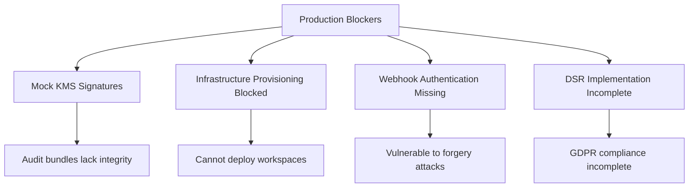
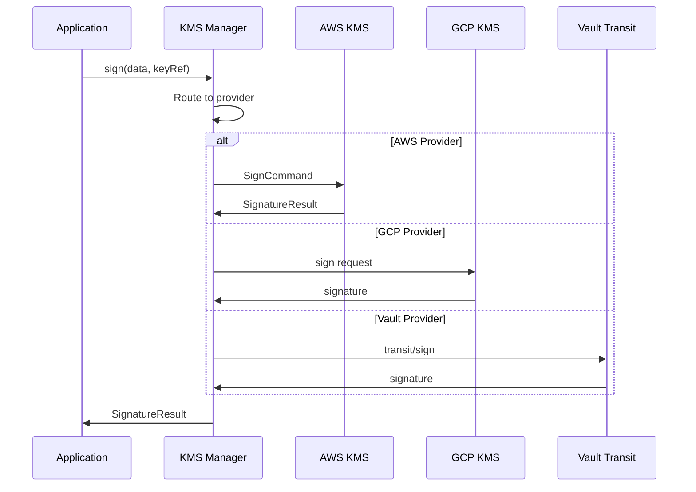
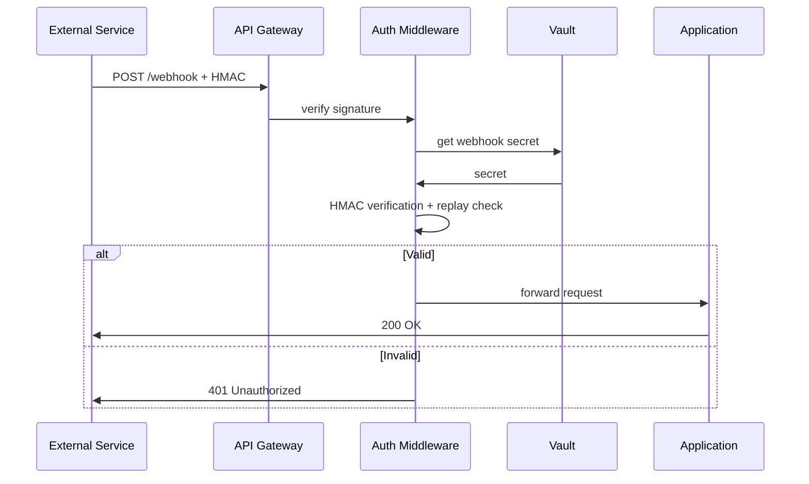
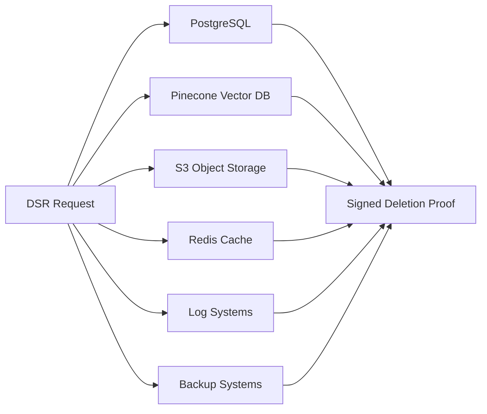
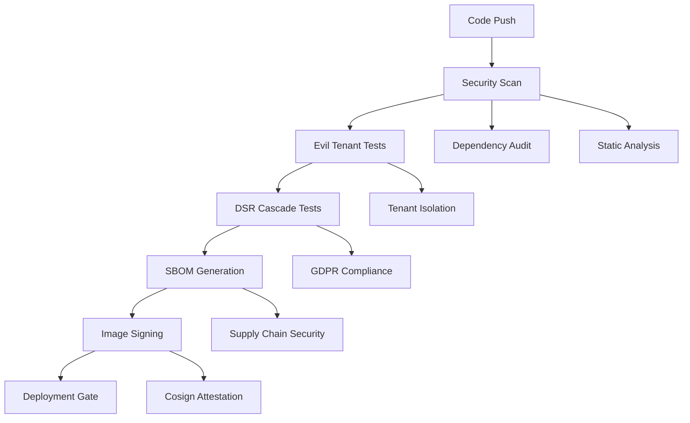
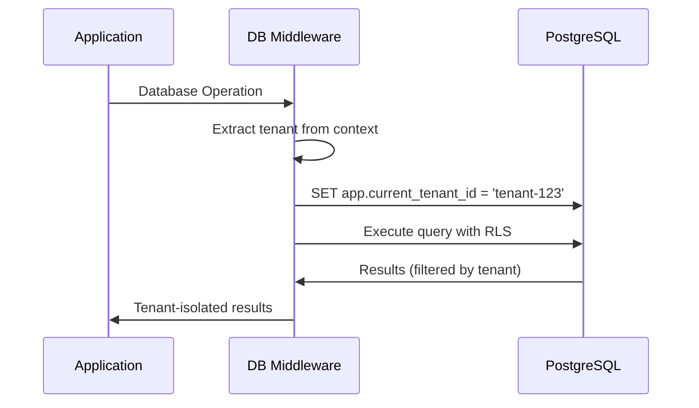
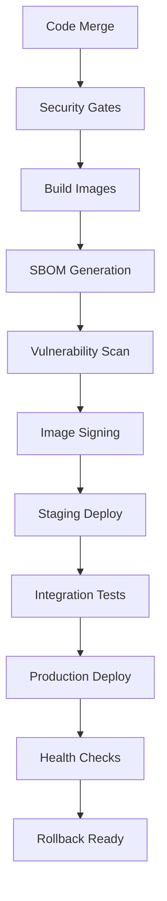

# SMM Architect Production Readiness Design

## Overview

This document outlines the comprehensive approach to achieve 100% production readiness for SMM Architect, transforming it from a feature-complete prototype to a secure, tested, and deployable enterprise platform. The design addresses critical security gaps, infrastructure automation, compliance requirements, and CI/CD hardening identified in the production audit.

## Architecture

### Current State Assessment

SMM Architect demonstrates strong foundational architecture with:
- **Multi-tenant RLS policies**: Complete tenant isolation at database level
- **Comprehensive testing framework**: Unit, integration, security, and performance tests
- **Agent orchestration**: Research, Planner, Creative, Legal, Publisher agents
- **Policy enforcement**: OPA-based governance and validation
- **Audit infrastructure**: Cryptographic signing capabilities (partial)

### Critical Production Gaps

The audit identified **4 critical blockers** preventing production deployment:



## Production Readiness Components

### 1. Cryptographic Security Infrastructure

#### KMS Integration Architecture



#### Implementation Strategy

**Files to Modify:**
- `services/audit/src/services/kms-service.ts` - Remove all mock implementations
- `services/audit/src/kms/adapters/aws.ts` - Production AWS KMS integration  
- `services/audit/src/kms/adapters/gcp.ts` - Production GCP KMS integration
- `services/audit/src/kms/adapters/vault.ts` - Enhanced Vault Transit integration

**Key Requirements:**
- **Real Cryptographic Operations**: All signature operations use actual KMS providers
- **Key Management**: Keys stored and retrieved from Vault at `secret/data/workspaces/<workspaceId>/kms_keys`
- **Algorithm Support**: RSA-2048, ECDSA P-256, EdDSA Ed25519
- **Audit Trail**: All signing operations logged with metadata

**Vault Key Schema:**
```json
{
  "signing_key": {
    "provider": "aws|gcp|vault",
    "key_id": "arn:aws:kms:...|projects/.../keys/...|transit/keys/...",
    "algorithm": "RSA_2048|ECDSA_P256|ED25519",
    "purpose": "audit_bundle_signing",
    "rotation_schedule": "90d"
  }
}
```

### 2. Webhook Authentication Security

#### Authentication Flow Architecture



#### Implementation Components

**Middleware Implementation:**
```typescript
// services/smm-architect/src/middleware/verify-webhook.ts
export interface WebhookVerificationConfig {
  secretPath: string;
  timestampTolerance: number; // seconds
  replayWindow: number; // seconds
}

export async function verifyWebhookSignature(
  req: Request,
  res: Response, 
  next: NextFunction,
  config: WebhookVerificationConfig
): Promise<void> {
  // 1. Extract signature and timestamp from headers
  // 2. Retrieve webhook secret from Vault
  // 3. HMAC-SHA256 verification with timing-safe comparison
  // 4. Timestamp validation (within tolerance window)
  // 5. Replay protection using Redis nonce store
}
```

**Security Features:**
- **HMAC-SHA256**: Cryptographically secure signature verification
- **Replay Protection**: Nonce-based prevention with sliding window
- **Timestamp Validation**: Configurable tolerance (default 300s)
- **Vault Integration**: Secrets stored per tenant/connector
- **Audit Logging**: All verification attempts logged

### 3. Data Subject Rights (DSR) Compliance

#### DSR Cascade Architecture



#### Production Integration Requirements

**Vector Database (Pinecone):**
```typescript
class PineconeClient {
  async cascadeDelete(userId: string, tenantId: string): Promise<DeletionResult> {
    // Delete by metadata filter
    const deleteResponse = await this.pinecone.delete({
      filter: {
        tenant_id: tenantId,
        user_id: userId
      }
    });
    
    return {
      recordsDeleted: deleteResponse.deleted,
      verificationHash: this.generateVerificationHash(deleteResponse)
    };
  }
}
```

**S3 Object Storage:**
```typescript
class S3Client {
  async cascadeDelete(userId: string, tenantId: string): Promise<DeletionResult> {
    // Handle versioned buckets
    const objects = await this.listObjectVersions({
      Prefix: `${tenantId}/${userId}/`
    });
    
    // Delete all versions
    for (const obj of objects.Versions) {
      await this.deleteObject({
        Key: obj.Key,
        VersionId: obj.VersionId
      });
    }
    
    return { recordsDeleted: objects.Versions.length };
  }
}
```

**Cryptographic Deletion Proof:**
```typescript
interface DeletionProof {
  proofId: string;
  userId: string;
  tenantId: string;
  deletionTimestamp: string;
  subsystemResults: SubsystemDeletionResult[];
  integrityHash: string;
  kmsSignature: string;
  verificationChain: string[];
}
```

### 4. Infrastructure Automation

#### Pulumi Integration Fix

**Root Cause:** Missing `@pulumi/automation` package causing 404 errors

**Resolution Strategy:**
```json
{
  "dependencies": {
    "@pulumi/pulumi": "^3.96.0",
    "@pulumi/aws": "^6.13.0", 
    "@pulumi/kubernetes": "^4.6.0",
    "@pulumi/gcp": "^7.5.0",
    "express": "^4.18.2"
  }
}
```

**Pulumi Automation API Integration:**
```typescript
import { LocalWorkspace, Stack } from "@pulumi/pulumi/automation";

class WorkspaceProvisioningService {
  async provisionWorkspace(config: WorkspaceConfig): Promise<ProvisioningResult> {
    const stack = await LocalWorkspace.createOrSelectStack({
      stackName: `${config.tenantId}-${config.workspaceId}`,
      projectName: "smm-workspace",
      program: async () => {
        // Define infrastructure resources
        const vpc = new aws.ec2.Vpc("workspace-vpc", {...});
        const cluster = new aws.eks.Cluster("workspace-cluster", {...});
        // Export outputs
        return { vpcId: vpc.id, clusterId: cluster.id };
      }
    });
    
    const result = await stack.up();
    return { outputs: result.outputs, resources: result.resources };
  }
}
```

### 5. CI/CD Security Gates

#### Enhanced Pipeline Architecture



#### CI Configuration

**.github/workflows/security-gates.yml:**
```yaml
name: Security Gates
on: [push, pull_request]

jobs:
  evil-tenant-test:
    runs-on: ubuntu-latest
    steps:
      - uses: actions/checkout@v4
      - run: pnpm test -- tests/security/evil-tenant.test.ts
      
  dsr-cascade-test:
    runs-on: ubuntu-latest
    services:
      postgres:
        image: postgres:14
        env:
          POSTGRES_PASSWORD: test
      redis:
        image: redis:7
    steps:
      - uses: actions/checkout@v4
      - run: pnpm test -- tests/dsr/cascade.test.ts
      
  sbom-compliance:
    runs-on: ubuntu-latest
    steps:
      - uses: actions/checkout@v4
      - name: Generate SBOM
        run: syft . -o cyclonedx-json=sbom.json
      - name: Scan vulnerabilities
        run: grype sbom.json
      - name: Sign SBOM
        run: cosign sign-blob --yes sbom.json
```

### 6. Database Tenant Context Automation

#### RLS Enforcement Middleware



**Implementation:**
```typescript
// services/shared/database/client.ts
export async function withAutomaticTenantContext<T>(
  tenantId: string,
  operation: (client: PrismaClient) => Promise<T>
): Promise<T> {
  const client = getPrismaClient();
  
  // Set tenant context
  await client.$executeRaw`SELECT set_config('app.current_tenant_id', ${tenantId}, true)`;
  
  try {
    return await operation(client);
  } finally {
    // Clear context
    await client.$executeRaw`SELECT set_config('app.current_tenant_id', '', true)`;
  }
}
```

## API Endpoints Reference

### Webhook Verification API

```typescript
POST /api/webhooks/verify
Headers:
  X-Signature: sha256=<hmac_signature>
  X-Timestamp: <unix_timestamp>
  X-Nonce: <unique_nonce>
Body: <webhook_payload>

Response:
  200: Signature verified, request processed
  401: Invalid signature or replay attack detected
  429: Rate limit exceeded
```

### KMS Signing API

```typescript
POST /api/audit/sign
{
  "bundleId": "bundle-123",
  "bundleData": { ... },
  "keyId": "workspace-signing-key-v1",
  "signedBy": "user-456"
}

Response:
{
  "signature": "base64_signature",
  "keyId": "workspace-signing-key-v1", 
  "algorithm": "RSA_2048",
  "signedAt": "2024-01-15T10:30:00Z",
  "metadata": { ... }
}
```

### DSR Cascade API

```typescript
DELETE /api/dsr/cascade/:userId
{
  "tenantId": "tenant-123",
  "scope": "user",
  "requestedBy": "admin-789",
  "reason": "GDPR Article 17 request"
}

Response:
{
  "requestId": "dsr-req-456",
  "status": "processing",
  "estimatedCompletion": "2024-01-18T10:30:00Z",
  "statusUrl": "/api/dsr/status/dsr-req-456"
}
```

## Data Models & Database Schema

### Audit Bundle with Real Signatures

```typescript
interface AuditBundle {
  bundleId: string;
  workspaceId: string;
  tenantId: string;
  contractSnapshot: WorkspaceContract;
  simulationResults: SimulationReport;
  policyValidation: PolicyReport;
  integrityHash: string;
  signatures: CryptographicSignature[];
  chainOfCustody: CustodyRecord[];
  assembledAt: string;
  assembledBy: string;
}

interface CryptographicSignature {
  algorithm: string;  // "RSA_2048" | "ECDSA_P256" | "ED25519"
  keyId: string;      // Actual KMS key reference
  signature: string;  // Base64 cryptographic signature
  signedAt: string;   // ISO timestamp
  signedBy: string;   // User ID
  kmsProvider: string; // "aws" | "gcp" | "vault"
  timestampToken?: string; // RFC 3161 timestamp
}
```

### DSR Tracking Schema

```sql
CREATE TABLE dsr_requests (
  id UUID PRIMARY KEY DEFAULT gen_random_uuid(),
  request_id VARCHAR(255) UNIQUE NOT NULL,
  request_type VARCHAR(50) NOT NULL, -- 'access', 'deletion', 'rectification'
  user_id VARCHAR(255) NOT NULL,
  tenant_id VARCHAR(255) NOT NULL,
  user_email VARCHAR(255) NOT NULL,
  requested_by VARCHAR(255) NOT NULL,
  requested_at TIMESTAMP NOT NULL,
  status VARCHAR(50) NOT NULL, -- 'pending', 'processing', 'completed', 'failed'
  completion_percentage INTEGER DEFAULT 0,
  signed_proof_hash VARCHAR(64), -- KMS-signed deletion proof
  audit_trail JSONB,
  created_at TIMESTAMP DEFAULT NOW(),
  updated_at TIMESTAMP DEFAULT NOW()
);

-- RLS for tenant isolation
ALTER TABLE dsr_requests ENABLE ROW LEVEL SECURITY;
CREATE POLICY dsr_requests_tenant_isolation ON dsr_requests
  FOR ALL USING (tenant_id = current_setting('app.current_tenant_id'));
```

## Testing Strategy

### Production Verification Tests

**Evil Tenant Security Test:**
```typescript
describe('Evil Tenant Security', () => {
  it('should prevent cross-tenant data access', async () => {
    // Create data in tenant A
    const tenantAData = await createWorkspace('tenant-a', 'user-a');
    
    // Attempt access from tenant B context
    await setTenantContext('tenant-b');
    const unauthorizedAccess = await getWorkspace(tenantAData.id);
    
    expect(unauthorizedAccess).toBeNull();
  });
});
```

**DSR Cascade Integration Test:**
```typescript
describe('DSR Cascade Deletion', () => {
  it('should delete across all subsystems with proof', async () => {
    // Setup test data across systems
    await setupTestData('user-123', 'tenant-456');
    
    // Execute cascade deletion
    const result = await dsrService.processErasureRequest(
      'req-789', 'user-123', 'tenant-456', { requestedBy: 'admin' }
    );
    
    // Verify deletion across subsystems
    expect(result.subsystemResults.every(r => r.status === 'success')).toBe(true);
    expect(result.signedReport).toBeDefined();
    
    // Verify cryptographic proof
    const proofValid = await kmsManager.verify(
      Buffer.from(result.integrityHash),
      result.signedReport,
      'deletion-proof-key'
    );
    expect(proofValid).toBe(true);
  });
});
```

**KMS Integration Test:**
```typescript
describe('KMS Production Integration', () => {
  it('should sign and verify with real KMS', async () => {
    const testData = Buffer.from('test audit bundle data');
    const keyId = 'workspace-signing-key-v1';
    
    // Sign with real KMS
    const signature = await kmsManager.sign(testData, keyId);
    expect(signature.signature).not.toContain('mock');
    
    // Verify signature
    const isValid = await kmsManager.verify(testData, signature.signature, keyId);
    expect(isValid).toBe(true);
  });
});
```

## Compliance & Security

### GDPR/CCPA Compliance Features

**Data Subject Rights Implementation:**
- **Right to Access (Article 15)**: Complete data export with integrity verification
- **Right to Rectification (Article 16)**: Audit-logged data corrections
- **Right to Erasure (Article 17)**: Cascade deletion with cryptographic proof
- **Right to Portability (Article 20)**: Machine-readable data export

**Compliance Monitoring:**
```typescript
interface ComplianceReport {
  tenantId: string;
  reportPeriod: string;
  dsrRequests: {
    total: number;
    byType: Record<string, number>;
    averageProcessingTime: number;
    complianceRate: number; // % completed within legal timeframe
  };
  dataRetention: {
    retentionPoliciesActive: boolean;
    automaticDeletionScheduled: number;
    legalHoldsActive: number;
  };
  auditTrail: {
    totalEvents: number;
    integrityVerified: boolean;
    cryptographicallySigned: boolean;
  };
}
```

### Security Hardening Measures

**Authentication Security:**
- **Multi-factor Authentication**: TOTP/Hardware key support
- **Session Management**: Secure cookie handling with rotation
- **Rate Limiting**: Configurable per endpoint and tenant
- **Audit Logging**: All authentication events logged

**Infrastructure Security:**
- **Network Segmentation**: VPC isolation per tenant
- **Encryption at Rest**: All databases encrypted with KMS keys
- **Encryption in Transit**: TLS 1.3 for all communications
- **Secret Management**: All secrets stored in Vault with rotation

## Deployment & Operations

### Production Deployment Workflow



### Infrastructure Provisioning

**Pulumi Workspace Stack:**
```typescript
// infra/pulumi/workspace-stack.ts
export = async () => {
  // Network Infrastructure
  const vpc = new aws.ec2.Vpc("workspace-vpc", {
    cidrBlock: "10.0.0.0/16",
    enableDnsHostnames: true,
    enableDnsSupport: true,
    tags: { Name: `workspace-${tenantId}` }
  });

  // Database Infrastructure
  const dbSubnetGroup = new aws.rds.SubnetGroup("db-subnet-group", {
    subnetIds: [privateSubnet1.id, privateSubnet2.id],
    tags: { Name: `db-subnet-group-${tenantId}` }
  });

  const database = new aws.rds.Instance("postgres", {
    engine: "postgres",
    engineVersion: "14.9",
    instanceClass: "db.t3.micro",
    allocatedStorage: 20,
    storageEncrypted: true,
    kmsKeyId: dbKmsKey.arn,
    dbSubnetGroupName: dbSubnetGroup.name,
    vpcSecurityGroupIds: [dbSecurityGroup.id]
  });

  // Application Infrastructure
  const cluster = new aws.eks.Cluster("app-cluster", {
    roleArn: clusterRole.arn,
    vpcConfig: {
      subnetIds: [privateSubnet1.id, privateSubnet2.id]
    },
    encryptionConfig: [{
      provider: { keyArn: eksKmsKey.arn },
      resources: ["secrets"]
    }]
  });

  return {
    vpcId: vpc.id,
    databaseEndpoint: database.endpoint,
    clusterEndpoint: cluster.endpoint
  };
};
```

### Monitoring & Observability

**Prometheus Metrics:**
```yaml
# monitoring/prometheus/rules/production-readiness.yml
groups:
  - name: security
    rules:
      - alert: WebhookAuthenticationFailure
        expr: rate(webhook_auth_failures_total[5m]) > 0.1
        for: 5m
        labels:
          severity: warning
        annotations:
          summary: High webhook authentication failure rate
          
      - alert: KMSSigningFailure
        expr: rate(kms_signing_failures_total[5m]) > 0
        for: 1m
        labels:
          severity: critical
        annotations:
          summary: KMS signing operations failing
          
      - alert: DSRRequestBacklog
        expr: dsr_pending_requests > 10
        for: 30m
        labels:
          severity: warning
        annotations:
          summary: DSR request backlog building up
```

### Verification Commands

**Local Development:**
```bash
# Install dependencies
pnpm install

# Run comprehensive test suite
pnpm -w test -- --runInBand

# Run specific security tests
pnpm test -- tests/security/evil-tenant.test.ts
pnpm test -- tests/dsr/cascade.test.ts

# Verify KMS integration
pnpm test -- tests/audit/kms-integration.test.ts

# Check for mock implementations
rg "generateMockSignature|MockKMS|MockVaultClient" || echo "✓ No mocks found"

# Pulumi infrastructure preview
cd infra/pulumi && ./scripts/pulumi-preview.sh

# Security dependency audit
pnpm audit --audit-level moderate

# Generate and verify SBOM
syft . -o cyclonedx-json=sbom.json
grype sbom.json --fail-on medium
```

**CI/CD Pipeline:**
```bash
# Full CI pipeline
make ci-build
make ci-security
make prod-ready

# Production readiness verification
make production-readiness-check
```

### Acceptance Criteria

**Critical Requirements:**
1. ✅ **No Mock Implementations**: All cryptographic operations use real KMS providers
2. ✅ **Webhook Security**: All webhook endpoints protected with HMAC verification
3. ✅ **DSR Compliance**: Complete cascade deletion with cryptographic proof
4. ✅ **Infrastructure Automation**: Pulumi provisioning functional
5. ✅ **Security Dependencies**: No high/critical vulnerabilities
6. ✅ **Tenant Isolation**: Evil tenant tests pass in CI
7. ✅ **Supply Chain Security**: SBOM generation and image signing

**Performance Requirements:**
- **KMS Operations**: < 500ms for signing operations
- **DSR Processing**: < 72 hours for complete cascade deletion
- **Webhook Verification**: < 50ms for signature validation
- **Database Operations**: Automatic tenant context under 10ms overhead

**Security Requirements:**
- **Encryption**: AES-256 for data at rest, TLS 1.3 for transit
- **Key Rotation**: Automatic rotation every 90 days
- **Audit Completeness**: 100% of security events logged
- **Compliance Verification**: Automated GDPR/CCPA compliance checking

This design provides a comprehensive roadmap for achieving 100% production readiness while maintaining the robust architectural foundations already established in SMM Architect.
