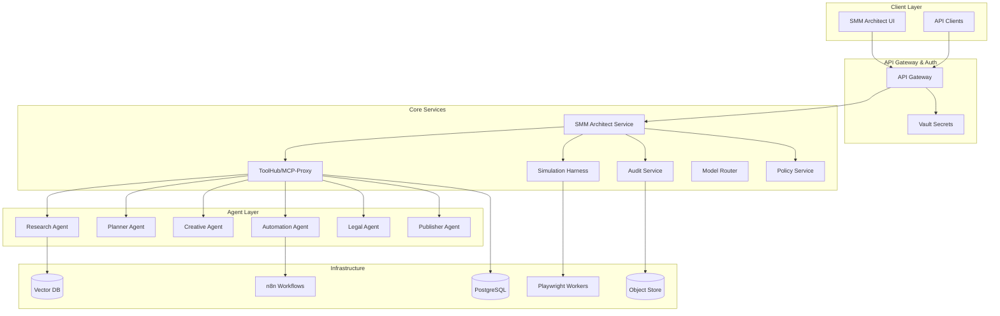
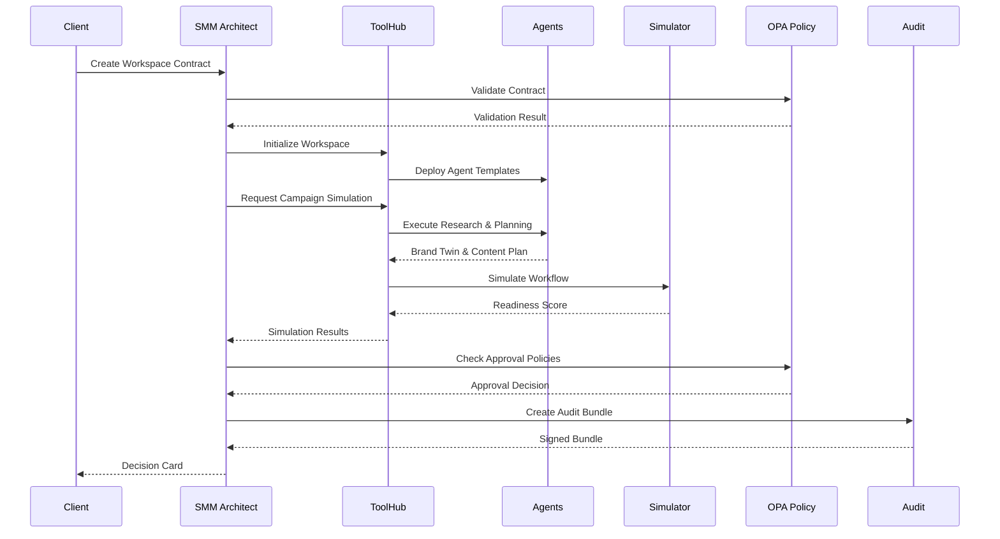
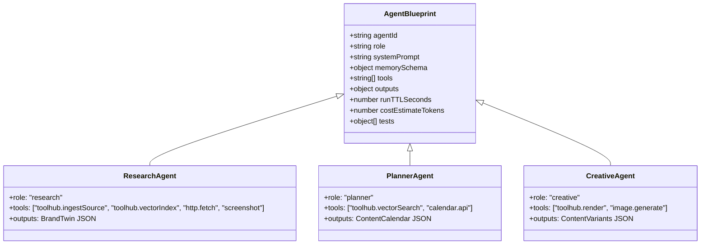
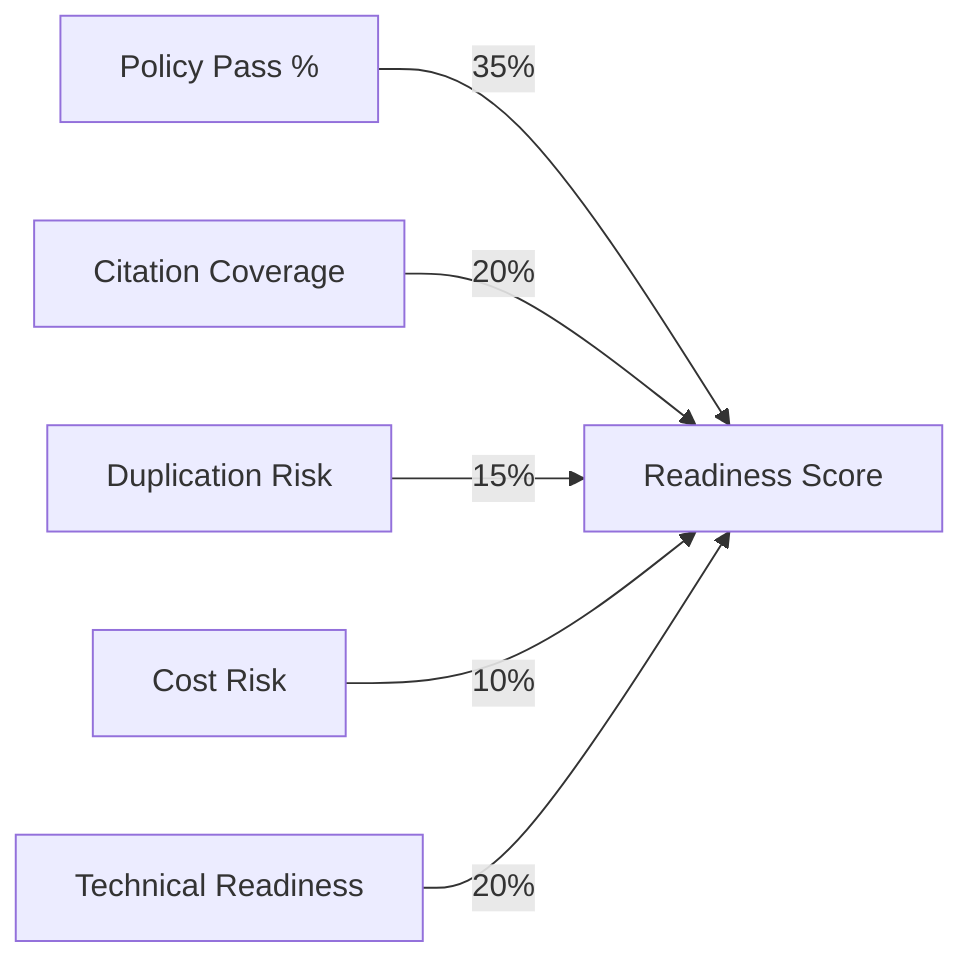
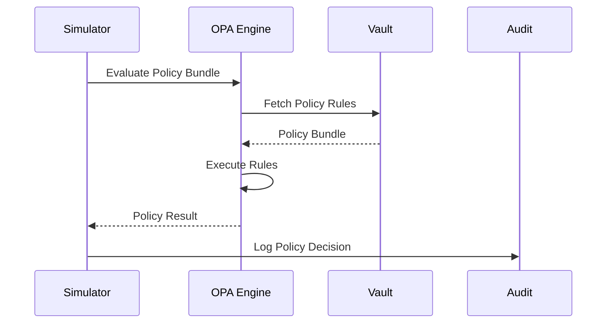
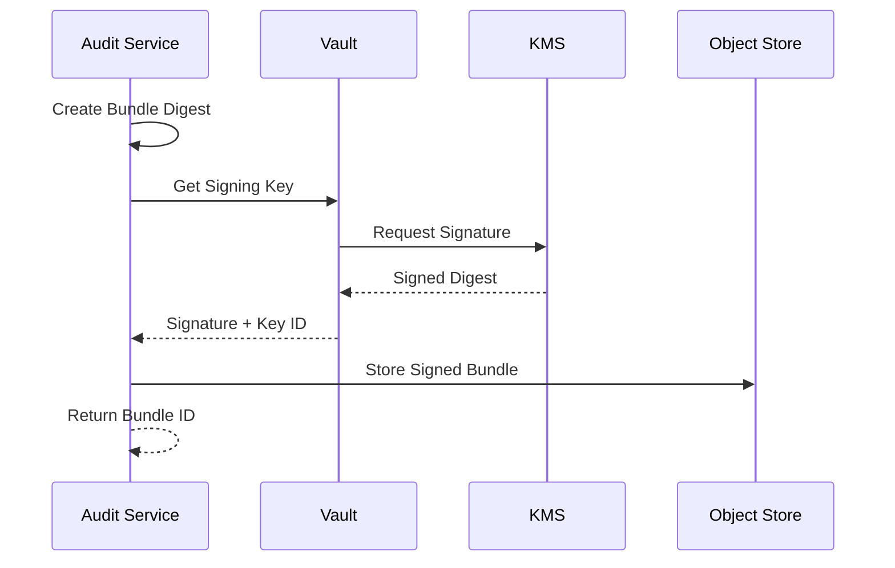
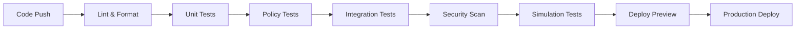

# SMM Architect Workspace Contract Schema Design

## Overview

The SMM Architect is a production-grade autonomous social media marketing platform that creates, simulates, and manages marketing campaigns through declarative workspace contracts. The system operates on a microservices architecture with schema-driven governance, policy enforcement, and multi-agent orchestration.

### Core Value Proposition
- **Declarative Workspace Management**: Define marketing goals, budgets, and policies through JSON contracts
- **Multi-Agent Orchestration**: Specialized agents for research, planning, content creation, and publishing
- **Policy-Driven Governance**: OPA-based rule enforcement with audit trails
- **Simulation-First Approach**: Monte Carlo simulation before live deployment
- **Infrastructure as Code**: Pulumi-based workspace provisioning

## Technology Stack & Dependencies

### Backend Services
- **Encore.ts**: Primary microservice framework
- **Node.js**: Runtime environment
- **TypeScript**: Primary development language
- **PostgreSQL**: Primary database
- **Vault**: Secrets management and dynamic credentials
- **OPA (Open Policy Agent)**: Policy enforcement engine
- **Agentuity**: Job orchestration platform

### Infrastructure
- **Kubernetes**: Container orchestration
- **Pulumi**: Infrastructure as Code
- **Helm**: Package management for K8s deployments
- **AWS/GCP**: Cloud providers (configurable)
- **Vector Database**: Pinecone or managed alternatives

### External Integrations
- **n8n**: Workflow automation
- **Playwright**: Browser automation for testing
- **Platform APIs**: LinkedIn, X (Twitter), etc.

## Architecture

### System Architecture Overview



### Data Flow Architecture



## Core Schema Definitions

### WorkspaceContract Schema

The WorkspaceContract is the authoritative, signed, declarative specification that defines workspace behavior, goals, and constraints.

```json
{
  "$schema": "http://json-schema.org/draft-07/schema#",
  "title": "WorkspaceContract",
  "type": "object",
  "properties": {
    "workspaceId": {"type": "string"},
    "tenantId": {"type": "string"},
    "createdBy": {"type": "string"},
    "createdAt": {"type": "string", "format": "date-time"},
    "lifecycle": {
      "type": "string",
      "enum": ["draft", "validated", "signed", "provisioning", "active", "paused", "decommissioned"],
      "default": "draft"
    },
    "contractVersion": {"type": "string"},
    "signedBy": {
      "type": "object",
      "properties": {
        "principal": {"type": "string"},
        "signedAt": {"type": "string", "format": "date-time"},
        "signatureId": {"type": "string"}
      }
    },
    "effectiveFrom": {"type": "string", "format": "date-time"},
    "effectiveTo": {"type": "string", "format": "date-time"},
    "goals": {
      "type": "array",
      "items": {
        "type": "object",
        "properties": {
          "key": {"type": "string"},
          "target": {"type": "number"},
          "unit": {"type": "string"}
        }
      }
    },
    "primaryChannels": {"type": "array", "items": {"type": "string"}},
    "connectors": {
      "type": "array",
      "items": {
        "type": "object",
        "properties": {
          "platform": {"type": "string"},
          "connectorId": {"type": "string"},
          "accountId": {"type": "string"},
          "displayName": {"type": "string"},
          "status": {"type": "string", "enum": ["unconnected", "connected", "degraded", "revoked"]},
          "lastConnectedAt": {"type": "string", "format": "date-time"},
          "scopes": {"type": "array", "items": {"type": "string"}},
          "ownerContact": {"type": "string"}
        }
      }
    },
    "consentRecords": {
      "type": "array",
      "items": {
        "type": "object",
        "properties": {
          "consentId": {"type": "string"},
          "type": {"type": "string"},
          "grantedBy": {"type": "string"},
          "grantedAt": {"type": "string", "format": "date-time"},
          "expiresAt": {"type": "string", "format": "date-time"},
          "documentRef": {"type": "string"},
          "verifierSignature": {"type": "string"}
        }
      }
    },
    "budget": {
      "type": "object",
      "properties": {
        "currency": {"type": "string"},
        "weeklyCap": {"type": "number"},
        "hardCap": {"type": "number"},
        "breakdown": {
          "type": "object",
          "properties": {
            "paidAds": {"type": "number"},
            "llmModelSpend": {"type": "number"},
            "rendering": {"type": "number"},
            "thirdPartyServices": {"type": "number"}
          }
        },
        "forecast": {
          "type": "object",
          "properties": {
            "estimatedWeeklySpend": {"type": "number"},
            "confidence": {"type": "number"}
          }
        }
      }
    },
    "approvalPolicy": {
      "type": "object",
      "properties": {
        "autoApproveReadinessThreshold": {"type": "number"},
        "canaryInitialPct": {"type": "number"},
        "canaryWatchWindowHours": {"type": "number"},
        "manualApprovalForPaid": {"type": "boolean"},
        "legalManualApproval": {"type": "boolean"}
      }
    },
    "riskProfile": {"type": "string", "enum": ["low", "medium", "high", "enterprise"]},
    "dataRetention": {"type": "object", "properties": {"auditRetentionDays": {"type": "integer"}}},
    "ttlHours": {"type": "integer"},
    "policyBundleRef": {"type": "string"},
    "policyBundleChecksum": {"type": "string"},
    "lastRun": {
      "type": "object",
      "properties": {
        "runId": {"type": "string"},
        "status": {"type": "string"},
        "startedAt": {"type": "string", "format": "date-time"},
        "finishedAt": {"type": "string", "format": "date-time"}
      }
    },
    "currentCanary": {
      "type": "object",
      "properties": {
        "pct": {"type": "number"},
        "startedAt": {"type": "string", "format": "date-time"},
        "status": {"type": "string", "enum": ["monitoring", "passed", "rolled_back"]}
      }
    },
    "audit": {
      "type": "object",
      "properties": {
        "retentionDays": {"type": "integer"},
        "storageRef": {"type": "string"},
        "lastBundleId": {"type": "string"}
      }
    },
    "simulationConfig": {
      "type": "object",
      "properties": {
        "iterations": {"type": "integer", "default": 1000},
        "randomSeed": {"type": "integer", "default": 42},
        "timeoutSeconds": {"type": "integer", "default": 120}
      }
    },
    "emergencyFlags": {
      "type": "object",
      "properties": {
        "pauseAll": {"type": "boolean", "default": false},
        "pausedAt": {"type": "string", "format": "date-time"},
        "reason": {"type": "string"}
      }
    },
    "kmsKeyRef": {"type": "string"},
    "vaultMount": {"type": "string"}
  },
  "required": ["workspaceId", "tenantId", "createdBy", "createdAt", "lifecycle", "contractVersion", "goals", "primaryChannels", "budget", "approvalPolicy", "ttlHours", "policyBundleRef", "policyBundleChecksum"]
}
```

### BrandTwin Schema

Canonical output of the research agent, containing validated brand information with exact-span citations and enhanced provenance tracking.

```json
{
  "$schema": "http://json-schema.org/draft-07/schema#",
  "title": "BrandTwin",
  "type": "object",
  "properties": {
    "brandId": {"type": "string"},
    "snapshotAt": {"type": "string", "format": "date-time"},
    "metadata": {
      "type": "object",
      "properties": {
        "modelVersion": {"type": "string"},
        "ingestedBy": {"type": "string"},
        "ingestedAt": {"type": "string", "format": "date-time"}
      }
    },
    "facts": {
      "type": "array",
      "items": {
        "type": "object",
        "properties": {
          "claim": {"type": "string"},
          "sourceUrl": {"type": "string"},
          "sourceId": {"type": "string"},
          "provenanceId": {"type": "string"},
          "embeddingId": {"type": "string"},
          "claimType": {"type": "string", "enum": ["factual", "opinion", "marketing"]},
          "spanStart": {"type": "integer"},
          "spanEnd": {"type": "integer"},
          "confidence": {"type": "number"}
        }
      }
    },
    "voiceTone": {
      "type": "object",
      "properties": {
        "primaryTone": {"type": "string"},
        "description": {"type": "string"}
      }
    },
    "audience": {
      "type": "object",
      "properties": {
        "segments": {"type": "array", "items": {"type": "string"}},
        "geos": {"type": "array", "items": {"type": "string"}}
      }
    },
    "assets": {
      "type": "array",
      "items": {
        "type": "object",
        "properties": {
          "assetId": {"type": "string"},
          "type": {"type": "string"},
          "fingerprint": {"type": "string"},
          "license": {"type": "string"}
        }
      }
    },
    "competitors": {
      "type": "array",
      "items": {
        "type": "object",
        "properties": {
          "name": {"type": "string"},
          "profileUrl": {"type": "string"},
          "notes": {"type": "string"}
        }
      }
    }
  },
  "required": ["brandId", "snapshotAt", "facts", "metadata"]
}
```

### DecisionCard Schema

User-facing summary for campaign approval decisions with enhanced tracking and impact estimation.

```json
{
  "$schema": "http://json-schema.org/draft-07/schema#",
  "title": "DecisionCard",
  "type": "object",
  "properties": {
    "actionId": {"type": "string"},
    "title": {"type": "string"},
    "one_line": {"type": "string"},
    "createdAt": {"type": "string", "format": "date-time"},
    "expiresAt": {"type": "string", "format": "date-time"},
    "readiness_score": {"type": "number"},
    "policy_pass_pct": {"type": "number"},
    "citation_coverage": {"type": "number"},
    "duplicate_risk": {"type": "string"},
    "estimatedImpact": {
      "type": "object",
      "properties": {
        "reach": {"type": "number"},
        "ctr": {"type": "number"},
        "conversions": {"type": "number"}
      }
    },
    "costBreakdown": {
      "type": "object",
      "properties": {
        "paidAds": {"type": "number"},
        "llmModelSpend": {"type": "number"},
        "rendering": {"type": "number"},
        "total": {"type": "number"}
      }
    },
    "primary_action": {
      "type": "object",
      "properties": {
        "label": {"type": "string"},
        "action": {"type": "string"},
        "payload": {"type": "object"}
      }
    },
    "provenance": {"type": "array", "items": {"type": "string"}},
    "escalations": {"type": "array", "items": {"type": "string"}}
  },
  "required": ["actionId", "title", "one_line", "createdAt", "expiresAt", "readiness_score"]
}
```

## API Endpoints Reference

### SMM Architect Service Endpoints

| Endpoint | Method | Description | Authentication |
|----------|--------|-------------|----------------|
| `/workspaces` | POST | Create new workspace contract | Bearer Token |
| `/workspaces/:id/status` | GET | Get workspace status and metrics | Bearer Token |
| `/workspaces/:id/approve` | POST | Approve/reject campaign promotion | Bearer Token |
| `/workspaces/:id/simulate` | POST | Trigger campaign simulation | Bearer Token |
| `/workspaces/:id/audit` | GET | Retrieve audit bundle | Bearer Token |

### ToolHub API Endpoints

| Endpoint | Method | Description | Rate Limit |
|----------|--------|-------------|------------|
| `/ingest/source` | POST | Ingest content source (URL, HTML) | 100/hour |
| `/vector/search` | POST | Vector similarity query | 1000/hour |
| `/simulate` | POST | Simulate workflow execution | 10/hour |
| `/render/job` | POST | Create render job | 50/hour |
| `/oauth/connect` | POST | Start OAuth flow for platform | 20/hour |

#### Authentication Requirements
- All ToolHub endpoints require Vault-issued ephemeral tokens
- Token format: `Authorization: Bearer vault:<token>`
- ToolHub validates token TTL and RBAC permissions
- Tokens are workspace-scoped with role-based access

## Agent Architecture

### Agent Blueprint Structure



### Agent Specializations

#### Research Agent
- **Purpose**: Gather authoritative sources about workspace domain
- **Key Outputs**: BrandTwin JSON with exact-span citations
- **Tools**: ToolHub.ingestSource, ToolHub.vectorIndex, http.fetch, screenshot
- **Memory Schema**: brandId, lastSnapshotAt, sources array

#### Planner Agent  
- **Purpose**: Generate content calendar and budget allocation
- **Key Outputs**: ContentCalendar JSON, budget plan
- **Tools**: ToolHub.vectorSearch, calendar APIs, cost estimation
- **Memory Schema**: goals, channels, budget constraints

#### Creative Agent
- **Purpose**: Generate content variations and creative assets
- **Key Outputs**: Content variants with metadata
- **Tools**: ToolHub.render, image generation, text variation
- **Memory Schema**: brand voice, audience segments, asset library

#### Automation Agent
- **Purpose**: Create and validate n8n workflows
- **Key Outputs**: n8n workflow JSON, simulation manifest
- **Tools**: n8n API, workflow validation, connector testing
- **Memory Schema**: workflow templates, connector credentials

#### Legal Agent
- **Purpose**: Policy compliance and consent validation
- **Key Outputs**: Compliance report, consent flows
- **Tools**: OPA policy checks, legal database queries
- **Memory Schema**: regulations, consent records, policy versions

#### Publisher Agent
- **Purpose**: Execute publication to social media platforms
- **Key Outputs**: Publication receipts, performance metrics
- **Tools**: Platform APIs, scheduling systems, analytics
- **Memory Schema**: platform credentials, publication history

## Simulation & Readiness Scoring

### Readiness Score Algorithm

The readiness score determines whether a campaign can be auto-approved or requires manual review.



#### Scoring Components
1. **Policy Pass % (35%)**: Percentage of OPA policy rules passed
2. **Citation Coverage (20%)**: Exact-span citation coverage for factual claims  
3. **Duplication Risk (15%)**: Risk of content similarity to existing campaigns
4. **Cost Risk (10%)**: Risk of budget overrun based on platform auction data
5. **Technical Readiness (20%)**: Format compliance, rate limits, asset availability

#### Monte Carlo Simulation
- Runs N simulated publish attempts with varying conditions
- Models platform latency, 429 rate limits, ad auction CPM distributions
- Generates confidence intervals for cost and technical readiness
- Default simulation runs: 1000 iterations per workflow

### Simulation Response Schema

```json
{
  "readinessScore": 0.92,
  "policyPassPct": 0.97,
  "citationCoverage": 0.95,
  "duplicationRisk": 0.07,
  "costEstimateUSD": 42.50,
  "simulationConfig": {
    "iterations": 1000,
    "randomSeed": 42,
    "timeoutSeconds": 120
  },
  "traces": [
    {"nodeId": "post_text", "status": "ok", "durationMs": 12},
    {"nodeId": "upload_image", "status": "ok", "durationMs": 245}
  ]
}
```

### Audit Bundle Schema

Complete audit trail for campaign decisions with cryptographic signatures.

```json
{
  "$schema": "http://json-schema.org/draft-07/schema#",
  "title": "AuditBundle",
  "type": "object",
  "properties": {
    "bundleId": {"type": "string"},
    "workspaceContract": {"type": "object"},
    "brandTwinSnapshotId": {"type": "string"},
    "simulationReport": {
      "type": "object",
      "properties": {
        "readinessScore": {"type": "number"},
        "policyPassPct": {"type": "number"},
        "citationCoverage": {"type": "number"},
        "simulationConfig": {
          "type": "object",
          "properties": {
            "iterations": {"type": "integer"},
            "randomSeed": {"type": "integer"},
            "timeoutSeconds": {"type": "integer"}
          }
        }
      }
    },
    "decisionCard": {"type": "object"},
    "workflowManifest": {"type": "object"},
    "assetFingerprints": {
      "type": "array",
      "items": {
        "type": "object",
        "properties": {
          "assetId": {"type": "string"},
          "sha256": {"type": "string"}
        }
      }
    },
    "policyResults": {
      "type": "object",
      "properties": {
        "bundleRef": {"type": "string"},
        "bundleChecksum": {"type": "string"},
        "results": {"type": "array"}
      }
    },
    "promotionHistory": {"type": "array"},
    "signature": {
      "type": "object",
      "properties": {
        "keyId": {"type": "string"},
        "signature": {"type": "string"},
        "algorithm": {"type": "string"},
        "signedAt": {"type": "string", "format": "date-time"}
      }
    }
  },
  "required": ["bundleId", "workspaceContract", "simulationReport", "signature"]
}
```

## Policy Management with OPA

### Policy Rules Structure

#### Voice Likeness Consent Enforcement
```rego
package smm.policy.voice

default deny = false

deny[msg] {
  input.workflow.uses_synthetic_voice
  not any(input.workspace.consentRecords, func(x) {
    x.type == "voice_likeness" && 
    time.parse_rfc3339_ns(x.expiresAt) > time.now_ns()
  })
  msg = "Missing valid voice likeness consent"
}
```

#### Connector Status Validation
```rego
package smm.policy.connector

default deny = false

deny[msg] {
  input.action.role == "publisher"
  channel := input.workflow.targetChannel
  not some connector in input.workspace.connectors
  connector.platform == channel
  connector.status == "connected"
  msg = sprintf("No connected %s account available", [channel])
}

# Fallback to browser automation if connector degraded
warn[msg] {
  input.action.role == "publisher"
  channel := input.workflow.targetChannel
  some connector in input.workspace.connectors
  connector.platform == channel
  connector.status == "degraded"
  msg = sprintf("Connector %s degraded, will use browser fallback", [channel])
}
```

#### Budget Enforcement
```rego
package smm.policy.budget

default deny = false

# Hard cap enforcement
deny[msg] {
  input.simulation.costEstimateUSD > input.workspace.budget.hardCap
  msg = sprintf("Estimated cost $%.2f exceeds hard cap $%.2f", [
    input.simulation.costEstimateUSD, 
    input.workspace.budget.hardCap
  ])
}

# Weekly cap warning
warn[msg] {
  input.simulation.costEstimateUSD > input.workspace.budget.weeklyCap * 0.8
  input.simulation.costEstimateUSD <= input.workspace.budget.hardCap
  msg = sprintf("Estimated cost $%.2f approaching weekly cap $%.2f", [
    input.simulation.costEstimateUSD,
    input.workspace.budget.weeklyCap
  ])
}

# Category-specific budget checks
deny[msg] {
  input.simulation.costBreakdown.paidAds > input.workspace.budget.breakdown.paidAds
  msg = "Paid ads budget exceeded"
}
```

#### Citation Coverage Requirements
```rego
package smm.policy.citations

default allow = false

allow {
  input.simulation.policyPassPct >= 0.0
  input.simulation.citationCoverage >= required_coverage
  not input.workflow.contains_forbidden_topics
}

required_coverage = 0.9 {
  input.workspace.riskProfile == "enterprise"
}

required_coverage = 0.8 {
  input.workspace.riskProfile == "high"
}

required_coverage = 0.7 {
  input.workspace.riskProfile == "medium"
}

required_coverage = 0.6 {
  input.workspace.riskProfile == "low"
}

deny[msg] {
  input.simulation.citationCoverage < required_coverage
  msg = sprintf("Citation coverage %.2f below required %.2f for risk profile %s", [
    input.simulation.citationCoverage,
    required_coverage,
    input.workspace.riskProfile
  ])
}
```

#### Emergency Controls
```rego
package smm.policy.emergency

default deny = false

deny[msg] {
  input.workspace.emergencyFlags.pauseAll == true
  msg = sprintf("Workspace paused: %s", [input.workspace.emergencyFlags.reason])
}

deny[msg] {
  input.workspace.lifecycle != "active"
  msg = sprintf("Workspace lifecycle is %s, not active", [input.workspace.lifecycle])
}
```

### Policy Evaluation Flow



## Infrastructure Architecture

### Workspace Provisioning with Pulumi

```typescript
// Pulumi workspace template structure
export interface WorkspaceConfig {
  workspaceId: string;
  tenantId: string;
  k8sNamespace: string;
  region: string;
  riskProfile: 'low' | 'medium' | 'high' | 'enterprise';
}

export async function createWorkspace(config: WorkspaceConfig) {
  // Kubernetes namespace
  const namespace = new k8s.core.v1.Namespace(config.workspaceId, {
    metadata: { name: config.k8sNamespace }
  });

  // PostgreSQL database (managed)
  const database = new aws.rds.Instance(`${config.workspaceId}-db`, {
    engine: "postgres",
    instanceClass: "db.t3.micro",
    allocatedStorage: 20
  });

  // S3 bucket for asset storage
  const bucket = new aws.s3.Bucket(`${config.workspaceId}-assets`);

  // n8n workflow engine
  const n8nChart = new k8s.helm.v3.Chart(`${config.workspaceId}-n8n`, {
    chart: "n8n",
    namespace: namespace.metadata.name
  });

  // Playwright workers for simulation
  const playwrightChart = new k8s.helm.v3.Chart(`${config.workspaceId}-playwright`, {
    chart: "playwright",
    namespace: namespace.metadata.name
  });

  return {
    namespace: namespace.metadata.name,
    n8nUrl: `https://${config.workspaceId}-n8n.example.com`,
    dbConnection: pulumi.secret(database.endpoint),
    bucketName: bucket.bucket
  };
}
```

### Vault Integration

#### Mount Paths
- `secret/workspaces/<workspaceId>/secrets` - Non-sensitive workspace configs
- `database/creds/<role>` - Dynamic database credentials  
- `aws/creds/<role>` - Temporary cloud credentials
- `transit/` - Audit bundle signing with tenant KMS keys
- `pki/` - Certificate management for connector authentication

#### Workspace-Scoped Vault Policy
```nginx
# Workspace access policy template
path "secret/data/workspaces/{{identity.entity.aliases.auth_jwt_accessor.metadata.workspace_id}}/*" {
  capabilities = ["read"]
}

path "database/creds/smm-architect" {
  capabilities = ["read"]
}

path "aws/creds/workspace-{{identity.entity.aliases.auth_jwt_accessor.metadata.workspace_id}}" {
  capabilities = ["read"]
}

path "transit/sign/workspace-audit" {
  capabilities = ["update"]
  allowed_parameters = {
    "input" = ["*"]
    "context" = ["{{identity.entity.aliases.auth_jwt_accessor.metadata.workspace_id}}"]
  }
}

path "pki/issue/connector-certs" {
  capabilities = ["update"]
  allowed_parameters = {
    "common_name" = ["{{identity.entity.aliases.auth_jwt_accessor.metadata.workspace_id}}.connectors.local"]
    "ttl" = ["24h"]
  }
}
```

#### KMS Signing Flow


#### Dynamic Credentials Lifecycle
1. **Database Credentials**: 24-hour TTL, auto-renewed by services
2. **Cloud Credentials**: 1-hour TTL for temporary access
3. **Connector Certificates**: 24-hour TTL for OAuth flows
4. **Signing Keys**: Long-lived, rotated quarterly

## Audit & Compliance

### Audit Bundle Schema

The audit bundle schema was defined earlier in the "Simulation Response Schema" section.

### Signing Flow
1. **Create Canonical Digest**: Generate SHA-256 hash of audit bundle JSON (sorted keys, no whitespace)
2. **KMS Signing**: Call tenant or platform KMS with workspace context
3. **Immutable Storage**: Store signed bundle in append-only object store
4. **Verification Endpoint**: Provide public verification API

```typescript
// Signing implementation
interface SigningRequest {
  bundleDigest: string;
  workspaceId: string;
  kmsKeyRef: string;
}

async function signAuditBundle(request: SigningRequest): Promise<Signature> {
  const vaultToken = await getWorkspaceToken(request.workspaceId);
  
  const signResponse = await vault.write('transit/sign/workspace-audit', {
    input: request.bundleDigest,
    context: base64Encode(request.workspaceId),
    key_version: 'latest'
  });
  
  return {
    keyId: request.kmsKeyRef,
    signature: signResponse.data.signature,
    algorithm: 'RS256',
    signedAt: new Date().toISOString()
  };
}
```

### Verification Endpoint
```typescript
// GET /audit/verify/:bundleId
async function verifyAuditBundle(bundleId: string): Promise<VerificationResult> {
  const bundle = await getAuditBundle(bundleId);
  const digest = createCanonicalDigest(bundle);
  
  const verifyResponse = await vault.write('transit/verify/workspace-audit', {
    input: digest,
    signature: bundle.signature.signature,
    context: base64Encode(bundle.workspaceContract.workspaceId)
  });
  
  return {
    valid: verifyResponse.data.valid,
    keyId: bundle.signature.keyId,
    signedAt: bundle.signature.signedAt,
    verifiedAt: new Date().toISOString()
  };
}
```

### Retention & Compliance
- **Audit Retention**: Configurable per workspace (default: 7 years)
- **Immutable Storage**: Write-once, read-many object store
- **Data Residency**: Configurable per tenant (US, EU, APAC)
- **Compliance Reports**: Automated quarterly compliance summaries

## Testing Strategy

### Unit Testing
- **Coverage Target**: Minimum 80% for core business logic
- **Framework**: Jest for Node.js services
- **Mocking**: Mock external APIs and database calls
- **Agent Testing**: Mock ToolHub endpoints and validate outputs

### Deterministic Simulation Testing
```typescript
// Reproducible Monte Carlo tests
describe('Simulation Reproducibility', () => {
  test('deterministic readiness score with fixed seed', async () => {
    const config = {
      iterations: 1000,
      randomSeed: 42,
      timeoutSeconds: 120
    };
    
    const result1 = await simulator.simulate(exampleWorkflow, config);
    const result2 = await simulator.simulate(exampleWorkflow, config);
    
    expect(result1.readinessScore).toEqual(result2.readinessScore);
    expect(result1.readinessScore).toBeGreaterThan(0.7);
  });
});
```

### Policy Testing Framework
```typescript
// OPA policy test cases
const policyTestCases = [
  {
    name: "voice-consent-required",
    input: {
      workflow: { uses_synthetic_voice: true },
      workspace: {
        consentRecords: [
          {
            type: "voice_likeness",
            expiresAt: "2025-12-31T23:59:59Z"
          }
        ]
      }
    },
    expected: { deny: false }
  },
  {
    name: "budget-hard-cap-exceeded",
    input: {
      simulation: { costEstimateUSD: 5000 },
      workspace: { budget: { hardCap: 4000 } }
    },
    expected: { 
      deny: true,
      message: "Estimated cost $5000.00 exceeds hard cap $4000.00"
    }
  },
  {
    name: "connector-degraded-fallback",
    input: {
      action: { role: "publisher" },
      workflow: { targetChannel: "linkedin" },
      workspace: {
        connectors: [{
          platform: "linkedin",
          status: "degraded"
        }]
      }
    },
    expected: { 
      warn: true,
      message: "Connector linkedin degraded, will use browser fallback"
    }
  }
];
```

### Integration Testing  
- **Workflow Simulation**: End-to-end campaign simulation tests
- **API Contract Testing**: Validate API schemas and responses
- **Agent Blueprint Testing**: Validate agent job creation and outputs
- **Infrastructure Testing**: Pulumi resource validation

### Connector Failure Testing
```typescript
describe('Connector Resilience', () => {
  test('handles OAuth token refresh failure', async () => {
    mockPlatformAPI.mockRejectedValue(new Error('invalid_token'));
    
    const result = await publisher.publish(content, 'linkedin');
    
    expect(result.fallbackUsed).toBe(true);
    expect(result.method).toBe('browser_automation');
    expect(result.requiresReconnect).toBe(true);
  });
});
```

## Operational SLOs & Monitoring

### Service Level Objectives
| Service | Metric | Target | Alert Threshold |
|---------|--------|--------|-----------------|
| ToolHub Vector Search | p95 latency | < 200ms | > 500ms |
| Simulation Execution | p95 latency | < 30s | > 60s |
| Agent Job Start | p95 latency | < 60s | > 120s |
| Publisher Success Rate | Availability | > 99% | < 95% |
| Audit Bundle Creation | p95 latency | < 5s | > 10s |
| Connector Health | Success Rate | > 95% | < 90% |

### Monitoring Dashboards
```yaml
# Grafana dashboard configuration
dashboards:
  - name: "SMM Architect Overview"
    panels:
      - title: "Workspace Health"
        query: "sum(rate(workspace_operations_total[5m])) by (status)"
      
      - title: "Budget Burn Rate"
        query: "rate(budget_spent_total[1h]) * 24 * 7"
        alert: "> 0.8 * weekly_cap"
      
      - title: "Agent Failure Rate"
        query: "rate(agent_job_failures_total[5m]) / rate(agent_job_starts_total[5m])"
        alert: "> 0.05"
      
      - title: "Connector Status"
        query: "connector_health_status by (platform, workspace_id)"
        alert: "== 0"
```

### Runtime Alerts
```yaml
# AlertManager rules
groups:
  - name: smm-architect
    rules:
      - alert: ConnectorHealthDegraded
        expr: connector_publish_success_rate < 0.95
        for: 10m
        labels:
          severity: warning
        annotations:
          summary: "{{ $labels.platform }} connector degraded for workspace {{ $labels.workspace_id }}"
      
      - alert: BudgetCapApproaching
        expr: budget_spent_percentage > 0.8
        for: 5m
        labels:
          severity: warning
        annotations:
          summary: "Workspace {{ $labels.workspace_id }} at 80% of weekly budget cap"
      
      - alert: AuditSigningFailure
        expr: rate(audit_signing_failures_total[5m]) > 0
        for: 1m
        labels:
          severity: critical
        annotations:
          summary: "Audit bundle signing failures detected - publishing auto-paused"
```

### CI/CD Pipeline



#### Pipeline Stages
1. **Lint**: ESLint, Prettier formatting
2. **Unit Tests**: Jest with 80% coverage requirement
3. **Policy Tests**: OPA rule validation with edge cases
4. **Integration**: Mocked Agentuity + ToolHub endpoints
5. **Security Scan**: Snyk/Trivy vulnerability scanning
6. **Simulation Tests**: Deterministic Monte Carlo validation
7. **Deploy Preview**: Pulumi Automation API for ephemeral environments
8. **Production Deploy**: Blue-green deployment with canary validation

#### Acceptance Criteria for Production Deployment
```yaml
# .github/workflows/acceptance.yml
name: Production Readiness Gate
requirements:
  - unit_test_coverage: ">= 80%"
  - policy_test_suite: "all_pass"
  - deterministic_simulation:
      seed: 42
      readiness_score: ">= 0.7"
  - integration_test:
      agent_blueprint_spawn: "success"
      brand_twin_facts: ">= 3"
      citation_spans: ">= 1"
  - security_scan:
      snyk_vulnerabilities: "none"
      secrets_in_repo: "none"
  - policy_bundle_checksum:
      action: "required_on_policy_change"
      must_increment: true
```

## Governance & Contract Evolution

### Contract Migration Strategy

#### Version Management
```typescript
interface ContractMigration {
  fromVersion: string;
  toVersion: string;
  previousContractRef: string;
  changeLog: string[];
  requiresResignature: boolean;
  migrationScript: string;
}

// Example migration
const migrationV1toV2: ContractMigration = {
  fromVersion: "1.0.0",
  toVersion: "2.0.0",
  previousContractRef: "contract-v1-sha256",
  changeLog: [
    "Added connectors array for platform account management",
    "Enhanced budget breakdown with category-specific caps",
    "Added emergency pause controls"
  ],
  requiresResignature: true, // Changes affect approvalPolicy or budget
  migrationScript: "migrations/v1-to-v2.js"
};
```

#### Immutability Rules
1. **Signed Contracts**: Never modify, only create new versions
2. **Audit Bundles**: Immutable after creation
3. **Policy Versions**: Checksum-tracked, append-only
4. **Migration Path**: Clear upgrade path with rollback capability

#### Emergency Operations
```typescript
// Emergency pause functionality
async function emergencyPause(workspaceId: string, reason: string) {
  const contract = await getWorkspaceContract(workspaceId);
  
  // Create emergency amendment (doesn't require full contract update)
  const emergencyAmendment = {
    workspaceId,
    emergencyFlags: {
      pauseAll: true,
      pausedAt: new Date().toISOString(),
      reason
    },
    amendmentId: generateId(),
    authorizedBy: getCurrentUser(),
    createdAt: new Date().toISOString()
  };
  
  // Apply immediately without simulation
  await applyEmergencyAmendment(emergencyAmendment);
  
  // Audit log
  await createAuditEntry({
    type: "EMERGENCY_PAUSE",
    workspaceId,
    reason,
    authorizedBy: getCurrentUser()
  });
}
```

### Policy Bundle Versioning
```typescript
interface PolicyBundle {
  bundleId: string;
  version: string;
  checksum: string;
  rules: PolicyRule[];
  tests: PolicyTest[];
  createdAt: string;
  previousVersion?: string;
}

// Enforce policy bundle integrity
function validatePolicyBundle(bundle: PolicyBundle): boolean {
  const computedChecksum = sha256(JSON.stringify(bundle.rules));
  return computedChecksum === bundle.checksum;
}
```
