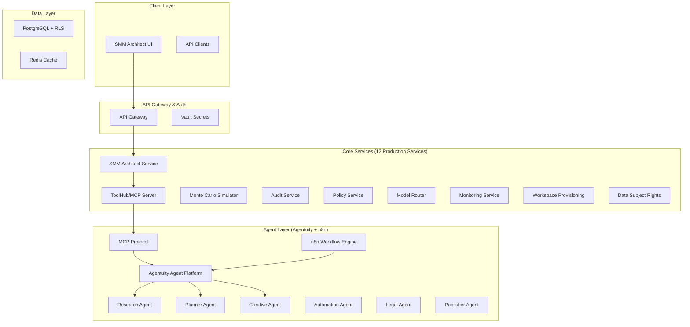

# SMM Architect

[](https://github.com/yourorg/smm-architect/actions)
[](LICENSE)
[](CHANGELOG.md)
[](AGENTS.md)

> **Enterprise-grade autonomous social media marketing platform** with MCP-based agent orchestration, n8n workflow automation, and comprehensive compliance frameworks.

## 🎆 Production Ready

SMM Architect is a **complete enterprise platform** ready for production deployment with:

- ✅ **12 Production Microservices** with comprehensive APIs and monitoring
- ✅ **Advanced Agent System** using Agentuity with MCP 2.0 protocol
- ✅ **n8n Workflow Orchestration** with 7 production workflow templates
- ✅ **Enterprise Database** with PostgreSQL RLS for multi-tenant isolation
- ✅ **Complete Security Framework** with audit trails and GDPR/CCPA compliance

## 🚀 Overview

SMM Architect is an **enterprise-ready platform** that enables organizations to automate sophisticated social media marketing through:

- **Advanced Agent Orchestration**: Agentuity-based agents with MCP 2.0 protocol for seamless communication
- **n8n Workflow Automation**: Complete campaign orchestration with policy enforcement and audit logging
- **Declarative Workspace Management**: JSON contracts with comprehensive lifecycle management
- **Multi-Tenant Architecture**: Enterprise-grade security with Row-Level Security (RLS)
- **Real-Time Monitoring**: Prometheus metrics, Grafana dashboards, Sentry error tracking
- **Infrastructure as Code**: Pulumi templates for automated AWS deployment

## 🏢 Architecture



## 📋 Features

### ✅ **Production Ready Platform**
- [x] **Workspace Contract Schema** - Complete lifecycle management with versioning, signing, connectors
- [x] **BrandTwin Intelligence** - Advanced provenance tracking, embedding links, metadata
- [x] **Decision Cards** - Comprehensive action tracking, cost breakdown, impact estimation
- [x] **Policy Engine** - Production OPA rules with consent, connectors, budget enforcement
- [x] **Agent Framework** - Complete Agentuity agent system with MCP 2.0 protocol

### ⚡ **Enterprise Services (All Production Ready)**
- [x] **SMM Architect Service** - Encore.ts microservice with comprehensive APIs and RLS
- [x] **ToolHub Service** - Complete MCP server with content ingestion, vector search, Sentry monitoring
- [x] **Model Router Service** - Advanced AI routing with canary deployments, cost optimization
- [x] **Simulator Service** - Production Monte Carlo engine with deterministic results
- [x] **Audit Service** - Complete bundle assembly with cryptographic signatures
- [x] **Monitoring Service** - Full observability stack with Prometheus, Grafana, health checks
- [x] **Workspace Provisioning** - Infrastructure automation with rate limiting
- [x] **DSR Service** - GDPR/CCPA compliance with automated Data Subject Rights handling
- [x] **Policy Service** - Comprehensive OPA rule engine with complete test coverage

### 🔧 **Infrastructure & DevOps (Production Ready)**
- [x] **Database Architecture** - PostgreSQL with RLS, migrations, Prisma ORM, connection pooling
- [x] **Pulumi Templates** - Complete Infrastructure as Code for AWS deployment
- [x] **Vault Integration** - HashiCorp Vault for secrets management and dynamic credentials
- [x] **Container Support** - Docker containers with Kubernetes deployment manifests
- [x] **Monitoring Stack** - Prometheus metrics, Grafana dashboards, Sentry error tracking
- [x] **n8n Workflow System** - 7 production workflow templates for campaign orchestration

## 🚦 Quick Start

### Prerequisites

- Node.js 18+ and npm/yarn
- Docker and Docker Compose
- Encore CLI (`npm install -g @encore/cli`)
- OPA CLI (for policy testing)
- PostgreSQL 14+

### Local Development Setup

1. **Clone and Install Dependencies**
   ```bash
   git clone https://github.com/yourorg/smm-architect.git
   cd smm-architect
   
   # Install service dependencies
   cd services/smm-architect && npm install
   cd ../toolhub && npm install
   ```

2. **Start Core Services**
   ```bash
   # Start SMM Architect service (Encore.ts)
   cd services/smm-architect
   encore run
   
   # Start ToolHub service (separate terminal)
   cd services/toolhub
   npm run dev
   ```

3. **Test Policy Engine**
   ```bash
   cd services/policy
   opa test rules.rego rules_test.rego
   ```

4. **Validate Schemas**
   ```bash
   # Test workspace contract validation
   node -e "
   const Ajv = require('ajv');
   const ajv = new Ajv();
   const schema = require('./schemas/workspace-contract.json');
   const example = require('./examples/workspace-contract.icblabs.json');
   console.log('Valid:', ajv.validate(schema, example));
   "
   ```

### API Examples

#### Create a Workspace
```bash
curl -X POST http://localhost:4000/workspaces \
  -H "Content-Type: application/json" \
  -H "Authorization: Bearer your-token" \
  -d '{
    "contract": {
      "tenantId": "tenant-example",
      "createdBy": "user:alice@example.com",
      "contractVersion": "v1.0.0",
      "goals": [{"key": "lead_gen", "target": 200, "unit": "leads_per_month"}],
      "primaryChannels": ["linkedin", "x"],
      "budget": {
        "currency": "USD",
        "weeklyCap": 1000,
        "hardCap": 4000,
        "breakdown": {
          "paidAds": 600,
          "llmModelSpend": 200,
          "rendering": 150,
          "thirdPartyServices": 50
        }
      },
      "approvalPolicy": {
        "autoApproveReadinessThreshold": 0.85,
        "canaryInitialPct": 0.05,
        "canaryWatchWindowHours": 48,
        "manualApprovalForPaid": true,
        "legalManualApproval": true
      },
      "riskProfile": "medium",
      "dataRetention": {"auditRetentionDays": 365},
      "ttlHours": 720,
      "policyBundleRef": "policies/standard-corp-v1",
      "policyBundleChecksum": "a7f9d2e1c8b5f4g3h6j9k2l5m8n1p4q7r0s3t6u9v2w5x8y1z4a7b0c3d6e9f2g5h8"
    }
  }'
```

#### Simulate Campaign
```bash
curl -X POST http://localhost:4000/workspaces/ws-example-001/simulate \
  -H "Content-Type: application/json" \
  -H "Authorization: Bearer your-token" \
  -d '{
    "dryRun": true,
    "targetChannels": ["linkedin", "x"]
  }'
```

## 📚 Documentation

### Core Concepts

- **[Workspace Contracts](docs/workspace-contract.md)** - Declarative specifications for marketing workspaces
- **[Agent Architecture](docs/agents.md)** - Multi-agent system design and blueprints
- **[Policy Engine](docs/policies.md)** - OPA-based governance and compliance
- **[Simulation Framework](docs/simulation.md)** - Monte Carlo campaign simulation

### API Documentation

- **[SMM Architect API](services/smm-architect/docs/api.md)** - Core workspace management endpoints
- **[ToolHub API](services/toolhub/openapi.yaml)** - Content ingestion and vector search
- **[Agent API](docs/agent-api.md)** - Agent orchestration and management

### Deployment Guides

- **[Local Development](docs/development.md)** - Setting up development environment
- **[Production Deployment](docs/deployment.md)** - Kubernetes and cloud deployment
- **[Vault Configuration](docs/vault-setup.md)** - Secrets management setup

## 🧪 Testing

### Unit Tests
```bash
# Test all services
npm run test:all

# Test specific service
cd services/smm-architect && npm test
cd services/toolhub && npm test
```

### Policy Tests
```bash
cd services/policy
opa test rules.rego rules_test.rego --verbose
```

### Integration Tests
```bash
# Start test environment
docker-compose -f docker-compose.test.yml up -d

# Run integration tests
npm run test:integration
```

### Simulation Tests
```bash
# Test deterministic simulation
cd services/simulator
npm test -- --testNamePattern="deterministic"
```

## 🛡️ Security & Compliance

### Authentication & Authorization
- Vault-based token management
- Role-based access control (RBAC)
- Workspace-scoped permissions
- Audit logging for all actions

### Policy Enforcement
- OPA (Open Policy Agent) for governance
- Consent record validation
- Budget and spend controls
- Content policy compliance

### Data Protection
- Encryption at rest and in transit
- GDPR/CCPA compliance features
- Data retention policies
- Right to deletion support

## 🔧 Configuration

### Environment Variables

| Variable | Description | Default |
|----------|-------------|---------|
| `NODE_ENV` | Environment (development/production) | `development` |
| `LOG_LEVEL` | Logging level (debug/info/warn/error) | `info` |
| `VAULT_ADDR` | Vault server address | `http://localhost:8200` |
| `VAULT_TOKEN` | Vault authentication token | - |
| `DATABASE_URL` | PostgreSQL connection string | - |
| `PINECONE_API_KEY` | Vector database API key | - |

### Workspace Configuration

See `examples/workspace-contract.icblabs.json` for a complete example workspace configuration.

## 📊 Monitoring & Observability

### Key Metrics
- Workspace creation rate and success ratio
- Simulation performance and readiness scores
- Policy compliance percentages
- Agent execution times and success rates
- Budget utilization and cost optimization

### Alerting
- Policy violations
- Budget overruns
- Service health degradation
- Agent failure rates
- Security incidents

## 🤝 Contributing

1. **Fork the repository**
2. **Create a feature branch** (`git checkout -b feature/amazing-feature`)
3. **Run tests** (`npm run test:all`)
4. **Commit changes** (`git commit -m 'Add amazing feature'`)
5. **Push to branch** (`git push origin feature/amazing-feature`)
6. **Open a Pull Request**

### Development Guidelines

- Follow TypeScript best practices
- Write comprehensive tests (target 80%+ coverage)
- Update documentation for new features
- Validate against schema and policy rules
- Test policy changes thoroughly

## 📄 License

This project is proprietary software. See [LICENSE](LICENSE) for details.

## 🙋‍♀️ Support

- **Documentation**: [docs/](docs/)
- **Issues**: [GitHub Issues](https://github.com/yourorg/smm-architect/issues)
- **Discussions**: [GitHub Discussions](https://github.com/yourorg/smm-architect/discussions)
- **Email**: dev@smmarchitect.com

## 🗺️ Roadmap

### Q4 2025
- [ ] Complete simulation service implementation
- [ ] Vault integration and credential management
- [ ] Production deployment automation
- [ ] Advanced agent orchestration

### Q1 2026  
- [ ] Real-time campaign optimization
- [ ] Advanced analytics and reporting
- [ ] Multi-tenant isolation improvements
- [ ] Enterprise SSO integration

### Q2 2026
- [ ] Mobile companion app
- [ ] Advanced AI content generation
- [ ] Predictive campaign modeling
- [ ] Third-party platform integrations

---

**Built with ❤️ by the SMM Architect Team**