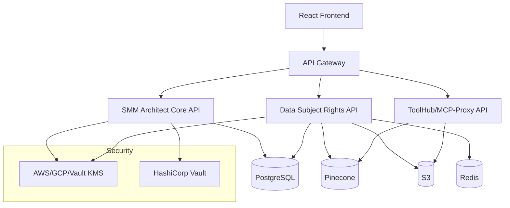

# SMM Architect API Documentation

Welcome to the comprehensive API documentation for the SMM Architect platform - an autonomous social media marketing platform with production-grade security and compliance.

## 🏗️ Architecture Overview

SMM Architect is built as a microservices architecture with the following core services:



## 📚 API Services

### 🔐 SMM Architect Core API
**Base URL:** `https://api.smmarchitect.com`

The main application API providing workspace management, authentication, and core platform functionality.

- **[📖 OpenAPI Specification](./smm-architect-openapi.yaml)**
- **[🌐 Interactive Docs](https://api.smmarchitect.com/docs)** *(Production)*
- **Framework:** Encore.ts
- **Authentication:** JWT Bearer tokens
- **Key Features:**
  - User authentication & session management
  - Workspace contract lifecycle
  - AI simulation & decision cards
  - Multi-tenant row-level security
  - Audit trails with KMS signing

#### Key Endpoints:
- `POST /api/auth/login` - User authentication
- `POST /workspaces` - Create workspace contract
- `POST /workspaces/{id}/simulate` - Run AI simulation
- `GET /workspaces/{id}/audit` - Get audit bundle

---

### 🛡️ Data Subject Rights (DSR) API
**Base URL:** `https://dsr.smmarchitect.com`

GDPR/CCPA compliant data rights service with cryptographic audit trails.

- **[📖 OpenAPI Specification](./dsr-service-openapi.yaml)**
- **[🌐 Interactive Docs](https://dsr.smmarchitect.com/docs)** *(Production)*
- **Framework:** Encore.ts
- **Compliance:** GDPR Article 15-17, CCPA
- **Key Features:**
  - Right to Access (data export)
  - Right to Erasure (cascade deletion)
  - Right to Rectification (data correction)
  - Cryptographic deletion proofs
  - Cross-system verification

#### Key Endpoints:
- `POST /erasure` - Request complete data deletion
- `POST /access/export` - Export user data
- `POST /rectification` - Correct user data
- `GET /erasure/{id}/report` - Get deletion report

---

### 🔧 ToolHub/MCP-Proxy API
**Base URL:** `https://toolhub.smmarchitect.com`

Content ingestion, vector search, and external service integration.

- **[📖 OpenAPI Specification](./toolhub-openapi.yaml)** *(Already exists)*
- **[🌐 Interactive Docs](https://toolhub.smmarchitect.com/docs)** *(Production)*
- **Framework:** Node.js/Express
- **Key Features:**
  - Content ingestion (URL, HTML, files)
  - Vector similarity search
  - OAuth integration
  - Simulation rendering
  - Multi-format support

#### Key Endpoints:
- `POST /ingest/source` - Ingest content from various sources
- `POST /vector/search` - Semantic search
- `POST /oauth/authorize` - OAuth flow initiation
- `POST /simulation/render` - Render simulation results

---

## 🔒 Security & Authentication

### Authentication Flow
1. **Login:** `POST /api/auth/login` with email/password
2. **Token:** Receive JWT token (24h expiry)
3. **Usage:** Include `Authorization: Bearer <token>` header
4. **Refresh:** Use `POST /api/auth/refresh` for token renewal

### Multi-Tenant Security
- **Row-Level Security (RLS)** enforced at database level
- **Automatic tenant context** injection via middleware
- **Cross-tenant access prevention** with cryptographic verification
- **Evil tenant protection** with comprehensive test coverage

### Rate Limiting
- **Authentication endpoints:** 5 attempts per 15 minutes per email
- **General API:** 1000 requests per hour per tenant
- **Burst protection:** 100 requests per minute per IP

---

## 🔐 Data Protection & Compliance

### GDPR Compliance
- **Article 15 - Right to Access:** Complete data export via DSR API
- **Article 16 - Right to Rectification:** Data correction via DSR API
- **Article 17 - Right to Erasure:** Cascade deletion with proofs
- **Article 20 - Right to Portability:** Structured data export

### Security Features
- **End-to-end encryption** using production KMS (AWS/GCP/Vault)
- **Cryptographic audit trails** with tamper-proof signatures
- **Real-time threat detection** and anomaly monitoring
- **Zero-trust architecture** with continuous verification

---

## 🛠️ Development & Testing

### OpenAPI Validation
```bash
# Validate all API specifications
npm run api:validate

# Generate client SDKs
npm run api:generate-clients

# Run API contract tests
npm run test:api-contracts
```

### API Testing
```bash
# Run all API tests
npm run test:api

# Test specific service
npm run test:api:smm-architect
npm run test:api:dsr
npm run test:api:toolhub

# Security tests
npm run test:security
```

### Local Development
```bash
# Start all services
docker-compose up -d

# Main API: http://localhost:4000
# DSR API: http://localhost:4001  
# ToolHub API: http://localhost:8080
```

---

## 📊 API Monitoring & Analytics

### Health Checks
- **Main API:** `GET /health`
- **DSR API:** `GET /health`
- **ToolHub API:** `GET /health`

### Metrics & Monitoring
- **Response times:** P50, P95, P99 percentiles
- **Error rates:** 4xx, 5xx error tracking
- **Throughput:** Requests per second by endpoint
- **Availability:** 99.9% SLA with uptime monitoring

### Observability
- **Distributed tracing** with correlation IDs
- **Structured logging** with tenant context
- **Real-time alerting** for anomalies
- **Performance profiling** and optimization

---

## 🚀 Production Deployment

### API Versioning
- **Semantic versioning:** v1.0.0, v1.1.0, etc.
- **Backward compatibility:** Maintained for 12 months
- **Deprecation policy:** 6-month notice for breaking changes

### Environment URLs
- **Production:** `https://api.smmarchitect.com`
- **Staging:** `https://api-staging.smmarchitect.com`
- **Development:** `http://localhost:4000`

### API Gateway Features
- **Request/Response logging** for audit compliance
- **API key management** for external integrations
- **Circuit breaker** pattern for resilience
- **Geographic load balancing** for global availability

---

## 📞 Support & Contact

### Technical Support
- **Email:** api-support@smmarchitect.com
- **Documentation:** [docs.smmarchitect.com](https://docs.smmarchitect.com)
- **Status Page:** [status.smmarchitect.com](https://status.smmarchitect.com)

### Security Issues
- **Security Email:** security@smmarchitect.com
- **Bug Bounty:** [security.smmarchitect.com](https://security.smmarchitect.com)
- **Response Time:** 24 hours for critical issues

### Privacy & Data Protection
- **Privacy Officer:** privacy@smmarchitect.com
- **GDPR Requests:** [privacy.smmarchitect.com](https://privacy.smmarchitect.com)
- **Data Processing Agreement:** Available upon request

---

## 📈 Changelog & Roadmap

### Recent Updates
- **v1.0.0** (2024-08-26): Initial production release
- **Security**: Multi-tenant RLS, KMS integration, DSR compliance
- **Features**: Workspace management, AI simulation, audit trails

### Upcoming Features
- **GraphQL API** for advanced querying
- **Webhook subscriptions** for real-time updates
- **API marketplace** for third-party integrations
- **Advanced analytics** and insights API

---

*Last updated: August 26, 2024*  
*API Documentation Version: 1.0.0*