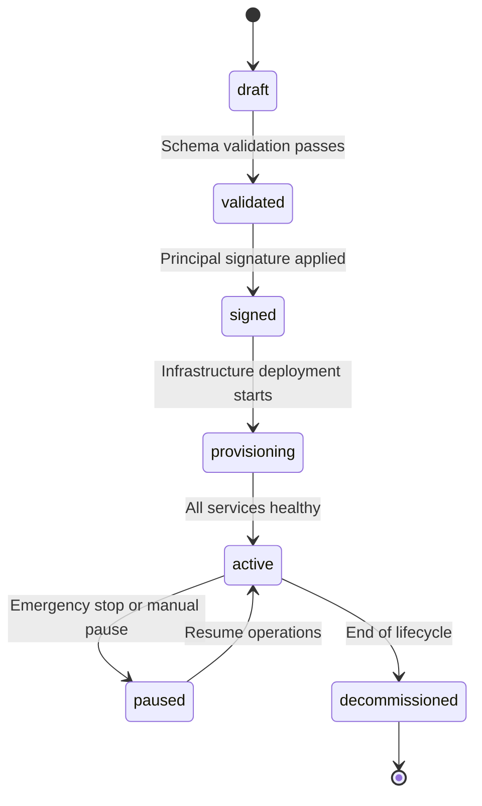

# Workspace Contract Specification

## Overview

> **Warning:** Example values in this document are placeholders for demonstration. Replace all demo data before using in production.

The **WorkspaceContract** is the authoritative, signed, declarative specification that defines workspace behavior, goals, and constraints within the SMM Architect platform. It serves as the single source of truth for all workspace-related policies, configurations, and operational parameters.

## Purpose

Workspace contracts enable:

- **Declarative Configuration**: Define complex marketing strategies through structured JSON
- **Policy Enforcement**: Ensure compliance with legal, financial, and operational constraints
- **Auditability**: Maintain complete records of decisions and changes
- **Governance**: Enable enterprise-grade controls and approval workflows
- **Reproducibility**: Recreate identical campaigns across environments

## Contract Lifecycle



### Lifecycle States

| State | Description | Valid Transitions |
|-------|-------------|-------------------|
| `draft` | Initial creation, editing allowed | → `validated` |
| `validated` | Schema valid, awaiting signature | → `signed`, → `draft` |
| `signed` | Cryptographically signed, immutable | → `provisioning` |
| `provisioning` | Infrastructure being deployed | → `active`, → `decommissioned` |
| `active` | Fully operational | → `paused`, → `decommissioned` |
| `paused` | Temporarily stopped | → `active`, → `decommissioned` |
| `decommissioned` | Permanently shut down | Terminal state |

## Core Components

### 1. Identity & Versioning

```json
{
  // Example values only; replace with real workspace IDs and emails.
  "workspaceId": "ws-{tenant}-{uuid8}",
  "tenantId": "tenant-organization-id",
  "createdBy": "user:alice@example.com",
  "createdAt": "2025-08-24T10:00:00Z",
  "contractVersion": "v1.2.3",
  "lifecycle": "active"
}
```

- **workspaceId**: Globally unique identifier following `ws-{tenant}-{uuid8}` pattern
- **tenantId**: Organization/tenant scope for multi-tenancy
- **contractVersion**: Semantic versioning for contract evolution
- **lifecycle**: Current operational state

### 2. Signature & Authorization

```json
{
  // Example signature metadata. Replace with real signer details.
  "signedBy": {
    "principal": "user:alice@example.com",
    "signedAt": "2025-08-24T10:30:00Z",
    "signatureId": "sig-icb-001-a7f9d2e1"
  },
  "effectiveFrom": "2025-08-24T11:00:00Z",
  "effectiveTo": "2026-02-24T11:00:00Z"
}
```

- **signedBy**: Cryptographic signature metadata for authorization
- **effectiveFrom/To**: Temporal boundaries for contract validity

### 3. Goals & Objectives

```json
{
  "goals": [
    {
      "key": "lead_gen",
      "target": 200,
      "unit": "leads_per_month"
    },
    {
      "key": "brand_awareness", 
      "target": 100000,
      "unit": "impressions_per_month"
    }
  ]
}
```

Supported goal types:
- **lead_gen**: Lead generation campaigns
- **brand_awareness**: Reach and impression campaigns  
- **engagement**: Social engagement and interaction
- **conversions**: Direct sales or signup conversions
- **retention**: Customer retention and loyalty

### 4. Channel Configuration

```json
{
  // Example connector configuration; replace with production values.
  "primaryChannels": ["linkedin", "x", "instagram"],
  "connectors": [
    {
      "platform": "linkedin",
      "connectorId": "conn-li-001",
      "accountId": "company-page-id",
      "displayName": "Company LinkedIn Page",
      "status": "connected",
      "lastConnectedAt": "2025-08-24T09:45:00Z",
      "scopes": ["w_member_social", "r_basicprofile"],
      "ownerContact": "social@example.com"
    }
  ]
}
```

- **primaryChannels**: Strategic focus channels for the workspace
- **connectors**: Technical integrations with platform APIs
- **status**: Real-time connection health (`connected`, `degraded`, `revoked`)

### 5. Budget & Financial Controls

```json
{
  "budget": {
    "currency": "USD",
    "weeklyCap": 1000,
    "hardCap": 4000,
    "breakdown": {
      "paidAds": 600,
      "llmModelSpend": 200, 
      "rendering": 150,
      "thirdPartyServices": 50
    },
    "forecast": {
      "estimatedWeeklySpend": 850,
      "confidence": 0.87
    }
  }
}
```

#### Budget Categories

| Category | Description | Typical % |
|----------|-------------|-----------|
| `paidAds` | Platform advertising spend | 60-70% |
| `llmModelSpend` | AI model usage costs | 15-25% |
| `rendering` | Content creation and assets | 10-20% |
| `thirdPartyServices` | External tools and APIs | 5-10% |

### 6. Approval & Governance Policies

```json
{
  "approvalPolicy": {
    "autoApproveReadinessThreshold": 0.85,
    "canaryInitialPct": 0.05,
    "canaryWatchWindowHours": 48,
    "manualApprovalForPaid": true,
    "legalManualApproval": true
  }
}
```

- **autoApproveReadinessThreshold**: Minimum simulation score for auto-approval
- **canaryInitialPct**: Initial rollout percentage for canary deployments
- **manualApprovalForPaid**: Require human approval for paid campaigns
- **legalManualApproval**: Require legal team sign-off

### 7. Consent & Legal Records

```json
{
  // Example consent record; replace with real authorization data.
  "consentRecords": [
    {
      "consentId": "consent-voice-001",
      "type": "voice_likeness",
      "grantedBy": "user:spokesperson@example.com",
      "grantedAt": "2025-08-24T10:15:00Z",
      "expiresAt": "2026-08-24T10:15:00Z",
      "documentRef": "s3://consents/voice-likeness-001.pdf",
      "verifierSignature": "vault:sig:001:8f7e6d5c"
    }
  ]
}
```

#### Consent Types

| Type | Purpose | Required For |
|------|---------|--------------|
| `voice_likeness` | Synthetic voice generation | AI voice content |
| `ugc_license` | User-generated content use | Customer testimonials |
| `celebrity_release` | Celebrity likeness | Influencer partnerships |
| `data_processing` | Personal data handling | Lead generation |
| `marketing_use` | Marketing communications | Email/SMS campaigns |

### 8. Security & Audit Configuration

```json
{
  "audit": {
    "retentionDays": 365,
    "storageRef": "s3://audit-bundles/ws-001/",
    "lastBundleId": "bundle-001-2025-08-24"
  },
  "kmsKeyRef": "projects/kms/keys/workspace-signing",
  "vaultMount": "secret/workspaces/ws-001"
}
```

### 9. Simulation Configuration

```json
{
  "simulationConfig": {
    "iterations": 1000,
    "randomSeed": 42,
    "timeoutSeconds": 120
  }
}
```

- **iterations**: Monte Carlo simulation runs for statistical confidence
- **randomSeed**: Deterministic seed for reproducible results
- **timeoutSeconds**: Maximum simulation execution time

### 10. Emergency Controls

```json
{
  "emergencyFlags": {
    "pauseAll": false,
    "pausedAt": "2025-08-24T15:30:00Z",
    "reason": "Policy violation detected"
  }
}
```

Emergency flags provide immediate control over workspace operations in crisis situations.

## Validation Rules

### Schema Validation

All contracts must pass JSON Schema validation against `schemas/workspace-contract.json`.

### Business Logic Validation

1. **Budget Consistency**
   - `breakdown` total ≤ `weeklyCap`
   - `weeklyCap` × 4 ≤ `hardCap`

2. **Lifecycle Constraints**
   - `signed` state requires `signedBy` metadata
   - `active` state requires `effectiveFrom` ≤ current time

3. **Connector Requirements**
   - Each `primaryChannel` must have a `connected` connector
   - Connector `lastConnectedAt` must be within 7 days

4. **Consent Validation**
   - Required consent types must not be expired
   - `expiresAt` must be in the future

5. **Approval Policy Bounds**
   - `autoApproveReadinessThreshold` ∈ [0, 1]
   - `canaryInitialPct` ∈ [0, 1]
   - `canaryWatchWindowHours` ≥ 1

## Policy Integration

Workspace contracts integrate with the OPA policy engine for runtime governance:

```rego
# Example policy rule
deny[msg] if {
    input.simulation.costEstimateUSD > input.workspace.budget.hardCap
    msg := "Cost estimate exceeds hard budget cap"
}
```

See `services/policy/rules.rego` for complete policy definitions.

## Contract Evolution

### Versioning Strategy

- **Semantic Versioning**: `MAJOR.MINOR.PATCH`
- **Breaking Changes**: Increment MAJOR version
- **New Features**: Increment MINOR version  
- **Bug Fixes**: Increment PATCH version

### Migration Process

1. **Create New Version**: Draft contract with incremented version
2. **Validation**: Run schema and business logic validation
3. **Impact Analysis**: Assess changes on existing workflows
4. **Approval**: Obtain required signatures
5. **Activation**: Update `effectiveFrom` and deploy

### Backward Compatibility

- Maintain compatibility for MINOR version changes
- Provide migration tools for MAJOR version changes
- Deprecation notices for removed features

## Examples

### Minimal Contract

```json
{
  "workspaceId": "ws-minimal-001",
  "tenantId": "tenant-startup",
  "createdBy": "user:founder@startup.com",
  "createdAt": "2025-08-24T10:00:00Z",
  "lifecycle": "draft",
  "contractVersion": "v1.0.0",
  "goals": [{"key": "brand_awareness", "target": 10000, "unit": "impressions"}],
  "primaryChannels": ["x"],
  "budget": {
    "currency": "USD",
    "weeklyCap": 100,
    "hardCap": 400,
    "breakdown": {"paidAds": 80, "llmModelSpend": 15, "rendering": 5, "thirdPartyServices": 0}
  },
  "approvalPolicy": {
    "autoApproveReadinessThreshold": 0.9,
    "canaryInitialPct": 0.1,
    "canaryWatchWindowHours": 24,
    "manualApprovalForPaid": false,
    "legalManualApproval": false
  },
  "riskProfile": "low",
  "dataRetention": {"auditRetentionDays": 90},
  "ttlHours": 168,
  "policyBundleRef": "policies/startup-basic-v1",
  "policyBundleChecksum": "abc123..."
}
```

### Enterprise Contract

See `examples/workspace-contract.icblabs.json` for a comprehensive enterprise example with all optional fields.

## Best Practices

### Security
- Always sign contracts in production environments
- Use dedicated KMS keys per tenant
- Rotate signing keys regularly
- Audit all contract modifications

### Operations
- Set appropriate TTL values based on campaign duration
- Monitor budget utilization regularly
- Test policy changes in staging first
- Maintain consent record hygiene

### Governance
- Require legal review for high-risk profiles
- Implement approval workflows for budget changes
- Document policy exceptions thoroughly
- Regular policy compliance audits

## Troubleshooting

### Common Validation Errors

| Error | Cause | Solution |
|-------|-------|----------|
| "Budget breakdown exceeds weekly cap" | Sum of breakdown > weeklyCap | Adjust breakdown or increase cap |
| "Missing connected platform" | No connector for primaryChannel | Connect platform or remove from channels |
| "Expired consent record" | Consent expiresAt < now | Renew consent or remove dependency |
| "Invalid lifecycle transition" | Illegal state change | Follow lifecycle state diagram |

### Performance Considerations

- Limit `simulationConfig.iterations` to ≤ 5000 for reasonable performance
- Use appropriate `ttlHours` to avoid resource leaks
- Monitor connector health to prevent degraded performance
- Archive decommissioned workspaces regularly

---

For implementation details, see the [SMM Architect API Documentation](../services/smm-architect/docs/api.md).