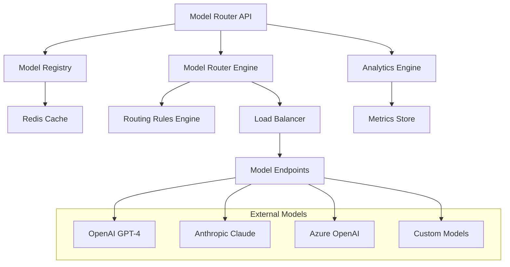

# Model Router Service

The Model Router Service is a critical component of the SMM Architect platform that provides intelligent routing, load balancing, and management of AI models. It serves as the central hub for all AI model interactions, ensuring optimal performance, cost efficiency, and reliability.

## Features

### Core Functionality
- **Intelligent Model Routing**: Route requests to the most appropriate AI model based on criteria like agent type, workspace configuration, and performance requirements
- **Load Balancing**: Distribute traffic across multiple model endpoints with configurable traffic splitting
- **Health Monitoring**: Continuous monitoring of model health and performance with automatic failover
- **Cost Optimization**: Track usage, costs, and optimize model selection for budget efficiency
- **Multi-tenant Support**: Workspace-specific configurations and model restrictions

### Advanced Features
- **Canary Deployments**: Gradual rollout of new models with traffic splitting
- **A/B Testing**: Compare model performance with statistical significance testing
- **Circuit Breaker**: Automatic failure detection and recovery
- **Analytics & Metrics**: Comprehensive performance analytics and usage tracking
- **Configuration Management**: Import/export configurations for disaster recovery

## Architecture

### Components



### Key Services

- **ModelRegistry**: Manages model metadata, health status, and endpoint configuration
- **ModelRouter**: Handles intelligent routing decisions and request execution
- **RoutingRules**: Configurable rules engine for routing logic
- **HealthMonitor**: Continuous monitoring and health assessment
- **MetricsCollector**: Performance and usage analytics

## API Reference

### Base URL
```
http://localhost:3003
```

### Authentication
Currently uses API key authentication. Include the following header:
```
Authorization: Bearer YOUR_API_KEY
```

### Core Endpoints

#### Health Check
```http
GET /health
```

**Response:**
```json
{
  "status": "healthy",
  "timestamp": "2024-01-15T10:30:00Z",
  "service": "model-router",
  "version": "1.0.0"
}
```

#### Model Management

**Register Model**
```http
POST /api/models
Content-Type: application/json

{
  "name": "GPT-4 Turbo",
  "version": "gpt-4-1106-preview",
  "provider": "openai",
  "modelType": "chat",
  "capabilities": [
    {
      "type": "text-generation",
      "maxTokens": 4096
    }
  ],
  "parameters": {
    "temperature": 0.7,
    "maxTokens": 4096
  },
  "status": "active",
  "tags": ["gpt-4", "high-quality", "reasoning"]
}
```

**Get Model**
```http
GET /api/models/{modelId}
```

**List Models**
```http
GET /api/models?provider=openai&status=active&modelType=chat
```

**Update Model Status**
```http
PATCH /api/models/{modelId}/status
Content-Type: application/json

{
  "status": "inactive"
}
```

#### Model Health Management

**Update Model Health**
```http
POST /api/models/{modelId}/health
Content-Type: application/json

{
  "status": "healthy",
  "responseTime": 500,
  "errorRate": 0.01,
  "availability": 99.9
}
```

**Get Model Health**
```http
GET /api/models/{modelId}/health
```

#### Model Endpoints

**Register Endpoint**
```http
POST /api/models/{modelId}/endpoints
Content-Type: application/json

{
  "url": "https://api.openai.com/v1/chat/completions",
  "type": "primary",
  "weight": 1.0,
  "healthCheckUrl": "https://api.openai.com/v1/models"
}
```

**Get Endpoints**
```http
GET /api/models/{modelId}/endpoints
```

#### Request Routing

**Route Request**
```http
POST /api/route
Content-Type: application/json

{
  "id": "req-12345",
  "agentType": "creative",
  "workspaceId": "ws-marketing-001",
  "userId": "user-123",
  "prompt": "Generate a creative marketing message for our new product",
  "parameters": {
    "temperature": 0.8,
    "maxTokens": 500
  },
  "metadata": {
    "requestType": "completion",
    "priority": "normal"
  }
}
```

**Response:**
```json
{
  "id": "response-67890",
  "requestId": "req-12345",
  "modelId": "gpt-4-1106-preview",
  "response": "Your creative marketing message here...",
  "usage": {
    "promptTokens": 25,
    "completionTokens": 100,
    "totalTokens": 125,
    "cost": 0.00375
  },
  "latency": 1250,
  "status": "success",
  "timestamp": "2024-01-15T10:30:00Z"
}
```

**Test Routing**
```http
POST /api/routing/test
Content-Type: application/json

{
  "agentType": "creative",
  "workspaceId": "ws-marketing-001",
  "requestType": "completion",
  "prompt": "Test prompt"
}
```

#### Routing Rules Management

**Add Routing Rule**
```http
POST /api/routing/rules
Content-Type: application/json

{
  "name": "Creative Agent Claude Preference",
  "condition": {
    "agentType": ["creative"],
    "requestType": ["completion", "chat"],
    "contentLength": {
      "min": 100,
      "max": 2000
    }
  },
  "targetModels": [
    {
      "modelId": "claude-3-sonnet",
      "weight": 0.7,
      "fallbackOrder": 1
    },
    {
      "modelId": "gpt-4",
      "weight": 0.3,
      "fallbackOrder": 2
    }
  ],
  "trafficSplit": {
    "primary": 80,
    "canary": 20
  },
  "priority": 100,
  "enabled": true
}
```

**List Routing Rules**
```http
GET /api/routing/rules
```

**Update Routing Rule**
```http
PATCH /api/routing/rules/{ruleId}
```

**Delete Routing Rule**
```http
DELETE /api/routing/rules/{ruleId}
```

#### Agent Configuration

**Set Agent Preferences**
```http
POST /api/agents/{agentType}/preferences
Content-Type: application/json

{
  "preferredModels": ["gpt-4", "claude-3-sonnet"],
  "fallbackModels": ["gpt-3.5-turbo"],
  "requiredCapabilities": ["text-generation"],
  "performanceRequirements": {
    "maxLatency": 5000,
    "minSuccessRate": 0.95,
    "maxCostPerToken": 0.01
  }
}
```

**Get Agent Preferences**
```http
GET /api/agents/{agentType}/preferences
```

**Get Active Models for Agent**
```http
GET /api/agents/{agentType}/models
```

#### Workspace Configuration

**Set Workspace Config**
```http
POST /api/workspaces/{workspaceId}/config
Content-Type: application/json

{
  "modelRestrictions": ["gpt-4", "claude-3-sonnet"],
  "budgetLimits": {
    "daily": 100,
    "weekly": 500,
    "monthly": 2000
  },
  "qualityRequirements": {
    "minSuccessRate": 0.95,
    "maxLatency": 5000
  },
  "complianceRequirements": ["gdpr", "ccpa", "hipaa"]
}
```

#### Analytics & Monitoring

**Get Request Metrics**
```http
GET /api/metrics/requests?limit=100
```

**Get Model Analytics**
```http
GET /api/analytics/models?timeRange=24h&modelId=gpt-4
```

**Get Workspace Analytics**
```http
GET /api/analytics/workspaces/{workspaceId}?timeRange=7d
```

**System Health Overview**
```http
GET /api/health/overview
```

#### Configuration Management

**Export Configuration**
```http
GET /api/config/export
```

**Import Configuration**
```http
POST /api/config/import
Content-Type: application/json

{
  "config": {
    "models": [...],
    "routingRules": [...],
    "agentPreferences": {...},
    "workspaceConfigs": {...}
  }
}
```

#### Batch Operations

**Batch Update Model Status**
```http
PATCH /api/models/batch/status
Content-Type: application/json

{
  "updates": [
    {
      "modelId": "model-1",
      "status": "active"
    },
    {
      "modelId": "model-2", 
      "status": "inactive"
    }
  ]
}
```

## Configuration

### Environment Variables

| Variable | Description | Default |
|----------|-------------|---------|
| `PORT` | Server port | `3003` |
| `REDIS_URL` | Redis connection URL | `redis://localhost:6379` |
| `NODE_ENV` | Environment (development/production) | `development` |
| `LOG_LEVEL` | Logging level | `info` |
| `RATE_LIMIT_MAX` | Rate limit per window | `1000` |
| `RATE_LIMIT_WINDOW_MS` | Rate limit window (ms) | `900000` |

### Docker Configuration

**Dockerfile**
```dockerfile
FROM node:18-alpine
WORKDIR /app
COPY package*.json ./
RUN npm ci --only=production
COPY . .
RUN npm run build
EXPOSE 3003
CMD ["npm", "start"]
```

**docker-compose.yml**
```yaml
version: '3.8'
services:
  model-router:
    build: .
    ports:
      - "3003:3003"
    environment:
      - REDIS_URL=redis://redis:6379
      - NODE_ENV=production
    depends_on:
      - redis
    restart: unless-stopped

  redis:
    image: redis:7-alpine
    ports:
      - "6379:6379"
    restart: unless-stopped
```

## Development

### Prerequisites
- Node.js 18+
- Redis 6+
- TypeScript 4.5+

### Setup
```bash
# Clone repository
git clone <repository-url>
cd model-router

# Install dependencies
npm install

# Start Redis (if not running)
redis-server

# Start development server
npm run dev

# Run tests
npm test

# Build for production
npm run build
```

### Project Structure
```
src/
├── index.ts                 # Main API server
├── types/                   # TypeScript type definitions
│   └── index.ts
├── services/                # Core business logic
│   ├── ModelRegistry.ts     # Model metadata management
│   └── ModelRouter.ts       # Routing engine
├── utils/                   # Utility functions
│   └── logger.ts            # Logging configuration
└── middleware/              # Express middleware
    └── validation.ts        # Request validation

test/
├── api.test.ts             # API endpoint tests
├── registry.test.ts        # Model registry tests
└── router.test.ts          # Routing engine tests
```

### Testing

**Unit Tests**
```bash
npm run test
```

**Integration Tests**
```bash
npm run test:integration
```

**Load Testing**
```bash
npm run test:load
```

**Coverage Report**
```bash
npm run test:coverage
```

## Monitoring & Observability

### Metrics
The service exposes Prometheus-compatible metrics at `/metrics`:

- `model_router_requests_total` - Total number of requests
- `model_router_request_duration_seconds` - Request duration histogram
- `model_router_model_health_score` - Model health scores
- `model_router_routing_rule_matches` - Routing rule match counts

### Logging
Structured JSON logging with configurable levels:
```json
{
  "timestamp": "2024-01-15T10:30:00Z",
  "level": "info",
  "service": "model-router",
  "message": "Request routed successfully",
  "requestId": "req-12345",
  "modelId": "gpt-4",
  "latency": 1250
}
```

### Health Checks
- **Liveness**: `/health` - Basic service health
- **Readiness**: `/health/ready` - Service ready to accept traffic
- **Deep Health**: `/health/detailed` - Comprehensive health check

## Deployment

### Kubernetes Deployment
```yaml
apiVersion: apps/v1
kind: Deployment
metadata:
  name: model-router
spec:
  replicas: 3
  selector:
    matchLabels:
      app: model-router
  template:
    metadata:
      labels:
        app: model-router
    spec:
      containers:
      - name: model-router
        image: smm-architect/model-router:1.0.0
        ports:
        - containerPort: 3003
        env:
        - name: REDIS_URL
          value: "redis://redis:6379"
        - name: NODE_ENV
          value: "production"
        livenessProbe:
          httpGet:
            path: /health
            port: 3003
          initialDelaySeconds: 30
          periodSeconds: 10
        readinessProbe:
          httpGet:
            path: /health/ready
            port: 3003
          initialDelaySeconds: 5
          periodSeconds: 5
        resources:
          requests:
            memory: "512Mi"
            cpu: "250m"
          limits:
            memory: "1Gi"
            cpu: "500m"
```

### Helm Chart
```bash
helm install model-router ./charts/model-router \
  --set image.tag=latest \
  --set redis.enabled=true \
  --set ingress.enabled=true
```

## Security

### Authentication
- API key authentication for all endpoints
- JWT token support for user-specific operations
- Service-to-service authentication via mutual TLS

### Authorization
- Role-based access control (RBAC)
- Workspace-level permissions
- Admin-only configuration endpoints

### Data Protection
- Encryption in transit (TLS 1.3)
- Encryption at rest for sensitive data
- PII data masking in logs
- Secure secret management via Vault

## Performance

### Benchmarks
- **Throughput**: 10,000+ requests per second
- **Latency**: P50 < 100ms, P95 < 500ms, P99 < 1s
- **Availability**: 99.9% SLA
- **Recovery**: < 30s automatic failover

### Optimization
- Redis caching for model metadata
- Connection pooling for model endpoints
- Request batching for analytics
- Async processing for non-critical operations

## Troubleshooting

### Common Issues

**High Latency**
```bash
# Check model health
curl http://localhost:3003/api/health/overview

# Review routing rules
curl http://localhost:3003/api/routing/rules

# Check Redis connectivity
redis-cli ping
```

**Model Failures**
```bash
# Check model status
curl http://localhost:3003/api/models/{modelId}/health

# Review error metrics
curl http://localhost:3003/api/metrics/requests
```

**Configuration Issues**
```bash
# Export current config
curl http://localhost:3003/api/config/export > config.json

# Validate routing rules
curl -X POST http://localhost:3003/api/routing/test \
  -H "Content-Type: application/json" \
  -d '{"agentType": "creative", "requestType": "completion"}'
```

### Debug Logs
Enable debug logging:
```bash
export LOG_LEVEL=debug
npm start
```

## Contributing

### Code Standards
- TypeScript strict mode
- ESLint + Prettier formatting
- 90%+ test coverage
- Conventional commits

### Pull Request Process
1. Fork the repository
2. Create feature branch
3. Add tests for new functionality
4. Ensure all tests pass
5. Update documentation
6. Submit pull request

## License

This service is part of the SMM Architect platform and follows the same licensing terms.

---

*For additional support, please refer to the SMM Architect documentation or contact the development team.*